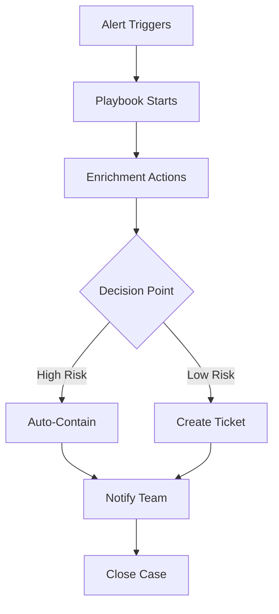

# How to Use Chronicle SOAR Playbooks for Automated Incident Response

Author: [nawazdhandala](https://www.github.com/nawazdhandala)

Tags: GCP, Chronicle SOAR, Playbooks, Incident Response, Security Automation

Description: Learn how to build and deploy automated incident response playbooks in Google Chronicle SOAR to accelerate threat containment and reduce manual security operations work.

---

When a security alert fires at 3 AM, you do not want your response to depend on whoever happens to be on call remembering the right steps. Chronicle SOAR (Security Orchestration, Automation, and Response) lets you encode your incident response procedures as playbooks that run automatically when specific alert types trigger. The result is consistent, fast responses regardless of the time or who is working.

This guide covers how to design, build, and deploy SOAR playbooks that actually work in production.

## How Chronicle SOAR Playbooks Work

A playbook in Chronicle SOAR is a directed workflow that chains together actions. It gets triggered by an alert or case, runs through a series of automated and manual steps, and produces a response.



The building blocks are:

- **Triggers** - Conditions that start the playbook (alert type, severity, log source)
- **Actions** - Individual operations like querying a threat intel feed or disabling a user
- **Conditions** - Decision points that branch the workflow
- **Manual tasks** - Steps that require human approval before proceeding

## Setting Up Your First Playbook

Let me walk through building a phishing response playbook, since phishing is one of the most common alert types and a great candidate for automation.

### Step 1: Define the Playbook Structure

Before touching the SOAR console, map out what your response process looks like on paper.

For a phishing alert, the typical flow is:

1. Extract the suspicious URL and sender from the alert
2. Check the URL against threat intelligence feeds
3. Check if any users clicked the link
4. If the URL is malicious and users clicked, disable their sessions and reset passwords
5. Block the sender domain at the email gateway
6. Create an incident ticket and notify the security team

### Step 2: Create the Playbook in Chronicle

In the Chronicle SOAR console, go to Playbooks and click Create.

Set the trigger conditions. This playbook should run when a phishing alert comes in.

```json
{
    "trigger": {
        "type": "ALERT",
        "conditions": [
            {
                "field": "alert.category",
                "operator": "EQUALS",
                "value": "PHISHING"
            },
            {
                "field": "alert.severity",
                "operator": "IN",
                "value": ["MEDIUM", "HIGH", "CRITICAL"]
            }
        ]
    }
}
```

### Step 3: Add Enrichment Actions

The first actions in your playbook should gather context about the alert.

**URL Reputation Check**: Use the VirusTotal integration to check the suspicious URL.

Configure the action:
- Integration: VirusTotal
- Action: Scan URL
- Input: `{alert.artifacts.url}`
- Output variable: `vt_result`

**Sender Reputation Check**: Query your email security tool for information about the sender.

Configure the action:
- Integration: Email Security Gateway
- Action: Get Sender Info
- Input: `{alert.artifacts.email_sender}`
- Output variable: `sender_info`

**User Click Check**: Query your email gateway or proxy logs to see if anyone clicked the link.

Configure the action:
- Integration: Chronicle SIEM
- Action: UDM Search
- Input query: `metadata.event_type = "NETWORK_HTTP" AND target.url = "{alert.artifacts.url}"`
- Output variable: `click_events`

### Step 4: Add Decision Logic

Now add a condition block that evaluates the enrichment results.

```python
# Decision logic for the phishing playbook
# This runs after enrichment actions complete

# Check if the URL is malicious based on VirusTotal score
url_is_malicious = vt_result.positives > 3

# Check if any users clicked the link
users_clicked = len(click_events) > 0

# Determine the response path
if url_is_malicious and users_clicked:
    response_level = "CONTAINMENT"
elif url_is_malicious and not users_clicked:
    response_level = "BLOCK_ONLY"
else:
    response_level = "MONITOR"
```

### Step 5: Add Containment Actions

For the CONTAINMENT path, add actions that limit the blast radius.

**Disable User Sessions**: For each user who clicked the malicious link.

```python
# Iterate through users who clicked the phishing link
# and disable their active sessions
for event in click_events:
    user_email = event.principal.user.email_addresses[0]

    # Disable sessions via Google Workspace Admin
    workspace_admin.revoke_sessions(user_email)

    # Force password reset
    workspace_admin.force_password_reset(user_email)

    # Add to case notes
    case.add_note(f"Disabled sessions and forced password reset for {user_email}")
```

**Block Sender Domain**: Add the malicious sender domain to your email gateway's block list.

Configure the action:
- Integration: Email Security Gateway
- Action: Block Sender Domain
- Input: `{alert.artifacts.email_sender_domain}`

**Block URL at Proxy**: Add the malicious URL to your web proxy's block list.

Configure the action:
- Integration: Web Proxy
- Action: Block URL
- Input: `{alert.artifacts.url}`

### Step 6: Add Notification and Ticketing

Regardless of the response path, create a ticket and notify the team.

**Create Jira Ticket**:

```json
{
    "action": "create_ticket",
    "integration": "Jira",
    "parameters": {
        "project": "SEC",
        "issue_type": "Incident",
        "summary": "Phishing Alert: {alert.name}",
        "description": "Alert ID: {alert.id}\nSeverity: {alert.severity}\nSuspicious URL: {alert.artifacts.url}\nVirusTotal Score: {vt_result.positives}/{vt_result.total}\nUsers who clicked: {click_events.count}\nResponse level: {response_level}",
        "priority": "High",
        "assignee": "security-oncall"
    }
}
```

**Slack Notification**:

```json
{
    "action": "send_message",
    "integration": "Slack",
    "parameters": {
        "channel": "#security-alerts",
        "message": "Phishing playbook triggered for alert {alert.id}. Response level: {response_level}. {click_events.count} users affected. Jira ticket: {jira_ticket.url}"
    }
}
```

## Building a Suspicious Login Playbook

Here is another common playbook for handling impossible travel or suspicious login alerts.

The flow looks like this:

1. Alert fires for a login from an unusual location
2. Check if the user has a travel exception on file
3. Check recent login history for the user
4. If login is from a known-bad IP or the user does not have a travel exception, require MFA re-verification
5. If the user fails MFA or does not respond, disable the account

```python
# Suspicious login playbook logic
def evaluate_login_alert(alert):
    user = alert.principal.user.email
    login_ip = alert.principal.ip
    login_location = alert.principal.location

    # Step 1: Check travel exceptions
    travel_exception = hr_system.check_travel(user, login_location)

    # Step 2: Check IP reputation
    ip_reputation = threat_intel.check_ip(login_ip)

    # Step 3: Get recent login history
    recent_logins = chronicle.search(
        f"metadata.event_type = 'USER_LOGIN' AND "
        f"principal.user.email_addresses = '{user}' AND "
        f"metadata.event_timestamp.seconds > timestamp_sub(now(), '24h')"
    )

    # Step 4: Decision logic
    if travel_exception:
        return "CLOSE_BENIGN"

    if ip_reputation.is_malicious:
        # High confidence threat - auto-contain
        identity_provider.disable_user(user)
        return "CONTAINMENT"

    # Medium confidence - ask the user to verify
    mfa_result = identity_provider.trigger_mfa_challenge(user)

    if mfa_result.verified:
        return "CLOSE_VERIFIED"
    else:
        identity_provider.disable_user(user)
        return "CONTAINMENT"
```

## Testing Playbooks Before Production

Never deploy an untested playbook to production. Chronicle SOAR provides a simulation mode.

1. Create a test alert that matches your playbook's trigger conditions
2. Run the playbook in simulation mode, which executes all logic but does not perform actual containment actions
3. Review the execution log to verify each step ran correctly
4. Check that decision points evaluated as expected
5. Validate that the correct actions would have been taken

## Playbook Best Practices

**Start with enrichment, not containment.** Your first actions should always gather context. Automatically disabling a user account based solely on an alert without any enrichment is a recipe for angry false-positive incidents.

**Add human approval gates for destructive actions.** Actions like disabling accounts, blocking domains, or wiping devices should have a manual approval step unless you have very high confidence in the alert fidelity.

**Log everything.** Add case notes at every step. When you review the case later, you want a complete record of what the playbook did and why.

**Handle errors gracefully.** Integrations fail. APIs time out. Build error handling into your playbooks so a failed enrichment step does not prevent the rest of the response from executing.

**Review and update regularly.** Playbooks rot just like code. Schedule quarterly reviews to check that integrations still work, actions are still relevant, and thresholds are still appropriate.

**Measure time-to-respond.** Track how long it takes from alert firing to containment action. This is your key metric for whether automation is actually helping.

Chronicle SOAR playbooks transform your incident response from ad-hoc and inconsistent to systematic and measurable. Start with your most common and well-understood alert types, automate the routine parts, and keep humans in the loop for the judgment calls.
