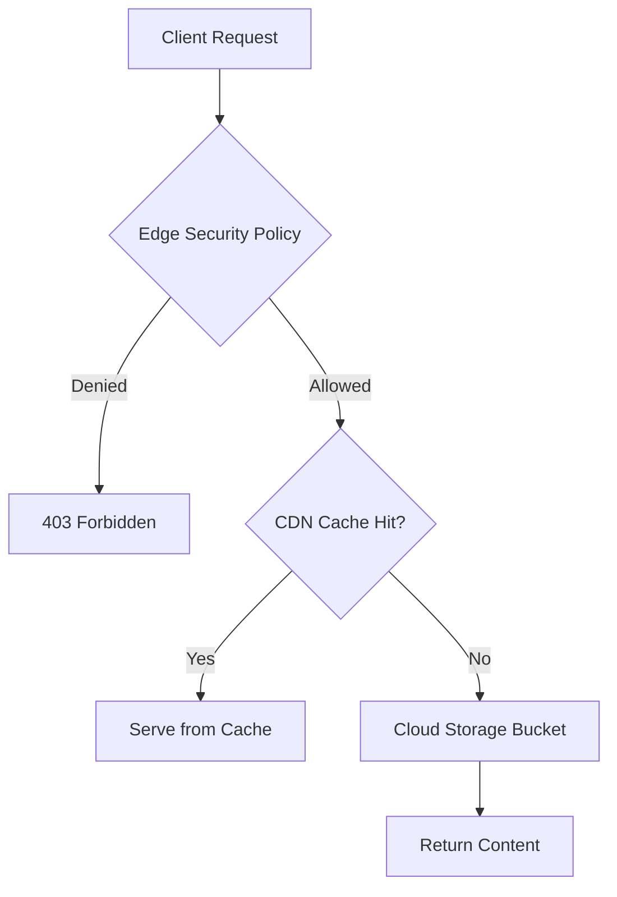

# How to Use Cloud Armor Security Policies with Backend Buckets in GCP

Author: [nawazdhandala](https://www.github.com/nawazdhandala)

Tags: GCP, Cloud Armor, Backend Buckets, Cloud Storage, Security

Description: Protect your Cloud Storage backend buckets with Cloud Armor edge security policies to control access, enforce geo-restrictions, and prevent content scraping.

---

Backend buckets in GCP let you serve static content from Cloud Storage through an external HTTP(S) load balancer, often with Cloud CDN enabled. It is a common pattern for hosting static websites, media assets, and downloadable files. But out of the box, backend buckets have no Cloud Armor protection. Unlike backend services, you cannot attach a standard Cloud Armor security policy to a backend bucket. The solution is edge security policies.

This guide shows you how to protect your backend buckets with Cloud Armor, including practical patterns for access control and abuse prevention.

## The Backend Bucket Security Gap

When you set up a backend bucket, traffic flows like this:

1. Client sends request to your load balancer
2. If Cloud CDN is enabled and there is a cache hit, the response is served immediately
3. If there is a cache miss, the request goes to Cloud Storage

The problem is that standard Cloud Armor backend security policies do not apply to backend buckets. They only work with backend services (Compute Engine instances, GKE, Cloud Run, etc.). If you need to restrict who can access your static content, you need edge security policies.



## Step 1: Create an Edge Security Policy

Edge security policies are a different type from standard backend policies:

```bash
# Create an edge security policy for backend buckets
gcloud compute security-policies create bucket-edge-policy \
  --type=CLOUD_ARMOR_EDGE \
  --description="Edge security policy for static content bucket" \
  --project=your-project-id
```

## Step 2: Add Access Control Rules

Now add rules based on your access control requirements. Here are several common patterns.

### Pattern A: IP-Based Access Control

Restrict access to specific IP ranges:

```bash
# Allow access from your corporate network
gcloud compute security-policies rules create 1000 \
  --security-policy=bucket-edge-policy \
  --src-ip-ranges="203.0.113.0/24,198.51.100.0/24" \
  --action=allow \
  --description="Allow access from corporate networks"

# Deny all other traffic
gcloud compute security-policies rules update 2147483647 \
  --security-policy=bucket-edge-policy \
  --action=deny-403 \
  --description="Default deny all non-corporate traffic"
```

### Pattern B: Geographic Restrictions

Limit content distribution to specific regions:

```bash
# Allow traffic from US and EU only
gcloud compute security-policies rules create 1000 \
  --security-policy=bucket-edge-policy \
  --expression="origin.region_code == 'US' || origin.region_code == 'DE' || origin.region_code == 'FR' || origin.region_code == 'GB'" \
  --action=allow \
  --description="Allow traffic from US and key EU countries"

# Deny all other regions
gcloud compute security-policies rules update 2147483647 \
  --security-policy=bucket-edge-policy \
  --action=deny-403 \
  --description="Default deny non-approved regions"
```

### Pattern C: Allow CDN Provider IPs Only

If you use a third-party CDN that pulls from your GCP origin:

```bash
# Allow only your CDN provider to access the bucket
gcloud compute security-policies rules create 1000 \
  --security-policy=bucket-edge-policy \
  --src-ip-ranges="CDN_IP_RANGE_1,CDN_IP_RANGE_2" \
  --action=allow \
  --description="Allow CDN origin pull access"

# Also allow your own monitoring
gcloud compute security-policies rules create 1100 \
  --security-policy=bucket-edge-policy \
  --src-ip-ranges="YOUR_MONITORING_IP/32" \
  --action=allow \
  --description="Allow monitoring access"

# Deny all direct access
gcloud compute security-policies rules update 2147483647 \
  --security-policy=bucket-edge-policy \
  --action=deny-403 \
  --description="Block all direct access"
```

## Step 3: Attach the Policy to Your Backend Bucket

Apply the edge security policy to your backend bucket:

```bash
# Attach the edge security policy to the backend bucket
gcloud compute backend-buckets update your-static-bucket \
  --edge-security-policy=bucket-edge-policy \
  --project=your-project-id
```

Verify the attachment:

```bash
# Verify the backend bucket has the edge policy attached
gcloud compute backend-buckets describe your-static-bucket \
  --project=your-project-id \
  --format="yaml(edgeSecurityPolicy)"
```

## Setting Up a Complete Backend Bucket with Security

If you are starting from scratch, here is the complete setup:

```bash
# Step 1: Create a Cloud Storage bucket
gcloud storage buckets create gs://your-static-content-bucket \
  --location=US \
  --project=your-project-id

# Step 2: Make the bucket content publicly readable (required for backend buckets)
gcloud storage buckets add-iam-policy-binding gs://your-static-content-bucket \
  --member=allUsers \
  --role=roles/storage.objectViewer

# Step 3: Create the backend bucket with CDN enabled
gcloud compute backend-buckets create static-content-backend \
  --gcs-bucket-name=your-static-content-bucket \
  --enable-cdn \
  --project=your-project-id

# Step 4: Create and configure the edge security policy
gcloud compute security-policies create static-edge-policy \
  --type=CLOUD_ARMOR_EDGE \
  --description="Protect static content"

# Step 5: Add your security rules
gcloud compute security-policies rules create 1000 \
  --security-policy=static-edge-policy \
  --expression="origin.region_code == 'US'" \
  --action=allow \
  --description="Allow US traffic"

gcloud compute security-policies rules update 2147483647 \
  --security-policy=static-edge-policy \
  --action=deny-403

# Step 6: Attach the policy
gcloud compute backend-buckets update static-content-backend \
  --edge-security-policy=static-edge-policy
```

## Preventing Content Scraping

Even with edge security policies, determined scrapers might still access your content from allowed regions. Here are additional measures:

```bash
# Block requests without a referer header (common for scrapers)
gcloud compute security-policies rules create 500 \
  --security-policy=bucket-edge-policy \
  --expression="!has(request.headers['referer'])" \
  --action=deny-403 \
  --description="Block requests without referer header"

# Allow requests with your domain as referer
gcloud compute security-policies rules create 400 \
  --security-policy=bucket-edge-policy \
  --expression="has(request.headers['referer']) && request.headers['referer'].matches('https://yourdomain\\.com/.*')" \
  --action=allow \
  --description="Allow requests with valid referer"
```

Be careful with referer-based rules. The referer header can be spoofed and is sometimes stripped by browsers or proxies. Use it as one layer of defense, not the only one.

## Monitoring Backend Bucket Traffic

Keep an eye on your edge policy performance:

```bash
# View edge security policy logs for the backend bucket
gcloud logging read \
  'resource.type="http_load_balancer" AND jsonPayload.enforcedEdgeSecurityPolicy.name="bucket-edge-policy"' \
  --project=your-project-id \
  --limit=25 \
  --format="table(timestamp, jsonPayload.enforcedEdgeSecurityPolicy.configuredAction, jsonPayload.remoteIp, jsonPayload.requestUrl)"
```

Create a log-based metric to track blocked requests over time:

```bash
# Create a metric for blocked bucket requests
gcloud logging metrics create bucket-blocked-requests \
  --project=your-project-id \
  --description="Blocked requests to backend bucket" \
  --log-filter='resource.type="http_load_balancer" AND jsonPayload.enforcedEdgeSecurityPolicy.name="bucket-edge-policy" AND jsonPayload.enforcedEdgeSecurityPolicy.configuredAction="DENY"'
```

## Handling Multiple Backend Buckets

If you have multiple backend buckets for different content types, you can share a single edge policy or create separate policies:

```bash
# Shared policy approach - attach same policy to multiple buckets
gcloud compute backend-buckets update media-bucket \
  --edge-security-policy=bucket-edge-policy

gcloud compute backend-buckets update docs-bucket \
  --edge-security-policy=bucket-edge-policy

# Or create separate policies for different access requirements
gcloud compute security-policies create media-policy \
  --type=CLOUD_ARMOR_EDGE \
  --description="Policy for media content"

gcloud compute security-policies create docs-policy \
  --type=CLOUD_ARMOR_EDGE \
  --description="Policy for documentation"
```

Use separate policies when different buckets have different access requirements (for example, public documentation vs. premium media content).

## Limitations and Workarounds

There are some constraints to be aware of:

- **No rate limiting:** Edge security policies do not support rate limiting. If you need rate limiting for static content, consider putting a backend service (like Cloud Run) in front of Cloud Storage instead of using a backend bucket directly.
- **No WAF rules:** Preconfigured WAF rules are not available in edge policies. This is usually fine for static content since there is no dynamic processing to exploit.
- **No reCAPTCHA:** Bot management via reCAPTCHA is not supported at the edge. Again, a backend service proxy can add this if needed.
- **Limited header inspection:** You can inspect some headers but the full CEL expression set available for backend policies is not fully supported.

## Wrapping Up

Backend buckets are an efficient way to serve static content, but they need security too. Edge security policies are the only Cloud Armor option for backend buckets, and they cover the most important use cases - IP filtering, geographic restrictions, and basic request inspection. For any production deployment serving static assets through backend buckets, an edge security policy is essential. Without one, your content is accessible to anyone who knows the load balancer URL, regardless of your intended access controls.
