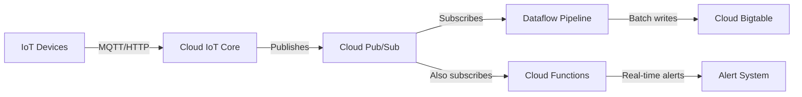

# How to Use Cloud Bigtable as a Backend for IoT Telemetry Data

Author: [nawazdhandala](https://www.github.com/nawazdhandala)

Tags: GCP, Cloud Bigtable, IoT, Telemetry, Time Series Data

Description: Design and implement a Cloud Bigtable backend for IoT telemetry data, covering schema design, ingestion pipelines, efficient querying, and scaling strategies.

---

IoT devices generate staggering amounts of telemetry data. A single factory floor might have thousands of sensors, each reporting temperature, pressure, vibration, and status every second. That is millions of data points per hour that need to be stored and queried with low latency. Cloud Bigtable was built for exactly this kind of workload.

I have designed Bigtable schemas for IoT platforms handling data from hundreds of thousands of devices. The key lessons always come down to row key design, write distribution, and query pattern alignment. In this post, I will share a complete approach to building an IoT telemetry backend on Bigtable.

## Why Bigtable for IoT Telemetry?

Several characteristics make Bigtable an excellent fit:

- **Write throughput:** Each node handles 10,000+ writes per second. Scale horizontally by adding nodes.
- **Low-latency reads:** Consistent single-digit millisecond reads regardless of data volume.
- **Automatic scaling:** Storage scales infinitely. Compute scales with node count or autoscaling.
- **Time-series native:** The data model with row keys and timestamps maps naturally to time-series data.
- **Cost at scale:** Cheaper per GB than relational databases for multi-terabyte datasets.

## Designing the Schema

Schema design for IoT telemetry in Bigtable revolves around one critical decision: the row key structure.

### Row Key Design

The row key determines how data is sorted, distributed, and queried. For IoT telemetry, the most common queries are:

1. Get the latest readings for a specific device
2. Get all readings for a device within a time range
3. Get readings across multiple devices in a location

Here is the row key structure I recommend:

```
<device_type>#<device_id>#<reverse_timestamp>
```

The reverse timestamp is calculated as `Long.MAX_VALUE - timestamp_millis`. This puts the most recent data first when scanning, which is the most common query pattern.

```python
# Row key design for IoT telemetry data
import time

def create_row_key(device_type, device_id, timestamp_ms=None):
    """Generate a Bigtable row key for an IoT telemetry reading."""

    if timestamp_ms is None:
        timestamp_ms = int(time.time() * 1000)

    # Reverse timestamp puts newest data first in scan order
    max_long = 9999999999999  # Large enough for millisecond timestamps
    reverse_ts = max_long - timestamp_ms

    # Pad components for consistent sorting
    return f"{device_type}#{device_id}#{reverse_ts:013d}"

# Examples of generated row keys
print(create_row_key("thermostat", "device-001"))
# Output: thermostat#device-001#7973828461234

print(create_row_key("thermostat", "device-001", 1706140800000))
# Output: thermostat#device-001#8293859199999
```

### Column Families

Create separate column families for different data categories:

```bash
# Create the telemetry table with appropriate column families
cbt -instance=my-iot-instance createtable telemetry

# Raw sensor readings - high volume, time-bounded retention
cbt -instance=my-iot-instance createfamily telemetry readings
cbt -instance=my-iot-instance setgcpolicy telemetry readings maxage=30d

# Device metadata - low volume, keep latest version only
cbt -instance=my-iot-instance createfamily telemetry meta
cbt -instance=my-iot-instance setgcpolicy telemetry meta maxversions=1

# Alerts and anomalies - keep longer for analysis
cbt -instance=my-iot-instance createfamily telemetry alerts
cbt -instance=my-iot-instance setgcpolicy telemetry alerts maxage=90d
```

## Ingestion Pipeline

For IoT data ingestion, you typically receive data through Cloud IoT Core or directly via Pub/Sub. Here is an ingestion pipeline:



Here is the Dataflow pipeline for ingesting telemetry:

```python
# iot_ingestion.py - Dataflow pipeline to ingest IoT telemetry into Bigtable
import apache_beam as beam
from apache_beam.io.gcp.bigtableio import WriteToBigTable
from google.cloud.bigtable import row as bt_row
import json
import time
import datetime

class ParseTelemetry(beam.DoFn):
    """Parse raw IoT telemetry messages from Pub/Sub."""

    def process(self, element):
        try:
            data = json.loads(element.decode("utf-8"))
            # Validate required fields
            if all(k in data for k in ["device_id", "device_type", "readings"]):
                yield data
            else:
                print(f"Missing required fields in message: {data.keys()}")
        except json.JSONDecodeError:
            print(f"Invalid JSON in telemetry message")

class CreateBigtableMutations(beam.DoFn):
    """Convert parsed telemetry into Bigtable row mutations."""

    def process(self, telemetry):
        device_type = telemetry["device_type"]
        device_id = telemetry["device_id"]
        timestamp_ms = telemetry.get("timestamp_ms", int(time.time() * 1000))
        readings = telemetry["readings"]

        # Build the row key with reverse timestamp
        max_long = 9999999999999
        reverse_ts = max_long - timestamp_ms
        row_key = f"{device_type}#{device_id}#{reverse_ts:013d}"

        # Create the Bigtable row mutation
        direct_row = bt_row.DirectRow(row_key=row_key.encode("utf-8"))
        ts = datetime.datetime.fromtimestamp(
            timestamp_ms / 1000, tz=datetime.timezone.utc)

        # Write each sensor reading as a separate column
        for metric_name, value in readings.items():
            direct_row.set_cell(
                "readings",
                metric_name,
                str(value).encode("utf-8"),
                timestamp=ts
            )

        # Write device metadata
        if "location" in telemetry:
            direct_row.set_cell(
                "meta",
                "location",
                telemetry["location"].encode("utf-8"),
                timestamp=ts
            )

        yield direct_row

def run():
    """Run the IoT telemetry ingestion pipeline."""
    options = beam.options.pipeline_options.PipelineOptions([
        "--project=my-project",
        "--runner=DataflowRunner",
        "--region=us-central1",
        "--temp_location=gs://my-bucket/temp",
        "--streaming",
        "--max_num_workers=10"
    ])

    with beam.Pipeline(options=options) as p:
        (
            p
            | "ReadFromPubSub" >> beam.io.ReadFromPubSub(
                subscription="projects/my-project/subscriptions/telemetry-sub")
            | "ParseTelemetry" >> beam.ParDo(ParseTelemetry())
            | "CreateMutations" >> beam.ParDo(CreateBigtableMutations())
            | "WriteToBigtable" >> WriteToBigTable(
                project_id="my-project",
                instance_id="my-iot-instance",
                table_id="telemetry")
        )

if __name__ == "__main__":
    run()
```

## Querying Telemetry Data

### Get Latest Readings for a Device

Since row keys use reverse timestamps, the latest data is at the beginning of a device's key range:

```python
# Get the most recent readings for a specific device
from google.cloud import bigtable
from google.cloud.bigtable import row_filters

client = bigtable.Client(project="my-project")
instance = client.instance("my-iot-instance")
table = instance.table("telemetry")

def get_latest_readings(device_type, device_id, count=1):
    """Fetch the most recent telemetry readings for a device."""

    prefix = f"{device_type}#{device_id}#"

    # Only get the readings family, latest version, limited rows
    read_filter = row_filters.RowFilterChain(filters=[
        row_filters.FamilyNameRegexFilter("readings"),
        row_filters.CellsColumnLimitFilter(1)
    ])

    rows = table.read_rows(
        start_key=prefix.encode("utf-8"),
        end_key=(prefix[:-1] + chr(ord(prefix[-1]) + 1)).encode("utf-8"),
        limit=count,
        filter_=read_filter
    )

    results = []
    for row in rows:
        reading = {}
        for qualifier, cells in row.cells.get("readings", {}).items():
            reading[qualifier.decode("utf-8")] = cells[0].value.decode("utf-8")
        results.append(reading)

    return results

# Get the last 10 readings for a thermostat
readings = get_latest_readings("thermostat", "device-001", count=10)
for r in readings:
    print(r)
```

### Get Readings in a Time Range

```python
# Query readings for a device within a specific time range
def get_readings_in_range(device_type, device_id, start_time_ms, end_time_ms):
    """Fetch telemetry readings within a time window."""

    max_long = 9999999999999

    # Reverse timestamps flip the range
    # Start key uses end_time (smaller reverse ts = more recent)
    # End key uses start_time (larger reverse ts = older)
    start_key = f"{device_type}#{device_id}#{max_long - end_time_ms:013d}"
    end_key = f"{device_type}#{device_id}#{max_long - start_time_ms:013d}"

    rows = table.read_rows(
        start_key=start_key.encode("utf-8"),
        end_key=end_key.encode("utf-8"),
        filter_=row_filters.FamilyNameRegexFilter("readings")
    )

    results = []
    for row in rows:
        reading = {"row_key": row.row_key.decode("utf-8")}
        for qualifier, cells in row.cells.get("readings", {}).items():
            reading[qualifier.decode("utf-8")] = cells[0].value.decode("utf-8")
        results.append(reading)

    return results
```

## Avoiding Hot Spots

The biggest performance pitfall with IoT data in Bigtable is hot-spotting. If all devices write with similar timestamps, writes concentrate on the same tablet servers.

The row key design above - grouping by device type and device ID before the timestamp - naturally distributes writes across many key ranges. If you have many device types and IDs, writes spread evenly.

For workloads where most devices share the same type, add a hash prefix:

```python
# Add a hash prefix to distribute writes more evenly
import hashlib

def create_salted_row_key(device_type, device_id, timestamp_ms):
    """Create a hash-salted row key for better write distribution."""

    # Generate a 2-character hex prefix from the device ID
    salt = hashlib.md5(device_id.encode()).hexdigest()[:2]

    max_long = 9999999999999
    reverse_ts = max_long - timestamp_ms

    return f"{salt}#{device_type}#{device_id}#{reverse_ts:013d}"
```

The tradeoff is that prefix scans for a single device now need to know the salt value. Store the salt in a separate lookup table or compute it deterministically from the device ID.

## Scaling the Cluster

For IoT workloads, enable autoscaling to handle device traffic that varies by time of day:

```bash
# Enable autoscaling for the IoT Bigtable cluster
gcloud bigtable clusters update iot-cluster \
  --instance=my-iot-instance \
  --autoscaling-min-nodes=3 \
  --autoscaling-max-nodes=30 \
  --autoscaling-cpu-target=60
```

## Monitoring IoT Workloads

Track these metrics specific to IoT telemetry workloads:

- **Write throughput per device type** - detect if a device type is generating unexpected volumes
- **Read latency by query pattern** - latest-reading queries should be under 10ms
- **Storage growth rate** - verify your GC policies are working and storage is not growing unbounded
- **Hot tablet detection** - watch for uneven CPU distribution across nodes

## Wrapping Up

Cloud Bigtable handles IoT telemetry at any scale you need - from thousands of devices to millions. The critical investment is in row key design. Get the key structure right, set appropriate garbage collection policies, and build your ingestion pipeline with Pub/Sub and Dataflow. From there, Bigtable does the heavy lifting of storing and serving your telemetry data with the low latency your applications demand.
