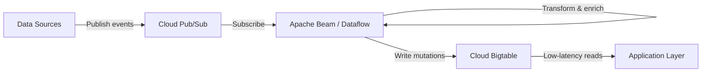

# How to Use Cloud Bigtable with Apache Beam for Streaming Data Pipelines

Author: [nawazdhandala](https://www.github.com/nawazdhandala)

Tags: GCP, Cloud Bigtable, Apache Beam, Dataflow, Streaming, Data Pipelines

Description: Build streaming data pipelines that write to Cloud Bigtable using Apache Beam and Google Cloud Dataflow for real-time data processing at scale.

---

When you need to process streaming data at scale and store results for low-latency reads, the combination of Apache Beam and Cloud Bigtable is hard to beat. Beam gives you a unified programming model for both batch and streaming, while Bigtable provides consistent single-digit millisecond reads no matter how much data you throw at it.

I have used this combination for processing real-time event streams, building feature stores for ML models, and ingesting IoT sensor data. In this post, I will walk through building a streaming pipeline with Apache Beam that reads from Pub/Sub and writes to Cloud Bigtable.

## Why Apache Beam and Bigtable?

Apache Beam is a portable data processing framework. You write your pipeline once and run it on different execution engines - Dataflow, Spark, Flink. When you run it on Google Cloud Dataflow, you get autoscaling, exactly-once processing, and tight integration with other GCP services.

Cloud Bigtable is ideal as a sink for streaming pipelines because:

- It handles millions of writes per second
- Read latency stays low regardless of data volume
- It scales horizontally by adding nodes
- There is no need to pre-define schemas for new columns

## Architecture Overview

Here is the full architecture of what we are building:



## Prerequisites

You will need:

- A GCP project with Dataflow API, Bigtable API, and Pub/Sub API enabled
- A Pub/Sub topic and subscription
- A Bigtable instance with a table created
- Python 3.8+ or Java 11+ for development

Let me set up the infrastructure first:

```bash
# Enable all required APIs
gcloud services enable \
  dataflow.googleapis.com \
  bigtable.googleapis.com \
  pubsub.googleapis.com

# Create a Pub/Sub topic and subscription for the pipeline input
gcloud pubsub topics create user-events
gcloud pubsub subscriptions create user-events-sub --topic=user-events

# Create a Bigtable table with a column family for event data
cbt -instance=my-instance createtable user-events
cbt -instance=my-instance createfamily user-events events
cbt -instance=my-instance createfamily user-events metadata
```

## Building the Pipeline in Python

First, install the required dependencies:

```bash
# Install Apache Beam with GCP extras including Bigtable support
pip install apache-beam[gcp] google-cloud-bigtable
```

Now let me build the pipeline step by step. The pipeline reads JSON events from Pub/Sub, transforms them, and writes to Bigtable.

```python
# streaming_pipeline.py - Apache Beam pipeline that streams data to Bigtable
import apache_beam as beam
from apache_beam.options.pipeline_options import PipelineOptions, StandardOptions
from apache_beam.io.gcp.bigtableio import WriteToBigTable
from google.cloud.bigtable import row as bt_row
import json
import datetime
import hashlib

class ParseEvent(beam.DoFn):
    """Parse raw JSON messages from Pub/Sub into Python dictionaries."""

    def process(self, element):
        try:
            # Decode the Pub/Sub message bytes and parse as JSON
            message = json.loads(element.decode("utf-8"))
            yield message
        except json.JSONDecodeError as e:
            # Log bad messages to a dead-letter output for later inspection
            print(f"Failed to parse message: {e}")

class CreateBigtableRow(beam.DoFn):
    """Convert parsed event dictionaries into Bigtable DirectRow mutations."""

    def process(self, event):
        # Build a row key from user ID and timestamp for time-ordered scans
        user_id = event.get("user_id", "unknown")
        timestamp = event.get("timestamp", datetime.datetime.now().isoformat())

        # Use a hash suffix to avoid hotspotting on sequential keys
        hash_prefix = hashlib.md5(user_id.encode()).hexdigest()[:4]
        row_key = f"{hash_prefix}#{user_id}#{timestamp}"

        # Create a DirectRow with mutations for each field
        direct_row = bt_row.DirectRow(row_key=row_key.encode("utf-8"))

        # Set cells in the events column family
        ts = datetime.datetime.now()
        direct_row.set_cell(
            "events",
            "event_type",
            event.get("event_type", "").encode("utf-8"),
            timestamp=ts
        )
        direct_row.set_cell(
            "events",
            "payload",
            json.dumps(event.get("payload", {})).encode("utf-8"),
            timestamp=ts
        )

        # Set metadata columns
        direct_row.set_cell(
            "metadata",
            "source",
            event.get("source", "unknown").encode("utf-8"),
            timestamp=ts
        )
        direct_row.set_cell(
            "metadata",
            "processed_at",
            datetime.datetime.now().isoformat().encode("utf-8"),
            timestamp=ts
        )

        yield direct_row

def run_pipeline():
    """Configure and run the streaming pipeline."""

    # Set up pipeline options for Dataflow streaming
    options = PipelineOptions([
        "--project=my-project",
        "--region=us-central1",
        "--runner=DataflowRunner",
        "--temp_location=gs://my-bucket/temp",
        "--staging_location=gs://my-bucket/staging",
        "--job_name=user-events-to-bigtable",
        "--max_num_workers=10",
    ])
    options.view_as(StandardOptions).streaming = True

    with beam.Pipeline(options=options) as pipeline:
        (
            pipeline
            # Read from Pub/Sub subscription
            | "ReadFromPubSub" >> beam.io.ReadFromPubSub(
                subscription="projects/my-project/subscriptions/user-events-sub"
            )
            # Parse JSON messages
            | "ParseEvents" >> beam.ParDo(ParseEvent())
            # Convert to Bigtable row mutations
            | "CreateRows" >> beam.ParDo(CreateBigtableRow())
            # Write to Bigtable
            | "WriteToBigtable" >> WriteToBigTable(
                project_id="my-project",
                instance_id="my-instance",
                table_id="user-events"
            )
        )

if __name__ == "__main__":
    run_pipeline()
```

## Handling Windowing for Aggregations

If you need to compute aggregations before writing to Bigtable - for example, counting events per user per minute - you can add windowing to the pipeline:

```python
# Add windowed aggregation before writing to Bigtable
import apache_beam.transforms.window as window

class CountEvents(beam.DoFn):
    """Convert windowed event counts into Bigtable row mutations."""

    def process(self, element, window_info=beam.DoFn.WindowParam):
        user_id, count = element
        # Use the window end timestamp in the row key
        window_end = window_info.end.to_utc_datetime().isoformat()

        row_key = f"count#{user_id}#{window_end}"
        direct_row = bt_row.DirectRow(row_key=row_key.encode("utf-8"))
        direct_row.set_cell(
            "events",
            "event_count",
            str(count).encode("utf-8"),
            timestamp=datetime.datetime.now()
        )
        yield direct_row

# Inside the pipeline definition, add windowing and aggregation
(
    parsed_events
    # Apply 1-minute fixed windows
    | "Window" >> beam.WindowInto(window.FixedWindows(60))
    # Extract user ID as the key
    | "ExtractKey" >> beam.Map(lambda e: (e["user_id"], 1))
    # Count events per user per window
    | "CountPerUser" >> beam.CombinePerKey(sum)
    # Convert to Bigtable mutations
    | "CreateCountRows" >> beam.ParDo(CountEvents())
    # Write aggregated counts to Bigtable
    | "WriteCountsToBigtable" >> WriteToBigTable(
        project_id="my-project",
        instance_id="my-instance",
        table_id="user-events"
    )
)
```

## Row Key Design for Streaming Data

Row key design is critical for Bigtable performance. With streaming data, you face the hot-spotting problem: if all recent writes have similar row keys, they hit the same tablet server.

Here are proven strategies:

**Hash prefix.** Prepend a hash of the key to distribute writes evenly across nodes. The tradeoff is that you lose the ability to do ordered scans by the original key.

**Reverse timestamp.** Use `Long.MAX_VALUE - timestamp` so that recent data sorts first when scanning.

**Salted keys.** Prepend a small number (0-9) based on a hash modulo to create a bounded number of key prefixes.

The example pipeline above uses a hash prefix approach. Choose the strategy that best fits your read patterns.

## Deploying and Monitoring

Launch the pipeline on Dataflow:

```bash
# Submit the streaming pipeline to Dataflow
python streaming_pipeline.py
```

Monitor the pipeline in the Dataflow console. Key metrics to watch:

- **System lag** - how far behind the pipeline is from real-time
- **Data freshness** - the age of the most recently processed element
- **Elements processed** - throughput in elements per second
- **Worker utilization** - CPU and memory usage across workers

You should also monitor Bigtable metrics in Cloud Monitoring:

```bash
# Check Bigtable server-side latency for writes
gcloud monitoring dashboards create \
  --config-from-file=bigtable-monitoring-dashboard.json
```

## Error Handling with Dead-Letter Queues

Production pipelines need to handle bad data gracefully. Add a dead-letter output for messages that fail parsing or transformation:

```python
# Tag outputs for routing good data and errors separately
class ParseEventWithDLQ(beam.DoFn):
    """Parse events and route failures to a dead-letter queue."""

    GOOD_OUTPUT = "good"
    BAD_OUTPUT = "bad"

    def process(self, element):
        try:
            message = json.loads(element.decode("utf-8"))
            yield beam.pvalue.TaggedOutput(self.GOOD_OUTPUT, message)
        except Exception as e:
            yield beam.pvalue.TaggedOutput(self.BAD_OUTPUT, {
                "raw": element.decode("utf-8", errors="replace"),
                "error": str(e)
            })
```

## Performance Tuning

A few tips for getting the best throughput from your Beam-to-Bigtable pipeline:

- **Batch mutations.** The `WriteToBigTable` transform batches mutations automatically, but you can tune the batch size
- **Size your Bigtable cluster.** Each node handles roughly 10,000 writes per second. Plan your cluster accordingly
- **Use Dataflow autoscaling.** Let Dataflow scale workers based on backlog, but set `max_num_workers` to cap costs
- **Avoid large cell values.** Keep individual cell values under 10 MB for best performance

## Wrapping Up

Apache Beam combined with Cloud Bigtable gives you a robust foundation for streaming data pipelines. Beam handles the complexity of exactly-once processing and windowing, while Bigtable delivers the write throughput and read performance your applications need. Start with a simple pipeline, get the row key design right, and then layer on windowing and aggregations as your requirements grow.
