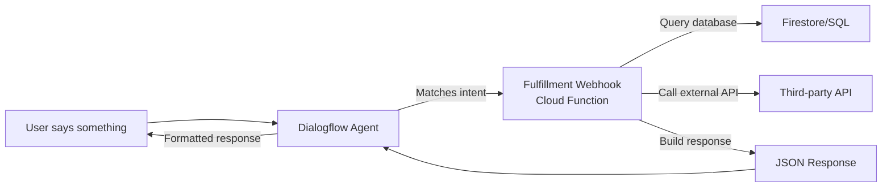

# How to Use Cloud Functions as a Backend for Dialogflow Fulfillment Webhooks

Author: [nawazdhandala](https://www.github.com/nawazdhandala)

Tags: GCP, Cloud Functions, Dialogflow, Chatbot, Webhooks

Description: Learn how to build Dialogflow fulfillment webhooks with Google Cloud Functions to create dynamic, data-driven conversational experiences for chatbots.

---

Dialogflow is Google's natural language understanding platform for building chatbots and conversational interfaces. While Dialogflow handles intent matching and entity extraction well on its own, the real power comes when you connect it to a fulfillment webhook. Instead of returning static responses, your chatbot can look up real data, call APIs, update databases, and generate dynamic responses based on what the user is asking.

Cloud Functions are the natural choice for fulfillment webhooks - they are serverless, scale automatically, and live in the same Google Cloud ecosystem as Dialogflow. Here is how to build a production-ready fulfillment backend.

## How Dialogflow Fulfillment Works



When a user message matches an intent that has fulfillment enabled, Dialogflow sends a POST request to your webhook with the intent name, extracted entities, session info, and other context. Your webhook processes this, does whatever logic is needed, and returns a response that Dialogflow sends back to the user.

## Setting Up the Fulfillment Function

Here is a complete fulfillment webhook that handles multiple intents:

```javascript
// index.js - Dialogflow fulfillment webhook
const functions = require('@google-cloud/functions-framework');
const { Firestore } = require('@google-cloud/firestore');

const firestore = new Firestore();

functions.http('dialogflowFulfillment', async (req, res) => {
  // Dialogflow sends fulfillment requests as POST
  if (req.method !== 'POST') {
    res.status(405).json({ error: 'Method not allowed' });
    return;
  }

  const body = req.body;

  // Extract key fields from the Dialogflow request
  const intentName = body.queryResult?.intent?.displayName;
  const parameters = body.queryResult?.parameters || {};
  const sessionId = body.session?.split('/').pop();
  const queryText = body.queryResult?.queryText;

  console.log(`Intent: ${intentName}, Session: ${sessionId}`);
  console.log('Parameters:', JSON.stringify(parameters));
  console.log('User said:', queryText);

  try {
    // Route to the appropriate intent handler
    let response;
    switch (intentName) {
      case 'check.order.status':
        response = await handleOrderStatus(parameters, sessionId);
        break;
      case 'get.product.info':
        response = await handleProductInfo(parameters);
        break;
      case 'check.store.hours':
        response = await handleStoreHours(parameters);
        break;
      case 'create.support.ticket':
        response = await handleCreateTicket(parameters, sessionId);
        break;
      case 'get.account.balance':
        response = await handleAccountBalance(parameters, sessionId);
        break;
      default:
        response = buildResponse(`I'm not sure how to handle that request.`);
    }

    res.json(response);
  } catch (error) {
    console.error(`Error handling intent ${intentName}:`, error);
    res.json(buildResponse(
      'Sorry, I ran into an issue processing your request. Please try again.'
    ));
  }
});

// Intent handler: Check order status
async function handleOrderStatus(parameters, sessionId) {
  const orderId = parameters.orderId || parameters['order-number'];

  if (!orderId) {
    return buildResponse('I need your order number to look that up. What is your order number?');
  }

  // Look up the order in Firestore
  const orderDoc = await firestore.collection('orders').doc(orderId).get();

  if (!orderDoc.exists) {
    return buildResponse(
      `I could not find order ${orderId}. Please double-check the order number and try again.`
    );
  }

  const order = orderDoc.data();
  const statusMessages = {
    pending: 'Your order is pending and has not been processed yet.',
    processing: 'Your order is being processed and will ship soon.',
    shipped: `Your order shipped on ${order.shippedDate}. Tracking number: ${order.trackingNumber}.`,
    delivered: `Your order was delivered on ${order.deliveredDate}.`,
    cancelled: 'This order has been cancelled.'
  };

  const statusMessage = statusMessages[order.status] || `Your order status is: ${order.status}`;

  return buildResponse(
    `Here is the update for order ${orderId}: ${statusMessage}`,
    { outputContexts: buildContext(sessionId, 'order-context', { orderId, status: order.status }) }
  );
}

// Intent handler: Get product information
async function handleProductInfo(parameters) {
  const productName = parameters.productName || parameters['product-name'];

  if (!productName) {
    return buildResponse('Which product would you like to know about?');
  }

  // Search for the product in Firestore
  const productsRef = firestore.collection('products');
  const snapshot = await productsRef
    .where('name', '==', productName)
    .limit(1)
    .get();

  if (snapshot.empty) {
    // Try a case-insensitive search with lowercase
    const lowerSnapshot = await productsRef
      .where('nameLower', '==', productName.toLowerCase())
      .limit(1)
      .get();

    if (lowerSnapshot.empty) {
      return buildResponse(
        `I could not find a product called "${productName}". Can you try a different name?`
      );
    }

    const product = lowerSnapshot.docs[0].data();
    return buildProductResponse(product);
  }

  const product = snapshot.docs[0].data();
  return buildProductResponse(product);
}

function buildProductResponse(product) {
  const priceFormatted = `$${product.price.toFixed(2)}`;
  const availability = product.inStock ? 'in stock' : 'currently out of stock';

  return buildResponse(
    `${product.name} is ${priceFormatted} and is ${availability}. ${product.description}`
  );
}

// Intent handler: Store hours
async function handleStoreHours(parameters) {
  const location = parameters.location || parameters.city;
  const dayOfWeek = parameters.dayOfWeek;

  // Look up store hours
  const storeDoc = await firestore
    .collection('stores')
    .where('city', '==', location)
    .limit(1)
    .get();

  if (storeDoc.empty) {
    return buildResponse(
      `I do not have information for a store in ${location}. Our locations include New York, Chicago, and San Francisco.`
    );
  }

  const store = storeDoc.docs[0].data();
  const hours = store.hours;

  if (dayOfWeek) {
    const dayHours = hours[dayOfWeek.toLowerCase()];
    return buildResponse(
      `The ${location} store is open ${dayHours} on ${dayOfWeek}.`
    );
  }

  return buildResponse(
    `The ${location} store hours are: Monday-Friday ${hours.weekday}, Saturday ${hours.saturday}, Sunday ${hours.sunday}.`
  );
}

// Intent handler: Create support ticket
async function handleCreateTicket(parameters, sessionId) {
  const issue = parameters.issue || parameters['issue-description'];
  const email = parameters.email;

  if (!issue) {
    return buildResponse('Can you describe the issue you are experiencing?');
  }

  if (!email) {
    return buildResponse(
      'I would like to create a support ticket for you. What email address should I use?',
      { outputContexts: buildContext(sessionId, 'ticket-context', { issue }) }
    );
  }

  // Create the ticket in Firestore
  const ticketRef = await firestore.collection('support-tickets').add({
    issue: issue,
    email: email,
    sessionId: sessionId,
    status: 'open',
    createdAt: new Date(),
    source: 'chatbot'
  });

  return buildResponse(
    `I have created support ticket #${ticketRef.id.slice(0, 8).toUpperCase()} for you. Our team will reach out to ${email} within 24 hours.`
  );
}

// Intent handler: Account balance
async function handleAccountBalance(parameters, sessionId) {
  const accountId = parameters.accountId || parameters['account-number'];

  if (!accountId) {
    return buildResponse('What is your account number?');
  }

  const accountDoc = await firestore.collection('accounts').doc(accountId).get();

  if (!accountDoc.exists) {
    return buildResponse('I could not find that account. Please verify your account number.');
  }

  const account = accountDoc.data();
  return buildResponse(
    `Your current balance is $${account.balance.toFixed(2)} as of ${new Date().toLocaleDateString()}.`
  );
}

// Helper: Build a standard Dialogflow response
function buildResponse(text, options = {}) {
  const response = {
    fulfillmentText: text,
    fulfillmentMessages: [
      {
        text: {
          text: [text]
        }
      }
    ]
  };

  if (options.outputContexts) {
    response.outputContexts = options.outputContexts;
  }

  return response;
}

// Helper: Build output context for multi-turn conversations
function buildContext(sessionId, contextName, parameters, lifespanCount = 5) {
  return [{
    name: `${sessionId}/contexts/${contextName}`,
    lifespanCount: lifespanCount,
    parameters: parameters
  }];
}
```

## Deploying the Webhook

```bash
# Deploy the fulfillment function
gcloud functions deploy dialogflow-fulfillment \
  --gen2 \
  --runtime=nodejs20 \
  --region=us-central1 \
  --source=. \
  --entry-point=dialogflowFulfillment \
  --trigger-http \
  --allow-unauthenticated \
  --memory=256Mi \
  --timeout=15s \
  --min-instances=1
```

Note: `--allow-unauthenticated` is used here because Dialogflow sends webhook requests directly. For added security, you can use IAM authentication and configure Dialogflow with the appropriate service account.

Setting `--min-instances=1` keeps a warm instance ready so the chatbot responds quickly without cold start delays.

## Connecting to Dialogflow

1. In the Dialogflow Console, go to Fulfillment in the left sidebar
2. Enable the Webhook toggle
3. Enter your function URL: `https://dialogflow-fulfillment-abc123-uc.a.run.app`
4. Save
5. For each intent that needs dynamic responses, enable "Enable webhook call for this intent" in the intent settings

## Rich Responses

Beyond plain text, you can return rich responses with cards, images, and suggestion chips:

```javascript
// Build a rich response with a card and suggestions
function buildRichResponse(text, cardData, suggestions) {
  return {
    fulfillmentText: text,
    fulfillmentMessages: [
      {
        text: { text: [text] }
      },
      {
        card: {
          title: cardData.title,
          subtitle: cardData.subtitle,
          imageUri: cardData.imageUrl,
          buttons: cardData.buttons.map(b => ({
            text: b.text,
            postback: b.url
          }))
        }
      },
      {
        quickReplies: {
          title: 'What would you like to do next?',
          quickReplies: suggestions
        }
      }
    ]
  };
}

// Usage in an intent handler
async function handleProductInfo(parameters) {
  const product = await getProduct(parameters.productName);

  return buildRichResponse(
    `Here is ${product.name}:`,
    {
      title: product.name,
      subtitle: `$${product.price.toFixed(2)} - ${product.inStock ? 'In Stock' : 'Out of Stock'}`,
      imageUrl: product.imageUrl,
      buttons: [
        { text: 'View Details', url: product.pageUrl },
        { text: 'Add to Cart', url: `${product.pageUrl}/add-to-cart` }
      ]
    },
    ['Check another product', 'View my cart', 'Talk to support']
  );
}
```

## Dialogflow CX Webhook Format

If you are using Dialogflow CX (the newer version), the request and response format is different:

```javascript
// Dialogflow CX fulfillment webhook handler
functions.http('dialogflowCxFulfillment', async (req, res) => {
  const body = req.body;

  // CX uses a different structure
  const tag = body.fulfillmentInfo?.tag;
  const sessionInfo = body.sessionInfo;
  const parameters = sessionInfo?.parameters || {};

  console.log(`Tag: ${tag}`);
  console.log('Parameters:', JSON.stringify(parameters));

  let responseMessages = [];
  let sessionParams = {};

  switch (tag) {
    case 'check-order':
      const order = await getOrder(parameters.orderId);
      responseMessages = [{
        text: {
          text: [`Order ${parameters.orderId} is ${order.status}.`]
        }
      }];
      sessionParams = { orderStatus: order.status };
      break;
  }

  // CX response format
  res.json({
    fulfillmentResponse: {
      messages: responseMessages
    },
    sessionInfo: {
      parameters: sessionParams
    }
  });
});
```

## Error Handling Best Practices

Always return a user-friendly response, even on errors:

```javascript
// Wrap intent handlers with error boundaries
async function safeHandle(handler, parameters, sessionId) {
  try {
    return await handler(parameters, sessionId);
  } catch (error) {
    console.error(`Handler error:`, error);

    // Return a friendly fallback message
    return buildResponse(
      'I am having trouble processing that right now. Could you try again in a moment?'
    );
  }
}
```

## Monitoring

Monitor your fulfillment webhook with OneUptime to track response times, error rates, and intent resolution success. A slow webhook means slow chatbot responses, which directly impacts user experience. Set up alerts for when response times exceed 2-3 seconds (Dialogflow has a 5-second timeout for webhooks by default) or when error rates increase. Monitoring helps you identify which intents are failing most often so you can prioritize improvements.

A well-built fulfillment webhook turns a basic chatbot into a genuinely useful assistant that can look up real data and take actions on behalf of users. Keep the webhook fast, handle errors gracefully, and monitor everything.
