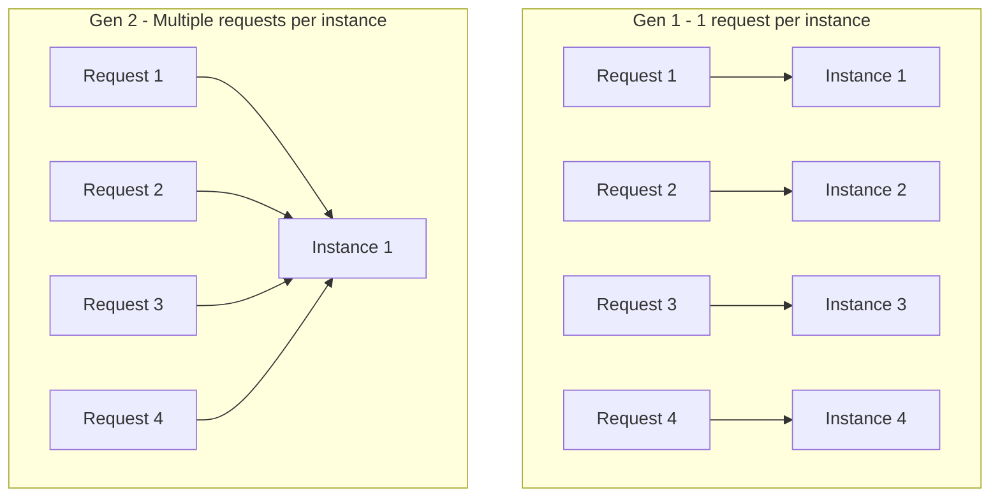

# How to Use Cloud Functions Gen 2 Concurrency to Handle Multiple Requests Per Instance

Author: [nawazdhandala](https://www.github.com/nawazdhandala)

Tags: GCP, Cloud Functions, Concurrency, Performance, Serverless

Description: Learn how to configure and optimize Cloud Functions Gen 2 concurrency to handle multiple simultaneous requests per instance, reducing costs and cold starts.

---

One of the biggest improvements in Cloud Functions Gen 2 is concurrency support. In Gen 1, each function instance could only process one request at a time. If 100 requests came in simultaneously, you needed 100 instances. Gen 2 changes this by allowing a single instance to handle up to 1000 concurrent requests, similar to how a traditional web server works.

This has a massive impact on cost, cold starts, and performance. Let me show you how to set it up correctly and what to watch out for.

## How Concurrency Works in Gen 2

When you deploy a Gen 2 function with concurrency enabled, a single instance receives multiple requests simultaneously. Your function code runs in parallel within the same process, sharing memory, global variables, and connections.



With 4 concurrent requests, Gen 1 needs 4 instances, while Gen 2 needs just 1. Fewer instances means fewer cold starts and lower costs.

## Configuring Concurrency

### Using gcloud

```bash
# Deploy with concurrency set to 80 requests per instance
gcloud functions deploy my-api \
  --gen2 \
  --runtime=nodejs20 \
  --region=us-central1 \
  --source=. \
  --entry-point=handler \
  --trigger-http \
  --concurrency=80 \
  --memory=1Gi \
  --cpu=1 \
  --min-instances=1 \
  --max-instances=50
```

### Using Terraform

```hcl
resource "google_cloudfunctions2_function" "api" {
  name     = "my-api"
  location = "us-central1"

  build_config {
    runtime     = "nodejs20"
    entry_point = "handler"
    source {
      storage_source {
        bucket = google_storage_bucket.source.name
        object = google_storage_bucket_object.source.name
      }
    }
  }

  service_config {
    available_memory = "1Gi"
    available_cpu    = "1"

    # Set concurrency to 80 requests per instance
    max_instance_request_concurrency = 80

    min_instance_count = 1
    max_instance_count = 50
    timeout_seconds    = 60
  }
}
```

## Choosing the Right Concurrency Value

The right concurrency value depends on your function's characteristics:

**I/O-bound functions** (making API calls, database queries, reading from storage): These can handle high concurrency because most of the time is spent waiting for responses. Start with 80-200.

**CPU-bound functions** (image processing, data transformation, encryption): These need more CPU per request, so lower concurrency works better. Start with 4-16.

**Memory-intensive functions**: Each concurrent request uses some memory. If your function processes large payloads, you might hit memory limits at high concurrency.

Here is a starting point for different workloads:

```bash
# I/O heavy API function
gcloud functions deploy api-handler \
  --gen2 \
  --concurrency=100 \
  --memory=512Mi \
  --cpu=1

# CPU-intensive image processing
gcloud functions deploy image-processor \
  --gen2 \
  --concurrency=4 \
  --memory=2Gi \
  --cpu=2

# Moderate workload with database queries
gcloud functions deploy data-processor \
  --gen2 \
  --concurrency=40 \
  --memory=1Gi \
  --cpu=1
```

## Writing Concurrency-Safe Code

When multiple requests share the same instance, you need to be careful about shared state. Here are the common pitfalls and how to avoid them.

### Shared Global Variables

Global variables are shared across all concurrent requests. This can be useful (connection pools) or dangerous (request-specific state).

```javascript
// DANGEROUS: Global variable used for request-specific data
let currentUserId; // Shared across all concurrent requests!

functions.http('handler', async (req, res) => {
  currentUserId = req.headers['x-user-id']; // Race condition!
  // Another request might overwrite currentUserId before we use it

  const data = await fetchUserData(currentUserId);
  res.json(data);
});

// SAFE: Use local variables for request-specific data
functions.http('handler', async (req, res) => {
  const currentUserId = req.headers['x-user-id']; // Local to this request
  const data = await fetchUserData(currentUserId);
  res.json(data);
});
```

### Connection Pool Sizing

With concurrency enabled, you need to size your connection pools appropriately. A pool that is too small will become a bottleneck when many requests compete for connections.

```javascript
// Configure connection pool for concurrent access
const { Pool } = require('pg');

const pool = new Pool({
  connectionString: process.env.DATABASE_URL,
  // Size the pool relative to your concurrency setting
  // For concurrency=80, a pool of 20-30 connections is usually enough
  // since not every request needs a connection simultaneously
  max: 20,
  min: 5,
  idleTimeoutMillis: 30000,
  connectionTimeoutMillis: 5000
});

functions.http('handler', async (req, res) => {
  // Each request gets a connection from the pool
  // The pool handles queuing if all connections are in use
  const client = await pool.connect();
  try {
    const result = await client.query('SELECT * FROM users WHERE id = $1', [req.query.id]);
    res.json(result.rows);
  } finally {
    client.release(); // Always release back to the pool
  }
});
```

### Shared Caches

A shared in-memory cache is one of the benefits of concurrency - multiple requests can share cached data:

```javascript
// In-memory cache shared across concurrent requests
const cache = new Map();
const CACHE_TTL = 60 * 1000; // 60 seconds

function getCached(key) {
  const entry = cache.get(key);
  if (entry && Date.now() - entry.time < CACHE_TTL) {
    return entry.value;
  }
  cache.delete(key);
  return null;
}

function setCache(key, value) {
  cache.set(key, { value, time: Date.now() });
}

functions.http('handler', async (req, res) => {
  const configKey = 'app-config';
  let config = getCached(configKey);

  if (!config) {
    // Only one request fetches the config; subsequent concurrent requests
    // will find it in the cache
    config = await fetchConfigFromDatabase();
    setCache(configKey, config);
  }

  res.json({ features: config.features });
});
```

## CPU Allocation and Concurrency

With Gen 2, you can choose between two CPU allocation models:

**CPU allocated during request processing only** (default): You only pay for CPU when requests are being processed. Idle instances use no CPU. This is cheaper but means that background tasks between requests will not execute.

**CPU always allocated**: CPU is available even when the instance is idle. More expensive but needed if your function does background work.

```bash
# CPU allocated only during requests (cheaper)
gcloud functions deploy my-api \
  --gen2 \
  --cpu-throttling \
  --concurrency=80

# CPU always allocated (for background processing)
gcloud functions deploy my-api \
  --gen2 \
  --no-cpu-throttling \
  --concurrency=80
```

For most API-style functions, "CPU during request" is the right choice. Use "CPU always allocated" if your function maintains persistent connections, runs background cleanup, or uses WebSockets.

## Scaling Behavior with Concurrency

Understanding how autoscaling works with concurrency is important for capacity planning:

```
Total capacity = max_instances * concurrency

Example: max_instances=50, concurrency=80
Total capacity = 4000 concurrent requests
```

The autoscaler uses a target utilization of about 60-70% of your concurrency setting. So with concurrency=80, new instances start spinning up when existing instances hit ~50-55 concurrent requests.

```bash
# Scale calculation for production
# Target: handle 1000 concurrent users
# With concurrency=100 and 70% utilization target:
# Instances needed = 1000 / (100 * 0.7) = ~15 instances
gcloud functions deploy my-api \
  --gen2 \
  --concurrency=100 \
  --min-instances=5 \
  --max-instances=25 \
  --memory=1Gi \
  --cpu=2
```

## Monitoring Concurrency

Track how your instances are handling concurrent requests to find the optimal setting:

```bash
# Check concurrent requests per instance
gcloud monitoring metrics list \
  --filter="metric.type=run.googleapis.com/container/instance_count"
```

Key metrics to watch:
- **Instance count**: How many instances are running
- **Request latency**: Does latency increase at higher concurrency?
- **Memory usage**: Are instances running out of memory with many concurrent requests?
- **CPU utilization**: Is the CPU maxed out?

## Load Testing Concurrency

Before going to production, load test your concurrency configuration:

```bash
# Install hey for load testing
go install github.com/rakyll/hey@latest

# Send 1000 requests with 100 concurrent workers
hey -n 1000 -c 100 \
  https://my-api-abcdef-uc.a.run.app/

# Check the results for:
# - Response time distribution
# - Error rate
# - Requests per second
```

If you see latency increasing sharply at high concurrency, your function might be CPU-bound and you should either reduce the concurrency setting or increase the CPU allocation.

## Monitoring in Production

Set up monitoring with OneUptime to track instance utilization, response latency percentiles, and error rates at different concurrency levels. When traffic patterns change, your optimal concurrency setting might need to change too. Monitoring helps you catch situations where instances are overloaded or underutilized.

Concurrency is one of the most impactful features of Gen 2 Cloud Functions. Getting it right can cut your costs significantly while improving response times for your users. Start conservative, measure everything, and adjust based on real data.
