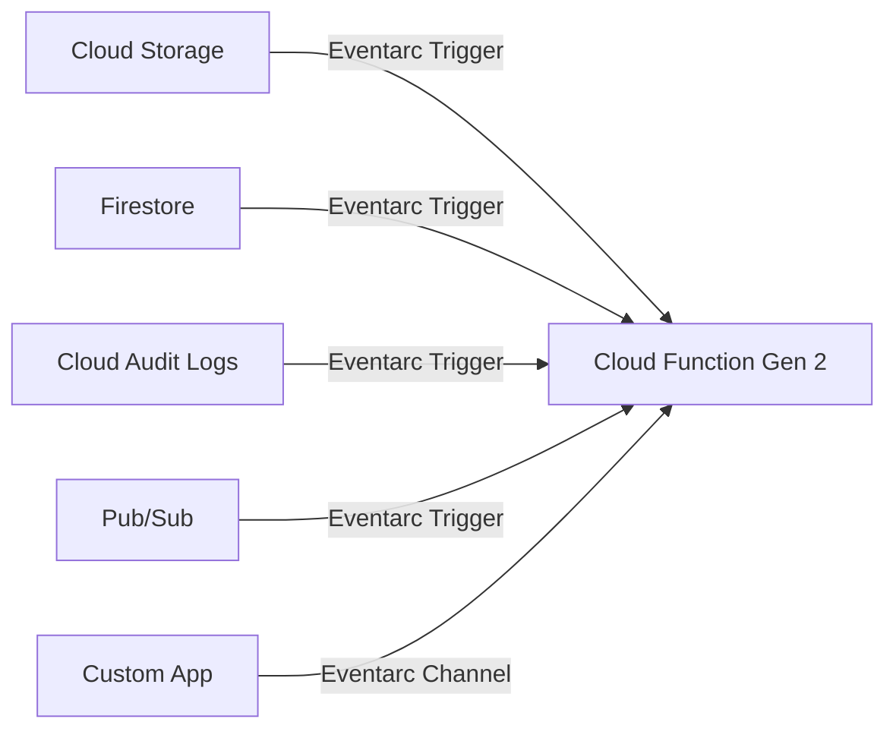

# How to Use Cloud Functions Gen 2 with Eventarc for Multi-Source Event Routing

Author: [nawazdhandala](https://www.github.com/nawazdhandala)

Tags: GCP, Cloud Functions, Eventarc, Serverless, Event-Driven Architecture

Description: A practical guide to using Cloud Functions Gen 2 with Eventarc to route events from multiple Google Cloud sources into a single event-driven architecture.

---

Cloud Functions Gen 2 brought a major shift in how event-driven architectures work on Google Cloud. Instead of the tightly coupled trigger model in Gen 1, where each function had exactly one trigger type baked in, Gen 2 uses Eventarc as a universal event routing layer. This means you can have a single function respond to events from Cloud Storage, Pub/Sub, Firestore, Cloud Audit Logs, and dozens of other sources - all through a consistent eventing framework.

I spent a fair amount of time migrating our event-driven pipelines from Gen 1 to Gen 2, and the flexibility Eventarc adds is worth the effort. Let me walk you through how it works and how to set it up.

## What Is Eventarc

Eventarc is Google Cloud's eventing system. It acts as a broker between event producers (like Cloud Storage or BigQuery) and event consumers (like Cloud Functions or Cloud Run). Events are delivered in CloudEvents format, which is an open standard, so the payloads are consistent regardless of the source.

The architecture looks like this:



Each arrow represents an Eventarc trigger. You define triggers separately from the function, and each trigger specifies what event type and source should invoke the function.

## Prerequisites

You need a few things before starting:

- A GCP project with billing enabled
- Cloud Functions API, Eventarc API, and Cloud Run API enabled
- The `gcloud` CLI installed and configured
- Node.js 18+ (or Python 3.11+ if you prefer Python)

Enable the required APIs with a single command.

```bash
# Enable all required APIs for Cloud Functions Gen 2 with Eventarc
gcloud services enable \
  cloudfunctions.googleapis.com \
  eventarc.googleapis.com \
  run.googleapis.com \
  cloudbuild.googleapis.com \
  pubsub.googleapis.com
```

## Writing a Gen 2 Cloud Function

Gen 2 functions use the Functions Framework, which means they are basically HTTP handlers that receive CloudEvents. Here is a simple function that handles events from multiple sources.

```javascript
// index.js - A Gen 2 Cloud Function that handles multiple event types
const functions = require("@google-cloud/functions-framework");

// Register a CloudEvent handler
// This single handler will receive events from all Eventarc triggers
functions.cloudEvent("handleEvent", (cloudEvent) => {
  // The CloudEvent object has standard fields regardless of source
  const eventType = cloudEvent.type;
  const source = cloudEvent.source;
  const data = cloudEvent.data;

  console.log(`Received event: type=${eventType}, source=${source}`);

  // Route to different handlers based on event type
  switch (eventType) {
    case "google.cloud.storage.object.v1.finalized":
      handleStorageUpload(data);
      break;
    case "google.cloud.firestore.document.v1.created":
      handleFirestoreCreate(data);
      break;
    case "google.cloud.audit.log.v1.written":
      handleAuditLog(data);
      break;
    default:
      console.log(`Unhandled event type: ${eventType}`);
  }
});

// Handler for new files uploaded to Cloud Storage
function handleStorageUpload(data) {
  const bucket = data.bucket;
  const fileName = data.name;
  const contentType = data.contentType;
  console.log(`New file: gs://${bucket}/${fileName} (${contentType})`);
}

// Handler for new Firestore documents
function handleFirestoreCreate(data) {
  const document = data.value;
  console.log("New Firestore document:", JSON.stringify(document.fields));
}

// Handler for Cloud Audit Log entries
function handleAuditLog(data) {
  const methodName = data.protoPayload.methodName;
  const principalEmail = data.protoPayload.authenticationInfo.principalEmail;
  console.log(`Audit log: ${methodName} by ${principalEmail}`);
}
```

## Deploying the Function

Deploy the function first, then attach Eventarc triggers to it. With Gen 2, the function itself is just a Cloud Run service under the hood.

```bash
# Deploy the Gen 2 Cloud Function
gcloud functions deploy handleEvent \
  --gen2 \
  --runtime nodejs18 \
  --region us-central1 \
  --trigger-http \
  --entry-point handleEvent \
  --source .
```

Wait - did I just use `--trigger-http`? Yes. With Eventarc, you deploy the function as an HTTP function and then create separate Eventarc triggers that route events to it. This is the key difference from Gen 1.

## Creating Eventarc Triggers

Now let us attach event sources. Each trigger is an independent resource that routes a specific event type to your function.

### Trigger for Cloud Storage Events

```bash
# Create a trigger for new objects in a specific Cloud Storage bucket
gcloud eventarc triggers create storage-upload-trigger \
  --location us-central1 \
  --destination-run-service handleEvent \
  --destination-run-region us-central1 \
  --event-filters "type=google.cloud.storage.object.v1.finalized" \
  --event-filters "bucket=my-uploads-bucket" \
  --service-account PROJECT_NUMBER-compute@developer.gserviceaccount.com
```

### Trigger for Firestore Document Creation

```bash
# Create a trigger for new documents in a Firestore collection
gcloud eventarc triggers create firestore-create-trigger \
  --location us-central1 \
  --destination-run-service handleEvent \
  --destination-run-region us-central1 \
  --event-filters "type=google.cloud.firestore.document.v1.created" \
  --event-filters "database=(default)" \
  --event-filters-path-pattern "document=users/{userId}" \
  --service-account PROJECT_NUMBER-compute@developer.gserviceaccount.com
```

### Trigger for Cloud Audit Log Events

```bash
# Create a trigger for BigQuery job completion audit logs
gcloud eventarc triggers create audit-log-trigger \
  --location us-central1 \
  --destination-run-service handleEvent \
  --destination-run-region us-central1 \
  --event-filters "type=google.cloud.audit.log.v1.written" \
  --event-filters "serviceName=bigquery.googleapis.com" \
  --event-filters "methodName=google.cloud.bigquery.v2.JobService.InsertJob" \
  --service-account PROJECT_NUMBER-compute@developer.gserviceaccount.com
```

## Custom Event Channels

One of the most powerful Eventarc features is custom channels. These let your own applications publish events into the Eventarc system, so your Cloud Functions can react to them just like they react to GCP events.

```bash
# Create a custom Eventarc channel
gcloud eventarc channels create my-app-channel \
  --location us-central1

# Create a trigger that listens to your custom channel
gcloud eventarc triggers create custom-event-trigger \
  --location us-central1 \
  --destination-run-service handleEvent \
  --destination-run-region us-central1 \
  --channel my-app-channel \
  --event-filters "type=com.myapp.order.created" \
  --service-account PROJECT_NUMBER-compute@developer.gserviceaccount.com
```

Then publish events from your application.

```javascript
// Publishing a custom event from your application code
const { EventarcPublisherClient } = require("@google-cloud/eventarc-publishing");

const client = new EventarcPublisherClient();

async function publishOrderEvent(orderId, customerId) {
  const channelName = `projects/my-project/locations/us-central1/channels/my-app-channel`;

  // Construct a CloudEvent-formatted message
  await client.publishEvents({
    channel: channelName,
    events: [
      {
        "@type": "type.googleapis.com/io.cloudevents.v1.CloudEvent",
        id: `order-${orderId}-${Date.now()}`,
        source: "//my-app/order-service",
        type: "com.myapp.order.created",
        specVersion: "1.0",
        textData: JSON.stringify({ orderId, customerId }),
      },
    ],
  });

  console.log(`Published order event for order ${orderId}`);
}
```

## Managing Multiple Triggers

As your system grows, you will want to track what triggers are connected to each function. Eventarc makes this easy.

```bash
# List all triggers in a region
gcloud eventarc triggers list --location us-central1

# Describe a specific trigger to see its configuration
gcloud eventarc triggers describe storage-upload-trigger --location us-central1

# Delete a trigger without affecting the function
gcloud eventarc triggers delete audit-log-trigger --location us-central1
```

This separation of triggers from functions is really the main advantage. You can add or remove event sources without redeploying your function.

## Event Filtering Best Practices

Eventarc supports both exact-match filters and path-pattern filters. Use them to narrow down which events actually reach your function.

```bash
# Only trigger for JSON files in a specific prefix
gcloud eventarc triggers create filtered-storage-trigger \
  --location us-central1 \
  --destination-run-service handleEvent \
  --destination-run-region us-central1 \
  --event-filters "type=google.cloud.storage.object.v1.finalized" \
  --event-filters "bucket=my-data-bucket" \
  --event-filters-path-pattern "name=incoming/*.json" \
  --service-account PROJECT_NUMBER-compute@developer.gserviceaccount.com
```

## Monitoring and Debugging

Eventarc integrates with Cloud Logging and Cloud Monitoring. You can see event delivery status, latency, and errors.

```bash
# Check recent event deliveries for a trigger
gcloud logging read 'resource.type="cloud_run_revision" AND textPayload:"Received event"' \
  --limit 20 \
  --format "table(timestamp, textPayload)"
```

## Wrapping Up

Cloud Functions Gen 2 with Eventarc gives you a much more flexible event-driven architecture compared to Gen 1. The decoupling of triggers from functions means you can independently manage event routing, add new sources without redeployment, and use standard CloudEvents format across all your handlers. If you are starting a new project or planning a migration from Gen 1, Eventarc is the way to go. The initial setup is a bit more involved, but the operational benefits are significant once you have multiple event sources flowing through your system.
