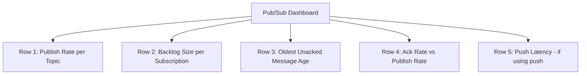

# How to Use Cloud Monitoring to Track Pub/Sub Subscription Backlog and Processing Latency

Author: [nawazdhandala](https://www.github.com/nawazdhandala)

Tags: GCP, Pub/Sub, Cloud Monitoring, Message Queues, Alerting

Description: Learn how to monitor Pub/Sub subscription backlogs and processing latency using Cloud Monitoring to prevent message processing bottlenecks.

---

Pub/Sub is the backbone of event-driven architectures on GCP, but it is only useful if messages are being processed in a timely manner. A growing backlog means your consumers cannot keep up with incoming messages. High processing latency means your system is falling behind. Both situations need immediate attention, and Cloud Monitoring gives you the tools to detect them before they become critical.

In this post, I will cover the key Pub/Sub metrics to monitor, how to build dashboards for them, and how to set up alerts that fire when backlogs or latency get out of hand.

## Key Pub/Sub Metrics

Pub/Sub reports several metrics to Cloud Monitoring. Here are the ones that matter most for operational health:

### Subscription Backlog Metrics

- **`pubsub.googleapis.com/subscription/num_undelivered_messages`** - The number of messages that have been published but not yet acknowledged. This is your backlog size.
- **`pubsub.googleapis.com/subscription/oldest_unacked_message_age`** - Age of the oldest unacknowledged message in seconds. This tells you how far behind your consumers are.
- **`pubsub.googleapis.com/subscription/backlog_bytes`** - Total size of unacknowledged messages in bytes.

### Processing Metrics

- **`pubsub.googleapis.com/subscription/pull_request_count`** - Number of pull requests made by subscribers.
- **`pubsub.googleapis.com/subscription/ack_message_count`** - Number of messages acknowledged.
- **`pubsub.googleapis.com/subscription/push_request_count`** - For push subscriptions, the number of push attempts.
- **`pubsub.googleapis.com/subscription/push_request_latencies`** - Latency of push delivery attempts.

### Publishing Metrics

- **`pubsub.googleapis.com/topic/send_message_operation_count`** - Number of publish operations.
- **`pubsub.googleapis.com/topic/send_request_count`** - Number of publish requests (a request can contain multiple messages).

## Building a Pub/Sub Monitoring Dashboard

### Backlog Size Chart

The most important chart is the backlog - how many messages are waiting to be processed:

```
# Number of undelivered messages per subscription
fetch pubsub_subscription
| metric 'pubsub.googleapis.com/subscription/num_undelivered_messages'
| group_by [resource.subscription_id], [val: mean(value.num_undelivered_messages)]
| every 1m
```

### Oldest Unacked Message Age

This metric is arguably more useful than backlog size. A backlog of 10,000 messages might be fine if they were all published in the last 5 seconds, but terrible if the oldest is 2 hours old:

```
# Age of the oldest unacknowledged message per subscription
fetch pubsub_subscription
| metric 'pubsub.googleapis.com/subscription/oldest_unacked_message_age'
| group_by [resource.subscription_id],
    [val: max(value.oldest_unacked_message_age)]
| every 1m
```

### Message Throughput

Track the rate of messages being published and acknowledged to understand your system's throughput:

```
# Message acknowledge rate per subscription
fetch pubsub_subscription
| metric 'pubsub.googleapis.com/subscription/ack_message_count'
| group_by [resource.subscription_id],
    [val: rate(value.ack_message_count)]
| every 1m
```

Compare this with the publish rate to see if your consumers are keeping up:

```
# Message publish rate per topic
fetch pubsub_topic
| metric 'pubsub.googleapis.com/topic/send_message_operation_count'
| group_by [resource.topic_id],
    [val: rate(value.send_message_operation_count)]
| every 1m
```

## Setting Up Backlog Alerts

### Alert on Backlog Size

This alert fires when the number of undelivered messages exceeds 10,000:

```json
{
  "displayName": "Pub/Sub Subscription Backlog Too Large",
  "combiner": "OR",
  "conditions": [
    {
      "displayName": "Undelivered messages above 10000",
      "conditionThreshold": {
        "filter": "resource.type=\"pubsub_subscription\" AND metric.type=\"pubsub.googleapis.com/subscription/num_undelivered_messages\"",
        "comparison": "COMPARISON_GT",
        "thresholdValue": 10000,
        "duration": "300s",
        "aggregations": [
          {
            "alignmentPeriod": "60s",
            "perSeriesAligner": "ALIGN_MEAN",
            "groupByFields": ["resource.labels.subscription_id"]
          }
        ]
      }
    }
  ],
  "documentation": {
    "content": "A Pub/Sub subscription has accumulated more than 10,000 undelivered messages. Check consumer health and scaling.",
    "mimeType": "text/markdown"
  }
}
```

Apply it:

```bash
# Create the Pub/Sub backlog alert
gcloud alpha monitoring policies create --policy-from-file=pubsub-backlog-alert.json
```

### Alert on Message Age

The age-based alert is often more practical because it accounts for throughput. A subscription that processes 1 million messages per second might have a large numeric backlog that clears in seconds:

```json
{
  "displayName": "Pub/Sub Oldest Message Age Too High",
  "combiner": "OR",
  "conditions": [
    {
      "displayName": "Oldest unacked message older than 5 minutes",
      "conditionThreshold": {
        "filter": "resource.type=\"pubsub_subscription\" AND metric.type=\"pubsub.googleapis.com/subscription/oldest_unacked_message_age\"",
        "comparison": "COMPARISON_GT",
        "thresholdValue": 300,
        "duration": "60s",
        "aggregations": [
          {
            "alignmentPeriod": "60s",
            "perSeriesAligner": "ALIGN_MAX",
            "groupByFields": ["resource.labels.subscription_id"]
          }
        ]
      }
    }
  ]
}
```

I use a shorter duration (60 seconds instead of 300) for this alert because if the oldest message is already 5 minutes old, you want to know right away.

### Alert on Push Subscription Latency

For push subscriptions, latency measures how long Pub/Sub waits for your endpoint to respond:

```json
{
  "displayName": "Pub/Sub Push Subscription High Latency",
  "combiner": "OR",
  "conditions": [
    {
      "displayName": "Push latency above 10 seconds",
      "conditionThreshold": {
        "filter": "resource.type=\"pubsub_subscription\" AND metric.type=\"pubsub.googleapis.com/subscription/push_request_latencies\"",
        "comparison": "COMPARISON_GT",
        "thresholdValue": 10000,
        "duration": "300s",
        "aggregations": [
          {
            "alignmentPeriod": "60s",
            "perSeriesAligner": "ALIGN_PERCENTILE_95",
            "groupByFields": ["resource.labels.subscription_id"]
          }
        ]
      }
    }
  ]
}
```

## Terraform Configuration

Here is a reusable Terraform module for Pub/Sub monitoring:

```hcl
# Pub/Sub backlog alert
resource "google_monitoring_alert_policy" "pubsub_backlog" {
  display_name = "Pub/Sub Backlog - ${var.subscription_name}"
  combiner     = "OR"

  conditions {
    display_name = "Backlog above ${var.backlog_threshold}"

    condition_threshold {
      filter          = "resource.type=\"pubsub_subscription\" AND metric.type=\"pubsub.googleapis.com/subscription/num_undelivered_messages\" AND resource.labels.subscription_id=\"${var.subscription_name}\""
      comparison      = "COMPARISON_GT"
      threshold_value = var.backlog_threshold
      duration        = "300s"

      aggregations {
        alignment_period   = "60s"
        per_series_aligner = "ALIGN_MEAN"
      }
    }
  }

  notification_channels = var.notification_channels
}

# Pub/Sub message age alert
resource "google_monitoring_alert_policy" "pubsub_age" {
  display_name = "Pub/Sub Message Age - ${var.subscription_name}"
  combiner     = "OR"

  conditions {
    display_name = "Oldest message above ${var.age_threshold_seconds}s"

    condition_threshold {
      filter          = "resource.type=\"pubsub_subscription\" AND metric.type=\"pubsub.googleapis.com/subscription/oldest_unacked_message_age\" AND resource.labels.subscription_id=\"${var.subscription_name}\""
      comparison      = "COMPARISON_GT"
      threshold_value = var.age_threshold_seconds
      duration        = "60s"

      aggregations {
        alignment_period   = "60s"
        per_series_aligner = "ALIGN_MAX"
      }
    }
  }

  notification_channels = var.notification_channels
}
```

## Dashboard Layout

A well-organized Pub/Sub dashboard follows this pattern:



The comparison in Row 4 between acknowledge rate and publish rate is particularly useful. When the ack rate drops below the publish rate, the backlog starts growing.

## Practical Tips

From running Pub/Sub at scale, here are some things I have learned:

1. **Set different thresholds per subscription**: A batch processing subscription might tolerate a larger backlog than a real-time event subscription. Do not use one-size-fits-all thresholds.

2. **Monitor dead letter queues separately**: If you use dead letter topics, monitor the messages flowing into them. A spike in dead letters means your consumer is failing to process certain messages.

3. **Watch for subscription expiration**: Pub/Sub subscriptions expire if they have no activity for 31 days by default. Set up alerts for subscription activity to catch abandoned subscriptions.

4. **Correlate with consumer metrics**: Pub/Sub metrics tell you what is happening in the queue, but you also need to know what is happening in your consumer. Monitor consumer CPU, memory, and error rates alongside Pub/Sub metrics.

## Wrapping Up

Pub/Sub backlog and latency monitoring is essential for any event-driven system on GCP. The oldest unacked message age is typically the single most useful metric - it tells you immediately whether your consumers are keeping up. Combine it with backlog size and throughput rate comparisons, and you have a complete picture of your messaging pipeline health. Set up alerts early, before backlogs become a problem, because catching a growing backlog at 1,000 messages is much easier than dealing with 10 million.
