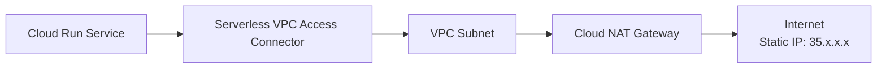

# How to Use Cloud NAT with Cloud Run Services via Serverless VPC Access in GCP

Author: [nawazdhandala](https://www.github.com/nawazdhandala)

Tags: GCP, Cloud NAT, Cloud Run, Serverless VPC Access, Networking

Description: Route outbound traffic from Cloud Run services through Cloud NAT using Serverless VPC Access connectors to get predictable egress IP addresses and access internal resources.

---

Cloud Run is great for serverless workloads, but its outbound networking is limited by default. Your Cloud Run services get random, ephemeral IP addresses for outbound traffic, which makes it impossible to allowlist with third-party APIs. They also cannot access resources on your VPC network. Serverless VPC Access fixes both problems by connecting Cloud Run to your VPC, and once traffic flows through your VPC, Cloud NAT can provide static, predictable outbound IPs.

This guide walks through the full setup of routing Cloud Run egress through Cloud NAT.

## The Architecture

Here is how the pieces fit together:



1. Cloud Run sends outbound traffic through the Serverless VPC Access connector
2. The connector routes traffic into your VPC subnet
3. Cloud NAT picks up the traffic and translates the source IP to your static NAT IP
4. The third-party service sees your predictable, allowlistable IP address

## Prerequisites

Before starting:
- A GCP project with billing enabled
- Cloud Run API enabled
- Compute Engine API enabled
- Serverless VPC Access API enabled
- A VPC network (or you will create one)

## Step 1: Set Up the VPC Network and Subnet

If you do not already have a VPC, create one:

```bash
# Create a VPC network
gcloud compute networks create cloudrun-vpc \
  --subnet-mode=custom \
  --project=your-project-id

# Create a subnet for the VPC connector
gcloud compute networks subnets create cloudrun-subnet \
  --network=cloudrun-vpc \
  --region=us-central1 \
  --range=10.8.0.0/28 \
  --project=your-project-id
```

The subnet for the VPC connector needs at least a /28 CIDR range (16 IPs). This is a dedicated subnet used only by the connector.

## Step 2: Create the Serverless VPC Access Connector

Create a connector that bridges Cloud Run to your VPC:

```bash
# Create a Serverless VPC Access connector
gcloud compute networks vpc-access connectors create cloudrun-connector \
  --network=cloudrun-vpc \
  --region=us-central1 \
  --range=10.8.0.0/28 \
  --min-instances=2 \
  --max-instances=10 \
  --project=your-project-id
```

Alternatively, if you want to use an existing subnet:

```bash
# Create connector using an existing subnet
gcloud compute networks vpc-access connectors create cloudrun-connector \
  --subnet=cloudrun-connector-subnet \
  --subnet-project=your-project-id \
  --region=us-central1 \
  --min-instances=2 \
  --max-instances=10 \
  --project=your-project-id
```

Verify the connector is ready:

```bash
# Check connector status
gcloud compute networks vpc-access connectors describe cloudrun-connector \
  --region=us-central1 \
  --project=your-project-id \
  --format="yaml(state, network, ipCidrRange)"
```

The state should be `READY`.

## Step 3: Set Up Cloud Router and Cloud NAT

Create a Cloud Router and NAT gateway with static IPs:

```bash
# Create a Cloud Router
gcloud compute routers create cloudrun-nat-router \
  --network=cloudrun-vpc \
  --region=us-central1 \
  --project=your-project-id

# Reserve a static IP for NAT
gcloud compute addresses create cloudrun-nat-ip \
  --region=us-central1 \
  --project=your-project-id

# Get the static IP address
gcloud compute addresses describe cloudrun-nat-ip \
  --region=us-central1 \
  --format="value(address)" \
  --project=your-project-id

# Create Cloud NAT with the static IP
gcloud compute routers nats create cloudrun-nat-gateway \
  --router=cloudrun-nat-router \
  --region=us-central1 \
  --nat-external-ip-pool=cloudrun-nat-ip \
  --nat-all-subnet-ip-ranges \
  --enable-dynamic-port-allocation \
  --min-ports-per-vm=512 \
  --max-ports-per-vm=4096 \
  --project=your-project-id
```

## Step 4: Deploy Cloud Run Service with VPC Connector

Deploy your Cloud Run service with the VPC connector attached and configure it to route all egress through the VPC:

```bash
# Deploy Cloud Run service with VPC connector and all-traffic egress
gcloud run deploy my-api-service \
  --image=gcr.io/your-project-id/my-api:latest \
  --region=us-central1 \
  --vpc-connector=cloudrun-connector \
  --vpc-egress=all-traffic \
  --project=your-project-id
```

The `--vpc-egress=all-traffic` flag is critical. It tells Cloud Run to route ALL outbound traffic through the VPC connector, including traffic to external (public) destinations. Without this flag, only traffic to internal IP ranges goes through the connector.

The other option is `--vpc-egress=private-ranges-only`, which only routes traffic to RFC 1918 addresses through the connector. External traffic would bypass the VPC and NAT.

## Step 5: Verify the Setup

Test that your Cloud Run service is using the static NAT IP:

```bash
# Deploy a simple test service that returns its external IP
gcloud run deploy nat-test \
  --image=curlimages/curl \
  --region=us-central1 \
  --vpc-connector=cloudrun-connector \
  --vpc-egress=all-traffic \
  --command="curl" \
  --args="-s,ifconfig.me" \
  --project=your-project-id
```

Or test from within your existing service by calling an IP echo service.

## Step 6: Configure for Direct VPC Egress (Alternative)

GCP also offers Direct VPC Egress as an alternative to VPC Access connectors. It lets Cloud Run instances attach directly to a VPC subnet without a connector:

```bash
# Deploy with Direct VPC Egress (no connector needed)
gcloud run deploy my-api-service \
  --image=gcr.io/your-project-id/my-api:latest \
  --region=us-central1 \
  --network=cloudrun-vpc \
  --subnet=cloudrun-direct-subnet \
  --vpc-egress=all-traffic \
  --project=your-project-id
```

Direct VPC Egress is simpler (no connector to manage) and has better scaling characteristics. The subnet needs to be large enough for your Cloud Run instance count since each instance gets an IP from the subnet.

## Handling Multiple Cloud Run Services

If you have multiple Cloud Run services that need the same static NAT IP, they can all share the same VPC connector:

```bash
# Service 1
gcloud run deploy service-a \
  --image=gcr.io/your-project-id/service-a:latest \
  --region=us-central1 \
  --vpc-connector=cloudrun-connector \
  --vpc-egress=all-traffic

# Service 2
gcloud run deploy service-b \
  --image=gcr.io/your-project-id/service-b:latest \
  --region=us-central1 \
  --vpc-connector=cloudrun-connector \
  --vpc-egress=all-traffic

# Service 3
gcloud run deploy service-c \
  --image=gcr.io/your-project-id/service-c:latest \
  --region=us-central1 \
  --vpc-connector=cloudrun-connector \
  --vpc-egress=all-traffic
```

All three services share the same connector, VPC, and NAT gateway, so they all use the same static NAT IP.

## Monitoring and Troubleshooting

Enable NAT logging to monitor Cloud Run egress traffic:

```bash
# Enable NAT logging
gcloud compute routers nats update cloudrun-nat-gateway \
  --router=cloudrun-nat-router \
  --region=us-central1 \
  --enable-logging \
  --log-filter=ALL \
  --project=your-project-id
```

Check for connectivity issues:

```bash
# View NAT logs for Cloud Run traffic
gcloud logging read \
  'resource.type="nat_gateway" AND resource.labels.gateway_name="cloudrun-nat-gateway"' \
  --project=your-project-id \
  --limit=20 \
  --format="table(timestamp, jsonPayload.connection.src_ip, jsonPayload.connection.dest_ip, jsonPayload.allocation_status)"
```

Common issues:

**Cloud Run cannot reach external services:**
- Verify `--vpc-egress=all-traffic` is set
- Check that the VPC connector is in READY state
- Confirm Cloud NAT is configured for the connector's subnet

**Intermittent connection failures:**
- Check for port exhaustion in NAT logs
- Increase connector min/max instances
- Increase NAT port allocation

**High latency:**
- VPC connector adds some latency. If latency is critical, consider Direct VPC Egress
- Check connector instance scaling - if it is at max instances, increase the limit

## Cost Considerations

This setup has several cost components:

- **Serverless VPC Access connector:** Charged per instance-hour for the connector VMs
- **Cloud NAT:** Charged per GB processed and per hour per gateway
- **Static IP:** Small hourly charge per reserved IP
- **Cloud Run egress:** Standard Cloud Run egress rates apply

For high-traffic services, the connector can become a significant cost. Direct VPC Egress avoids the connector cost entirely.

## Wrapping Up

Combining Cloud Run with Serverless VPC Access and Cloud NAT gives you the best of both worlds - the simplicity and autoscaling of serverless with the networking control of VPC-based infrastructure. Static egress IPs make it possible to integrate with third-party APIs that require IP allowlisting, which is one of the most common pain points with serverless architectures. The setup involves a few moving parts, but once configured, it runs reliably and scales with your Cloud Run services.
