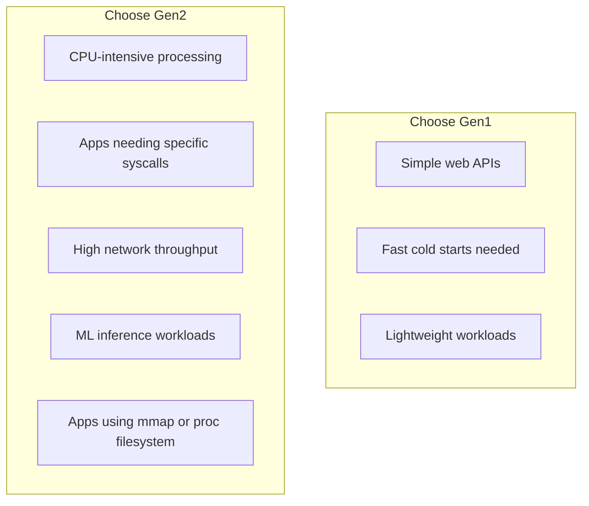

# How to Use Cloud Run Execution Environment Gen2 for Better CPU and Network Performance

Author: [nawazdhandala](https://www.github.com/nawazdhandala)

Tags: GCP, Cloud Run, Execution Environment, Gen2, Performance, Google Cloud

Description: Learn how to switch to Cloud Run execution environment Gen2 for improved CPU performance, full Linux compatibility, and faster network throughput.

---

Cloud Run offers two execution environments: Gen1 and Gen2. Gen1 uses gVisor, a lightweight container sandbox that intercepts system calls for security. Gen2 runs containers in a full Linux environment using microVMs. While Gen1 is fine for most web applications, Gen2 offers real improvements when you need better CPU performance, full system call compatibility, or faster networking.

This guide explains the differences, shows how to switch, and helps you decide which environment is right for your workload.

## Gen1 vs Gen2: What Is Different

Let me break down the practical differences:

**Gen1 (default):**
- Uses gVisor for container sandboxing
- Intercepts and emulates system calls
- Some Linux system calls are not supported
- Slightly higher CPU overhead for system call-heavy workloads
- Faster cold starts (smaller VM footprint)

**Gen2:**
- Runs on Linux microVMs
- Full Linux kernel compatibility
- Native system call execution (no interception overhead)
- Better CPU performance for compute-intensive work
- Better network throughput (up to 2x for some workloads)
- Supports all Linux system calls and features
- Slightly slower cold starts

Here is a comparison of where each shines:



## When to Use Gen2

You should consider Gen2 if your workload matches any of these scenarios:

**CPU-intensive applications**: Image processing, video transcoding, data compression, or any task where raw CPU performance matters. Gen2's native system calls eliminate the overhead of gVisor's system call interception.

**Applications that need specific Linux features**: Some libraries and tools rely on Linux-specific features like `/proc` filesystem, `mmap`, `io_uring`, or specific ioctl calls. These may not work or may work differently in gVisor.

**High network throughput**: If your service transfers large amounts of data (file uploads/downloads, streaming), Gen2 provides better network performance.

**Machine learning inference**: ML frameworks often use system calls that gVisor does not fully support or adds overhead to. Gen2 gives these workloads native performance.

**Applications using native libraries**: C/C++ extensions, Rust FFI, or other native code that makes heavy use of system calls will run better on Gen2.

## Switching to Gen2

### Using gcloud CLI

```bash
# Deploy a new service with Gen2 execution environment
gcloud run deploy my-service \
  --image=us-central1-docker.pkg.dev/MY_PROJECT/my-repo/my-app:latest \
  --region=us-central1 \
  --execution-environment=gen2

# Update an existing service to Gen2
gcloud run services update my-service \
  --region=us-central1 \
  --execution-environment=gen2
```

### Using Service YAML

```yaml
# service.yaml - Cloud Run service on Gen2 execution environment
apiVersion: serving.knative.dev/v1
kind: Service
metadata:
  name: my-service
spec:
  template:
    metadata:
      annotations:
        # Switch to Gen2 execution environment
        run.googleapis.com/execution-environment: gen2
    spec:
      containers:
        - image: us-central1-docker.pkg.dev/MY_PROJECT/my-repo/my-app:latest
          resources:
            limits:
              cpu: "2"
              memory: 1Gi
```

### Using Terraform

```hcl
# Cloud Run service with Gen2 execution environment
resource "google_cloud_run_v2_service" "my_service" {
  name     = "my-service"
  location = "us-central1"

  template {
    # Set the execution environment to gen2
    execution_environment = "EXECUTION_ENVIRONMENT_GEN2"

    containers {
      image = "us-central1-docker.pkg.dev/my-project/my-repo/my-app:latest"
      resources {
        limits = {
          cpu    = "2"
          memory = "1Gi"
        }
      }
    }
  }
}
```

## Verifying the Execution Environment

After deployment, confirm that your service is running on Gen2:

```bash
# Check the execution environment
gcloud run services describe my-service \
  --region=us-central1 \
  --format="yaml(spec.template.metadata.annotations['run.googleapis.com/execution-environment'])"
```

You can also verify from inside the container by checking for Linux-specific features:

```python
# check_environment.py - Detect the execution environment from inside the container
import os

def check_execution_environment():
    """Check which Cloud Run execution environment we are running in."""
    checks = {}

    # Gen2 has full /proc access
    try:
        with open("/proc/cpuinfo", "r") as f:
            cpuinfo = f.read()
            checks["proc_cpuinfo"] = "accessible"
            # Count CPU cores
            cores = cpuinfo.count("processor")
            checks["cpu_cores"] = cores
    except Exception as e:
        checks["proc_cpuinfo"] = f"error: {e}"

    # Check memory info
    try:
        with open("/proc/meminfo", "r") as f:
            meminfo = f.read()
            checks["proc_meminfo"] = "accessible"
    except Exception as e:
        checks["proc_meminfo"] = f"error: {e}"

    # Check for full network stack
    try:
        import socket
        s = socket.socket(socket.AF_INET, socket.SOCK_RAW, socket.IPPROTO_ICMP)
        s.close()
        checks["raw_sockets"] = "supported"
    except Exception as e:
        checks["raw_sockets"] = f"not supported: {e}"

    return checks
```

## Performance Benchmarks

Here are the kinds of improvements you can expect when switching to Gen2. These numbers vary by workload, but they give you a general idea.

**CPU-bound workload (image resizing with Pillow):**
- Gen1: ~450ms per image
- Gen2: ~380ms per image
- Improvement: roughly 15-20%

**Network throughput (downloading a 100MB file):**
- Gen1: ~500 Mbps
- Gen2: ~900 Mbps
- Improvement: roughly 80%

**System call heavy workload (file I/O operations):**
- Gen1: Higher overhead per syscall due to gVisor interception
- Gen2: Native syscall speed
- Improvement: varies significantly by workload, 10-50%

These numbers are illustrative. Your actual improvement depends on your specific workload. The best approach is to benchmark your application on both environments.

## Benchmarking Your Own Application

Here is a simple benchmarking approach. Deploy the same application on both Gen1 and Gen2, then compare performance:

```bash
# Deploy on Gen1
gcloud run deploy my-service-gen1 \
  --image=us-central1-docker.pkg.dev/MY_PROJECT/my-repo/my-app:latest \
  --region=us-central1 \
  --execution-environment=gen1 \
  --cpu=2 \
  --memory=1Gi \
  --concurrency=1

# Deploy on Gen2
gcloud run deploy my-service-gen2 \
  --image=us-central1-docker.pkg.dev/MY_PROJECT/my-repo/my-app:latest \
  --region=us-central1 \
  --execution-environment=gen2 \
  --cpu=2 \
  --memory=1Gi \
  --concurrency=1

# Benchmark Gen1
hey -n 200 -c 10 https://my-service-gen1-xxxxx-uc.a.run.app/process

# Benchmark Gen2
hey -n 200 -c 10 https://my-service-gen2-xxxxx-uc.a.run.app/process
```

Compare the p50, p95, and p99 latencies. Also look at CPU utilization in Cloud Monitoring for both deployments.

## Cold Start Considerations

Gen2 cold starts are slightly slower than Gen1 because the microVM takes a bit longer to initialize than gVisor. The difference is typically 100-500ms depending on your container size and initialization.

If cold starts are critical for your use case, you have options:

```bash
# Keep minimum instances to avoid cold starts entirely
gcloud run services update my-service \
  --region=us-central1 \
  --execution-environment=gen2 \
  --min-instances=1
```

For most production services, keeping one or two warm instances eliminates the cold start problem entirely.

## Compatibility Considerations

When switching to Gen2, be aware of these differences:

**Network behavior**: Gen2 instances have different network interface configurations. If your code hardcodes network interface names, it might need adjustment.

**File system**: Gen2 provides a standard Linux filesystem. Some paths that exist in gVisor might differ slightly in Gen2, though this rarely causes issues.

**Resource limits**: Memory and CPU limits work the same way in both environments, but Gen2 may use memory slightly differently due to the full Linux kernel overhead.

**Container startup**: Gen2 containers should start the same way, but if your startup code probes specific system features, it might detect differences.

## Combining Gen2 with Other Features

Gen2 works well with other Cloud Run features:

```bash
# Gen2 with always-on CPU and high concurrency
gcloud run deploy ml-inference \
  --image=us-central1-docker.pkg.dev/MY_PROJECT/my-repo/ml-model:latest \
  --region=us-central1 \
  --execution-environment=gen2 \
  --cpu=4 \
  --memory=8Gi \
  --cpu-always-allocated \
  --concurrency=4 \
  --min-instances=2 \
  --max-instances=50
```

This is a typical configuration for an ML inference service: Gen2 for native performance, multiple CPUs, always-on CPU allocation, and warm instances to handle traffic without cold starts.

## Switching Back to Gen1

If Gen2 does not work for your use case (for example, if cold starts are a bigger concern than raw performance), switch back:

```bash
# Revert to Gen1
gcloud run services update my-service \
  --region=us-central1 \
  --execution-environment=gen1
```

The switch is seamless with no downtime. Cloud Run deploys a new revision on the new execution environment and shifts traffic.

## Summary

Gen2 is the better choice for CPU-intensive workloads, applications needing full Linux compatibility, and services with high network throughput requirements. The switch is a single configuration change with no code modifications. The tradeoff is slightly slower cold starts, which you can mitigate with minimum instances. For simple web APIs and lightweight services where cold start speed matters more than raw performance, Gen1 remains a solid default. Benchmark your specific workload on both environments to make an informed decision.
