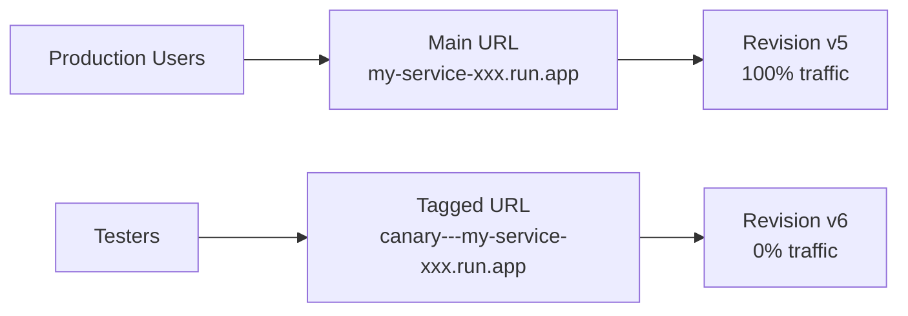

# How to Use Cloud Run Tags to Route Test Traffic to Specific Revisions Without Affecting Production

Author: [nawazdhandala](https://www.github.com/nawazdhandala)

Tags: GCP, Cloud Run, Traffic Management, Revision Tags, Testing, Google Cloud

Description: Learn how to use Cloud Run revision tags to create dedicated URLs for testing new revisions without routing any production traffic to them.

---

You have a new version of your Cloud Run service and you want to test it with real traffic before rolling it out to everyone. The standard approach of deploying and hoping for the best is not great. You could split traffic 50/50, but then half your users are guinea pigs.

Cloud Run revision tags solve this. They give you a dedicated URL for a specific revision. You can send test traffic to that URL while production traffic continues going to the stable revision. Zero impact on production, full access to test the new version in the real environment.

## How Revision Tags Work

Every Cloud Run deployment creates a new revision. By default, 100% of traffic goes to the latest revision. When you add a tag to a revision, Cloud Run creates a unique URL specifically for that revision.

The URL format is: `https://TAG---SERVICE-XXXXXX-XX.a.run.app`

That tagged URL always routes to the specific revision, regardless of how traffic is split. Production traffic stays on the revision that has the traffic allocation.



## Deploying a New Revision with a Tag

When you deploy a new version, you can assign a tag and route zero production traffic to it:

```bash
# Deploy a new revision with a tag, but send no production traffic
gcloud run deploy my-service \
  --image=us-central1-docker.pkg.dev/MY_PROJECT/my-repo/my-app:v2 \
  --region=us-central1 \
  --tag=canary \
  --no-traffic
```

The `--no-traffic` flag means 0% of production traffic goes to this new revision. The `--tag=canary` flag creates a tagged URL you can use for testing.

After deployment, gcloud will output something like:

```
Service [my-service] revision [my-service-00002-abc] has been deployed with tag [canary]
Traffic: https://canary---my-service-xxxxx-uc.a.run.app
```

That tagged URL is your test endpoint.

## Adding Tags to Existing Revisions

You can also tag revisions that are already deployed:

```bash
# List existing revisions
gcloud run revisions list --service=my-service \
  --region=us-central1 \
  --format="table(name, active, traffic_percent)"

# Tag a specific revision
gcloud run services update-traffic my-service \
  --region=us-central1 \
  --set-tags=canary=my-service-00002-abc
```

## Testing with the Tagged URL

Use the tagged URL to test the new revision. The URL works exactly like the main service URL but always routes to the tagged revision:

```bash
# Test the tagged revision
curl https://canary---my-service-xxxxx-uc.a.run.app/api/health

# Run a more thorough test
hey -n 100 -c 10 https://canary---my-service-xxxxx-uc.a.run.app/api/endpoint

# Compare responses between production and canary
diff <(curl -s https://my-service-xxxxx-uc.a.run.app/api/data) \
     <(curl -s https://canary---my-service-xxxxx-uc.a.run.app/api/data)
```

## Multiple Tags for Different Test Scenarios

You can have multiple tags on different revisions simultaneously:

```bash
# Tag different revisions for different test scenarios
gcloud run services update-traffic my-service \
  --region=us-central1 \
  --set-tags=canary=my-service-00003-def,staging=my-service-00002-abc,qa=my-service-00004-ghi
```

This gives you three separate test URLs:
- `https://canary---my-service-xxxxx-uc.a.run.app`
- `https://staging---my-service-xxxxx-uc.a.run.app`
- `https://qa---my-service-xxxxx-uc.a.run.app`

Each one points to a different revision. QA, staging, and canary testing can happen in parallel without interfering with each other or with production.

## Gradual Traffic Migration After Testing

Once you are satisfied with testing, gradually shift production traffic to the new revision:

```bash
# Send 10% of production traffic to the canary revision
gcloud run services update-traffic my-service \
  --region=us-central1 \
  --to-tags=canary=10

# Check how it is doing, then increase
gcloud run services update-traffic my-service \
  --region=us-central1 \
  --to-tags=canary=50

# Everything looks good - send all traffic to the canary
gcloud run services update-traffic my-service \
  --region=us-central1 \
  --to-tags=canary=100
```

Or if you want to set traffic by revision name instead of tag:

```bash
# Route all traffic to the new revision
gcloud run services update-traffic my-service \
  --region=us-central1 \
  --to-revisions=my-service-00003-def=100
```

## Rolling Back

If testing reveals problems, you do not need to redeploy. Just shift traffic back:

```bash
# Rollback: send all traffic to the previous revision
gcloud run services update-traffic my-service \
  --region=us-central1 \
  --to-revisions=my-service-00001-xyz=100
```

The canary revision stays deployed but receives no traffic. You can test it again via the tagged URL after fixing the issues.

## Practical CI/CD Integration

Here is how to integrate revision tags into a CI/CD pipeline:

```yaml
# .github/workflows/deploy-and-test.yml
name: Deploy and Test

on:
  push:
    branches: [main]

jobs:
  deploy-canary:
    runs-on: ubuntu-latest
    steps:
      - uses: actions/checkout@v4

      - name: Authenticate to GCP
        uses: google-github-actions/auth@v2
        with:
          workload_identity_provider: ${{ secrets.WIF_PROVIDER }}
          service_account: ${{ secrets.SA_EMAIL }}

      - name: Setup gcloud
        uses: google-github-actions/setup-gcloud@v2

      - name: Build and Push
        run: |
          gcloud builds submit \
            --tag us-central1-docker.pkg.dev/$PROJECT_ID/images/my-app:${{ github.sha }}

      # Deploy with tag and no traffic
      - name: Deploy Canary
        run: |
          gcloud run deploy my-service \
            --image=us-central1-docker.pkg.dev/$PROJECT_ID/images/my-app:${{ github.sha }} \
            --region=us-central1 \
            --tag=canary \
            --no-traffic

      # Run tests against the tagged URL
      - name: Test Canary
        run: |
          CANARY_URL=$(gcloud run services describe my-service \
            --region=us-central1 \
            --format='value(status.traffic[tag=canary].url)')

          # Run your test suite against the canary
          npm run test:integration -- --base-url=$CANARY_URL

      # If tests pass, promote to production
      - name: Promote to Production
        if: success()
        run: |
          gcloud run services update-traffic my-service \
            --region=us-central1 \
            --to-tags=canary=100

    env:
      PROJECT_ID: your-project-id
```

This workflow deploys the new version as a canary, runs integration tests against the tagged URL, and only promotes to production if the tests pass.

## Viewing Traffic Distribution

Check how traffic is currently distributed:

```bash
# View current traffic split and tags
gcloud run services describe my-service \
  --region=us-central1 \
  --format="yaml(status.traffic)"
```

Output looks like:

```yaml
status:
  traffic:
  - latestRevision: false
    percent: 90
    revisionName: my-service-00001-xyz
  - latestRevision: false
    percent: 10
    revisionName: my-service-00003-def
    tag: canary
    url: https://canary---my-service-xxxxx-uc.a.run.app
```

## Cleaning Up Tags

Remove tags when you are done testing:

```bash
# Remove a specific tag
gcloud run services update-traffic my-service \
  --region=us-central1 \
  --remove-tags=canary

# Remove multiple tags
gcloud run services update-traffic my-service \
  --region=us-central1 \
  --remove-tags=canary,staging,qa
```

Removing a tag does not delete the revision or affect traffic allocation. It only removes the dedicated URL.

## Cost Considerations

Tagged revisions that receive no production traffic still cost money if they receive test traffic. They scale to zero when not being tested, so the cost is minimal. But keep in mind:

- Each tagged URL keeps the revision warm while it is receiving requests
- If you have many tagged revisions receiving test traffic simultaneously, that is many active instances
- Remove tags and let unused revisions scale to zero when you are done testing

## Tags vs Traffic Splitting

Both tags and traffic splitting let you test new revisions, but they serve different purposes:

| Feature | Tags | Traffic Splitting |
|---------|------|-------------------|
| Who gets the new version | Only testers using the tagged URL | A percentage of all users |
| Production impact | None | Some users see the new version |
| Testing control | Full - you choose when to test | Random - users are assigned automatically |
| Use case | Pre-production testing | Canary releases to real users |

The typical flow is: deploy with tag, test internally, then use traffic splitting for a gradual rollout to real users.

## Summary

Cloud Run revision tags give you a safe, zero-impact way to test new deployments before exposing them to production traffic. Deploy with `--tag` and `--no-traffic`, test using the tagged URL, and promote only when you are confident the new version works. This pattern integrates naturally into CI/CD pipelines and eliminates the need for separate staging environments for most testing scenarios.
