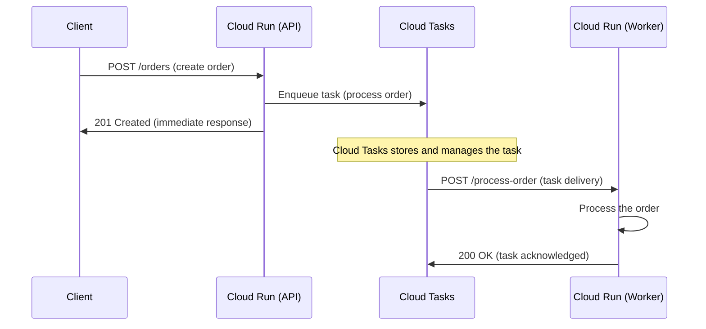

# How to Use Cloud Run with Cloud Tasks for Reliable Asynchronous Task Processing

Author: [nawazdhandala](https://www.github.com/nawazdhandala)

Tags: GCP, Cloud Run, Cloud Tasks, Asynchronous Processing, Task Queue, Google Cloud

Description: Learn how to use Google Cloud Tasks with Cloud Run for reliable asynchronous task processing with automatic retries and rate limiting.

---

Some operations should not happen during an HTTP request. Sending emails, generating reports, processing uploads, updating search indexes - these tasks take time, and making the user wait for them leads to a poor experience and request timeouts.

Cloud Tasks is Google's managed task queue. You enqueue a task, Cloud Tasks stores it durably, and then delivers it to your Cloud Run service as an HTTP request. If the processing fails, Cloud Tasks retries automatically. If your service is overloaded, Cloud Tasks backs off. It handles all the reliability plumbing so you can focus on the processing logic.

## How Cloud Tasks Works with Cloud Run

The flow is straightforward:



The user gets an immediate response. The actual processing happens asynchronously, with Cloud Tasks guaranteeing delivery and handling retries.

## Prerequisites

```bash
# Enable required APIs
gcloud services enable cloudtasks.googleapis.com run.googleapis.com
```

## Step 1: Create a Cloud Tasks Queue

```bash
# Create a queue with retry and rate limit configuration
gcloud tasks queues create order-processing \
  --location=us-central1 \
  --max-dispatches-per-second=10 \
  --max-concurrent-dispatches=5 \
  --max-attempts=5 \
  --min-backoff=10s \
  --max-backoff=300s \
  --max-doublings=4
```

Here is what each setting does:

- `--max-dispatches-per-second=10`: Cloud Tasks sends at most 10 tasks per second to your service
- `--max-concurrent-dispatches=5`: At most 5 tasks are in-flight simultaneously
- `--max-attempts=5`: A task is retried up to 5 times before being abandoned
- `--min-backoff=10s`: First retry waits at least 10 seconds
- `--max-backoff=300s`: Maximum wait between retries is 5 minutes
- `--max-doublings=4`: Backoff doubles 4 times (10s, 20s, 40s, 80s, then caps at 300s)

## Step 2: Build the Worker Service

Create a Cloud Run service that processes the tasks. Each task arrives as an HTTP request:

```python
# worker.py - Cloud Run service that processes Cloud Tasks
from flask import Flask, request, jsonify
import json
import os
import logging

app = Flask(__name__)
logging.basicConfig(level=logging.INFO)
logger = logging.getLogger(__name__)

@app.route("/process-order", methods=["POST"])
def process_order():
    """
    Process an order task. Called by Cloud Tasks.
    Returns 200 on success (task completed).
    Returns 500 on failure (task will be retried).
    """
    # Cloud Tasks includes metadata in headers
    task_name = request.headers.get("X-CloudTasks-TaskName", "unknown")
    retry_count = request.headers.get("X-CloudTasks-TaskRetryCount", "0")
    queue_name = request.headers.get("X-CloudTasks-QueueName", "unknown")

    logger.info(f"Processing task {task_name} (retry: {retry_count})")

    try:
        # Parse the task payload
        payload = request.get_json()
        order_id = payload["order_id"]
        customer_email = payload["customer_email"]
        items = payload["items"]

        # Do the actual processing
        total = calculate_total(items)
        charge_payment(order_id, total)
        send_confirmation_email(customer_email, order_id, items)
        update_inventory(items)

        logger.info(f"Order {order_id} processed successfully")
        return jsonify({"status": "completed", "order_id": order_id}), 200

    except Exception as e:
        logger.error(f"Failed to process task {task_name}: {str(e)}")
        # Return 500 to trigger Cloud Tasks retry
        return jsonify({"error": str(e)}), 500

def calculate_total(items):
    """Calculate the order total."""
    return sum(item["price"] * item["quantity"] for item in items)

def charge_payment(order_id, total):
    """Process the payment. Replace with real payment logic."""
    logger.info(f"Charging ${total} for order {order_id}")

def send_confirmation_email(email, order_id, items):
    """Send order confirmation email. Replace with real email logic."""
    logger.info(f"Sending confirmation to {email} for order {order_id}")

def update_inventory(items):
    """Update product inventory. Replace with real inventory logic."""
    for item in items:
        logger.info(f"Reducing inventory for {item['product_id']} by {item['quantity']}")

@app.route("/health", methods=["GET"])
def health():
    """Health check endpoint."""
    return "OK", 200

if __name__ == "__main__":
    port = int(os.environ.get("PORT", 8080))
    app.run(host="0.0.0.0", port=port)
```

Deploy the worker:

```bash
# Build and push the worker image
gcloud builds submit ./worker \
  --tag us-central1-docker.pkg.dev/$(gcloud config get-value project)/myapp/task-worker:latest

# Deploy the worker (not publicly accessible)
gcloud run deploy task-worker \
  --image=us-central1-docker.pkg.dev/$(gcloud config get-value project)/myapp/task-worker:latest \
  --region=us-central1 \
  --no-allow-unauthenticated \
  --timeout=300 \
  --cpu=1 \
  --memory=512Mi
```

Note `--no-allow-unauthenticated` - only Cloud Tasks should be able to call this service.

## Step 3: Set Up IAM for Cloud Tasks

Cloud Tasks needs a service account with permission to invoke the worker Cloud Run service:

```bash
# Create a service account for Cloud Tasks
gcloud iam service-accounts create cloud-tasks-sa \
  --display-name="Cloud Tasks Invoker"

# Grant it permission to invoke the worker
gcloud run services add-iam-policy-binding task-worker \
  --region=us-central1 \
  --member="serviceAccount:cloud-tasks-sa@$(gcloud config get-value project).iam.gserviceaccount.com" \
  --role="roles/run.invoker"
```

## Step 4: Build the API Service (Task Creator)

The API service receives user requests and enqueues tasks:

```python
# api.py - Cloud Run API that enqueues tasks to Cloud Tasks
from flask import Flask, request, jsonify
from google.cloud import tasks_v2
import json
import os

app = Flask(__name__)

# Cloud Tasks configuration
PROJECT_ID = os.environ["PROJECT_ID"]
LOCATION = os.environ.get("LOCATION", "us-central1")
QUEUE_NAME = os.environ.get("QUEUE_NAME", "order-processing")
WORKER_URL = os.environ["WORKER_URL"]
SERVICE_ACCOUNT_EMAIL = os.environ["TASKS_SA_EMAIL"]

# Initialize the Cloud Tasks client
tasks_client = tasks_v2.CloudTasksClient()

def create_task(endpoint, payload, delay_seconds=0):
    """
    Create a Cloud Tasks task that targets the worker service.

    Args:
        endpoint: The URL path on the worker to call
        payload: Dictionary to send as JSON body
        delay_seconds: Optional delay before the task is dispatched
    """
    parent = tasks_client.queue_path(PROJECT_ID, LOCATION, QUEUE_NAME)

    task = {
        "http_request": {
            "http_method": tasks_v2.HttpMethod.POST,
            "url": f"{WORKER_URL}{endpoint}",
            "headers": {"Content-Type": "application/json"},
            "body": json.dumps(payload).encode(),
            # Use OIDC token for authentication
            "oidc_token": {
                "service_account_email": SERVICE_ACCOUNT_EMAIL,
                "audience": WORKER_URL,
            },
        },
    }

    # Add a delay if specified
    if delay_seconds > 0:
        from google.protobuf import timestamp_pb2
        import time
        scheduled_time = timestamp_pb2.Timestamp()
        scheduled_time.FromSeconds(int(time.time()) + delay_seconds)
        task["schedule_time"] = scheduled_time

    response = tasks_client.create_task(parent=parent, task=task)
    return response.name

@app.route("/orders", methods=["POST"])
def create_order():
    """
    Create a new order. Returns immediately and processes asynchronously.
    """
    data = request.get_json()

    # Validate the order
    if not data.get("items"):
        return jsonify({"error": "No items in order"}), 400

    order_id = generate_order_id()

    # Enqueue the processing task
    task_name = create_task("/process-order", {
        "order_id": order_id,
        "customer_email": data["customer_email"],
        "items": data["items"],
    })

    return jsonify({
        "order_id": order_id,
        "status": "processing",
        "message": "Order received and being processed",
    }), 201

@app.route("/orders/scheduled", methods=["POST"])
def create_scheduled_order():
    """Create an order that will be processed after a delay."""
    data = request.get_json()
    order_id = generate_order_id()

    # Process in 30 minutes
    task_name = create_task("/process-order", {
        "order_id": order_id,
        "customer_email": data["customer_email"],
        "items": data["items"],
    }, delay_seconds=1800)

    return jsonify({
        "order_id": order_id,
        "status": "scheduled",
        "process_at": "in 30 minutes",
    }), 201

def generate_order_id():
    """Generate a unique order ID."""
    import uuid
    return str(uuid.uuid4())[:8]

if __name__ == "__main__":
    port = int(os.environ.get("PORT", 8080))
    app.run(host="0.0.0.0", port=port)
```

Deploy the API:

```bash
# Get the worker URL
WORKER_URL=$(gcloud run services describe task-worker --region=us-central1 --format="get(status.url)")

# Deploy the API service
gcloud run deploy order-api \
  --image=us-central1-docker.pkg.dev/$(gcloud config get-value project)/myapp/order-api:latest \
  --region=us-central1 \
  --allow-unauthenticated \
  --set-env-vars="PROJECT_ID=$(gcloud config get-value project),WORKER_URL=${WORKER_URL},TASKS_SA_EMAIL=cloud-tasks-sa@$(gcloud config get-value project).iam.gserviceaccount.com,QUEUE_NAME=order-processing"
```

## Step 5: Test the Pipeline

```bash
# Create an order (returns immediately)
curl -X POST https://order-api-xxxxx-uc.a.run.app/orders \
  -H "Content-Type: application/json" \
  -d '{
    "customer_email": "test@example.com",
    "items": [
      {"product_id": "P001", "name": "Widget", "price": 29.99, "quantity": 2},
      {"product_id": "P002", "name": "Gadget", "price": 49.99, "quantity": 1}
    ]
  }'
```

Check the worker logs to see the task being processed:

```bash
# View worker logs
gcloud logging read '
  resource.type="cloud_run_revision"
  AND resource.labels.service_name="task-worker"
' --limit=10 --format="table(timestamp, textPayload)"
```

## Monitoring Tasks

Check the queue status:

```bash
# View queue statistics
gcloud tasks queues describe order-processing \
  --location=us-central1

# List pending tasks in the queue
gcloud tasks list \
  --queue=order-processing \
  --location=us-central1
```

## Handling Failures and Dead Letters

For tasks that fail all retry attempts, you want to know about it. Set up monitoring:

```bash
# Check for tasks that exceeded max retry attempts
gcloud logging read '
  resource.type="cloud_tasks_queue"
  AND resource.labels.queue_id="order-processing"
  AND severity>=ERROR
' --limit=10
```

You can also build a dead letter pattern by checking the retry count in your worker:

```python
# In the worker, handle max retries
@app.route("/process-order", methods=["POST"])
def process_order():
    retry_count = int(request.headers.get("X-CloudTasks-TaskRetryCount", "0"))

    if retry_count >= 4:  # Last attempt (0-indexed, max-attempts=5)
        # This is the final retry - save to a dead letter store
        save_to_dead_letter(request.get_json(), retry_count)
        # Return 200 so the task is not retried again
        return jsonify({"status": "moved_to_dead_letter"}), 200

    # Normal processing...
```

## Rate Limiting and Backpressure

Cloud Tasks rate limiting protects your worker from being overwhelmed:

```bash
# Update queue rate limits
gcloud tasks queues update order-processing \
  --location=us-central1 \
  --max-dispatches-per-second=20 \
  --max-concurrent-dispatches=10
```

If your worker returns 429 (Too Many Requests) or 503 (Service Unavailable), Cloud Tasks automatically backs off and retries later. This gives your service time to recover.

## Summary

Cloud Tasks with Cloud Run gives you a reliable async processing pipeline with minimal setup. The API service enqueues tasks and responds immediately. Cloud Tasks handles durable storage, retry logic, and rate limiting. The worker processes tasks at its own pace. The key benefits over building this yourself are guaranteed delivery, automatic retries with backoff, rate limiting to protect downstream services, and zero infrastructure to manage. For any operation that does not need to happen during the HTTP request, moving it to a Cloud Tasks queue improves both user experience and system reliability.
