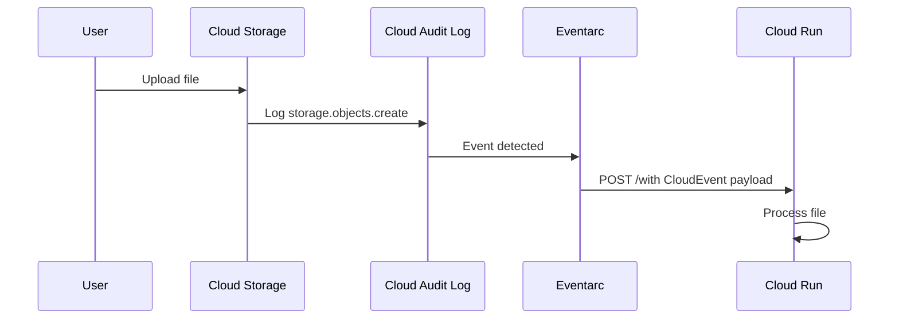

# How to Use Cloud Run with Eventarc to Automatically Process Files Uploaded to Cloud Storage

Author: [nawazdhandala](https://www.github.com/nawazdhandala)

Tags: GCP, Cloud Run, Eventarc, Cloud Storage, Event-Driven, Google Cloud

Description: Learn how to use Eventarc to trigger a Cloud Run service automatically whenever a file is uploaded to a Google Cloud Storage bucket.

---

Event-driven architectures are a natural fit for file processing. Someone uploads a CSV to a Cloud Storage bucket, and your service automatically kicks off to parse and load it into BigQuery. An image lands in a bucket, and a thumbnail generator fires up without anyone pressing a button.

Eventarc is Google Cloud's eventing layer that connects these dots. It listens for events from GCP services and routes them to Cloud Run (or other targets). This guide walks through setting up an end-to-end pipeline where file uploads to Cloud Storage automatically trigger a Cloud Run service.

## How Eventarc Works

Eventarc uses Cloud Audit Logs or direct event sources to detect when something happens in your GCP project. When it sees a matching event, it delivers it to your target service as an HTTP request in CloudEvents format.

For Cloud Storage, the flow looks like this:



## Prerequisites

Make sure you have the following:

- A GCP project with billing enabled
- Cloud Run, Eventarc, and Cloud Storage APIs enabled
- A Cloud Storage bucket to monitor
- The gcloud CLI installed and authenticated

Enable the required APIs:

```bash
# Enable all necessary APIs
gcloud services enable run.googleapis.com \
  eventarc.googleapis.com \
  storage.googleapis.com \
  cloudbuild.googleapis.com \
  logging.googleapis.com
```

You also need to enable audit logging for Cloud Storage. Eventarc relies on audit logs to detect storage events:

```bash
# Enable Cloud Storage audit logging for DATA_WRITE operations
gcloud projects get-iam-policy $(gcloud config get-value project) \
  --format=json > /tmp/policy.json
```

You will need to add the following audit config to the policy if it is not already there. This can also be done through the Cloud Console under IAM > Audit Logs:

```json
{
  "service": "storage.googleapis.com",
  "auditLogConfigs": [
    {
      "logType": "ADMIN_READ"
    },
    {
      "logType": "DATA_WRITE"
    },
    {
      "logType": "DATA_READ"
    }
  ]
}
```

## Step 1: Create a Cloud Storage Bucket

If you do not have a bucket already, create one:

```bash
# Create a bucket for file uploads
gcloud storage buckets create gs://my-upload-bucket-$(gcloud config get-value project) \
  --location=us-central1 \
  --uniform-bucket-level-access
```

## Step 2: Build the File Processing Service

Here is a Cloud Run service that receives Eventarc events and processes the uploaded files. The event payload includes the bucket name and object name, which you use to download and process the file:

```python
# main.py - Cloud Run service that processes Cloud Storage upload events
import os
import json
from flask import Flask, request
from google.cloud import storage
from cloudevents.http import from_http

app = Flask(__name__)
storage_client = storage.Client()

@app.route("/", methods=["POST"])
def handle_event():
    """Receive a CloudEvent from Eventarc and process the uploaded file."""

    # Parse the CloudEvent from the HTTP request
    event = from_http(request.headers, request.get_data())

    # Extract file information from the event data
    data = event.data
    bucket_name = data["resourceName"].split("/")[3]
    object_name = data["resourceName"].split("objects/")[1]

    print(f"Processing file: gs://{bucket_name}/{object_name}")

    # Download the file
    bucket = storage_client.bucket(bucket_name)
    blob = bucket.blob(object_name)

    # Skip if the file was deleted or is a folder marker
    if not blob.exists():
        print(f"File {object_name} no longer exists, skipping")
        return "Skipped", 200

    # Download and process based on file type
    content = blob.download_as_bytes()

    if object_name.endswith(".csv"):
        process_csv(content, object_name)
    elif object_name.endswith(".json"):
        process_json(content, object_name)
    elif object_name.endswith((".jpg", ".png", ".gif")):
        process_image(content, object_name)
    else:
        print(f"Unsupported file type: {object_name}")

    return "OK", 200

def process_csv(content, filename):
    """Process a CSV file."""
    lines = content.decode("utf-8").strip().split("\n")
    print(f"CSV file {filename}: {len(lines)} rows")
    # Add your CSV processing logic here

def process_json(content, filename):
    """Process a JSON file."""
    data = json.loads(content)
    print(f"JSON file {filename}: {len(data) if isinstance(data, list) else 1} records")
    # Add your JSON processing logic here

def process_image(content, filename):
    """Process an image file."""
    print(f"Image file {filename}: {len(content)} bytes")
    # Add your image processing logic here (resize, compress, etc.)

if __name__ == "__main__":
    port = int(os.environ.get("PORT", 8080))
    app.run(host="0.0.0.0", port=port)
```

The Dockerfile:

```dockerfile
# Dockerfile for the file processing service
FROM python:3.11-slim

WORKDIR /app

COPY requirements.txt .
RUN pip install --no-cache-dir -r requirements.txt

COPY . .

CMD ["python", "main.py"]
```

And the requirements:

```text
flask==3.0.0
google-cloud-storage==2.14.0
cloudevents==1.10.1
gunicorn==21.2.0
```

Build and push the image:

```bash
# Build and push the file processor image
gcloud builds submit \
  --tag us-central1-docker.pkg.dev/$(gcloud config get-value project)/cloud-run-images/file-processor:latest
```

## Step 3: Deploy the Cloud Run Service

```bash
# Deploy the file processing service
gcloud run deploy file-processor \
  --image=us-central1-docker.pkg.dev/$(gcloud config get-value project)/cloud-run-images/file-processor:latest \
  --region=us-central1 \
  --no-allow-unauthenticated \
  --min-instances=0 \
  --max-instances=10
```

Note the `--no-allow-unauthenticated` flag. The service should only be called by Eventarc, not by the public internet.

## Step 4: Grant Eventarc Permissions

Eventarc needs a service account with permission to invoke your Cloud Run service:

```bash
# Get the project number
PROJECT_NUMBER=$(gcloud projects describe $(gcloud config get-value project) \
  --format='value(projectNumber)')

# Grant the Eventarc service agent the ability to invoke Cloud Run
gcloud projects add-iam-policy-binding $(gcloud config get-value project) \
  --member="serviceAccount:service-${PROJECT_NUMBER}@gcp-sa-eventarc.iam.gserviceaccount.com" \
  --role="roles/run.invoker"

# Grant the Eventarc service agent the eventReceiver role
gcloud projects add-iam-policy-binding $(gcloud config get-value project) \
  --member="serviceAccount:${PROJECT_NUMBER}-compute@developer.gserviceaccount.com" \
  --role="roles/eventarc.eventReceiver"
```

## Step 5: Create the Eventarc Trigger

This is the piece that connects Cloud Storage events to your Cloud Run service:

```bash
# Create an Eventarc trigger for Cloud Storage object creation
gcloud eventarc triggers create file-upload-trigger \
  --location=us-central1 \
  --destination-run-service=file-processor \
  --destination-run-region=us-central1 \
  --event-filters="type=google.cloud.audit.log.v1.written" \
  --event-filters="serviceName=storage.googleapis.com" \
  --event-filters="methodName=storage.objects.create" \
  --service-account="${PROJECT_NUMBER}-compute@developer.gserviceaccount.com"
```

This trigger fires whenever a new object is created in any Cloud Storage bucket in the project. If you want to filter to a specific bucket, you can add a path pattern filter.

## Step 6: Test the Pipeline

Upload a file and check the logs:

```bash
# Upload a test file
echo "name,email,age" > /tmp/test.csv
echo "Alice,alice@example.com,30" >> /tmp/test.csv
gcloud storage cp /tmp/test.csv gs://my-upload-bucket-$(gcloud config get-value project)/test.csv

# Wait a few seconds for the event to propagate, then check logs
sleep 10
gcloud logging read "resource.type=cloud_run_revision \
  AND resource.labels.service_name=file-processor" \
  --limit=10 \
  --format="table(timestamp, textPayload)"
```

You should see log entries showing the file being processed. Event delivery typically takes 10-30 seconds from the time of upload.

## Filtering Events to a Specific Bucket

If you only want to process files from a specific bucket, add a resource path filter to your trigger:

```bash
# Trigger only for a specific bucket
gcloud eventarc triggers create specific-bucket-trigger \
  --location=us-central1 \
  --destination-run-service=file-processor \
  --destination-run-region=us-central1 \
  --event-filters="type=google.cloud.audit.log.v1.written" \
  --event-filters="serviceName=storage.googleapis.com" \
  --event-filters="methodName=storage.objects.create" \
  --event-filters-path-pattern="resourceName=/projects/_/buckets/my-specific-bucket/objects/*" \
  --service-account="${PROJECT_NUMBER}-compute@developer.gserviceaccount.com"
```

## Handling Duplicate Events

Eventarc guarantees at-least-once delivery, which means your service might receive the same event more than once. Design your processing to be idempotent:

```python
# Use a simple deduplication check before processing
from google.cloud import firestore

db = firestore.Client()

def is_duplicate(event_id):
    """Check if this event has already been processed."""
    doc_ref = db.collection("processed_events").document(event_id)
    doc = doc_ref.get()
    if doc.exists:
        return True
    # Mark as processed
    doc_ref.set({"processed_at": firestore.SERVER_TIMESTAMP})
    return False
```

## Error Handling and Retries

If your Cloud Run service returns a non-2xx response, Eventarc will retry the delivery. The default retry period is 24 hours with exponential backoff. Make sure your service returns appropriate status codes:

- 200-299: Success, event is acknowledged
- 400-499: Client error, event will not be retried (except 429)
- 500-599: Server error, event will be retried

## Summary

Eventarc and Cloud Run make file processing pipelines straightforward to build. Upload a file, Eventarc detects it, and Cloud Run processes it - all serverless and auto-scaling. The key steps are enabling audit logging, deploying your processing service, setting up IAM permissions, and creating the trigger. Add idempotency handling for production workloads since events can be delivered more than once.
