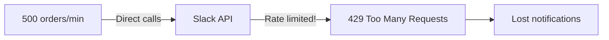
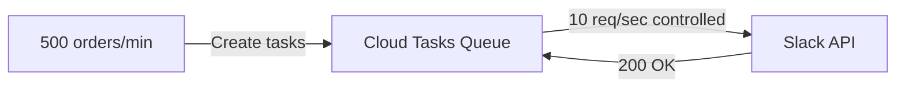

# How to Use Cloud Tasks to Buffer HTTP Requests for Rate-Limited APIs

Author: [nawazdhandala](https://www.github.com/nawazdhandala)

Tags: GCP, Cloud Tasks, Rate Limiting, API Integration, Buffering

Description: Learn how to use Google Cloud Tasks as a buffer to smooth out traffic spikes and stay within rate limits when integrating with third-party APIs.

---

Almost every third-party API has rate limits. Stripe allows 100 requests per second. Twilio has concurrent request limits. Salesforce has daily API call quotas. When your application generates traffic that might exceed these limits, you need a buffer between your app and the API. Cloud Tasks is an excellent choice for this because it gives you precise control over dispatch rates and handles retries automatically.

In this post, I will show you how to use Cloud Tasks as a request buffer to protect rate-limited APIs from being overwhelmed by your application.

## The Problem: Traffic Spikes vs. Rate Limits

Imagine your e-commerce platform sends a Slack notification for every order. On a normal day, you get 50 orders per hour - no problem. But during a flash sale, you might get 500 orders in a minute. If you call the Slack API directly, you will hit rate limits and start losing notifications.

Without a buffer:



With Cloud Tasks as a buffer:



## Setting Up the Buffer Queue

Create a Cloud Tasks queue configured to stay within the target API's rate limits.

```bash
# Create a queue that dispatches at a rate safe for the target API
# Example: Slack allows ~1 request per second per method
gcloud tasks queues create slack-notification-buffer \
  --location=us-central1 \
  --max-dispatches-per-second=1 \
  --max-concurrent-dispatches=1 \
  --max-burst-size=5 \
  --max-attempts=5 \
  --min-backoff="30s" \
  --max-backoff="300s" \
  --max-doublings=3
```

The key settings:
- `max-dispatches-per-second=1`: Stay within Slack's rate limit
- `max-concurrent-dispatches=1`: Only one request in flight at a time
- `min-backoff=30s`: If rate-limited, wait at least 30 seconds before retrying (gives the rate limit window time to reset)

## Building the Buffer Handler

Create a Cloud Function that acts as the intermediary between Cloud Tasks and the rate-limited API.

```javascript
// buffer-handler.js
// Cloud Function that forwards buffered requests to a rate-limited API
const functions = require("@google-cloud/functions-framework");

functions.http("slackBuffer", async (req, res) => {
  const taskName = req.headers["x-cloudtasks-taskname"] || "unknown";
  const retryCount = parseInt(req.headers["x-cloudtasks-taskretrycount"] || "0");

  const { channel, text, blocks } = req.body;

  if (!channel || !text) {
    // Invalid payload - do not retry
    console.error("Missing channel or text");
    res.status(200).json({ error: "invalid_payload" });
    return;
  }

  try {
    // Call the Slack API
    const response = await fetch("https://slack.com/api/chat.postMessage", {
      method: "POST",
      headers: {
        "Content-Type": "application/json",
        Authorization: `Bearer ${process.env.SLACK_TOKEN}`,
      },
      body: JSON.stringify({ channel, text, blocks }),
    });

    const data = await response.json();

    if (response.status === 429) {
      // Rate limited - extract retry-after header
      const retryAfter = response.headers.get("retry-after") || "30";
      console.warn(`Rate limited by Slack. Retry after ${retryAfter}s`);
      // Return 429 so Cloud Tasks retries with backoff
      res.status(429).json({ error: "rate_limited", retryAfter });
      return;
    }

    if (!data.ok) {
      // Slack API error
      if (data.error === "channel_not_found" || data.error === "invalid_auth") {
        // Permanent errors - do not retry
        console.error(`Slack permanent error: ${data.error}`);
        res.status(200).json({ error: data.error, permanent: true });
        return;
      }
      // Potentially transient errors - retry
      throw new Error(`Slack API error: ${data.error}`);
    }

    console.log(`Message sent to ${channel}: ${data.ts}`);
    res.status(200).json({ status: "sent", ts: data.ts });
  } catch (error) {
    console.error(`Attempt ${retryCount} failed: ${error.message}`);
    res.status(500).json({ error: error.message });
  }
});
```

Deploy the function.

```bash
# Deploy the buffer handler
gcloud functions deploy slack-buffer \
  --gen2 \
  --runtime=nodejs20 \
  --region=us-central1 \
  --entry-point=slackBuffer \
  --trigger-http \
  --no-allow-unauthenticated \
  --memory=256MB \
  --timeout=30s \
  --set-secrets="SLACK_TOKEN=slack-bot-token:latest"
```

## Creating Buffered Tasks from Your Application

Your application creates tasks instead of calling the API directly.

```javascript
// slack-notifier.js
// Sends Slack notifications through the Cloud Tasks buffer
const { CloudTasksClient } = require("@google-cloud/tasks");

const client = new CloudTasksClient();
const PROJECT = process.env.GOOGLE_CLOUD_PROJECT;
const LOCATION = "us-central1";
const QUEUE = "slack-notification-buffer";
const HANDLER_URL = process.env.SLACK_BUFFER_URL;
const SA_EMAIL = `task-dispatcher@${PROJECT}.iam.gserviceaccount.com`;

async function sendSlackNotification(channel, text, blocks = null) {
  const parent = client.queuePath(PROJECT, LOCATION, QUEUE);

  const payload = { channel, text };
  if (blocks) {
    payload.blocks = blocks;
  }

  const task = {
    httpRequest: {
      httpMethod: "POST",
      url: HANDLER_URL,
      headers: { "Content-Type": "application/json" },
      body: Buffer.from(JSON.stringify(payload)).toString("base64"),
      oidcToken: {
        serviceAccountEmail: SA_EMAIL,
        audience: HANDLER_URL,
      },
    },
  };

  const [response] = await client.createTask({ parent, task });
  return response;
}

// Usage in your order processing code
async function onNewOrder(order) {
  // This returns immediately - the notification is queued
  await sendSlackNotification(
    "#orders",
    `New order ${order.id} from ${order.customerName} - $${order.total}`
  );
}

module.exports = { sendSlackNotification };
```

## Buffering for Multiple API Endpoints

If you call different rate-limited APIs, create separate queues for each with appropriate rate limits.

```bash
# Queue for Stripe API (100 req/sec limit, use 80 to leave headroom)
gcloud tasks queues create stripe-buffer \
  --location=us-central1 \
  --max-dispatches-per-second=80 \
  --max-concurrent-dispatches=20 \
  --max-attempts=5 \
  --min-backoff="5s"

# Queue for SendGrid API (100 emails/sec for Pro plan)
gcloud tasks queues create sendgrid-buffer \
  --location=us-central1 \
  --max-dispatches-per-second=80 \
  --max-concurrent-dispatches=15 \
  --max-attempts=5 \
  --min-backoff="10s"

# Queue for a slow internal API (5 req/sec capacity)
gcloud tasks queues create internal-api-buffer \
  --location=us-central1 \
  --max-dispatches-per-second=4 \
  --max-concurrent-dispatches=3 \
  --max-attempts=10 \
  --min-backoff="15s"
```

## Handling Rate Limit Responses

A good buffer handler should understand rate limit signals from the target API and behave accordingly.

```javascript
// Generic rate-limit-aware buffer handler
async function callRateLimitedApi(url, method, headers, body) {
  const response = await fetch(url, {
    method,
    headers,
    body: JSON.stringify(body),
  });

  // Check for rate limiting
  if (response.status === 429) {
    const retryAfter = parseInt(response.headers.get("retry-after") || "60");
    console.warn(`Rate limited. Retry-After: ${retryAfter}s`);
    // Throw a specific error so the handler returns 429/503
    const error = new Error("Rate limited");
    error.retryAfter = retryAfter;
    error.isRateLimit = true;
    throw error;
  }

  // Check for server errors (transient, retryable)
  if (response.status >= 500) {
    throw new Error(`Server error: ${response.status}`);
  }

  // Check for client errors (permanent, not retryable)
  if (response.status >= 400) {
    const data = await response.json().catch(() => ({}));
    console.error(`Client error ${response.status}:`, data);
    return { success: false, permanent: true, status: response.status, data };
  }

  return { success: true, data: await response.json() };
}
```

## Priority Queues

For scenarios where some notifications are more important than others, use multiple queues with different dispatch rates.

```bash
# High-priority queue - faster dispatch
gcloud tasks queues create slack-high-priority \
  --location=us-central1 \
  --max-dispatches-per-second=5 \
  --max-concurrent-dispatches=3

# Low-priority queue - slower dispatch
gcloud tasks queues create slack-low-priority \
  --location=us-central1 \
  --max-dispatches-per-second=1 \
  --max-concurrent-dispatches=1
```

```javascript
// Route to different queues based on priority
async function sendNotification(channel, text, priority = "normal") {
  const queue = priority === "high" ? "slack-high-priority" : "slack-low-priority";
  const parent = client.queuePath(PROJECT, LOCATION, queue);

  // Create task in the appropriate queue...
}
```

## Monitoring the Buffer

Track how the buffer is performing.

```bash
# Check queue depth (how many tasks are waiting)
gcloud tasks list --queue=slack-notification-buffer \
  --location=us-central1 \
  --format="table(name.basename(), scheduleTime, dispatchCount)"

# Check queue configuration
gcloud tasks queues describe slack-notification-buffer \
  --location=us-central1 \
  --format="yaml(rateLimits, retryConfig, stats)"
```

If the queue depth is constantly growing, your dispatch rate is too low for the incoming task volume. Either increase the rate (if the target API allows it) or accept that notifications will be delayed during peak traffic.

## Dynamic Rate Adjustment

For APIs where your rate limit changes based on your plan or usage, you can adjust the queue rate dynamically.

```javascript
// Dynamically adjust queue rate based on remaining API quota
const { CloudTasksClient } = require("@google-cloud/tasks");

async function adjustQueueRate(currentQuotaRemaining, quotaResetSeconds) {
  const client = new CloudTasksClient();
  const name = client.queuePath("my-project", "us-central1", "api-buffer");

  // Calculate a safe rate based on remaining quota
  const safeRate = Math.max(1, Math.floor(currentQuotaRemaining / quotaResetSeconds * 0.8));

  const [queue] = await client.updateQueue({
    queue: {
      name,
      rateLimits: { maxDispatchesPerSecond: safeRate },
    },
    updateMask: { paths: ["rate_limits.max_dispatches_per_second"] },
  });

  console.log(`Adjusted dispatch rate to ${safeRate}/s`);
}
```

## Wrapping Up

Using Cloud Tasks as a buffer for rate-limited APIs is a straightforward pattern that solves a common problem. Instead of handling rate limits in your application code with complex retry logic and backoff, you let Cloud Tasks manage the flow. Create a queue with appropriate rate limits, deploy a handler that forwards requests to the target API, and have your application create tasks instead of making direct API calls. The result is an application that never gets rate-limited, handles traffic spikes gracefully, and automatically retries failed requests.
