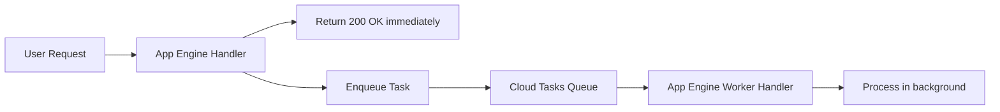

# How to Use Cloud Tasks with App Engine to Process Background Work Without Blocking Requests

Author: [nawazdhandala](https://www.github.com/nawazdhandala)

Tags: GCP, Cloud Tasks, App Engine, Background Processing, Task Queue, Asynchronous

Description: Learn how to use Google Cloud Tasks with App Engine to offload background work like sending emails, processing images, and syncing data without blocking user requests.

---

Your user clicks "Place Order" and your application needs to charge their credit card, send a confirmation email, update the inventory system, notify the warehouse, and generate a receipt PDF. If you do all of that synchronously in the request handler, the user stares at a loading spinner for 10 seconds. If any step fails, the whole request fails.

Cloud Tasks lets you break that work into individual tasks that run in the background. The user gets an immediate response, and the background tasks process asynchronously. If a task fails, Cloud Tasks retries it automatically. Your request handler stays fast and your background processing stays reliable.

## How Cloud Tasks Works with App Engine

Cloud Tasks integrates natively with App Engine. You create a task queue, enqueue tasks that specify a URL on your App Engine service, and Cloud Tasks sends HTTP requests to those URLs at a controlled rate. Your App Engine handlers process the tasks just like regular requests.



## Setting Up a Task Queue

First, enable the Cloud Tasks API:

```bash
# Enable the Cloud Tasks API
gcloud services enable cloudtasks.googleapis.com
```

Create a task queue:

```bash
# Create a task queue for processing orders
gcloud tasks queues create order-processing \
  --location=us-central1 \
  --max-dispatches-per-second=10 \
  --max-concurrent-dispatches=5 \
  --max-attempts=5 \
  --min-backoff=10s \
  --max-backoff=300s
```

Let me break down those settings:

- `--max-dispatches-per-second=10`: Cloud Tasks sends at most 10 tasks per second to your handler
- `--max-concurrent-dispatches=5`: At most 5 tasks are being processed simultaneously
- `--max-attempts=5`: Failed tasks are retried up to 5 times
- `--min-backoff=10s` and `--max-backoff=300s`: Retry delays range from 10 seconds to 5 minutes

## Enqueuing Tasks from Your Application

Here is how to create tasks from your request handler. When a user places an order, enqueue background tasks for each step:

```python
# main.py - Order handler that enqueues background tasks
from flask import Flask, request, jsonify
from google.cloud import tasks_v2
import json

app = Flask(__name__)

# Initialize the Cloud Tasks client
tasks_client = tasks_v2.CloudTasksClient()

# Queue path configuration
PROJECT = 'my-project'
LOCATION = 'us-central1'
QUEUE = 'order-processing'

def get_queue_path():
    """Return the fully qualified queue path."""
    return tasks_client.queue_path(PROJECT, LOCATION, QUEUE)


@app.route('/api/orders', methods=['POST'])
def create_order():
    """Handle order creation - respond quickly, process in background."""
    order_data = request.get_json()
    order_id = save_order_to_database(order_data)

    # Enqueue background tasks for each processing step
    enqueue_task('/tasks/charge-payment', {
        'order_id': order_id,
        'amount': order_data['total']
    })

    enqueue_task('/tasks/send-confirmation-email', {
        'order_id': order_id,
        'email': order_data['email']
    })

    enqueue_task('/tasks/update-inventory', {
        'order_id': order_id,
        'items': order_data['items']
    })

    # Return immediately - background tasks handle the rest
    return jsonify({'order_id': order_id, 'status': 'processing'}), 202


def enqueue_task(handler_url, payload):
    """Create a Cloud Task that sends a POST request to the handler URL."""
    task = {
        'app_engine_http_request': {
            'http_method': tasks_v2.HttpMethod.POST,
            'relative_uri': handler_url,
            'headers': {
                'Content-Type': 'application/json'
            },
            'body': json.dumps(payload).encode()
        }
    }

    tasks_client.create_task(
        parent=get_queue_path(),
        task=task
    )
```

## Processing Tasks

The task handlers are regular App Engine request handlers. Cloud Tasks sends HTTP requests to them:

```python
# workers.py - Background task handlers
from flask import Flask, request, abort
import logging

app = Flask(__name__)


@app.route('/tasks/charge-payment', methods=['POST'])
def charge_payment():
    """Process payment for an order."""
    # Verify the request is from Cloud Tasks
    if not request.headers.get('X-AppEngine-TaskName'):
        abort(403)

    data = request.get_json()
    order_id = data['order_id']
    amount = data['amount']

    logging.info(f"Charging payment for order {order_id}: ${amount}")

    try:
        # Call the payment processor
        charge_result = process_payment(order_id, amount)
        update_order_status(order_id, 'payment_complete')
        return 'OK', 200
    except PaymentError as e:
        logging.error(f"Payment failed for order {order_id}: {e}")
        # Return 500 to trigger Cloud Tasks retry
        return 'Payment failed', 500


@app.route('/tasks/send-confirmation-email', methods=['POST'])
def send_confirmation_email():
    """Send order confirmation email."""
    if not request.headers.get('X-AppEngine-TaskName'):
        abort(403)

    data = request.get_json()
    order_id = data['order_id']
    email = data['email']

    logging.info(f"Sending confirmation for order {order_id} to {email}")

    order = get_order(order_id)
    send_email(
        to=email,
        subject=f"Order Confirmation - {order_id}",
        template='order_confirmation',
        context={'order': order}
    )

    return 'OK', 200


@app.route('/tasks/update-inventory', methods=['POST'])
def update_inventory():
    """Update inventory counts after an order."""
    if not request.headers.get('X-AppEngine-TaskName'):
        abort(403)

    data = request.get_json()
    order_id = data['order_id']
    items = data['items']

    for item in items:
        decrease_stock(item['product_id'], item['quantity'])
        logging.info(f"Updated inventory for product {item['product_id']}")

    return 'OK', 200
```

## Task Scheduling and Delays

You can schedule tasks to run at a specific time in the future. This is useful for follow-up emails, reminder notifications, or delayed processing:

```python
# Schedule a task to run in the future
from datetime import datetime, timedelta
from google.protobuf import timestamp_pb2

def enqueue_delayed_task(handler_url, payload, delay_seconds):
    """Create a task that executes after a delay."""
    # Calculate the execution time
    execute_time = datetime.utcnow() + timedelta(seconds=delay_seconds)
    timestamp = timestamp_pb2.Timestamp()
    timestamp.FromDatetime(execute_time)

    task = {
        'app_engine_http_request': {
            'http_method': tasks_v2.HttpMethod.POST,
            'relative_uri': handler_url,
            'headers': {'Content-Type': 'application/json'},
            'body': json.dumps(payload).encode()
        },
        # Schedule the task for future execution
        'schedule_time': timestamp
    }

    tasks_client.create_task(parent=get_queue_path(), task=task)


# Example: send a follow-up email 24 hours after order
enqueue_delayed_task('/tasks/send-followup-email', {
    'order_id': order_id,
    'email': user_email
}, delay_seconds=86400)  # 24 hours
```

## Deduplication with Task Names

Cloud Tasks supports named tasks to prevent duplicate processing. If you try to create a task with the same name as an existing task, the request is rejected:

```python
# Create a task with a unique name for deduplication
def enqueue_unique_task(handler_url, payload, task_id):
    """Create a task with a specific name to prevent duplicates."""
    task_name = f"{get_queue_path()}/tasks/{task_id}"

    task = {
        'name': task_name,
        'app_engine_http_request': {
            'http_method': tasks_v2.HttpMethod.POST,
            'relative_uri': handler_url,
            'headers': {'Content-Type': 'application/json'},
            'body': json.dumps(payload).encode()
        }
    }

    try:
        tasks_client.create_task(parent=get_queue_path(), task=task)
    except Exception as e:
        if 'ALREADY_EXISTS' in str(e):
            logging.info(f"Task {task_id} already exists, skipping")
        else:
            raise
```

Be aware that task names are reserved for about an hour after the task completes or is deleted. If you need to re-enqueue a task with the same name, wait or use a different naming scheme.

## Queue Rate Limiting

Control how fast tasks are dispatched to protect your downstream services:

```bash
# Update queue rate limits
gcloud tasks queues update order-processing \
  --location=us-central1 \
  --max-dispatches-per-second=50 \
  --max-concurrent-dispatches=20
```

For different types of work, create separate queues with different rate limits:

```bash
# High-priority queue for payment processing
gcloud tasks queues create payments \
  --location=us-central1 \
  --max-dispatches-per-second=100 \
  --max-concurrent-dispatches=50

# Low-priority queue for email sending
gcloud tasks queues create emails \
  --location=us-central1 \
  --max-dispatches-per-second=5 \
  --max-concurrent-dispatches=3

# Bulk queue for data processing
gcloud tasks queues create bulk-processing \
  --location=us-central1 \
  --max-dispatches-per-second=20 \
  --max-concurrent-dispatches=10
```

## Retry Configuration

Fine-tune retry behavior for different failure modes:

```bash
# Configure retries for a queue
gcloud tasks queues update order-processing \
  --location=us-central1 \
  --max-attempts=10 \
  --min-backoff=5s \
  --max-backoff=600s \
  --max-doublings=4
```

The `max-doublings` parameter controls how quickly the backoff increases. With `min-backoff=5s` and `max-doublings=4`, the retry delays would be: 5s, 10s, 20s, 40s, 80s, then capped at the max-backoff for remaining attempts.

In your handler, you can check which retry attempt is current:

```python
@app.route('/tasks/process-item', methods=['POST'])
def process_item():
    # Cloud Tasks sets these headers automatically
    task_name = request.headers.get('X-AppEngine-TaskName')
    retry_count = int(request.headers.get('X-AppEngine-TaskRetryCount', 0))
    execution_count = int(request.headers.get('X-AppEngine-TaskExecutionCount', 0))

    if retry_count > 3:
        logging.warning(f"Task {task_name} has been retried {retry_count} times")
        # Maybe notify someone or take different action
        send_alert(f"Task stuck: {task_name}")

    # Process the task
    try:
        do_work()
        return 'OK', 200
    except Exception as e:
        logging.error(f"Task failed (attempt {retry_count}): {e}")
        return 'Error', 500
```

## Monitoring Task Queues

Keep an eye on your queues to catch issues early:

```bash
# View queue statistics
gcloud tasks queues describe order-processing --location=us-central1

# List tasks in a queue (useful for debugging stuck tasks)
gcloud tasks list --queue=order-processing --location=us-central1 --limit=10
```

Set up monitoring alerts for queue depth:

```bash
# Alert when tasks are piling up (queue depth > 1000)
gcloud alpha monitoring policies create \
  --display-name="Cloud Tasks Queue Depth" \
  --condition-filter='resource.type="cloud_tasks_queue" AND metric.type="cloudtasks.googleapis.com/queue/depth"' \
  --condition-threshold-value=1000 \
  --condition-threshold-comparison=COMPARISON_GT
```

## Targeting Specific Services and Versions

You can direct tasks to specific App Engine services:

```python
# Send task to a specific App Engine service
task = {
    'app_engine_http_request': {
        'http_method': tasks_v2.HttpMethod.POST,
        'relative_uri': '/tasks/heavy-processing',
        # Route to the 'worker' service instead of default
        'app_engine_routing': {
            'service': 'worker',
            'version': 'v2'
        },
        'body': json.dumps(payload).encode()
    }
}
```

This is useful when you have a dedicated worker service with different scaling settings than your main web service.

Cloud Tasks with App Engine is a battle-tested pattern for building reliable, scalable applications. The user gets a fast response, the background work gets done reliably, and if something fails, automatic retries handle it. Once you start using this pattern, you will find yourself applying it everywhere - because almost every user action has work that does not need to happen synchronously.
