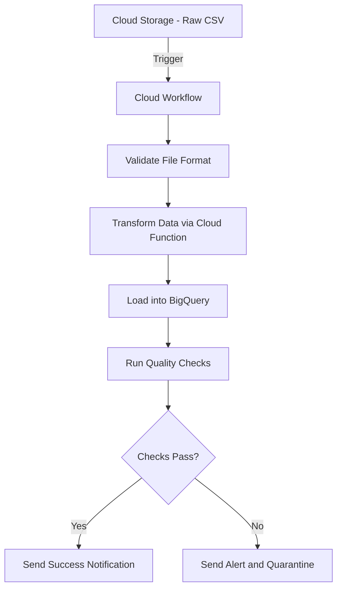

# How to Use Cloud Workflows to Orchestrate a Data Processing Pipeline

Author: [nawazdhandala](https://www.github.com/nawazdhandala)

Tags: GCP, Cloud Workflows, Data Pipeline, BigQuery, Cloud Storage

Description: Build a complete data processing pipeline using Google Cloud Workflows to orchestrate data ingestion, transformation, and loading across multiple GCP services.

---

Data processing pipelines typically involve multiple steps - extracting data from sources, transforming it, loading it into a warehouse, and maybe running some validation at the end. Each step depends on the previous one completing successfully, and you need error handling throughout. Cloud Workflows is a great fit for orchestrating these pipelines because it handles step sequencing, retries, and error propagation natively.

In this post, I will walk through building a real data processing pipeline that ingests CSV files from Cloud Storage, processes them through Cloud Functions, loads the results into BigQuery, and sends a notification when everything is done.

## Pipeline Architecture

Here is what we are building.



## Prerequisites

Make sure you have these APIs enabled.

```bash
# Enable all required APIs
gcloud services enable \
  workflows.googleapis.com \
  cloudfunctions.googleapis.com \
  bigquery.googleapis.com \
  storage.googleapis.com
```

## The Complete Pipeline Workflow

Here is the full workflow definition. I will explain each section after.

```yaml
# data-pipeline.yaml
# Orchestrates a complete ETL pipeline: validate, transform, load, verify
main:
  params: [args]
  steps:
    - init:
        assign:
          - project_id: ${sys.get_env("GOOGLE_CLOUD_PROJECT_ID")}
          - source_bucket: ${args.bucket}
          - source_file: ${args.file}
          - dataset: "analytics"
          - table: "processed_events"
          - staging_table: "staging_events"
          - timestamp: ${sys.now()}
          - pipeline_id: ${sys.get_env("GOOGLE_CLOUD_WORKFLOW_EXECUTION_ID")}

    - log_start:
        call: sys.log
        args:
          text: ${"Pipeline " + pipeline_id + " started for gs://" + source_bucket + "/" + source_file}
          severity: "INFO"

    # Step 1: Validate the source file
    - validate_file:
        try:
          call: validate_source_file
          args:
            bucket: ${source_bucket}
            file: ${source_file}
          result: validation_result
        except:
          as: e
          steps:
            - log_validation_error:
                call: sys.log
                args:
                  text: ${"File validation failed - " + e.message}
                  severity: "ERROR"
            - quarantine_file:
                call: move_to_quarantine
                args:
                  bucket: ${source_bucket}
                  file: ${source_file}
                  reason: "validation_failed"
            - fail_validation:
                raise: ${"Pipeline failed at validation - " + e.message}

    # Step 2: Transform the data
    - transform_data:
        try:
          call: transform_via_function
          args:
            bucket: ${source_bucket}
            file: ${source_file}
            project_id: ${project_id}
          result: transform_result
        except:
          as: e
          steps:
            - log_transform_error:
                call: sys.log
                args:
                  text: ${"Transform failed - " + e.message}
                  severity: "ERROR"
            - fail_transform:
                raise: ${"Pipeline failed at transformation - " + e.message}

    # Step 3: Load into BigQuery
    - load_to_bigquery:
        call: load_data_to_bq
        args:
          project_id: ${project_id}
          dataset: ${dataset}
          staging_table: ${staging_table}
          source_uri: ${transform_result.output_uri}
        result: load_result

    # Step 4: Run quality checks
    - quality_checks:
        call: run_quality_checks
        args:
          project_id: ${project_id}
          dataset: ${dataset}
          staging_table: ${staging_table}
        result: quality_result

    # Step 5: Promote or reject
    - evaluate_quality:
        switch:
          - condition: ${quality_result.passed == true}
            steps:
              - promote_data:
                  call: promote_staging_to_production
                  args:
                    project_id: ${project_id}
                    dataset: ${dataset}
                    staging_table: ${staging_table}
                    production_table: ${table}
                  result: promote_result
              - send_success:
                  call: send_notification
                  args:
                    status: "success"
                    message: ${"Pipeline completed. " + string(quality_result.row_count) + " rows loaded."}
                    pipeline_id: ${pipeline_id}
          - condition: true
            steps:
              - send_failure:
                  call: send_notification
                  args:
                    status: "failure"
                    message: ${"Quality check failed - " + quality_result.failure_reason}
                    pipeline_id: ${pipeline_id}
              - fail_quality:
                  raise: ${"Quality check failed - " + quality_result.failure_reason}

    - return_result:
        return:
          pipeline_id: ${pipeline_id}
          status: "success"
          rows_loaded: ${quality_result.row_count}

# Subworkflow: Validate the source file exists and has expected format
validate_source_file:
  params: [bucket, file]
  steps:
    - check_file_exists:
        call: http.get
        args:
          url: ${"https://storage.googleapis.com/storage/v1/b/" + bucket + "/o/" + file}
          auth:
            type: OAuth2
        result: file_metadata

    - validate_size:
        switch:
          - condition: ${int(file_metadata.body.size) == 0}
            raise: "File is empty"
          - condition: ${int(file_metadata.body.size) > 5368709120}
            raise: "File exceeds 5GB limit"

    - validate_extension:
        assign:
          - file_lower: ${text.to_lower(file)}
        switch:
          - condition: ${not(text.match_regex(file_lower, ".*\\.csv$"))}
            raise: "File is not a CSV"

    - return_valid:
        return:
          valid: true
          size_bytes: ${int(file_metadata.body.size)}

# Subworkflow: Call Cloud Function to transform the data
transform_via_function:
  params: [bucket, file, project_id]
  steps:
    - call_transform_function:
        call: http.post
        args:
          url: ${"https://us-central1-" + project_id + ".cloudfunctions.net/transform-csv"}
          auth:
            type: OIDC
          body:
            source_bucket: ${bucket}
            source_file: ${file}
            output_bucket: ${bucket}
            output_prefix: "transformed/"
          timeout: 540
        result: transform_response

    - check_response:
        switch:
          - condition: ${transform_response.code != 200}
            raise: ${"Transform function returned status " + string(transform_response.code)}

    - return_transform:
        return:
          output_uri: ${transform_response.body.output_uri}
          rows_processed: ${transform_response.body.rows_processed}

# Subworkflow: Load transformed data into BigQuery staging table
load_data_to_bq:
  params: [project_id, dataset, staging_table, source_uri]
  steps:
    - start_load_job:
        call: http.post
        args:
          url: ${"https://bigquery.googleapis.com/bigquery/v2/projects/" + project_id + "/jobs"}
          auth:
            type: OAuth2
          body:
            configuration:
              load:
                sourceUris:
                  - ${source_uri}
                destinationTable:
                  projectId: ${project_id}
                  datasetId: ${dataset}
                  tableId: ${staging_table}
                sourceFormat: "NEWLINE_DELIMITED_JSON"
                writeDisposition: "WRITE_TRUNCATE"
                autodetect: false
        result: job_response

    - extract_job_id:
        assign:
          - job_id: ${job_response.body.jobReference.jobId}

    - poll_job:
        call: poll_bq_job
        args:
          project_id: ${project_id}
          job_id: ${job_id}
        result: completed_job

    - return_load:
        return:
          job_id: ${job_id}
          status: "loaded"

# Subworkflow: Poll BigQuery job until done
poll_bq_job:
  params: [project_id, job_id]
  steps:
    - init:
        assign:
          - delay: 3
          - max_delay: 30
    - check:
        call: http.get
        args:
          url: ${"https://bigquery.googleapis.com/bigquery/v2/projects/" + project_id + "/jobs/" + job_id}
          auth:
            type: OAuth2
        result: status
    - evaluate:
        switch:
          - condition: ${status.body.status.state == "DONE"}
            steps:
              - check_error:
                  switch:
                    - condition: ${"errorResult" in status.body.status}
                      raise: ${status.body.status.errorResult.message}
              - done:
                  return: ${status.body}
    - wait:
        call: sys.sleep
        args:
          seconds: ${delay}
    - backoff:
        assign:
          - delay: ${if(delay * 2 > max_delay, max_delay, delay * 2)}
    - loop:
        next: check

# Subworkflow: Run data quality checks
run_quality_checks:
  params: [project_id, dataset, staging_table]
  steps:
    - count_rows:
        call: http.post
        args:
          url: ${"https://bigquery.googleapis.com/bigquery/v2/projects/" + project_id + "/queries"}
          auth:
            type: OAuth2
          body:
            query: ${"SELECT COUNT(*) as cnt FROM `" + project_id + "." + dataset + "." + staging_table + "`"}
            useLegacySql: false
        result: count_result

    - extract_count:
        assign:
          - row_count: ${int(count_result.body.rows[0].f[0].v)}

    - check_not_empty:
        switch:
          - condition: ${row_count == 0}
            return:
              passed: false
              failure_reason: "Staging table has zero rows"
              row_count: 0

    - check_nulls:
        call: http.post
        args:
          url: ${"https://bigquery.googleapis.com/bigquery/v2/projects/" + project_id + "/queries"}
          auth:
            type: OAuth2
          body:
            query: ${"SELECT COUNT(*) as null_count FROM `" + project_id + "." + dataset + "." + staging_table + "` WHERE event_id IS NULL"}
            useLegacySql: false
        result: null_result

    - evaluate_nulls:
        assign:
          - null_count: ${int(null_result.body.rows[0].f[0].v)}

    - final_check:
        switch:
          - condition: ${null_count > 0}
            return:
              passed: false
              failure_reason: ${string(null_count) + " rows have null event_id"}
              row_count: ${row_count}
          - condition: true
            return:
              passed: true
              row_count: ${row_count}

# Subworkflow: Promote staging data to production table
promote_staging_to_production:
  params: [project_id, dataset, staging_table, production_table]
  steps:
    - copy_to_production:
        call: http.post
        args:
          url: ${"https://bigquery.googleapis.com/bigquery/v2/projects/" + project_id + "/jobs"}
          auth:
            type: OAuth2
          body:
            configuration:
              copy:
                sourceTable:
                  projectId: ${project_id}
                  datasetId: ${dataset}
                  tableId: ${staging_table}
                destinationTable:
                  projectId: ${project_id}
                  datasetId: ${dataset}
                  tableId: ${production_table}
                writeDisposition: "WRITE_APPEND"
        result: copy_job

    - poll_copy:
        call: poll_bq_job
        args:
          project_id: ${project_id}
          job_id: ${copy_job.body.jobReference.jobId}
        result: copy_done

    - return_promote:
        return:
          status: "promoted"

# Subworkflow: Move bad files to quarantine
move_to_quarantine:
  params: [bucket, file, reason]
  steps:
    - copy_to_quarantine:
        call: http.post
        args:
          url: ${"https://storage.googleapis.com/storage/v1/b/" + bucket + "/o/" + file + "/copyTo/b/" + bucket + "/o/quarantine%2F" + file}
          auth:
            type: OAuth2
        result: copy_result
    - log_quarantine:
        call: sys.log
        args:
          text: ${"File quarantined - " + file + " - reason - " + reason}
          severity: "WARNING"

# Subworkflow: Send notification
send_notification:
  params: [status, message, pipeline_id]
  steps:
    - send_webhook:
        call: http.post
        args:
          url: https://hooks.slack.com/services/YOUR/WEBHOOK/URL
          body:
            text: ${"Pipeline " + pipeline_id + " [" + status + "] - " + message}
```

## Deploying and Running the Pipeline

Deploy the workflow and test it with a sample file.

```bash
# Deploy the pipeline workflow
gcloud workflows deploy data-pipeline \
  --source=data-pipeline.yaml \
  --service-account=pipeline-sa@YOUR_PROJECT_ID.iam.gserviceaccount.com \
  --location=us-central1

# Run with arguments specifying the file to process
gcloud workflows execute data-pipeline \
  --location=us-central1 \
  --data='{"bucket": "my-data-bucket", "file": "incoming/events-2026-02-17.csv"}'
```

## Key Design Decisions

There are a few patterns worth calling out. First, the staging table approach - loading data into a staging table before promoting to production gives you a chance to run quality checks without risking production data integrity. If checks fail, you just drop the staging table.

Second, error handling at every stage. Each major step has a try/except block, and the workflow logs exactly where it failed. This makes debugging much easier than a generic "pipeline failed" message.

Third, the quarantine pattern for invalid files. Rather than just failing and leaving the bad file where it is, moving it to a quarantine folder prevents the pipeline from trying to process the same bad file repeatedly.

## Wrapping Up

Cloud Workflows gives you a clean way to build data pipelines that are easy to understand, debug, and maintain. The YAML syntax keeps the orchestration logic separate from the processing logic (which lives in Cloud Functions or other services), and the built-in retry and error handling features mean you do not have to reinvent the wheel. Start with a simple pipeline and add complexity as your needs grow.
