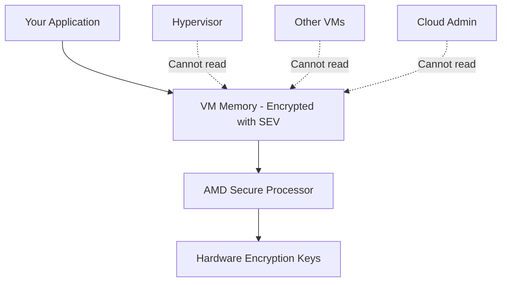

# How to Use Confidential VMs to Encrypt Data in Use on Compute Engine

Author: [nawazdhandala](https://www.github.com/nawazdhandala)

Tags: GCP, Compute Engine, Confidential VMs, Encryption, Security

Description: Learn how to use GCP Confidential VMs to encrypt data in use with hardware-based memory encryption, protecting sensitive workloads from even the cloud provider.

---

Encrypting data at rest and data in transit is standard practice. But what about data in use - the data sitting in your VM's memory while your application processes it? Traditional VMs expose this data in plaintext in RAM, which means it could theoretically be accessed by a compromised hypervisor, a rogue administrator, or certain hardware-level attacks.

Confidential VMs on GCP solve this by encrypting your VM's memory using hardware-based encryption. The encryption keys are generated and managed by the CPU itself, and even Google cannot access them. Let me show you how to set this up.

## How Confidential VMs Work

Confidential VMs use AMD SEV (Secure Encrypted Virtualization) or AMD SEV-SNP technology, depending on the machine type:

- **AMD SEV**: Available on N2D machine types. Encrypts each VM's memory with a unique key managed by the AMD Secure Processor.
- **AMD SEV-SNP**: Available on C2D and N2D machine types. Adds integrity protection on top of encryption, preventing memory replay attacks.

The key insight is that encryption and decryption happen in the CPU hardware itself. The hypervisor, host OS, and even other VMs on the same physical server cannot read your VM's memory.



## Creating a Confidential VM

Creating a Confidential VM is just a matter of adding the `--confidential-compute` flag:

```bash
# Create a Confidential VM using N2D machine type (AMD SEV)
gcloud compute instances create my-confidential-vm \
    --zone=us-central1-a \
    --machine-type=n2d-standard-4 \
    --image-family=debian-12 \
    --image-project=debian-cloud \
    --confidential-compute \
    --maintenance-policy=TERMINATE
```

A few important points:

- **Machine type**: Confidential VMs require AMD-based machine types (N2D, C2D). Intel-based types are not supported.
- **Maintenance policy**: Must be set to `TERMINATE` because live migration is not possible with encrypted memory.
- **No additional cost for SEV**: The base Confidential VM feature (AMD SEV) does not have an extra charge beyond the N2D machine cost.

## Using AMD SEV-SNP for Stronger Protection

AMD SEV-SNP adds memory integrity protection on top of encryption. To use it:

```bash
# Create a Confidential VM with AMD SEV-SNP
gcloud compute instances create my-snp-vm \
    --zone=us-central1-a \
    --machine-type=n2d-standard-4 \
    --image-family=debian-12 \
    --image-project=debian-cloud \
    --confidential-compute-type=SEV_SNP \
    --maintenance-policy=TERMINATE
```

SEV-SNP provides:
- Memory encryption (same as SEV)
- Memory integrity protection (prevents tampering with encrypted memory)
- Attestation (cryptographic proof of what is running in the VM)

## Instance Templates for Confidential VMs

For managed instance groups:

```bash
# Create an instance template for Confidential VMs
gcloud compute instance-templates create confidential-template \
    --machine-type=n2d-standard-4 \
    --image-family=debian-12 \
    --image-project=debian-cloud \
    --confidential-compute \
    --maintenance-policy=TERMINATE
```

## Terraform Configuration

```hcl
# Confidential VM with AMD SEV
resource "google_compute_instance" "confidential" {
  name         = "my-confidential-vm"
  machine_type = "n2d-standard-4"
  zone         = "us-central1-a"

  boot_disk {
    initialize_params {
      image = "debian-cloud/debian-12"
    }
  }

  network_interface {
    network = "default"
    access_config {}
  }

  confidential_instance_config {
    enable_confidential_compute = true
  }

  scheduling {
    on_host_maintenance = "TERMINATE"
    automatic_restart   = true
  }
}

# Confidential VM instance template for MIGs
resource "google_compute_instance_template" "confidential" {
  name_prefix  = "confidential-"
  machine_type = "n2d-standard-4"

  disk {
    source_image = "debian-cloud/debian-12"
    auto_delete  = true
    boot         = true
    disk_type    = "pd-ssd"
  }

  network_interface {
    network = "default"
  }

  confidential_instance_config {
    enable_confidential_compute = true
  }

  scheduling {
    on_host_maintenance = "TERMINATE"
    automatic_restart   = true
  }

  lifecycle {
    create_before_destroy = true
  }
}
```

## Verifying Confidential Computing is Active

From inside the VM, you can verify that AMD SEV is active:

```bash
# Check for SEV support in the kernel log
sudo dmesg | grep -i sev
```

You should see output like:

```
AMD Memory Encryption Features active: SEV
```

You can also check the CPU flags:

```bash
# Verify AMD SEV is enabled at the CPU level
grep -o 'sev[a-z_]*' /proc/cpuinfo | sort -u
```

From outside the VM:

```bash
# Verify Confidential Computing is enabled on the instance
gcloud compute instances describe my-confidential-vm \
    --zone=us-central1-a \
    --format="value(confidentialInstanceConfig)"
```

## Use Cases for Confidential VMs

Confidential VMs are not just a theoretical security improvement. Here are real scenarios where they matter:

**Healthcare and HIPAA**: Processing patient data with memory encryption adds a layer of protection that auditors appreciate. Even if the underlying infrastructure were compromised, the data in memory remains encrypted.

**Financial Services**: Processing credit card numbers, bank account details, or trading algorithms with the assurance that the data cannot be extracted from memory.

**Multi-Tenant Platforms**: If you run a platform where different customers' data is processed on shared infrastructure, Confidential VMs provide hardware-level isolation between tenants.

**Key Management**: Running your own key management or HSM emulation where the cryptographic material must be protected even from the cloud provider.

**Machine Learning on Sensitive Data**: Training models on sensitive datasets (medical records, financial data) while ensuring the training data is never exposed in plaintext memory.

## Performance Considerations

Memory encryption does have a performance cost, but it is smaller than you might expect:

- **CPU overhead**: AMD SEV adds roughly 2-6% overhead for most workloads, depending on memory access patterns.
- **Memory-intensive workloads**: Applications that do heavy memory operations (databases, in-memory caches) may see slightly higher overhead.
- **I/O workloads**: Disk and network I/O are not significantly affected since the encryption is at the memory level.

For most applications, the performance difference is negligible and well worth the security benefit.

## Combining with Other Security Features

Confidential VMs work well alongside other GCP security features:

```bash
# Create a Confidential VM with Shielded VM and Customer-Managed Encryption Key
gcloud compute instances create max-security-vm \
    --zone=us-central1-a \
    --machine-type=n2d-standard-4 \
    --image-family=debian-12 \
    --image-project=debian-cloud \
    --confidential-compute \
    --shielded-secure-boot \
    --shielded-vtpm \
    --shielded-integrity-monitoring \
    --maintenance-policy=TERMINATE \
    --boot-disk-kms-key=projects/my-project/locations/us-central1/keyRings/my-keyring/cryptoKeys/my-key
```

This gives you:
- **Memory encryption** (Confidential Computing)
- **Boot integrity** (Shielded VM)
- **Disk encryption with your own keys** (CMEK)

## Attestation

For workloads that need to prove they are running in a Confidential VM (zero-trust architectures, regulated industries), you can use attestation:

```bash
# Install the go-tpm-tools for attestation
# This allows your application to generate an attestation report
# that cryptographically proves it is running in a Confidential VM

# From inside the Confidential VM
sudo apt-get install -y golang
go install github.com/google/go-tpm-tools/cmd/attest-tool@latest

# Generate an attestation report
~/go/bin/attest-tool
```

The attestation report can be verified by a remote party to confirm that:
- The VM is running on AMD SEV-enabled hardware
- The VM has not been tampered with
- The expected software is loaded

## Organization Policies

Enforce Confidential Computing across your organization:

```bash
# Require Confidential Computing for all new VMs
gcloud resource-manager org-policies enable-enforce \
    compute.restrictNonConfidentialComputing \
    --organization=ORGANIZATION_ID
```

This prevents anyone from creating VMs without Confidential Computing enabled.

## Wrapping Up

Confidential VMs close the last major gap in data encryption - protecting data while it is being processed. With hardware-based memory encryption, even a compromised hypervisor or a rogue cloud administrator cannot access your data. The setup is simple (one flag), the performance overhead is minimal (2-6%), and the security improvement is substantial. If you are processing sensitive data on GCP, Confidential VMs should be on your shortlist. Combined with Shielded VMs and customer-managed encryption keys, you get end-to-end protection for your data at rest, in transit, and in use.
