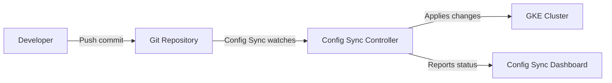

# How to Use Config Sync to Implement GitOps for GKE Cluster Configuration Management

Author: [nawazdhandala](https://www.github.com/nawazdhandala)

Tags: GCP, GKE, Kubernetes, GitOps, Config Sync, Configuration Management

Description: A hands-on guide to implementing GitOps on GKE using Config Sync to keep your cluster configuration in sync with a Git repository as the single source of truth.

---

Managing Kubernetes configuration manually - applying YAML files with kubectl, hoping everyone remembers to commit their changes, tracking down who changed what and when - does not scale. Once you have more than a couple of clusters or a handful of people making changes, configuration drift becomes inevitable. Someone applies a hotfix directly to the cluster and forgets to update the repo. Or the repo gets updated but nobody applies it. Either way, what is in the cluster does not match what is in Git.

Config Sync solves this by continuously syncing your cluster state with a Git repository. You commit changes to Git, and Config Sync automatically applies them to your clusters. No manual kubectl apply, no drift, and full audit history through Git commits. This is GitOps.

## How Config Sync Works

Config Sync runs as a controller inside your GKE cluster. It watches a Git repository (or an OCI image, or a Helm chart) and reconciles the cluster state to match what is in the repo.



If someone manually changes something in the cluster that differs from Git, Config Sync reverts it. Git is the source of truth, always.

## Prerequisites

- A GKE cluster with GKE Enterprise or Config Sync standalone
- A Git repository (GitHub, GitLab, Cloud Source Repositories, Bitbucket)
- The Fleet API enabled

```bash
# Enable required APIs
gcloud services enable \
  container.googleapis.com \
  gkehub.googleapis.com \
  anthosconfigmanagement.googleapis.com
```

## Step 1: Enable Config Sync on the Cluster

First, register your cluster with the fleet, then enable Config Sync.

```bash
# Register the cluster with the fleet
gcloud container fleet memberships register my-cluster \
  --gke-cluster us-central1/my-cluster \
  --enable-workload-identity

# Enable Config Management (which includes Config Sync)
gcloud container fleet config-management apply \
  --membership my-cluster \
  --config config-management.yaml
```

Create the Config Management configuration file.

```yaml
# config-management.yaml
apiVersion: configmanagement.gke.io/v1
kind: ConfigManagement
metadata:
  name: config-management
spec:
  sourceFormat: unstructured
  git:
    syncRepo: https://github.com/your-org/cluster-config.git
    syncBranch: main
    secretType: token  # or ssh, gcpserviceaccount, etc.
    policyDir: clusters/my-cluster
  # Enable Policy Controller for additional policy enforcement
  policyController:
    enabled: true
```

Alternatively, enable it through the gcloud CLI directly.

```bash
# Enable Config Sync via gcloud
gcloud container fleet config-management apply \
  --membership my-cluster \
  --config - <<EOF
apiVersion: configmanagement.gke.io/v1
kind: ConfigManagement
metadata:
  name: config-management
spec:
  sourceFormat: unstructured
  git:
    syncRepo: https://github.com/your-org/cluster-config.git
    syncBranch: main
    secretType: token
    policyDir: clusters/my-cluster
EOF
```

## Step 2: Set Up Git Authentication

Config Sync needs read access to your Git repo. The method depends on where your repo is hosted.

### For GitHub with a Personal Access Token

```bash
# Create a Kubernetes secret with the Git token
kubectl create secret generic git-creds \
  --namespace config-management-system \
  --from-literal=username=your-github-username \
  --from-literal=token=ghp_your_personal_access_token
```

### For Cloud Source Repositories

```bash
# Use GCP service account authentication (no token needed)
# The cluster's service account needs Source Reader access
gcloud projects add-iam-policy-binding YOUR_PROJECT_ID \
  --member "serviceAccount:YOUR_PROJECT_ID.svc.id.goog[config-management-system/root-reconciler]" \
  --role "roles/source.reader"
```

## Step 3: Structure Your Git Repository

Organize your repo with a clear structure. I recommend the unstructured format, which mirrors how you would normally organize Kubernetes manifests.

```
cluster-config/
  clusters/
    my-cluster/
      namespaces/
        production/
          namespace.yaml
          deployments/
            api-server.yaml
            web-frontend.yaml
          services/
            api-service.yaml
            frontend-service.yaml
          network-policies/
            default-deny.yaml
            allow-frontend-to-api.yaml
        staging/
          namespace.yaml
          deployments/
            api-server.yaml
          services/
            api-service.yaml
      cluster-scoped/
        rbac/
          cluster-roles.yaml
          cluster-role-bindings.yaml
        resource-quotas/
          production-quota.yaml
          staging-quota.yaml
```

## Step 4: Add Configuration to the Repository

Create your Kubernetes manifests in the repo. Here is an example.

```yaml
# clusters/my-cluster/namespaces/production/namespace.yaml
apiVersion: v1
kind: Namespace
metadata:
  name: production
  labels:
    env: production
    managed-by: config-sync
---
# clusters/my-cluster/namespaces/production/deployments/api-server.yaml
apiVersion: apps/v1
kind: Deployment
metadata:
  name: api-server
  namespace: production
  labels:
    app: api-server
    managed-by: config-sync
spec:
  replicas: 3
  selector:
    matchLabels:
      app: api-server
  template:
    metadata:
      labels:
        app: api-server
    spec:
      containers:
        - name: api
          image: us-docker.pkg.dev/YOUR_PROJECT_ID/my-repo/api-server:v1.2.3
          ports:
            - containerPort: 8080
          resources:
            requests:
              cpu: "250m"
              memory: "512Mi"
---
# clusters/my-cluster/namespaces/production/network-policies/default-deny.yaml
apiVersion: networking.k8s.io/v1
kind: NetworkPolicy
metadata:
  name: default-deny
  namespace: production
spec:
  podSelector: {}
  policyTypes:
    - Ingress
    - Egress
```

Commit and push these files to your repo.

```bash
cd cluster-config
git add .
git commit -m "Add production namespace configuration"
git push origin main
```

## Step 5: Verify Sync Status

Check that Config Sync has picked up your changes and applied them.

```bash
# Check Config Sync status
gcloud container fleet config-management status \
  --membership my-cluster

# Or check via kubectl
kubectl get rootsync root-sync -n config-management-system -o yaml

# Check for sync errors
kubectl -n config-management-system logs deployment/root-reconciler
```

You should see output indicating the sync is successful and showing the latest commit hash.

## Multi-Cluster Configuration

Config Sync really shines when managing multiple clusters. You can have shared configuration and cluster-specific overrides.

```
cluster-config/
  base/
    # Shared configuration applied to all clusters
    namespaces/
      monitoring/
        namespace.yaml
        prometheus-deployment.yaml
    cluster-scoped/
      common-rbac.yaml
  clusters/
    cluster-us/
      # US-specific overrides
      kustomization.yaml
    cluster-eu/
      # EU-specific overrides
      kustomization.yaml
```

Register each cluster with its own policyDir.

```bash
# Cluster US syncs from clusters/cluster-us
gcloud container fleet config-management apply \
  --membership cluster-us \
  --config - <<EOF
apiVersion: configmanagement.gke.io/v1
kind: ConfigManagement
metadata:
  name: config-management
spec:
  sourceFormat: unstructured
  git:
    syncRepo: https://github.com/your-org/cluster-config.git
    syncBranch: main
    secretType: token
    policyDir: clusters/cluster-us
EOF

# Cluster EU syncs from clusters/cluster-eu
gcloud container fleet config-management apply \
  --membership cluster-eu \
  --config - <<EOF
apiVersion: configmanagement.gke.io/v1
kind: ConfigManagement
metadata:
  name: config-management
spec:
  sourceFormat: unstructured
  git:
    syncRepo: https://github.com/your-org/cluster-config.git
    syncBranch: main
    secretType: token
    policyDir: clusters/cluster-eu
EOF
```

## Drift Prevention

Config Sync continuously reconciles. If someone manually changes a resource that is managed by Config Sync, it gets reverted.

```bash
# Manually change a deployment (Config Sync will revert this)
kubectl -n production scale deployment api-server --replicas=10

# Wait a few seconds... Config Sync reverts it back to 3 (from Git)
kubectl -n production get deployment api-server
# READY: 3/3
```

This is a core feature, not a bug. The Git repo is the source of truth. If you need to change replicas, commit the change to Git.

## Using Kustomize with Config Sync

Config Sync supports Kustomize natively, which is great for managing environment-specific variations.

```yaml
# base/kustomization.yaml
apiVersion: kustomize.config.k8s.io/v1beta1
kind: Kustomization
resources:
  - deployment.yaml
  - service.yaml
---
# overlays/production/kustomization.yaml
apiVersion: kustomize.config.k8s.io/v1beta1
kind: Kustomization
resources:
  - ../../base
patchesStrategicMerge:
  - deployment-patch.yaml
---
# overlays/production/deployment-patch.yaml
apiVersion: apps/v1
kind: Deployment
metadata:
  name: api-server
spec:
  replicas: 5  # More replicas in production
```

## Monitoring and Alerting

Set up monitoring for Config Sync to catch sync failures early.

```bash
# Check sync status across all clusters
gcloud container fleet config-management status

# View Config Sync metrics in Cloud Monitoring
# Metric: configsync.googleapis.com/reconciler/reconcile_duration
# Metric: configsync.googleapis.com/reconciler/last_sync_timestamp

# Set up an alert for sync failures
gcloud monitoring policies create \
  --notification-channels CHANNEL_ID \
  --condition-display-name "Config Sync Failure" \
  --condition-filter 'metric.type="configsync.googleapis.com/reconciler/error_count" AND resource.type="k8s_container"'
```

## CI/CD Integration

Pair Config Sync with a CI/CD pipeline that validates changes before they are merged to the main branch.

```yaml
# .github/workflows/validate-config.yaml
name: Validate Cluster Config
on:
  pull_request:
    branches: [main]

jobs:
  validate:
    runs-on: ubuntu-latest
    steps:
      - uses: actions/checkout@v4

      - name: Install kubeval
        run: |
          wget https://github.com/instrumenta/kubeval/releases/latest/download/kubeval-linux-amd64.tar.gz
          tar xf kubeval-linux-amd64.tar.gz
          sudo mv kubeval /usr/local/bin/

      - name: Validate Kubernetes manifests
        run: |
          find clusters/ -name "*.yaml" -exec kubeval {} \;

      - name: Dry-run with nomos
        run: |
          nomos vet --source-format unstructured --path clusters/my-cluster
```

## Wrapping Up

Config Sync turns your Git repository into the single source of truth for cluster configuration. Changes go through pull requests with review, validation, and audit trails. Drift is automatically corrected. Multi-cluster deployments are managed from one place. If you are managing GKE clusters at any meaningful scale, GitOps with Config Sync eliminates an entire category of configuration management problems. The initial setup takes some thought around repository structure and authentication, but once running, the day-to-day workflow is simple: commit to Git, and Config Sync handles the rest.
