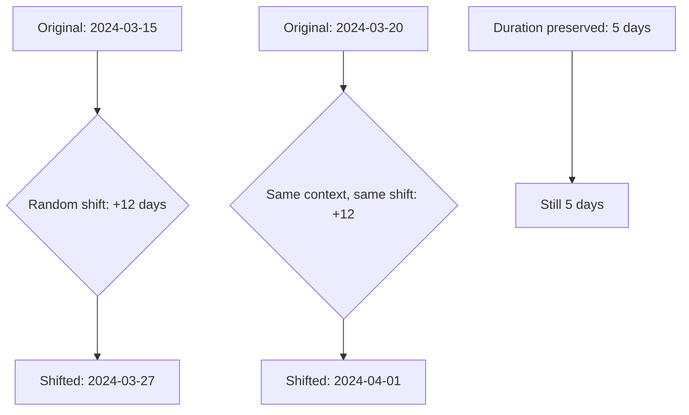

# How to Use Date Shifting for De-Identification in Cloud DLP

Author: [nawazdhandala](https://www.github.com/nawazdhandala)

Tags: GCP, Cloud DLP, De-Identification, Date Shifting, Privacy

Description: Learn how to use Cloud DLP date shifting to de-identify date fields while preserving temporal relationships and analytical utility in your datasets.

---

Dates are one of the trickiest data elements to de-identify. Birth dates, admission dates, appointment dates, transaction dates - they are everywhere in healthcare, financial, and customer data. Simple redaction destroys analytical value. Replacing with fixed values makes time-series analysis impossible. Generalizing to just the year loses too much precision.

Date shifting is the sweet spot. It moves each date forward or backward by a random number of days within a range you specify. A birth date of March 15, 1985 might become April 2, 1985 or February 28, 1985. The shifted date is realistic, preserves approximate temporal relationships, and is not directly recoverable from the shifted value alone.

Cloud DLP has built-in date shifting that you can apply to individual fields or use consistently across related records. In this post, I will show you how to set it up.

## How Date Shifting Works

The mechanics are simple:

1. You specify a range (e.g., -30 to +30 days)
2. For each date value, DLP picks a random shift within that range
3. The original date is moved by that many days
4. The shifted date replaces the original

The key decision is whether the shift is consistent per record. If a patient has an admission date and a discharge date, you probably want both shifted by the same amount so the length of stay is preserved. Cloud DLP supports this through a context field - all dates in records with the same context value get the same shift.


```mermaid
flowchart TD
    A[Original: 2024-03-15] --> B{Random shift: +12 days}
    B --> C[Shifted: 2024-03-27]

    D[Original: 2024-03-20] --> E{Same context, same shift: +12}
    E --> F[Shifted: 2024-04-01]

    G["Duration preserved: 5 days"] --> H["Still 5 days"]
```

## Step 1: Basic Date Shifting

Here is a simple example that shifts dates in text content:

```python
from google.cloud import dlp_v2

def date_shift_text(project_id, text, lower_bound=-30, upper_bound=30):
    """Shift date values in text by a random number of days."""

    dlp_client = dlp_v2.DlpServiceClient()

    # Configure date shifting
    deidentify_config = {
        "info_type_transformations": {
            "transformations": [
                {
                    "info_types": [{"name": "DATE"}, {"name": "DATE_OF_BIRTH"}],
                    "primitive_transformation": {
                        "date_shift_config": {
                            "upper_bound_days": upper_bound,
                            "lower_bound_days": lower_bound,
                        }
                    },
                }
            ]
        }
    }

    # Inspect for date values
    inspect_config = {
        "info_types": [{"name": "DATE"}, {"name": "DATE_OF_BIRTH"}],
    }

    item = {"value": text}
    parent = f"projects/{project_id}/locations/global"

    response = dlp_client.deidentify_content(
        request={
            "parent": parent,
            "deidentify_config": deidentify_config,
            "inspect_config": inspect_config,
            "item": item,
        }
    )

    print(f"Original:  {text}")
    print(f"Shifted:   {response.item.value}")

    return response.item.value

# Test it

date_shift_text(
    "my-project",
    "Patient DOB: 1985-03-15, Admission: 2024-01-10, Discharge: 2024-01-17"
)
```

## Step 2: Consistent Date Shifting with Context

For structured data where you need consistent shifts across related dates, use a context field. Records with the same context value get the same random shift.

```python
import base64

from google.cloud import dlp_v2

def date_shift_with_context(project_id, wrapped_key, kms_key_name):
    """Shift dates consistently per patient using a context field."""

    dlp_client = dlp_v2.DlpServiceClient()

    def date_value(value):
        year, month, day = map(int, value.split("-"))
        return {"date_value": {"year": year, "month": month, "day": day}}

    # Sample patient records as a DLP table
    table = {
        "headers": [
            {"name": "patient_id"},
            {"name": "name"},
            {"name": "birth_date"},
            {"name": "admission_date"},
            {"name": "discharge_date"},
        ],
        "rows": [
            {
                "values": [
                    {"string_value": "P001"},
                    {"string_value": "John Smith"},
                    date_value("1985-03-15"),
                    date_value("2024-01-10"),
                    date_value("2024-01-17"),
                ]
            },
            {
                "values": [
                    {"string_value": "P001"},
                    {"string_value": "John Smith"},
                    date_value("1985-03-15"),
                    date_value("2024-06-05"),
                    date_value("2024-06-08"),
                ]
            },
            {
                "values": [
                    {"string_value": "P002"},
                    {"string_value": "Jane Doe"},
                    date_value("1990-07-22"),
                    date_value("2024-02-14"),
                    date_value("2024-02-20"),
                ]
            },
        ],
    }

    # Configure date shifting with a context field
    # All records with the same patient_id get the same shift
    date_shift_config = {
        "upper_bound_days": 30,
        "lower_bound_days": -30,
        # Context field determines consistent shifting
        "context": {"name": "patient_id"},
        # Crypto key ensures the shift is deterministic for the same context
        "crypto_key": {
            "kms_wrapped": {
                "wrapped_key": base64.b64decode(wrapped_key),
                "crypto_key_name": kms_key_name,
            }
        },
    }

    # Apply date shifting to specific date columns
    deidentify_config = {
        "record_transformations": {
            "field_transformations": [
                {
                    "fields": [
                        {"name": "birth_date"},
                        {"name": "admission_date"},
                        {"name": "discharge_date"},
                    ],
                    "primitive_transformation": {
                        "date_shift_config": date_shift_config
                    },
                },
                {
                    # Also redact the name while we are at it
                    "fields": [{"name": "name"}],
                    "primitive_transformation": {
                        "replace_config": {
                            "new_value": {"string_value": "[REDACTED]"}
                        }
                    },
                },
            ]
        }
    }

    item = {"table": table}
    parent = f"projects/{project_id}/locations/global"

    response = dlp_client.deidentify_content(
        request={
            "parent": parent,
            "deidentify_config": deidentify_config,
            "item": item,
        }
    )

    # Print the results
    result = response.item.table
    print("De-identified records:")
    for row in result.rows:
        values = [
            v.string_value
            or f"{v.date_value.year:04d}-{v.date_value.month:02d}-{v.date_value.day:02d}"
            for v in row.values
        ]
        print(f"  {values}")

    return response

# Run with your base64-encoded KMS-wrapped key
kms_key = "projects/my-project/locations/global/keyRings/dlp-keyring/cryptoKeys/dlp-key"
date_shift_with_context("my-project", "YOUR_WRAPPED_KEY", kms_key)
```

The important thing here is the `context` field. Both records for patient P001 will have their dates shifted by the same amount. So if admission was January 10 and discharge was January 17 (7-day stay), the shifted dates will still be 7 days apart. But patient P002 will get a different random shift.

The `crypto_key` makes the shift deterministic - running the same data through the same configuration always produces the same shifts. This is critical for reproducibility and for processing data in batches.

## Step 3: Date Shifting BigQuery Data in Batches

Sensitive Data Protection inspection jobs can scan BigQuery tables, but the de-identification action that creates de-identified copies is for Cloud Storage. For BigQuery data, call `deidentify_content` from a pipeline or remote function, then write the transformed rows to a destination table.

```python
import base64
from datetime import date

from google.cloud import bigquery, dlp_v2

def date_shift_bigquery_table(project_id, source_table, destination_table,
                              wrapped_key, kms_key_name, batch_size=500):
    """Date-shift selected BigQuery columns and write rows to another table."""

    dlp_client = dlp_v2.DlpServiceClient()
    bq_client = bigquery.Client(project=project_id)

    date_fields = ["birth_date", "admission_date", "discharge_date",
                   "appointment_date"]

    date_shift_config = {
        "upper_bound_days": 100,
        "lower_bound_days": -100,
        "context": {"name": "patient_id"},
        "crypto_key": {
            "kms_wrapped": {
                "wrapped_key": base64.b64decode(wrapped_key),
                "crypto_key_name": kms_key_name,
            }
        },
    }

    deidentify_config = {
        "record_transformations": {
            "field_transformations": [
                {
                    "fields": [{"name": f} for f in date_fields],
                    "primitive_transformation": {
                        "date_shift_config": date_shift_config
                    },
                }
            ],
        }
    }

    def to_dlp_value(value):
        if isinstance(value, date):
            return {
                "date_value": {
                    "year": value.year,
                    "month": value.month,
                    "day": value.day,
                }
            }
        return {"string_value": "" if value is None else str(value)}

    def from_dlp_value(value):
        if value.date_value.year:
            return (
                f"{value.date_value.year:04d}-"
                f"{value.date_value.month:02d}-"
                f"{value.date_value.day:02d}"
            )
        return value.string_value

    columns = ["patient_id", "name"] + date_fields
    rows = bq_client.query(
        f"SELECT {', '.join(columns)} FROM `{source_table}`"
    ).result()

    def deidentify_batch(dlp_rows):
        table = {
            "headers": [{"name": column} for column in columns],
            "rows": dlp_rows,
        }

        parent = f"projects/{project_id}/locations/global"
        response = dlp_client.deidentify_content(
            request={
                "parent": parent,
                "deidentify_config": deidentify_config,
                "item": {"table": table},
            }
        )

        return [
            {
                column: from_dlp_value(value)
                for column, value in zip(columns, row.values)
            }
            for row in response.item.table.rows
        ]

    output_rows = []
    batch = []
    for row in rows:
        batch.append({
            "values": [to_dlp_value(row[column]) for column in columns]
        })
        if len(batch) == batch_size:
            output_rows.extend(deidentify_batch(batch))
            batch = []

    if batch:
        output_rows.extend(deidentify_batch(batch))

    job_config = bigquery.LoadJobConfig(
        write_disposition=bigquery.WriteDisposition.WRITE_TRUNCATE
    )
    load_job = bq_client.load_table_from_json(
        output_rows,
        destination_table,
        job_config=job_config,
    )
    load_job.result()

    print(f"Wrote {len(output_rows)} de-identified rows to {destination_table}")
```

## Step 4: Choosing the Right Shift Range

The shift range is a trade-off between privacy and utility:

| Range | Privacy | Utility | Good For |
|-------|---------|---------|----------|
| 1-7 days | Low | High | Internal analytics where exact dates are not sensitive |
| 30 days | Medium | Medium | Most healthcare and financial use cases |
| 100 days | High | Lower | Research datasets shared externally |
| 365 days | Very high | Low | Highly sensitive data, rare diseases |

For HIPAA Safe Harbor compliance, dates directly related to an individual generally must be reduced to the year, not merely shifted. Date shifting can be useful in healthcare datasets, but HIPAA compliance depends on your de-identification method and risk analysis.

## Step 5: Verify Temporal Relationships

After date shifting, verify that temporal relationships are preserved:

```sql
-- Check that discharge is always after admission (relationship preserved)
SELECT
  patient_id,
  admission_date,
  discharge_date,
  DATE_DIFF(discharge_date, admission_date, DAY) as length_of_stay
FROM
  `my-project.clean_data.patients_deidentified`
WHERE
  discharge_date < admission_date
-- This should return zero rows if context-based shifting worked correctly
```

```sql
-- Compare length of stay distributions before and after shifting
-- They should be identical
SELECT
  'original' as dataset,
  AVG(DATE_DIFF(discharge_date, admission_date, DAY)) as avg_los,
  MIN(DATE_DIFF(discharge_date, admission_date, DAY)) as min_los,
  MAX(DATE_DIFF(discharge_date, admission_date, DAY)) as max_los
FROM `my-project.raw_data.patients`
UNION ALL
SELECT
  'shifted' as dataset,
  AVG(DATE_DIFF(discharge_date, admission_date, DAY)) as avg_los,
  MIN(DATE_DIFF(discharge_date, admission_date, DAY)) as min_los,
  MAX(DATE_DIFF(discharge_date, admission_date, DAY)) as max_los
FROM `my-project.clean_data.patients_deidentified`
```

## Common Pitfalls

**Forgetting the context field.** Without a context field, each date in a record gets a different random shift. Admission might shift forward 20 days while discharge shifts backward 10 days, making the patient appear to be discharged before admission.

**Losing the crypto key.** If you use a context field with a crypto key and then lose access to that key, you cannot reproduce the same shifts. This matters if you need to add new data to an existing de-identified dataset - it needs the same key to get consistent shifts.

**Date boundaries.** Shifting a date near the edge of a year can push it into the next or previous year. This is usually fine but can affect year-based partitioning or reporting.

**Mixed date formats.** Cloud DLP detects dates in various formats (YYYY-MM-DD, MM/DD/YYYY, etc.), but the output format may not match the input. Test with your specific data to make sure downstream systems can parse the shifted dates.

## Summary

Date shifting is the go-to de-identification method for temporal data. It preserves the analytical utility of dates - time intervals, seasonal patterns, ordering - while making it harder to identify individuals from their specific dates. Use context fields and crypto keys for consistent shifting across related records, choose a shift range that balances privacy and utility for your use case, and always verify that temporal relationships are preserved after shifting.
