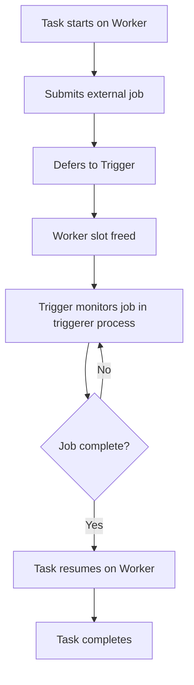

# How to Use Deferrable Operators in Cloud Composer 2 to Reduce Worker Resource Usage

Author: [nawazdhandala](https://www.github.com/nawazdhandala)

Tags: GCP, Cloud Composer, Airflow, Deferrable Operators, Resource Optimization

Description: Learn how to use deferrable operators in Cloud Composer 2 to free up Airflow worker slots while waiting for long-running tasks, reducing resource usage and costs.

---

Most Airflow tasks spend a large portion of their time waiting. A BigQuery job might take 30 minutes, a Dataflow pipeline might run for hours, and a sensor might wait all day for a file to arrive. During all that waiting, the task occupies a worker slot, consuming memory and preventing other tasks from running. Deferrable operators solve this by releasing the worker slot while waiting and only reclaiming it when the external work is actually done.

I switched a Cloud Composer environment from standard operators to deferrable ones and was able to reduce the worker count from 6 to 2. The tasks were mostly waiting for BigQuery and Dataflow jobs, and deferrable operators let those worker slots serve other tasks during the wait periods.

## How Deferrable Operators Work

A standard operator follows this pattern: start the external job, then poll in a loop until it completes. The worker thread sleeps between polls but keeps occupying the slot.

A deferrable operator follows a different pattern: start the external job, then defer to a trigger. The task is suspended, and the worker slot is freed. A lightweight trigger process monitors the external job. When the job completes, the trigger fires, and the task resumes on any available worker.



The triggerer is a separate process in Cloud Composer 2 that runs many triggers concurrently using asyncio. One triggerer process can handle hundreds of waiting tasks using minimal resources.

## Enabling Deferrable Operators in Cloud Composer 2

Cloud Composer 2 supports deferrable operators out of the box. The triggerer runs automatically when you have deferrable tasks.

Check that your Cloud Composer 2 environment has the triggerer enabled:

```bash
# Verify your Composer 2 environment configuration
gcloud composer environments describe my-composer-env \
  --location=us-central1 \
  --format="yaml(config.workloadsConfig)"

# Update the triggerer configuration if needed
# Increase triggerer resources for environments with many deferrable tasks
gcloud composer environments update my-composer-env \
  --location=us-central1 \
  --triggerer-cpu=1 \
  --triggerer-memory=2 \
  --triggerer-count=1
```

## Using Built-in Deferrable Operators

Many standard operators have deferrable versions. Simply set `deferrable=True`:

```python
# dags/deferrable_bigquery.py
# BigQuery operators in deferrable mode free worker slots
# while waiting for queries to complete
from datetime import datetime
from airflow import DAG
from airflow.providers.google.cloud.operators.bigquery import (
    BigQueryInsertJobOperator,
    BigQueryCheckOperator,
)

default_args = {
    "owner": "data-engineering",
    "start_date": datetime(2026, 1, 1),
}

with DAG(
    dag_id="deferrable_bigquery_pipeline",
    default_args=default_args,
    schedule_interval="@daily",
    catchup=False,
) as dag:

    # This operator submits the BigQuery job, then defers
    # The worker slot is freed while BigQuery processes the query
    run_query = BigQueryInsertJobOperator(
        task_id="run_daily_aggregation",
        configuration={
            "query": {
                "query": """
                    SELECT
                        DATE(event_timestamp) AS event_date,
                        event_type,
                        COUNT(*) AS event_count,
                        COUNT(DISTINCT user_id) AS unique_users
                    FROM `my-project.raw_data.events`
                    WHERE DATE(event_timestamp) = '{{ ds }}'
                    GROUP BY 1, 2
                """,
                "useLegacySql": False,
                "destinationTable": {
                    "projectId": "my-project",
                    "datasetId": "analytics",
                    "tableId": "daily_events${{ ds_nodash }}",
                },
                "writeDisposition": "WRITE_TRUNCATE",
            }
        },
        deferrable=True,  # This is the key setting
    )

    # Data quality check, also deferrable
    check_quality = BigQueryCheckOperator(
        task_id="check_row_count",
        sql="""
            SELECT COUNT(*) > 0
            FROM `my-project.analytics.daily_events`
            WHERE event_date = '{{ ds }}'
        """,
        use_legacy_sql=False,
        deferrable=True,
    )

    run_query >> check_quality
```

## Deferrable Sensors

Sensors are the biggest beneficiaries of deferrable mode because they can wait for hours or even days:

```python
# dags/deferrable_sensors.py
# Sensors in deferrable mode do not waste worker slots while waiting
from datetime import datetime, timedelta
from airflow import DAG
from airflow.providers.google.cloud.sensors.gcs import (
    GCSObjectExistenceSensor,
    GCSObjectsWithPrefixExistenceSensor,
)
from airflow.providers.google.cloud.sensors.bigquery import (
    BigQueryTableExistenceSensor,
)
from airflow.operators.python import PythonOperator

default_args = {
    "owner": "data-engineering",
    "start_date": datetime(2026, 1, 1),
}

with DAG(
    dag_id="deferrable_sensors_pipeline",
    default_args=default_args,
    schedule_interval="@daily",
    catchup=False,
) as dag:

    # Wait for a file to appear in GCS
    # In deferrable mode, this does not occupy a worker while waiting
    wait_for_data = GCSObjectExistenceSensor(
        task_id="wait_for_input_file",
        bucket="my-data-bucket",
        object="incoming/{{ ds }}/data.parquet",
        timeout=86400,  # Wait up to 24 hours
        poke_interval=60,  # Check every 60 seconds
        deferrable=True,  # Worker slot freed between checks
    )

    # Wait for multiple files with a prefix
    wait_for_batch = GCSObjectsWithPrefixExistenceSensor(
        task_id="wait_for_batch_files",
        bucket="my-data-bucket",
        prefix="batch/{{ ds }}/",
        timeout=7200,
        poke_interval=120,
        deferrable=True,
    )

    # Wait for an upstream table to be populated
    wait_for_table = BigQueryTableExistenceSensor(
        task_id="wait_for_upstream_table",
        project_id="my-project",
        dataset_id="staging",
        table_id="preprocessed_{{ ds_nodash }}",
        timeout=3600,
        poke_interval=60,
        deferrable=True,
    )

    process = PythonOperator(
        task_id="process_data",
        python_callable=lambda: print("Processing data"),
    )

    [wait_for_data, wait_for_batch, wait_for_table] >> process
```

## Deferrable Dataflow and Dataproc Operators

Long-running compute jobs benefit greatly from deferrable mode:

```python
# dags/deferrable_compute.py
# Deferrable operators for Dataflow and Dataproc jobs
from datetime import datetime
from airflow import DAG
from airflow.providers.google.cloud.operators.dataflow import (
    DataflowStartFlexTemplateOperator,
)
from airflow.providers.google.cloud.operators.dataproc import (
    DataprocSubmitJobOperator,
)

default_args = {
    "owner": "data-engineering",
    "start_date": datetime(2026, 1, 1),
}

with DAG(
    dag_id="deferrable_compute_pipeline",
    default_args=default_args,
    schedule_interval="@daily",
    catchup=False,
) as dag:

    # Submit a Dataflow Flex Template job and defer
    # The worker slot is freed for the entire duration of the Dataflow job
    dataflow_job = DataflowStartFlexTemplateOperator(
        task_id="run_dataflow_pipeline",
        project_id="my-project",
        location="us-central1",
        body={
            "launchParameter": {
                "containerSpecGcsPath": "gs://my-bucket/templates/etl-template.json",
                "jobName": "daily-etl-{{ ds_nodash }}",
                "parameters": {
                    "inputDate": "{{ ds }}",
                },
                "environment": {
                    "tempLocation": "gs://my-bucket/temp",
                },
            }
        },
        deferrable=True,  # Free the worker while Dataflow runs
    )

    # Submit a Spark job to Dataproc and defer
    spark_job = DataprocSubmitJobOperator(
        task_id="run_spark_aggregation",
        project_id="my-project",
        region="us-central1",
        job={
            "pyspark_job": {
                "main_python_file_uri": "gs://my-bucket/scripts/aggregate.py",
                "args": ["--date={{ ds }}"],
            },
            "placement": {"cluster_name": "etl-cluster"},
        },
        deferrable=True,
    )

    dataflow_job >> spark_job
```

## Writing Custom Deferrable Operators

If you need a deferrable operator for a custom service, write your own:

```python
# plugins/custom_operators/deferrable_api_operator.py
# Custom deferrable operator that monitors an external API job
from airflow.models import BaseOperator
from airflow.triggers.base import BaseTrigger, TriggerEvent
from typing import Any, AsyncIterator
import asyncio
import aiohttp

class APIJobTrigger(BaseTrigger):
    """Trigger that monitors an external API job asynchronously."""

    def __init__(self, api_url: str, job_id: str, poll_interval: int = 30):
        super().__init__()
        self.api_url = api_url
        self.job_id = job_id
        self.poll_interval = poll_interval

    def serialize(self):
        """Serialize the trigger for storage between worker restarts."""
        return (
            "custom_operators.deferrable_api_operator.APIJobTrigger",
            {
                "api_url": self.api_url,
                "job_id": self.job_id,
                "poll_interval": self.poll_interval,
            },
        )

    async def run(self) -> AsyncIterator[TriggerEvent]:
        """Poll the API until the job completes."""
        async with aiohttp.ClientSession() as session:
            while True:
                async with session.get(
                    f"{self.api_url}/jobs/{self.job_id}/status"
                ) as response:
                    data = await response.json()
                    status = data.get("status")

                    if status == "completed":
                        yield TriggerEvent({"status": "success", "result": data})
                        return
                    elif status == "failed":
                        yield TriggerEvent({"status": "error", "error": data.get("error")})
                        return

                # Wait before polling again
                await asyncio.sleep(self.poll_interval)


class DeferrableAPIJobOperator(BaseOperator):
    """Operator that submits an API job and defers until completion."""

    def __init__(self, api_url: str, job_config: dict, **kwargs):
        super().__init__(**kwargs)
        self.api_url = api_url
        self.job_config = job_config

    def execute(self, context):
        """Submit the job and defer to the trigger."""
        import requests

        # Submit the job
        response = requests.post(
            f"{self.api_url}/jobs",
            json=self.job_config,
        )
        response.raise_for_status()
        job_id = response.json()["job_id"]

        self.log.info(f"Job submitted: {job_id}, deferring...")

        # Defer to the trigger - this frees the worker slot
        self.defer(
            trigger=APIJobTrigger(
                api_url=self.api_url,
                job_id=job_id,
                poll_interval=30,
            ),
            method_name="execute_complete",
        )

    def execute_complete(self, context, event: dict[str, Any]):
        """Called when the trigger fires, indicating job completion."""
        if event["status"] == "error":
            raise Exception(f"Job failed: {event['error']}")

        self.log.info(f"Job completed successfully: {event['result']}")
        return event["result"]
```

## Monitoring Deferrable Task Performance

Check how much you are saving by monitoring worker utilization:

```bash
# View the triggerer logs in Cloud Composer
gcloud composer environments run my-composer-env \
  --location=us-central1 \
  tasks list -- --all

# Check how many tasks are currently deferred
gcloud composer environments run my-composer-env \
  --location=us-central1 \
  tasks states-for-dag-run -- my_dag "2026-02-17"
```

## Comparing Resource Usage

Use Airflow's metrics to compare before and after:

```python
# dags/monitor_deferred_tasks.py
# DAG that reports on deferred task metrics
from datetime import datetime
from airflow import DAG
from airflow.operators.python import PythonOperator
from airflow.models import TaskInstance
from airflow.utils.session import provide_session

@provide_session
def report_deferred_stats(session=None, **context):
    """Report statistics about deferred tasks."""
    from sqlalchemy import func

    # Count tasks by state
    stats = (
        session.query(
            TaskInstance.state,
            func.count(TaskInstance.state),
        )
        .filter(TaskInstance.execution_date >= context["ds"])
        .group_by(TaskInstance.state)
        .all()
    )

    for state, count in stats:
        print(f"State: {state}, Count: {count}")

default_args = {
    "owner": "data-engineering",
    "start_date": datetime(2026, 1, 1),
}

with DAG(
    dag_id="monitor_deferred_tasks",
    default_args=default_args,
    schedule_interval="@hourly",
    catchup=False,
) as dag:

    report = PythonOperator(
        task_id="report_stats",
        python_callable=report_deferred_stats,
    )
```

## Summary

Deferrable operators in Cloud Composer 2 dramatically reduce worker resource usage by freeing worker slots while tasks wait for external jobs to complete. Enable them by setting `deferrable=True` on supported operators - BigQuery, Dataflow, Dataproc, and GCS sensors all support it. For custom integrations, write your own trigger and deferrable operator using asyncio for efficient polling. The triggerer process handles hundreds of deferred tasks with minimal overhead, so you can run more concurrent tasks with fewer workers. The result is lower Cloud Composer costs and better pipeline throughput without any changes to your pipeline logic.
