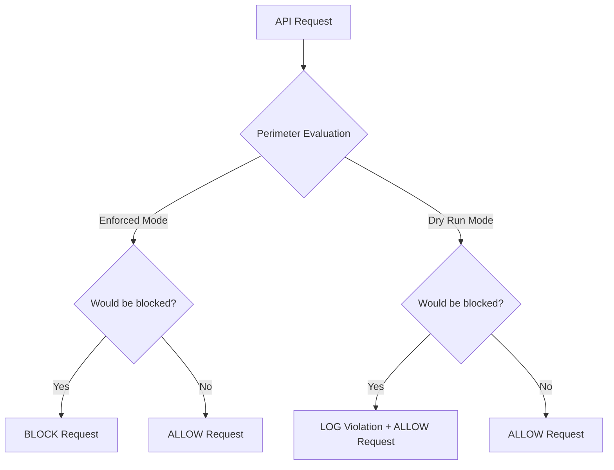

# How to Use Dry Run Mode to Test VPC Service Controls Before Enforcement

Author: [nawazdhandala](https://www.github.com/nawazdhandala)

Tags: GCP, VPC Service Controls, Dry Run, Security Testing, Cloud Security

Description: Learn how to use VPC Service Controls dry run mode to safely test perimeter configurations before enforcement, avoiding service disruptions and access issues.

---

Enforcing a VPC Service Controls perimeter without testing it first is like deploying code straight to production without staging. You might get lucky, but more likely you will break something important. Dry run mode exists specifically for this purpose - it simulates perimeter enforcement and logs what would be blocked, without actually blocking anything.

I have seen teams enforce perimeters that immediately broke their CI/CD pipelines, locked developers out of the Console, and disrupted critical data flows. All of that could have been caught in dry run first. Take the time to use it properly.

## How Dry Run Mode Works

When a perimeter is in dry run mode, every API call is evaluated against the perimeter rules, but violations are only logged, not enforced. The actual API call still succeeds. This gives you a window to see exactly what would break if you enforced the perimeter.



## Step 1: Create a Perimeter in Dry-Run Mode

You can create a brand new perimeter that only exists in dry run.

```bash
# Get your access policy ID
ACCESS_POLICY_ID=$(gcloud access-context-manager policies list \
  --organization=ORGANIZATION_ID \
  --format="value(name)")

# Create a dry-run-only perimeter
gcloud access-context-manager perimeters dry-run create test-perimeter \
  --perimeter-type=regular \
  --resources="projects/PROJECT_NUMBER_1,projects/PROJECT_NUMBER_2" \
  --restricted-services="bigquery.googleapis.com,storage.googleapis.com,cloudsql.googleapis.com" \
  --title="Test Perimeter - Dry Run" \
  --policy=$ACCESS_POLICY_ID
```

## Step 2: Add Dry-Run Config to an Existing Perimeter

If you already have an enforced perimeter and want to test changes before applying them, use the dry-run update command.

```bash
# Add new services to the dry-run config without changing enforcement
gcloud access-context-manager perimeters dry-run update my-perimeter \
  --add-restricted-services="spanner.googleapis.com,pubsub.googleapis.com" \
  --policy=$ACCESS_POLICY_ID
```

This keeps the existing enforced perimeter as-is but adds a dry-run configuration that includes the additional services. You can see what would happen if you restricted those services too.

## Step 3: Test Ingress and Egress Rules in Dry-Run

Before enforcing new ingress or egress rules, test them in dry-run.

```bash
# Apply ingress rules to dry-run configuration only
gcloud access-context-manager perimeters dry-run update my-perimeter \
  --set-ingress-policies=new-ingress-rules.yaml \
  --policy=$ACCESS_POLICY_ID

# Apply egress rules to dry-run configuration only
gcloud access-context-manager perimeters dry-run update my-perimeter \
  --set-egress-policies=new-egress-rules.yaml \
  --policy=$ACCESS_POLICY_ID
```

## Step 4: Monitor Dry-Run Violations

This is where the real value of dry run comes in. The audit logs tell you exactly what would be blocked.

```bash
# Query for dry-run violations
gcloud logging read \
  'protoPayload.metadata.@type="type.googleapis.com/google.cloud.audit.VpcServiceControlAuditMetadata" AND protoPayload.metadata.dryRun=true' \
  --limit=50 \
  --format="table(timestamp, protoPayload.authenticationInfo.principalEmail, protoPayload.methodName, protoPayload.metadata.violationReason)" \
  --project=my-project-id
```

For a more detailed view:

```bash
# Get full details on dry-run violations
gcloud logging read \
  'protoPayload.metadata.@type="type.googleapis.com/google.cloud.audit.VpcServiceControlAuditMetadata" AND protoPayload.metadata.dryRun=true' \
  --limit=10 \
  --format=json \
  --project=my-project-id
```

## Step 5: Analyze Violation Patterns

Export dry-run violations to BigQuery for deeper analysis.

```bash
# Create a log sink to export VPC SC violations to BigQuery
gcloud logging sinks create vpc-sc-dryrun-sink \
  bigquery.googleapis.com/projects/my-project-id/datasets/vpc_sc_analysis \
  --log-filter='protoPayload.metadata.@type="type.googleapis.com/google.cloud.audit.VpcServiceControlAuditMetadata" AND protoPayload.metadata.dryRun=true' \
  --project=my-project-id
```

Then query the data to understand patterns:

```sql
-- Find the most common violation sources
SELECT
  protopayload_auditlog.authenticationInfo.principalEmail AS identity,
  protopayload_auditlog.methodName AS method,
  COUNT(*) AS violation_count
FROM `my-project-id.vpc_sc_analysis.cloudaudit_googleapis_com_policy_*`
WHERE protopayload_auditlog.metadata.dryRun = TRUE
GROUP BY identity, method
ORDER BY violation_count DESC
LIMIT 20;
```

```sql
-- Find all unique services that would be blocked
SELECT
  DISTINCT protopayload_auditlog.serviceName AS blocked_service,
  COUNT(*) as count
FROM `my-project-id.vpc_sc_analysis.cloudaudit_googleapis_com_policy_*`
WHERE protopayload_auditlog.metadata.dryRun = TRUE
GROUP BY blocked_service
ORDER BY count DESC;
```

## Step 6: Iterate on the Configuration

Based on the dry-run violations, adjust your perimeter configuration.

If you see legitimate traffic being blocked, create appropriate ingress or egress rules:

```yaml
# Add ingress rules for legitimate traffic identified in dry-run
- ingressFrom:
    identities:
      - serviceAccount:legitimate-sa@external-project.iam.gserviceaccount.com
    sources:
      - resource: projects/EXTERNAL_PROJECT_NUMBER
  ingressTo:
    operations:
      - serviceName: storage.googleapis.com
        methodSelectors:
          - method: "*"
    resources:
      - projects/INTERNAL_PROJECT_NUMBER
```

Apply the updated rules to the dry-run config and monitor again:

```bash
# Update dry-run ingress rules
gcloud access-context-manager perimeters dry-run update my-perimeter \
  --set-ingress-policies=updated-ingress.yaml \
  --policy=$ACCESS_POLICY_ID
```

Repeat this cycle until you see zero unexpected violations.

## Step 7: Compare Enforced and Dry-Run Configs

If you have both an enforced config and a dry-run config, compare them.

```bash
# View the full perimeter including both enforced and dry-run configs
gcloud access-context-manager perimeters describe my-perimeter \
  --policy=$ACCESS_POLICY_ID \
  --format=json
```

The output shows `status` (enforced config) and `spec` (dry-run config) side by side.

## Step 8: Enforce the Dry-Run Configuration

Once you are confident the dry-run config is correct (zero unexpected violations over a sufficient observation period), enforce it.

```bash
# Promote dry-run config to enforced
gcloud access-context-manager perimeters dry-run enforce my-perimeter \
  --policy=$ACCESS_POLICY_ID
```

This replaces the enforced configuration with whatever is in the dry-run configuration.

## Step 9: Monitor After Enforcement

Even after enforcement, monitor closely for the first few days.

```bash
# Watch for enforced violations (these are actual blocks)
gcloud logging read \
  'protoPayload.metadata.@type="type.googleapis.com/google.cloud.audit.VpcServiceControlAuditMetadata" AND protoPayload.metadata.dryRun=false AND protoPayload.metadata.violationReason!=""' \
  --limit=20 \
  --format="table(timestamp, protoPayload.authenticationInfo.principalEmail, protoPayload.methodName, protoPayload.metadata.violationReason)" \
  --project=my-project-id
```

## How Long Should You Run Dry-Run?

There is no fixed answer, but here are some guidelines:

- **Minimum 1 week**: This covers daily patterns (batch jobs, scheduled tasks)
- **Ideally 2 weeks**: This covers bi-weekly patterns
- **For critical environments, 1 month**: This covers monthly processes like billing exports, compliance reports, and end-of-month batch jobs

The longer you run dry-run, the more confident you can be that you have caught everything. Rushing to enforcement is where things go wrong.

## Rolling Back Enforcement

If something breaks after enforcement, you have options:

```bash
# Option 1: Delete the perimeter entirely
gcloud access-context-manager perimeters delete my-perimeter \
  --policy=$ACCESS_POLICY_ID

# Option 2: Add the blocked traffic as an ingress/egress rule
gcloud access-context-manager perimeters update my-perimeter \
  --set-ingress-policies=emergency-fix-ingress.yaml \
  --policy=$ACCESS_POLICY_ID

# Option 3: Remove the problematic service from restricted services
gcloud access-context-manager perimeters update my-perimeter \
  --remove-restricted-services="problematic-service.googleapis.com" \
  --policy=$ACCESS_POLICY_ID
```

## Best Practices

1. Run dry-run during peak business hours, not just overnight. Weekend batch jobs are different from weekday interactive usage.

2. Involve application teams in reviewing dry-run violations. They know which flows are legitimate and which are not.

3. Set up a monitoring dashboard for dry-run violations so you can track the trend over time.

4. Keep a dry-run config active even after enforcement so you can test future changes before applying them.

5. Document every violation you resolve and the action you took (created ingress rule, egress rule, or determined it was unnecessary traffic).

## Conclusion

Dry run mode is not optional - it is a critical part of any VPC Service Controls rollout. Skipping it leads to outages, frustrated teams, and emergency rollbacks. Take the time to observe, analyze, and iterate on your perimeter configuration in dry run before enforcing. Your future self will thank you.
