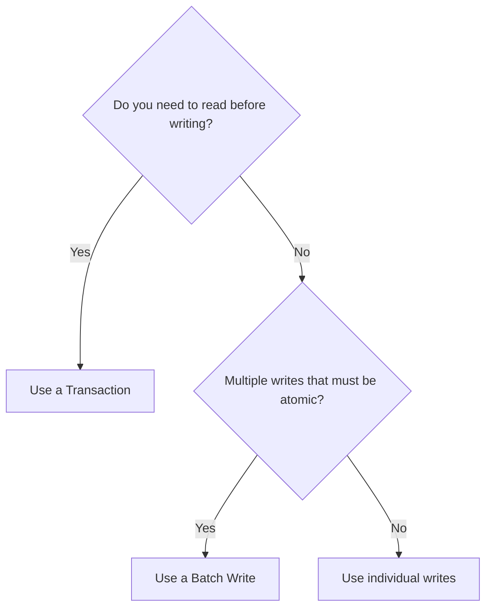

# How to Use Firestore Batch Writes to Update Multiple Documents Atomically

Author: [nawazdhandala](https://www.github.com/nawazdhandala)

Tags: GCP, Firestore, Batch Writes, Atomic Operations, Firebase

Description: A practical guide to using Firestore batch writes to create, update, and delete multiple documents in a single atomic operation.

---

Sometimes you need to update several documents at once and you need a guarantee: either all the updates succeed, or none of them do. If you are marking an order as shipped, updating the inventory count, and creating a shipment tracking document, you do not want half of those writes to go through if the other half fails.

Firestore batch writes give you exactly this guarantee. A batch is an atomic unit - all operations in the batch commit together, or the whole thing rolls back. Let me show you how to use them effectively.

## What Batch Writes Are

A batch write is a group of write operations (set, update, delete) that execute as a single atomic commit. Unlike transactions, batch writes do not include reads. You already know what you want to write, and you just need all the writes to happen together.

The key constraints are: up to 500 operations per batch, and the total size of all documents in the batch cannot exceed 10 MB. Each document in the batch can only be written once - you cannot set and then update the same document in the same batch.

## Basic Batch Write

Here is a simple example: creating multiple documents at once.

```javascript
// Create multiple documents atomically using a batch write
// All documents are created together or none of them are
import { writeBatch, doc, collection } from 'firebase/firestore';

async function createMultipleUsers(usersData) {
  const batch = writeBatch(db);

  for (const userData of usersData) {
    // Create a new document reference with an auto-generated ID
    const userRef = doc(collection(db, 'users'));

    batch.set(userRef, {
      name: userData.name,
      email: userData.email,
      role: 'viewer',
      createdAt: new Date()
    });
  }

  // Commit all writes at once
  await batch.commit();
  console.log(`Created ${usersData.length} users`);
}
```

## Mixing Operations in a Batch

A batch can include set, update, and delete operations all together. This is useful for complex state changes that touch multiple documents.

```javascript
// Mix different operations in a single batch
// This processes an order: updates the order, adjusts inventory, creates a log entry
import { writeBatch, doc, collection, increment } from 'firebase/firestore';

async function processOrder(orderId, items) {
  const batch = writeBatch(db);

  // 1. Update the order status
  const orderRef = doc(db, 'orders', orderId);
  batch.update(orderRef, {
    status: 'processing',
    processedAt: new Date()
  });

  // 2. Decrease inventory for each item
  for (const item of items) {
    const inventoryRef = doc(db, 'inventory', item.productId);
    batch.update(inventoryRef, {
      stock: increment(-item.quantity)
    });
  }

  // 3. Create an audit log entry
  const logRef = doc(collection(db, 'audit-logs'));
  batch.set(logRef, {
    action: 'order_processed',
    orderId: orderId,
    items: items,
    timestamp: new Date()
  });

  // 4. Delete the cart document since the order is placed
  const cartRef = doc(db, 'carts', orderId);
  batch.delete(cartRef);

  // All operations commit atomically
  await batch.commit();
  console.log('Order processed successfully');
}
```

## Handling the 500-Operation Limit

If you need to write more than 500 documents, you have to split the work across multiple batches. Here is a helper function that handles this automatically.

```javascript
// Helper function that automatically splits large writes into multiple batches
// Each batch contains up to 500 operations (Firestore's limit)
import { writeBatch, doc } from 'firebase/firestore';

async function batchWrite(db, operations) {
  const BATCH_SIZE = 500;
  let batchCount = 0;

  for (let i = 0; i < operations.length; i += BATCH_SIZE) {
    const batch = writeBatch(db);
    const chunk = operations.slice(i, i + BATCH_SIZE);

    for (const op of chunk) {
      const docRef = doc(db, op.collection, op.docId);

      switch (op.type) {
        case 'set':
          batch.set(docRef, op.data, op.options || {});
          break;
        case 'update':
          batch.update(docRef, op.data);
          break;
        case 'delete':
          batch.delete(docRef);
          break;
      }
    }

    await batch.commit();
    batchCount++;
    console.log(`Committed batch ${batchCount} (${chunk.length} operations)`);
  }

  console.log(`Total: ${operations.length} operations in ${batchCount} batches`);
}

// Usage example: bulk update user statuses
const operations = userIds.map(uid => ({
  type: 'update',
  collection: 'users',
  docId: uid,
  data: { status: 'active', updatedAt: new Date() }
}));

await batchWrite(db, operations);
```

Note that when you split across multiple batches, each batch is independent. If batch 2 fails, batch 1's writes are already committed. If you need everything to be atomic across more than 500 operations, you are out of luck with batch writes and need a different approach (like breaking the problem into smaller atomic units).

## Server-Side Batch Writes with the Admin SDK

The Admin SDK has the same batch write API but with some nice additions like server timestamps that are evaluated at commit time.

```javascript
// Server-side batch write using the Firebase Admin SDK
// Useful in Cloud Functions, migration scripts, or backend services
const admin = require('firebase-admin');
const db = admin.firestore();

async function migratePosts(posts) {
  const BATCH_SIZE = 500;

  for (let i = 0; i < posts.length; i += BATCH_SIZE) {
    const batch = db.batch();
    const chunk = posts.slice(i, i + BATCH_SIZE);

    for (const post of chunk) {
      const ref = db.collection('posts').doc(post.id);

      batch.set(ref, {
        title: post.title,
        content: post.content,
        author: post.author,
        // Server timestamp is evaluated at commit time
        migratedAt: admin.firestore.FieldValue.serverTimestamp(),
        tags: post.tags || []
      }, { merge: true });  // merge: true preserves existing fields
    }

    await batch.commit();
    console.log(`Migrated batch ${Math.floor(i / BATCH_SIZE) + 1}`);
  }
}
```

## Set with Merge vs Update

Within a batch, you can choose between `set()`, `set() with merge`, and `update()`. They behave differently.

```javascript
// Demonstrating the difference between set, set with merge, and update
import { writeBatch, doc } from 'firebase/firestore';

const batch = writeBatch(db);
const userRef = doc(db, 'users', 'user-1');

// set() replaces the entire document
// If user-1 had other fields, they are gone after this
batch.set(userRef, { name: 'Alice', role: 'admin' });

// set() with merge only updates specified fields, keeps everything else
// This is safe for partial updates when you are not sure the document exists
batch.set(userRef, { role: 'admin' }, { merge: true });

// update() only updates specified fields, but fails if the document does not exist
// Use this when you know the document exists
batch.update(userRef, { role: 'admin' });
```

In batch operations, `set` with `merge: true` is often the safest choice. It creates the document if it does not exist and updates only the specified fields if it does. Plain `update` fails the entire batch if any document does not exist.

## Batch Deletes for Cleanup

Batch writes are great for cleaning up old data. Here is a pattern for deleting documents that match a query.

```javascript
// Delete all documents matching a query using batch writes
// Useful for cleanup tasks like removing expired sessions
import { writeBatch, collection, query, where, getDocs, doc } from 'firebase/firestore';

async function deleteExpiredSessions() {
  const expiredQuery = query(
    collection(db, 'sessions'),
    where('expiresAt', '<', new Date())
  );

  const snapshot = await getDocs(expiredQuery);

  if (snapshot.empty) {
    console.log('No expired sessions to delete');
    return;
  }

  const BATCH_SIZE = 500;
  const docs = snapshot.docs;

  for (let i = 0; i < docs.length; i += BATCH_SIZE) {
    const batch = writeBatch(db);
    const chunk = docs.slice(i, i + BATCH_SIZE);

    for (const docSnapshot of chunk) {
      batch.delete(docSnapshot.ref);
    }

    await batch.commit();
  }

  console.log(`Deleted ${docs.length} expired sessions`);
}
```

## Batch Writes vs Transactions

When should you use a batch write versus a transaction? The decision is straightforward.

Use batch writes when you already know all the data you want to write and you do not need to read documents first. Batch writes are simpler, faster, and can be used offline (they queue up like regular writes).

Use transactions when you need to read documents and make write decisions based on those reads. Transactions involve reads, so they are more expensive and cannot work offline.



## Error Handling

When a batch commit fails, none of the operations are applied. Handle the error and decide whether to retry.

```javascript
// Error handling for batch writes
// If commit fails, no operations in the batch are applied
import { writeBatch, doc } from 'firebase/firestore';

async function safeBatchWrite(updates) {
  const batch = writeBatch(db);

  for (const update of updates) {
    batch.update(doc(db, update.path, update.id), update.data);
  }

  try {
    await batch.commit();
    console.log('Batch committed successfully');
  } catch (error) {
    console.error('Batch commit failed:', error);

    if (error.code === 'not-found') {
      console.error('One or more documents in the batch do not exist');
    } else if (error.code === 'permission-denied') {
      console.error('Security rules blocked the batch');
    }

    // The entire batch was rolled back - no partial writes
    throw error;
  }
}
```

## Wrapping Up

Firestore batch writes are a clean, simple way to perform multiple document operations atomically. They are ideal for data migrations, bulk updates, cleanup tasks, and any scenario where you need multiple writes to succeed or fail together. Keep the 500-operation limit in mind, choose the right write method (set, merge, or update) for each operation, and remember that batch writes are for write-only operations - if you need reads too, reach for transactions instead.
