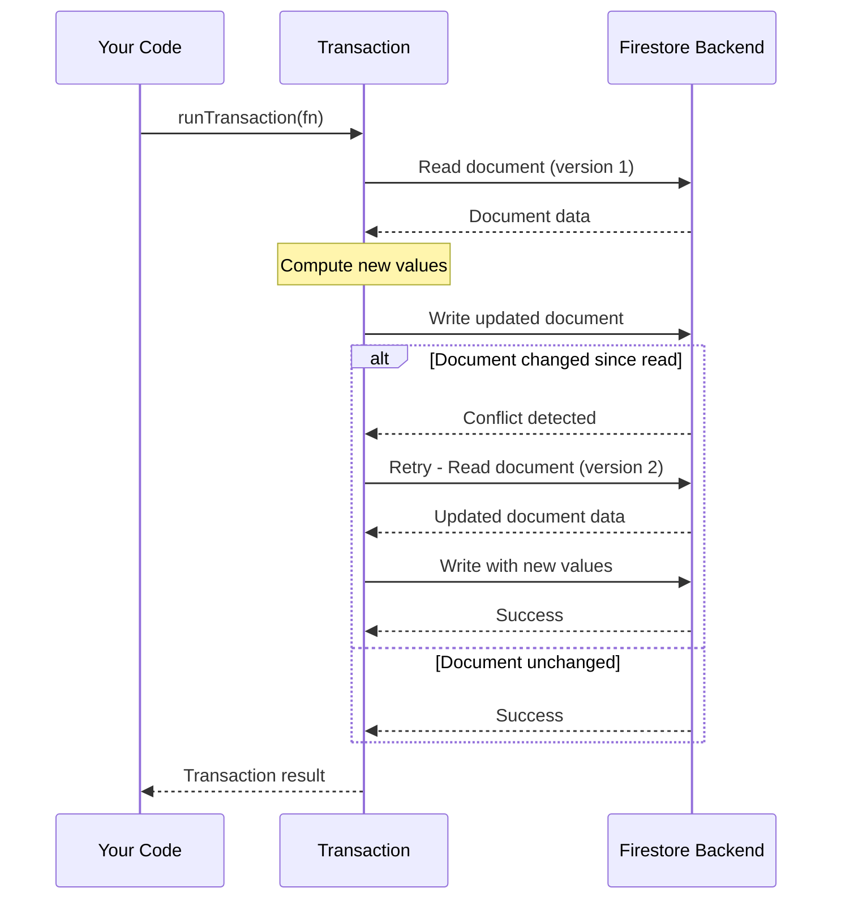

# How to Use Firestore Transactions to Ensure Atomic Read-Write Operations

Author: [nawazdhandala](https://www.github.com/nawazdhandala)

Tags: GCP, Firestore, Transactions, Atomic Operations, Firebase

Description: Learn how to use Firestore transactions to perform atomic read-write operations that keep your data consistent even under concurrent access.

---

When multiple users or processes update the same Firestore document at the same time, you can end up with stale data overwrites. Classic example: two users both read a counter at 10, both increment it to 11, and you lose an increment. Transactions solve this by ensuring that reads and writes happen atomically - if the data changes between your read and write, the transaction retries automatically.

Let me show you how to use Firestore transactions correctly, when to use them, and what the gotchas are.

## How Transactions Work

A Firestore transaction is a function that reads one or more documents and then writes based on what it read. The key property is that if any of the documents you read change before your write completes, Firestore throws away your write and re-runs the entire transaction function. This retry continues until the transaction succeeds or it has retried too many times (the default limit is 5 attempts on the client).



## Basic Transaction Example

The most common use case is incrementing a counter safely.

```javascript
// Safely increment a counter using a transaction
// Without this, concurrent increments could overwrite each other
import { doc, runTransaction } from 'firebase/firestore';

async function incrementCounter(counterId) {
  const counterRef = doc(db, 'counters', counterId);

  const newCount = await runTransaction(db, async (transaction) => {
    // Step 1: Read the current value inside the transaction
    const counterDoc = await transaction.get(counterRef);

    if (!counterDoc.exists()) {
      throw new Error('Counter document does not exist');
    }

    // Step 2: Compute the new value
    const currentCount = counterDoc.data().count;
    const updatedCount = currentCount + 1;

    // Step 3: Write the new value
    transaction.update(counterRef, { count: updatedCount });

    // Return a value from the transaction if needed
    return updatedCount;
  });

  console.log('Counter updated to:', newCount);
  return newCount;
}
```

The critical thing here is that the read and write happen inside the same transaction function. If another client increments the counter between your read and write, Firestore detects the conflict and reruns your function with the fresh data.

## Transferring Between Documents

Another classic use case is transferring a value from one document to another - like moving credits between user accounts.

```javascript
// Transfer credits between two users atomically
// Either both the debit and credit happen, or neither does
import { doc, runTransaction } from 'firebase/firestore';

async function transferCredits(fromUserId, toUserId, amount) {
  const fromRef = doc(db, 'accounts', fromUserId);
  const toRef = doc(db, 'accounts', toUserId);

  await runTransaction(db, async (transaction) => {
    // Read both documents
    const fromDoc = await transaction.get(fromRef);
    const toDoc = await transaction.get(toRef);

    if (!fromDoc.exists() || !toDoc.exists()) {
      throw new Error('One or both accounts do not exist');
    }

    const fromBalance = fromDoc.data().credits;
    const toBalance = toDoc.data().credits;

    // Validate the transfer
    if (fromBalance < amount) {
      throw new Error('Insufficient credits');
    }

    // Write both updates - they succeed or fail together
    transaction.update(fromRef, { credits: fromBalance - amount });
    transaction.update(toRef, { credits: toBalance + amount });
  });

  console.log(`Transferred ${amount} credits from ${fromUserId} to ${toUserId}`);
}
```

If the transaction function throws an error (like insufficient credits), the entire transaction is aborted and no writes are applied.

## Transaction Rules

There are some important rules to follow when writing transactions.

First, all reads must come before all writes. You cannot read a document, write to another document, and then read a third document. Firestore enforces this order.

```javascript
// CORRECT: All reads first, then all writes
await runTransaction(db, async (transaction) => {
  // Reads first
  const doc1 = await transaction.get(ref1);
  const doc2 = await transaction.get(ref2);

  // Then writes
  transaction.update(ref1, { field: 'value1' });
  transaction.update(ref2, { field: 'value2' });
});

// WRONG: Interleaving reads and writes will throw an error
// await runTransaction(db, async (transaction) => {
//   const doc1 = await transaction.get(ref1);
//   transaction.update(ref1, { field: 'value' });
//   const doc2 = await transaction.get(ref2);  // Error!
// });
```

Second, a transaction can read and write up to 500 documents. If you need to touch more than that, you will need to split the work into multiple transactions or use batch writes for the write-only portion.

Third, transactions must be idempotent. Since they can be retried, your transaction function might run multiple times. Do not include side effects like sending emails or making API calls inside a transaction.

## Server-Side Transactions

Transactions on the server (in Cloud Functions or the Admin SDK) work slightly differently. Instead of optimistic concurrency with retries, server-side transactions use pessimistic locking - they lock the documents they read.

```javascript
// Server-side transaction using the Admin SDK
// These use pessimistic locking instead of optimistic retries
const admin = require('firebase-admin');
const db = admin.firestore();

async function processOrder(orderId) {
  const orderRef = db.collection('orders').doc(orderId);
  const inventoryRef = db.collection('inventory').doc('warehouse-1');

  await db.runTransaction(async (transaction) => {
    const orderDoc = await transaction.get(orderRef);
    const inventoryDoc = await transaction.get(inventoryRef);

    const order = orderDoc.data();
    const inventory = inventoryDoc.data();

    // Check if we have enough stock
    if (inventory.quantity < order.quantity) {
      throw new Error('Out of stock');
    }

    // Deduct inventory and mark order as processed
    transaction.update(inventoryRef, {
      quantity: inventory.quantity - order.quantity
    });
    transaction.update(orderRef, {
      status: 'processed',
      processedAt: admin.firestore.FieldValue.serverTimestamp()
    });
  });
}
```

Server-side transactions also have a higher retry limit (up to 25 times by default) and can hold locks for longer, making them better suited for high-contention scenarios.

## When Not to Use Transactions

Transactions are powerful but not always necessary. If you are just incrementing a counter and do not need to read the current value first, use `FieldValue.increment()` instead:

```javascript
// For simple increments, FieldValue.increment is simpler and more efficient
// No transaction needed - Firestore handles the atomicity
import { doc, updateDoc, increment } from 'firebase/firestore';

await updateDoc(doc(db, 'counters', 'page-views'), {
  count: increment(1)
});
```

If you are writing multiple documents but do not need to read any of them first, use a batch write instead of a transaction. Batch writes are atomic (all succeed or all fail) but do not involve reads, so they are simpler and faster.

## Handling Transaction Failures

Transactions can fail for several reasons. The most common is too many retries due to high contention. Always handle this gracefully.

```javascript
// Handle transaction failures with proper error handling
import { doc, runTransaction } from 'firebase/firestore';

async function safeTransaction(docId) {
  try {
    const result = await runTransaction(db, async (transaction) => {
      const docRef = doc(db, 'items', docId);
      const snapshot = await transaction.get(docRef);

      if (!snapshot.exists()) {
        throw new Error('Document not found');
      }

      const newValue = snapshot.data().value + 1;
      transaction.update(docRef, { value: newValue });
      return newValue;
    });

    console.log('Transaction succeeded, new value:', result);
  } catch (error) {
    if (error.message === 'Document not found') {
      // Our custom error - handle accordingly
      console.error('The document does not exist');
    } else {
      // Firestore error - likely contention or network issue
      console.error('Transaction failed after retries:', error);
    }
  }
}
```

## Wrapping Up

Firestore transactions are your go-to tool for maintaining data consistency when you need to read and then write based on what you read. They handle concurrency automatically through retries, and they guarantee that your writes are based on the freshest data. Just remember the rules: reads before writes, keep transactions idempotent, and use simpler alternatives (increment, batch writes) when you do not need the full power of a transaction. For high-contention scenarios, consider running transactions server-side where you get pessimistic locking and more retries.
