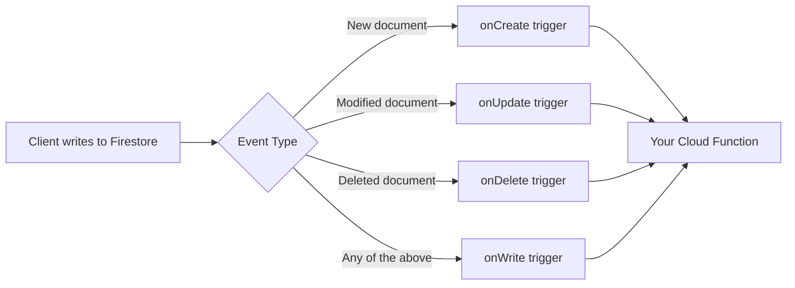

# How to Use Firestore with Cloud Functions for Serverless Triggers

Author: [nawazdhandala](https://www.github.com/nawazdhandala)

Tags: GCP, Firestore, Cloud Functions, Serverless, Firebase

Description: Learn how to set up Cloud Functions that trigger automatically on Firestore document creates, updates, and deletes for building serverless backend logic.

---

One of the most powerful combinations in the Firebase ecosystem is Firestore plus Cloud Functions. You write a function, attach it to a Firestore event (document created, updated, or deleted), and it runs automatically every time that event happens. No servers to manage, no webhooks to configure, no polling loops. Your backend logic just runs when data changes.

I use this pattern constantly - for sending notifications when a new order comes in, syncing data to external services, maintaining aggregate counts, validating data after writes, and much more. Let me show you how to set it up.

## The Trigger Types

Firestore Cloud Functions support four trigger types:

- **onCreate**: Fires when a new document is created
- **onUpdate**: Fires when an existing document is updated
- **onDelete**: Fires when a document is deleted
- **onWrite**: Fires on any write (create, update, or delete)

Each trigger gives you access to the document data and metadata.



## Setting Up Your First Trigger

Start with a simple onCreate trigger that sends a welcome email when a new user document is created.

```javascript
// Cloud Function that triggers when a new user document is created
// Sends a welcome email to the new user
const functions = require('firebase-functions');
const admin = require('firebase-admin');
admin.initializeApp();

exports.onNewUser = functions.firestore
  .document('users/{userId}')
  .onCreate(async (snapshot, context) => {
    // snapshot contains the new document data
    const userData = snapshot.data();
    const userId = context.params.userId;

    console.log(`New user created: ${userId}`);
    console.log(`Name: ${userData.name}, Email: ${userData.email}`);

    // Send welcome email (using your email service)
    await sendWelcomeEmail(userData.email, userData.name);

    // You can also write back to Firestore from inside the function
    await snapshot.ref.update({
      welcomeEmailSent: true,
      welcomeEmailSentAt: admin.firestore.FieldValue.serverTimestamp()
    });
  });
```

## Handling Updates

The onUpdate trigger gives you both the before and after snapshots, so you can see exactly what changed.

```javascript
// Trigger on order status changes
// Compare before and after to detect specific field changes
exports.onOrderStatusChange = functions.firestore
  .document('orders/{orderId}')
  .onUpdate(async (change, context) => {
    const before = change.before.data();  // Document data before the update
    const after = change.after.data();    // Document data after the update
    const orderId = context.params.orderId;

    // Only act if the status field actually changed
    if (before.status === after.status) {
      console.log('Status did not change, skipping');
      return null;
    }

    console.log(`Order ${orderId} status: ${before.status} -> ${after.status}`);

    // React to specific status transitions
    if (after.status === 'shipped') {
      await sendShippingNotification(after.customerEmail, orderId);
    }

    if (after.status === 'delivered') {
      await sendDeliveryConfirmation(after.customerEmail, orderId);
      await updateCustomerStats(after.customerId);
    }

    if (after.status === 'cancelled') {
      await processRefund(orderId, after.total);
    }
  });
```

## Handling Deletes

The onDelete trigger gives you the data of the document that was just deleted. Useful for cleanup tasks.

```javascript
// Clean up related data when a user is deleted
// Delete their subcollections, storage files, and references in other documents
exports.onUserDeleted = functions.firestore
  .document('users/{userId}')
  .onDelete(async (snapshot, context) => {
    const userId = context.params.userId;
    const userData = snapshot.data();

    console.log(`User deleted: ${userId}`);

    const db = admin.firestore();

    // Delete the user's posts
    const postsSnapshot = await db.collection('posts')
      .where('authorId', '==', userId)
      .get();

    const batch = db.batch();
    postsSnapshot.forEach(doc => {
      batch.delete(doc.ref);
    });

    // Delete the user's profile image from Storage
    if (userData.profileImagePath) {
      await admin.storage().bucket().file(userData.profileImagePath).delete()
        .catch(() => console.log('Profile image already deleted'));
    }

    await batch.commit();
    console.log(`Cleaned up ${postsSnapshot.size} posts for user ${userId}`);
  });
```

## The onWrite Catch-All

The onWrite trigger fires on creates, updates, and deletes. The change object tells you which operation occurred.

```javascript
// Log all changes to the audit collection using onWrite
// This captures creates, updates, and deletes
exports.auditLog = functions.firestore
  .document('sensitive-data/{docId}')
  .onWrite(async (change, context) => {
    const docId = context.params.docId;
    const db = admin.firestore();

    let action;
    let dataBefore = null;
    let dataAfter = null;

    if (!change.before.exists) {
      // Document was created
      action = 'CREATE';
      dataAfter = change.after.data();
    } else if (!change.after.exists) {
      // Document was deleted
      action = 'DELETE';
      dataBefore = change.before.data();
    } else {
      // Document was updated
      action = 'UPDATE';
      dataBefore = change.before.data();
      dataAfter = change.after.data();
    }

    // Write to the audit log
    await db.collection('audit-log').add({
      documentId: docId,
      action: action,
      dataBefore: dataBefore,
      dataAfter: dataAfter,
      timestamp: admin.firestore.FieldValue.serverTimestamp()
    });

    console.log(`Audit: ${action} on ${docId}`);
  });
```

## Watching Subcollections

You can trigger on subcollection documents by including the full path with wildcards.

```javascript
// Trigger when a new message is added to any room's messages subcollection
// The wildcard captures both the room ID and message ID
exports.onNewMessage = functions.firestore
  .document('rooms/{roomId}/messages/{messageId}')
  .onCreate(async (snapshot, context) => {
    const roomId = context.params.roomId;
    const messageId = context.params.messageId;
    const message = snapshot.data();

    console.log(`New message in room ${roomId}: ${message.text}`);

    // Update the room's last message timestamp
    await admin.firestore().collection('rooms').doc(roomId).update({
      lastMessageAt: admin.firestore.FieldValue.serverTimestamp(),
      lastMessageText: message.text.substring(0, 100),
      messageCount: admin.firestore.FieldValue.increment(1)
    });

    // Send push notifications to room members
    const roomDoc = await admin.firestore().collection('rooms').doc(roomId).get();
    const members = roomDoc.data().members || [];

    const notificationPromises = members
      .filter(memberId => memberId !== message.sender)
      .map(memberId => sendPushNotification(memberId, {
        title: `New message in ${roomDoc.data().name}`,
        body: message.text.substring(0, 200)
      }));

    await Promise.all(notificationPromises);
  });
```

## Avoiding Infinite Loops

A common mistake is writing a Cloud Function that updates a document, which triggers the same function again, creating an infinite loop.

```javascript
// BAD: This creates an infinite loop
// exports.badFunction = functions.firestore
//   .document('orders/{orderId}')
//   .onUpdate(async (change) => {
//     await change.after.ref.update({ processedAt: new Date() });
//     // This update triggers onUpdate again, which updates again, forever
//   });

// GOOD: Check if the update was already processed
exports.goodFunction = functions.firestore
  .document('orders/{orderId}')
  .onUpdate(async (change) => {
    const before = change.before.data();
    const after = change.after.data();

    // Guard clause: skip if we already processed this
    if (after.processedAt) {
      console.log('Already processed, skipping');
      return null;
    }

    // Guard clause: only process if a specific field changed
    if (before.status === after.status) {
      return null;
    }

    // Safe to update now
    await change.after.ref.update({
      processedAt: admin.firestore.FieldValue.serverTimestamp()
    });
  });
```

## Using v2 Cloud Functions

The newer v2 Cloud Functions API (2nd generation) offers better performance and more configuration options.

```javascript
// v2 Cloud Functions with Firestore triggers
// Offers better performance, longer timeouts, and more memory options
const { onDocumentCreated, onDocumentUpdated } = require('firebase-functions/v2/firestore');

exports.onNewOrder = onDocumentCreated(
  {
    document: 'orders/{orderId}',
    region: 'us-central1',
    memory: '512MiB',       // Configure memory
    timeoutSeconds: 120,     // Configure timeout
    minInstances: 1,         // Keep one instance warm to reduce cold starts
  },
  async (event) => {
    const snapshot = event.data;
    const orderId = event.params.orderId;
    const orderData = snapshot.data();

    console.log(`Processing new order: ${orderId}`);

    // Process the order
    await processNewOrder(orderId, orderData);
  }
);
```

## Error Handling and Retries

Cloud Functions triggered by Firestore are automatically retried on failure by default. Make sure your functions are idempotent - safe to run multiple times with the same input.

```javascript
// Idempotent function that is safe to retry
// Uses a processed flag to avoid duplicate processing
exports.processPayment = functions.firestore
  .document('payments/{paymentId}')
  .onCreate(async (snapshot, context) => {
    const paymentId = context.params.paymentId;
    const payment = snapshot.data();

    // Check if already processed (idempotency check)
    if (payment.processed) {
      console.log(`Payment ${paymentId} already processed`);
      return;
    }

    try {
      // Process the payment with your payment provider
      const result = await chargePayment(payment);

      // Mark as processed so retries do not double-charge
      await snapshot.ref.update({
        processed: true,
        chargeId: result.chargeId,
        processedAt: admin.firestore.FieldValue.serverTimestamp()
      });
    } catch (error) {
      // Log the error - the function will be retried
      console.error(`Payment processing failed for ${paymentId}:`, error);

      await snapshot.ref.update({
        error: error.message,
        lastAttemptAt: admin.firestore.FieldValue.serverTimestamp()
      });

      // Re-throw to trigger a retry
      throw error;
    }
  });
```

## Wrapping Up

Firestore triggers with Cloud Functions are the backbone of serverless architectures on Firebase. They let you build reactive backend logic that responds to data changes automatically, without any infrastructure management. The key patterns to remember are: check what actually changed in onUpdate to avoid unnecessary work, guard against infinite loops, make your functions idempotent for safe retries, and use v2 functions for better performance options. With these patterns in place, you can build complex, event-driven systems that scale automatically.
