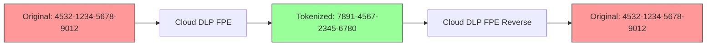

# How to Use Format-Preserving Encryption with Cloud DLP for Tokenization

Author: [nawazdhandala](https://www.github.com/nawazdhandala)

Tags: GCP, Cloud DLP, Tokenization, Encryption, Data Security

Description: Learn how to use Cloud DLP's format-preserving encryption (FPE) to tokenize sensitive data while maintaining the original format, enabling safe data sharing and analytics.

---

When you need to de-identify sensitive data but still preserve its format for downstream systems, simple redaction does not cut it. Replace a credit card number with "[REDACTED]" and every system that expects a 16-digit number breaks. Replace an SSN with "XXX-XX-XXXX" and you lose the ability to join records across datasets.

Format-preserving encryption (FPE) solves this problem. It encrypts data while keeping the same format - a 16-digit credit card number becomes a different 16-digit number, a 9-digit SSN becomes a different 9-digit SSN. The tokenized data looks structurally identical to the original, passes format validation, but reveals nothing about the actual values. And with the encryption key, you can reverse the tokenization when needed.

Cloud DLP implements FPE through the `CryptoReplaceFfxFpeConfig` transformation. In this post, I will show you how to set it up and use it.

## How Format-Preserving Encryption Works

FPE uses the FF1 or FF3-1 algorithms (depending on the implementation) to encrypt data within a specific alphabet. If your input is numeric, the output is numeric. If your input uses alphanumeric characters, the output uses the same character set. The encryption key is a standard AES key, typically managed through Cloud KMS.



The key properties of FPE:

- **Format preservation**: Output has the same length and character set as input
- **Deterministic**: Same input with same key always produces same output (important for join operations)
- **Reversible**: With the key, you can decrypt back to the original value
- **Cryptographically secure**: Without the key, you cannot recover the original data

## Prerequisites

You need:

- Cloud DLP API enabled
- Cloud KMS API enabled
- A KMS keyring and key for wrapping the encryption key
- DLP Admin and KMS CryptoKey Encrypter/Decrypter roles

## Step 1: Set Up the Encryption Key

FPE in Cloud DLP uses a wrapped key approach. You create an AES key, wrap it with a Cloud KMS key, and provide the wrapped key to DLP.

First, create a KMS keyring and key:

```bash
# Create a keyring for DLP encryption keys
gcloud kms keyrings create dlp-keyring \
  --location=global \
  --project=PROJECT_ID

# Create a symmetric key for wrapping
gcloud kms keys create dlp-fpe-key \
  --keyring=dlp-keyring \
  --location=global \
  --purpose=encryption \
  --project=PROJECT_ID
```

Now generate and wrap an AES-256 key:

```python
import os
import base64
from google.cloud import kms_v1

def create_wrapped_key(project_id, location_id, keyring_id, key_id):
    """Generate an AES key and wrap it with a Cloud KMS key."""

    kms_client = kms_v1.KeyManagementServiceClient()

    # Generate a random 256-bit (32-byte) AES key
    raw_key = os.urandom(32)

    # Build the KMS key resource name
    key_name = kms_client.crypto_key_path(
        project_id, location_id, keyring_id, key_id
    )

    # Wrap (encrypt) the AES key with the KMS key
    response = kms_client.encrypt(
        request={
            "name": key_name,
            "plaintext": raw_key,
        }
    )

    # Base64 encode the wrapped key for use in DLP configs
    wrapped_key = base64.b64encode(response.ciphertext).decode("utf-8")
    print(f"Wrapped key (base64): {wrapped_key}")

    return wrapped_key

wrapped_key = create_wrapped_key(
    "my-project", "global", "dlp-keyring", "dlp-fpe-key"
)
```

Save the wrapped key value - you will need it for your DLP configurations.

## Step 2: Tokenize Text Content with FPE

Here is how to tokenize sensitive data in text using FPE:

```python
from google.cloud import dlp_v2

def tokenize_with_fpe(project_id, text, wrapped_key, kms_key_name):
    """Tokenize sensitive data in text using format-preserving encryption."""

    dlp_client = dlp_v2.DlpServiceClient()

    # Configure FPE transformation for credit card numbers
    fpe_config = {
        "crypto_key": {
            "kms_wrapped": {
                "wrapped_key": wrapped_key,
                "crypto_key_name": kms_key_name,
            }
        },
        # NUMERIC means input and output are digits only
        "common_alphabet": "NUMERIC",
        # Optional: add a surrogate InfoType to mark tokenized values
        "surrogate_info_type": {
            "name": "TOKENIZED_CC"
        },
    }

    # Define the de-identification config
    deidentify_config = {
        "info_type_transformations": {
            "transformations": [
                {
                    "info_types": [{"name": "CREDIT_CARD_NUMBER"}],
                    "primitive_transformation": {
                        "crypto_replace_ffx_fpe_config": fpe_config
                    },
                }
            ]
        }
    }

    # Inspection config to find the data
    inspect_config = {
        "info_types": [{"name": "CREDIT_CARD_NUMBER"}],
    }

    item = {"value": text}
    parent = f"projects/{project_id}/locations/global"

    response = dlp_client.deidentify_content(
        request={
            "parent": parent,
            "deidentify_config": deidentify_config,
            "inspect_config": inspect_config,
            "item": item,
        }
    )

    print(f"Original:  {text}")
    print(f"Tokenized: {response.item.value}")

    return response.item.value

# Test it
kms_key = "projects/my-project/locations/global/keyRings/dlp-keyring/cryptoKeys/dlp-fpe-key"

tokenize_with_fpe(
    "my-project",
    "Customer card: 4532-1234-5678-9012",
    "YOUR_BASE64_WRAPPED_KEY",
    kms_key,
)
```

## Step 3: Reverse the Tokenization

The power of FPE is that you can reverse it. Use the `reidentifyContent` API:

```python
def reverse_tokenization(project_id, tokenized_text, wrapped_key, kms_key_name):
    """Reverse FPE tokenization to recover original values."""

    dlp_client = dlp_v2.DlpServiceClient()

    # Same FPE config as tokenization - must match exactly
    fpe_config = {
        "crypto_key": {
            "kms_wrapped": {
                "wrapped_key": wrapped_key,
                "crypto_key_name": kms_key_name,
            }
        },
        "common_alphabet": "NUMERIC",
        "surrogate_info_type": {
            "name": "TOKENIZED_CC"
        },
    }

    # Re-identification config
    reidentify_config = {
        "info_type_transformations": {
            "transformations": [
                {
                    "info_types": [{"name": "TOKENIZED_CC"}],
                    "primitive_transformation": {
                        "crypto_replace_ffx_fpe_config": fpe_config
                    },
                }
            ]
        }
    }

    # The surrogate InfoType tells DLP which values to reverse
    inspect_config = {
        "custom_info_types": [
            {
                "info_type": {"name": "TOKENIZED_CC"},
                "surrogate_type": {},
            }
        ]
    }

    item = {"value": tokenized_text}
    parent = f"projects/{project_id}/locations/global"

    response = dlp_client.reidentify_content(
        request={
            "parent": parent,
            "reidentify_config": reidentify_config,
            "inspect_config": inspect_config,
            "item": item,
        }
    )

    print(f"Tokenized:    {tokenized_text}")
    print(f"Re-identified: {response.item.value}")

    return response.item.value
```

## Step 4: Tokenize Structured Data

FPE works great with structured data like BigQuery tables and CSV files. Here is how to tokenize specific columns:

```python
def tokenize_table_data(project_id, wrapped_key, kms_key_name):
    """Tokenize specific columns in structured data."""

    dlp_client = dlp_v2.DlpServiceClient()

    # Define the structured data (simulating a table)
    table = {
        "headers": [
            {"name": "name"},
            {"name": "email"},
            {"name": "ssn"},
            {"name": "credit_card"},
            {"name": "amount"},
        ],
        "rows": [
            {
                "values": [
                    {"string_value": "John Smith"},
                    {"string_value": "john@example.com"},
                    {"string_value": "123-45-6789"},
                    {"string_value": "4532123456789012"},
                    {"string_value": "150.00"},
                ]
            },
            {
                "values": [
                    {"string_value": "Jane Doe"},
                    {"string_value": "jane@example.com"},
                    {"string_value": "987-65-4321"},
                    {"string_value": "5425987654321098"},
                    {"string_value": "250.00"},
                ]
            },
        ],
    }

    # FPE for numeric data (SSN digits and credit card)
    numeric_fpe = {
        "crypto_key": {
            "kms_wrapped": {
                "wrapped_key": wrapped_key,
                "crypto_key_name": kms_key_name,
            }
        },
        "common_alphabet": "NUMERIC",
    }

    # De-identification config with record-level transformations
    deidentify_config = {
        "record_transformations": {
            "field_transformations": [
                {
                    # Tokenize the SSN column
                    "fields": [{"name": "ssn"}],
                    "primitive_transformation": {
                        "crypto_replace_ffx_fpe_config": numeric_fpe
                    },
                },
                {
                    # Tokenize the credit card column
                    "fields": [{"name": "credit_card"}],
                    "primitive_transformation": {
                        "crypto_replace_ffx_fpe_config": numeric_fpe
                    },
                },
            ]
        }
    }

    item = {"table": table}
    parent = f"projects/{project_id}/locations/global"

    response = dlp_client.deidentify_content(
        request={
            "parent": parent,
            "deidentify_config": deidentify_config,
            "item": item,
        }
    )

    # Print the tokenized table
    result_table = response.item.table
    for i, row in enumerate(result_table.rows):
        values = [v.string_value for v in row.values]
        print(f"Row {i}: {values}")

    return response
```

## Step 5: Choose the Right Alphabet

The `common_alphabet` parameter controls what characters are used:

- `NUMERIC`: Digits 0-9 only
- `HEXADECIMAL`: Digits 0-9 and letters A-F
- `UPPER_CASE_ALPHA_NUMERIC`: Uppercase letters and digits
- `ALPHA_NUMERIC`: Both cases of letters and digits

You can also define a custom alphabet with `custom_alphabet`:

```python
# Custom alphabet for specific use cases
fpe_config = {
    "crypto_key": {
        "kms_wrapped": {
            "wrapped_key": wrapped_key,
            "crypto_key_name": kms_key_name,
        }
    },
    # Only use uppercase letters (no digits)
    "custom_alphabet": "ABCDEFGHIJKLMNOPQRSTUVWXYZ",
}
```

Choose the alphabet that matches your data. Credit cards and SSNs are numeric. Customer IDs might be alphanumeric. Pick the narrowest alphabet that covers your data for the strongest encryption.

## When to Use FPE vs Other Methods

Use FPE when:

- Downstream systems require specific data formats (validation, schema enforcement)
- You need to join tokenized datasets on common fields
- You need reversibility (re-identification with the key)
- You want deterministic output (same input always gives same token)

Use other methods when:

- You never need to reverse the transformation (use hashing or redaction)
- Format preservation does not matter (use simple replacement)
- You need non-deterministic output for privacy (use random replacement)

## Summary

Format-preserving encryption in Cloud DLP lets you tokenize sensitive data while keeping it structurally valid. Set up a KMS-wrapped encryption key, configure FPE transformations for the right alphabet, and apply them to text or structured data. The tokenized output passes format validation, supports joins across datasets, and can be reversed when authorized access to the original data is needed. It is the right tool when you need to share or analyze data that must look real but must not expose actual sensitive values.
