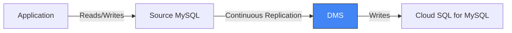

# How to Use GCP Database Migration Service to Migrate MySQL to Cloud SQL

Author: [nawazdhandala](https://www.github.com/nawazdhandala)

Tags: GCP, Database Migration Service, MySQL, Cloud SQL, Migration

Description: A step-by-step guide to using GCP Database Migration Service to migrate your MySQL databases to Cloud SQL for MySQL with minimal downtime using continuous replication.

---

Database migration is one of those tasks that sounds simple in theory and gets complicated in practice. You need to handle schema differences, maintain data consistency during the transfer, minimize downtime, and make sure nothing gets lost. GCP's Database Migration Service (DMS) takes care of the heavy lifting for MySQL migrations to Cloud SQL.

DMS uses native MySQL replication under the hood. It sets up the source database as a replication primary and the Cloud SQL instance as a replica. Data flows continuously until you are ready to promote the Cloud SQL instance and cut over. In this post, I will walk through the full migration process.

## How Database Migration Service Works



The migration follows these phases:

1. **Create connection profile**: Configure connectivity to your source database
2. **Create migration job**: Define source, destination, and migration settings
3. **Full dump**: Initial bulk transfer of all data
4. **CDC (Change Data Capture)**: Continuous replication of changes
5. **Promote**: Promote Cloud SQL to primary, cut over application traffic

## Prerequisites

- Source MySQL 5.6, 5.7, or 8.0
- Binary logging enabled on the source (`log_bin = ON`, `binlog_format = ROW`)
- A replication user on the source database
- Network connectivity between source and GCP (VPN, Cloud Interconnect, or public IP)
- DMS API enabled

```bash
# Enable the Database Migration Service API
gcloud services enable datamigration.googleapis.com --project=PROJECT_ID
```

## Step 1: Prepare the Source Database

Configure the source MySQL for replication. These settings need to be in your MySQL configuration:

```ini
# MySQL configuration for DMS replication
[mysqld]
# Enable binary logging
log_bin = mysql-bin
binlog_format = ROW
binlog_row_image = FULL

# Set a unique server ID
server-id = 1

# Recommended: expire binary logs after 7 days
expire_logs_days = 7

# If using GTID-based replication (recommended)
gtid_mode = ON
enforce_gtid_consistency = ON
```

Restart MySQL after changing the configuration.

Create a replication user:

```sql
-- Create a user for DMS replication
CREATE USER 'dms_replication'@'%' IDENTIFIED BY 'strong_password_here';

-- Grant required privileges
GRANT REPLICATION SLAVE, REPLICATION CLIENT ON *.* TO 'dms_replication'@'%';
GRANT SELECT ON *.* TO 'dms_replication'@'%';

-- If migrating specific databases only
-- GRANT SELECT ON my_database.* TO 'dms_replication'@'%';

FLUSH PRIVILEGES;
```

## Step 2: Create a Connection Profile for the Source

```bash
# Create a connection profile for the source MySQL database
gcloud database-migration connection-profiles create mysql-source \
  --region=us-central1 \
  --display-name="Source MySQL Server" \
  --provider=MYSQL \
  --mysql-host=203.0.113.10 \
  --mysql-port=3306 \
  --mysql-username=dms_replication \
  --mysql-password=strong_password_here \
  --project=PROJECT_ID
```

If your source is on AWS RDS:

```bash
# Connection profile for AWS RDS MySQL
gcloud database-migration connection-profiles create rds-mysql-source \
  --region=us-central1 \
  --display-name="AWS RDS MySQL Source" \
  --provider=MYSQL \
  --mysql-host=mydb.cluster-xyz.us-east-1.rds.amazonaws.com \
  --mysql-port=3306 \
  --mysql-username=dms_replication \
  --mysql-password=strong_password_here \
  --project=PROJECT_ID
```

For secure connections, add SSL configuration:

```bash
# Add SSL certificates for encrypted replication
gcloud database-migration connection-profiles create secure-mysql-source \
  --region=us-central1 \
  --display-name="Secure MySQL Source" \
  --provider=MYSQL \
  --mysql-host=203.0.113.10 \
  --mysql-port=3306 \
  --mysql-username=dms_replication \
  --mysql-password=strong_password_here \
  --mysql-ssl-ca=ca-cert.pem \
  --mysql-ssl-cert=client-cert.pem \
  --mysql-ssl-key=client-key.pem \
  --project=PROJECT_ID
```

## Step 3: Create the Destination Cloud SQL Instance

You can let DMS create the Cloud SQL instance automatically, or create it yourself for more control:

```bash
# Create a Cloud SQL for MySQL instance as the migration destination
gcloud sql instances create mysql-destination \
  --database-version=MYSQL_8_0 \
  --tier=db-custom-4-16384 \
  --region=us-central1 \
  --storage-type=SSD \
  --storage-size=100GB \
  --storage-auto-increase \
  --availability-type=REGIONAL \
  --backup-start-time=02:00 \
  --maintenance-window-day=SUN \
  --maintenance-window-hour=03 \
  --project=PROJECT_ID
```

Create a connection profile for the destination:

```bash
# Create a connection profile for the Cloud SQL destination
gcloud database-migration connection-profiles create mysql-destination \
  --region=us-central1 \
  --display-name="Cloud SQL Destination" \
  --provider=CLOUDSQL \
  --cloudsql-instance=mysql-destination \
  --project=PROJECT_ID
```

## Step 4: Create and Start the Migration Job

```bash
# Create a continuous migration job
gcloud database-migration migration-jobs create mysql-migration \
  --region=us-central1 \
  --display-name="MySQL to Cloud SQL Migration" \
  --type=CONTINUOUS \
  --source=mysql-source \
  --destination=mysql-destination \
  --project=PROJECT_ID
```

The `--type=CONTINUOUS` flag enables CDC (Change Data Capture), which keeps replicating changes from the source until you promote.

Verify the migration job and start it:

```bash
# Verify the migration job configuration
gcloud database-migration migration-jobs verify mysql-migration \
  --region=us-central1 \
  --project=PROJECT_ID

# Start the migration
gcloud database-migration migration-jobs start mysql-migration \
  --region=us-central1 \
  --project=PROJECT_ID
```

The verify step checks connectivity, permissions, and compatibility before starting data transfer.

## Step 5: Monitor the Migration

```bash
# Check migration job status
gcloud database-migration migration-jobs describe mysql-migration \
  --region=us-central1 \
  --project=PROJECT_ID

# Watch the migration progress
gcloud database-migration migration-jobs describe mysql-migration \
  --region=us-central1 \
  --format="table(name, state, phase, error)" \
  --project=PROJECT_ID
```

The migration goes through these phases:

- `FULL_DUMP`: Initial bulk data transfer
- `CDC`: Change data capture (continuous replication)
- `PROMOTE_IN_PROGRESS`: Cutover happening
- `COMPLETED`: Migration finished

For large databases, the full dump phase can take hours or days. Monitor the progress:

```bash
# Check replication lag
gcloud database-migration migration-jobs describe mysql-migration \
  --region=us-central1 \
  --format="get(durationSinceLastVpcPeering)" \
  --project=PROJECT_ID
```

## Step 6: Validate Before Cutover

Before promoting the Cloud SQL instance, validate the data:

```bash
# Connect to the Cloud SQL instance (read-only during migration)
gcloud sql connect mysql-destination --user=root --project=PROJECT_ID
```

Run validation queries:

```sql
-- Compare row counts between source and destination
-- Run these on both databases and compare

-- Check table counts
SELECT COUNT(*) as table_count
FROM information_schema.tables
WHERE table_schema NOT IN ('mysql', 'sys', 'information_schema', 'performance_schema');

-- Check row counts for critical tables
SELECT table_name, table_rows
FROM information_schema.tables
WHERE table_schema = 'my_database'
ORDER BY table_rows DESC;

-- Verify specific data integrity
SELECT COUNT(*), MAX(updated_at)
FROM my_database.orders;
```

## Step 7: Promote (Cutover)

When you are confident the data is in sync and the replication lag is minimal:

```bash
# Promote the Cloud SQL instance to primary
gcloud database-migration migration-jobs promote mysql-migration \
  --region=us-central1 \
  --project=PROJECT_ID
```

The promotion process:

1. Stops accepting new writes on the source (brief pause)
2. Waits for remaining changes to replicate
3. Promotes Cloud SQL to a standalone primary instance
4. The Cloud SQL instance becomes read-write

**Important**: Update your application's database connection string to point to the Cloud SQL instance immediately after promotion.

```bash
# Get the Cloud SQL connection details
gcloud sql instances describe mysql-destination \
  --format="get(connectionName)" \
  --project=PROJECT_ID
```

## Handling Common Issues

**Replication lag keeps growing**: This usually means the source has more write throughput than DMS can replicate. Consider upgrading the Cloud SQL instance tier or optimizing the source workload during migration.

**Schema incompatibilities**: Cloud SQL has some MySQL configuration differences. Check for features like specific storage engines (only InnoDB is recommended), character sets, and SQL modes that might differ.

**Large tables taking too long**: For tables with hundreds of gigabytes, the initial dump can be very slow. Consider migrating in stages - start with smaller databases first.

**Network connectivity issues**: If the replication keeps disconnecting, check your VPN stability or consider using Cloud Interconnect for more reliable connectivity.

## Post-Migration Checklist

After successful cutover:

- Update application connection strings to Cloud SQL
- Configure Cloud SQL maintenance windows
- Set up Cloud SQL automated backups
- Enable query insights for performance monitoring
- Update firewall rules (authorized networks in Cloud SQL)
- Set up Cloud Monitoring alerts for the database
- Test failover if using high availability configuration
- Decommission the source database after a safe holdback period

## Summary

Database Migration Service makes MySQL-to-Cloud-SQL migrations straightforward by leveraging native MySQL replication. Prepare your source with binary logging and a replication user, create connection profiles, start a continuous migration job, and promote when the data is in sync. The continuous replication approach minimizes downtime since data stays synchronized until the moment of cutover. Validate thoroughly with test queries before promoting, and have your application ready to switch connection strings immediately after.
