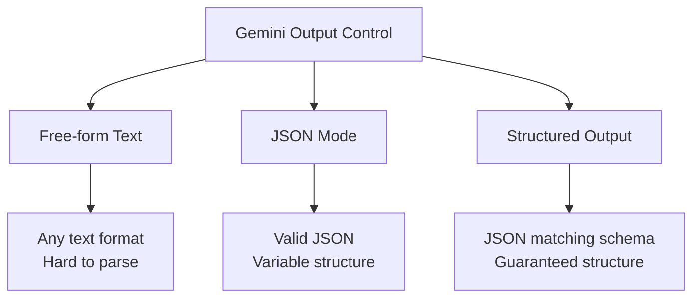

# How to Use Gemini Structured Output and JSON Mode for Reliable Data Extraction

Author: [nawazdhandala](https://www.github.com/nawazdhandala)

Tags: GCP, Vertex AI, Gemini, Structured Output, JSON Mode

Description: Learn how to use Gemini structured output and JSON mode on Vertex AI for reliable, parseable data extraction from unstructured text.

---

LLMs are great at understanding text, but getting them to return data in a consistent, parseable format is a different challenge. Ask Gemini to extract information from an invoice, and it might return a nice JSON object one time and a conversational paragraph the next. When you are building an application that needs to parse the output programmatically, this inconsistency breaks things.

Gemini's structured output mode and JSON mode solve this by constraining the model's output to match a specific schema. The model can only return valid JSON that conforms to your defined structure, eliminating the need for fragile output parsing.

## JSON Mode vs Structured Output

Gemini offers two levels of output control.

JSON mode tells the model to return valid JSON, but does not enforce a specific schema. The output is guaranteed to be parseable JSON, but the keys and structure might vary.

Structured output goes further by providing a JSON schema that the model must follow. Every response conforms exactly to your schema - the right keys, the right types, the right structure.



## Using JSON Mode

JSON mode is the simpler option. You configure the model to return JSON, and it handles the formatting.

This code uses JSON mode for basic extraction:

```python
import vertexai
from vertexai.generative_models import GenerativeModel, GenerationConfig

vertexai.init(project="your-project-id", location="us-central1")

# Configure the model to return JSON
model = GenerativeModel(
    "gemini-1.5-pro-002",
    generation_config=GenerationConfig(
        response_mime_type="application/json"  # Enable JSON mode
    )
)

# Extract information from unstructured text
invoice_text = """
Invoice #INV-2026-0042
Date: February 15, 2026
Bill To: Acme Corp, 123 Main St, Springfield, IL 62701

Items:
- Cloud Hosting (Monthly): $499.00
- SSL Certificate (Annual): $79.00
- Support Plan (Monthly): $199.00

Subtotal: $777.00
Tax (8.5%): $66.05
Total: $843.05

Payment Terms: Net 30
Due Date: March 17, 2026
"""

response = model.generate_content(
    f"Extract all structured information from this invoice:\n\n{invoice_text}"
)

# The response is guaranteed to be valid JSON
import json
invoice_data = json.loads(response.text)
print(json.dumps(invoice_data, indent=2))
```

JSON mode guarantees valid JSON, but the exact keys and nesting depend on how the model interprets your prompt. For production use where you need predictable keys, use structured output with a schema.

## Using Structured Output with a Schema

Structured output lets you define exactly what the response should look like. The model's output is constrained to match your schema.

This code defines a schema and extracts structured data:

```python
import vertexai
from vertexai.generative_models import GenerativeModel, GenerationConfig
import json

vertexai.init(project="your-project-id", location="us-central1")

# Define the schema for invoice extraction
invoice_schema = {
    "type": "object",
    "properties": {
        "invoice_number": {"type": "string"},
        "date": {"type": "string"},
        "bill_to": {
            "type": "object",
            "properties": {
                "company": {"type": "string"},
                "address": {"type": "string"},
                "city": {"type": "string"},
                "state": {"type": "string"},
                "zip": {"type": "string"}
            },
            "required": ["company"]
        },
        "line_items": {
            "type": "array",
            "items": {
                "type": "object",
                "properties": {
                    "description": {"type": "string"},
                    "amount": {"type": "number"},
                    "frequency": {
                        "type": "string",
                        "enum": ["one_time", "monthly", "annual"]
                    }
                },
                "required": ["description", "amount"]
            }
        },
        "subtotal": {"type": "number"},
        "tax_rate": {"type": "number"},
        "tax_amount": {"type": "number"},
        "total": {"type": "number"},
        "payment_terms": {"type": "string"},
        "due_date": {"type": "string"}
    },
    "required": ["invoice_number", "total", "line_items"]
}

# Create model with structured output configuration
model = GenerativeModel(
    "gemini-1.5-pro-002",
    generation_config=GenerationConfig(
        response_mime_type="application/json",
        response_schema=invoice_schema
    )
)

response = model.generate_content(
    f"Extract all information from this invoice:\n\n{invoice_text}"
)

# Parse the response - guaranteed to match the schema
invoice = json.loads(response.text)

# You can safely access known keys
print(f"Invoice: {invoice['invoice_number']}")
print(f"Total: ${invoice['total']:.2f}")
print(f"Items:")
for item in invoice["line_items"]:
    print(f"  - {item['description']}: ${item['amount']:.2f}")
```

## Extracting Entities from Text

Structured output is particularly useful for named entity extraction, where you need to pull out specific types of information from text.

This code extracts entities from a support ticket:

```python
# Schema for support ticket entity extraction
ticket_schema = {
    "type": "object",
    "properties": {
        "customer_name": {"type": "string"},
        "email": {"type": "string"},
        "severity": {
            "type": "string",
            "enum": ["low", "medium", "high", "critical"]
        },
        "category": {
            "type": "string",
            "enum": ["billing", "technical", "account", "feature_request", "bug_report"]
        },
        "product_mentioned": {"type": "string"},
        "error_codes": {
            "type": "array",
            "items": {"type": "string"}
        },
        "summary": {"type": "string"},
        "action_items": {
            "type": "array",
            "items": {"type": "string"}
        },
        "sentiment": {
            "type": "string",
            "enum": ["positive", "neutral", "negative", "angry"]
        }
    },
    "required": ["severity", "category", "summary", "sentiment"]
}

model = GenerativeModel(
    "gemini-1.5-pro-002",
    generation_config=GenerationConfig(
        response_mime_type="application/json",
        response_schema=ticket_schema
    )
)

ticket_text = """
Subject: URGENT - Production monitoring down for 3 hours

Hi support team,

My name is Sarah Chen (sarah.chen@acmecorp.com). Our production monitoring
dashboard has been showing "Error 503" and "TIMEOUT_EXCEEDED" for the past
3 hours. We are completely blind to our production systems right now.

This is affecting our entire engineering team of 50 people. We are on the
Enterprise plan and this level of downtime is unacceptable. We need this
resolved immediately or we will need to reconsider our subscription.

Our account ID is ACC-8872.
"""

response = model.generate_content(
    f"Extract entities and metadata from this support ticket:\n\n{ticket_text}"
)

ticket = json.loads(response.text)
print(f"Severity: {ticket['severity']}")
print(f"Category: {ticket['category']}")
print(f"Sentiment: {ticket['sentiment']}")
print(f"Summary: {ticket['summary']}")
if ticket.get("error_codes"):
    print(f"Error codes: {', '.join(ticket['error_codes'])}")
```

## Batch Processing with Structured Output

For processing many documents, combine structured output with efficient batching.

This code processes multiple documents:

```python
import asyncio
import json
from vertexai.generative_models import GenerativeModel, GenerationConfig

async def extract_batch(documents, schema, batch_size=5):
    """Extract structured data from a batch of documents.

    Processes documents in parallel batches for throughput.
    """
    model = GenerativeModel(
        "gemini-1.5-flash-002",  # Flash for high-volume processing
        generation_config=GenerationConfig(
            response_mime_type="application/json",
            response_schema=schema
        )
    )

    results = []

    for i in range(0, len(documents), batch_size):
        batch = documents[i:i + batch_size]

        # Process batch items concurrently
        responses = []
        for doc in batch:
            response = model.generate_content(
                f"Extract structured data:\n\n{doc['text']}"
            )
            responses.append(response)

        for doc, response in zip(batch, responses):
            try:
                extracted = json.loads(response.text)
                results.append({
                    "id": doc["id"],
                    "data": extracted,
                    "status": "success"
                })
            except json.JSONDecodeError as e:
                results.append({
                    "id": doc["id"],
                    "error": str(e),
                    "status": "failed"
                })

        print(f"Processed {min(i + batch_size, len(documents))}/{len(documents)}")

    return results

# Process a list of documents
documents = [
    {"id": "doc_001", "text": "Invoice text here..."},
    {"id": "doc_002", "text": "Another invoice..."},
    # ... more documents
]

results = asyncio.run(extract_batch(documents, invoice_schema))
```

## Using Enum Types for Classification

Structured output with enum types is powerful for classification tasks where you need the model to choose from a fixed set of labels.

This code classifies text into categories:

```python
classification_schema = {
    "type": "object",
    "properties": {
        "primary_intent": {
            "type": "string",
            "enum": [
                "purchase_inquiry",
                "return_request",
                "complaint",
                "technical_support",
                "account_management",
                "general_question"
            ]
        },
        "sub_intent": {"type": "string"},
        "urgency": {
            "type": "string",
            "enum": ["low", "medium", "high"]
        },
        "requires_human": {"type": "boolean"},
        "suggested_response_template": {"type": "string"},
        "confidence": {
            "type": "string",
            "enum": ["low", "medium", "high"]
        }
    },
    "required": ["primary_intent", "urgency", "requires_human"]
}

model = GenerativeModel(
    "gemini-1.5-flash-002",
    generation_config=GenerationConfig(
        response_mime_type="application/json",
        response_schema=classification_schema
    )
)

# Classify a customer message
message = "I bought a laptop last week and the screen has dead pixels. I want to return it."

response = model.generate_content(
    f"Classify this customer message:\n\n{message}"
)

classification = json.loads(response.text)
print(f"Intent: {classification['primary_intent']}")
print(f"Urgency: {classification['urgency']}")
print(f"Needs human: {classification['requires_human']}")
```

## Handling Complex Nested Schemas

For complex data with nested structures, define the schema carefully to capture all the relationships.

```python
# Schema for extracting meeting notes structure
meeting_schema = {
    "type": "object",
    "properties": {
        "meeting_title": {"type": "string"},
        "date": {"type": "string"},
        "attendees": {
            "type": "array",
            "items": {
                "type": "object",
                "properties": {
                    "name": {"type": "string"},
                    "role": {"type": "string"}
                }
            }
        },
        "agenda_items": {
            "type": "array",
            "items": {
                "type": "object",
                "properties": {
                    "topic": {"type": "string"},
                    "discussion_points": {
                        "type": "array",
                        "items": {"type": "string"}
                    },
                    "decisions": {
                        "type": "array",
                        "items": {"type": "string"}
                    },
                    "action_items": {
                        "type": "array",
                        "items": {
                            "type": "object",
                            "properties": {
                                "task": {"type": "string"},
                                "assignee": {"type": "string"},
                                "deadline": {"type": "string"}
                            },
                            "required": ["task"]
                        }
                    }
                },
                "required": ["topic"]
            }
        },
        "next_meeting": {"type": "string"}
    },
    "required": ["meeting_title", "agenda_items"]
}
```

## Error Handling and Validation

Even with structured output, validate the response in your application. The model always returns valid JSON matching the schema, but the content might not make semantic sense.

```python
def extract_and_validate(model, text, schema, validators=None):
    """Extract structured data with validation.

    Args:
        model: Configured Gemini model
        text: Input text to extract from
        schema: JSON schema (for reference, already in model config)
        validators: Dict of field_name -> validation_function
    """
    response = model.generate_content(f"Extract data:\n\n{text}")
    data = json.loads(response.text)

    # Run custom validators
    issues = []
    if validators:
        for field, validator_fn in validators.items():
            if field in data:
                is_valid, message = validator_fn(data[field])
                if not is_valid:
                    issues.append(f"{field}: {message}")

    return {
        "data": data,
        "valid": len(issues) == 0,
        "issues": issues
    }

# Example validators
validators = {
    "total": lambda v: (v > 0, "Total must be positive") if v <= 0 else (True, ""),
    "email": lambda v: ("@" in v, "Invalid email format") if "@" not in v else (True, ""),
    "date": lambda v: (len(v) > 0, "Date cannot be empty")
}

result = extract_and_validate(model, invoice_text, invoice_schema, validators)
if result["valid"]:
    print("Extraction successful and validated")
else:
    print(f"Validation issues: {result['issues']}")
```

Gemini structured output transforms the model from a text generator into a reliable data extraction engine. By defining schemas upfront, you eliminate the brittleness of parsing free-form text and can build production applications that depend on consistent, typed output from the model.
