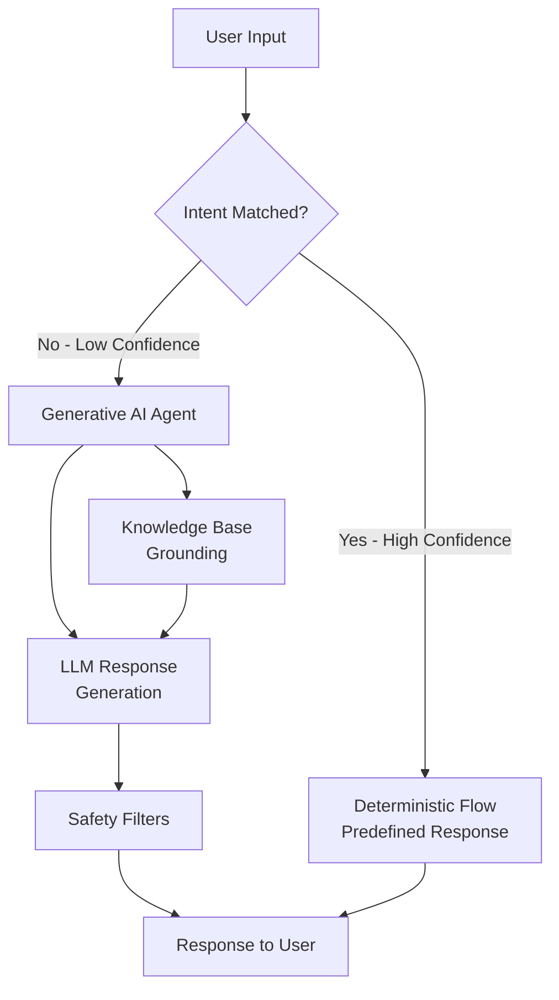

# How to Use Generative AI Agents in Dialogflow CX for Open-Domain Customer Conversations

Author: [nawazdhandala](https://www.github.com/nawazdhandala)

Tags: GCP, Dialogflow CX, Generative AI, LLM, Conversational AI, Customer Support, Google Cloud

Description: Use generative AI agents in Dialogflow CX to handle open-domain customer conversations that go beyond predefined intents and scripted responses.

---

Traditional chatbots break down the moment a customer asks something outside the predefined intent list. You spend months building out intents and training phrases, and then a customer asks a question you never anticipated and gets a frustrating "I don't understand" response. Generative AI agents in Dialogflow CX solve this by using large language models to understand and respond to a much wider range of customer queries, while still giving you control over the conversation flow for critical paths.

In this post, I will show you how to set up generative AI features in Dialogflow CX, configure the LLM for your use case, ground responses in your own data, and maintain guardrails so the agent stays on topic.

## How Generative AI Agents Work in Dialogflow CX

Dialogflow CX generative AI features sit alongside the traditional flow-based architecture. You get the best of both worlds:

- **Deterministic flows** handle well-defined use cases (order lookup, account changes, returns) where you need predictable behavior
- **Generative fallback** handles everything else using an LLM grounded in your company's knowledge base



## Prerequisites

- A Dialogflow CX agent with existing flows
- Vertex AI API enabled
- Knowledge base documents (FAQs, product docs, help articles)
- Generative AI features enabled for your agent

## Step 1: Enable Generative AI Features

Enable the generative AI features on your Dialogflow CX agent. This unlocks LLM-powered responses, generative fallback, and data store-grounded answers.

```python
from google.cloud import dialogflowcx_v3

def enable_generative_features(agent_name):
    """Enables generative AI features on a Dialogflow CX agent."""
    client = dialogflowcx_v3.AgentsClient()

    agent = client.get_agent(name=agent_name)

    # Enable generative AI settings
    agent.gen_app_builder_settings = dialogflowcx_v3.Agent.GenAppBuilderSettings(
        engine="projects/my-project/locations/us-central1/collections/default_collection/engines/my-engine",
    )

    client.update_agent(
        agent=agent,
        update_mask={"paths": ["gen_app_builder_settings"]},
    )
    print("Generative AI features enabled")

enable_generative_features(
    "projects/my-project/locations/us-central1/agents/AGENT_ID"
)
```

## Step 2: Create a Data Store for Knowledge Grounding

The generative agent needs a knowledge base to ground its responses. This prevents hallucination and ensures answers are based on your actual documentation.

First, create a Vertex AI Search data store and populate it with your documents:

```python
from google.cloud import discoveryengine_v1

def create_data_store(project_id, location, data_store_id):
    """Creates a data store for knowledge grounding."""
    client = discoveryengine_v1.DataStoreServiceClient()

    parent = f"projects/{project_id}/locations/{location}/collections/default_collection"

    data_store = discoveryengine_v1.DataStore(
        display_name="Customer Support Knowledge Base",
        industry_vertical=discoveryengine_v1.IndustryVertical.GENERIC,
        solution_types=[discoveryengine_v1.SolutionType.SOLUTION_TYPE_CHAT],
        content_config=discoveryengine_v1.DataStore.ContentConfig.CONTENT_REQUIRED,
    )

    operation = client.create_data_store(
        parent=parent,
        data_store=data_store,
        data_store_id=data_store_id,
    )
    result = operation.result(timeout=300)
    print(f"Data store created: {result.name}")
    return result

create_data_store("my-project", "global", "support-knowledge-base")
```

Now import your knowledge base documents:

```python
from google.cloud import discoveryengine_v1

def import_documents(project_id, data_store_id, gcs_uri):
    """Imports documents from Cloud Storage into the data store."""
    client = discoveryengine_v1.DocumentServiceClient()

    parent = (
        f"projects/{project_id}/locations/global"
        f"/collections/default_collection"
        f"/dataStores/{data_store_id}/branches/default_branch"
    )

    request = discoveryengine_v1.ImportDocumentsRequest(
        parent=parent,
        gcs_source=discoveryengine_v1.GcsSource(
            input_uris=[gcs_uri],
            data_schema="content",
        ),
        reconciliation_mode=discoveryengine_v1.ImportDocumentsRequest.ReconciliationMode.INCREMENTAL,
    )

    operation = client.import_documents(request=request)
    result = operation.result(timeout=600)
    print(f"Documents imported: {result}")
    return result

# Import FAQ documents, product documentation, help articles
import_documents("my-project", "support-knowledge-base", "gs://my-docs-bucket/support-docs/*")
```

## Step 3: Configure the Generative Fallback

Set up the generative fallback handler so that when no intent matches with high confidence, the LLM generates a response grounded in your knowledge base.

```python
from google.cloud import dialogflowcx_v3

def configure_generative_fallback(agent_name, data_store_name):
    """Configures generative fallback for unmatched queries."""
    client = dialogflowcx_v3.AgentsClient()

    agent = client.get_agent(name=agent_name)

    # Configure the default start flow to use generative fallback
    flows_client = dialogflowcx_v3.FlowsClient()
    default_flow_name = f"{agent_name}/flows/00000000-0000-0000-0000-000000000000"
    default_flow = flows_client.get_flow(name=default_flow_name)

    # Add a no-match event handler with generative fallback
    generative_handler = dialogflowcx_v3.EventHandler(
        event="sys.no-match-default",
        trigger_fulfillment=dialogflowcx_v3.Fulfillment(
            messages=[
                dialogflowcx_v3.ResponseMessage(
                    text=dialogflowcx_v3.ResponseMessage.Text(
                        text=["Let me look that up for you."]
                    )
                )
            ],
            # Enable generative fallback
            enable_generative_fallback=True,
        ),
    )

    default_flow.event_handlers.append(generative_handler)

    flows_client.update_flow(
        flow=default_flow,
        update_mask={"paths": ["event_handlers"]},
    )
    print("Generative fallback configured")
```

## Step 4: Set Up Conversation Persona and Instructions

Control how the LLM behaves by setting a persona and providing instructions. This is crucial for keeping the agent on-brand and on-topic.

```python
from google.cloud import dialogflowcx_v3

def configure_agent_persona(agent_name):
    """Sets up the generative agent's persona and behavioral instructions."""
    client = dialogflowcx_v3.AgentsClient()

    agent = client.get_agent(name=agent_name)

    # Set the agent's generative settings
    agent.gen_app_builder_settings = dialogflowcx_v3.Agent.GenAppBuilderSettings(
        engine=(
            "projects/my-project/locations/global"
            "/collections/default_collection/engines/support-engine"
        ),
    )

    # Note: Persona configuration is typically done in the console
    # under Agent Settings > ML > Generative AI
    # Here we demonstrate the key settings:

    client.update_agent(
        agent=agent,
        update_mask={"paths": ["gen_app_builder_settings"]},
    )
    print("Agent persona configured")
```

In the Dialogflow CX console, navigate to Agent Settings > Generative AI and configure:

```text
Agent Name: Acme Support Assistant

Persona Instructions:
- You are a helpful customer support agent for Acme Inc.
- Always be polite and professional.
- If you don't know the answer, say so honestly and offer to connect the user with a human agent.
- Never make up product information or pricing. Only share information from the knowledge base.
- Do not discuss competitors or make comparisons.
- Keep responses concise - no more than 3 sentences for simple questions.
- For account-specific queries (order status, billing), always direct users to the appropriate flow.
```

## Step 5: Implement Guardrails and Safety Filters

Generative responses need guardrails to prevent off-topic responses, hallucinations, and inappropriate content.

```python
from google.cloud import dialogflowcx_v3

def configure_safety_settings(agent_name):
    """Configures safety and content filtering for generative responses."""
    client = dialogflowcx_v3.AgentsClient()
    agent = client.get_agent(name=agent_name)

    # Safety settings are configured through the agent's generative settings
    # These include:
    # - Banned phrases that should never appear in responses
    # - Topic restrictions to keep the agent focused
    # - Content safety thresholds

    # Configure banned phrases via the console or API
    # These prevent the agent from generating certain content
    print("Safety settings should be configured in the console under:")
    print("Agent Settings > Generative AI > Safety")
    print("")
    print("Recommended banned phrases:")
    print("- Competitor product names")
    print("- Legal advice language")
    print("- Medical advice language")
    print("- Pricing guarantees")

configure_safety_settings(
    "projects/my-project/locations/us-central1/agents/AGENT_ID"
)
```

## Step 6: Blend Deterministic and Generative Responses

The real power comes from combining structured flows with generative capabilities. Use deterministic flows for transactional operations and generative responses for informational queries.

Here is a pattern for routing between the two:

```python
from google.cloud import dialogflowcx_v3

def create_hybrid_routing(agent_name, default_flow_name):
    """Sets up routing that combines deterministic flows with generative fallback."""
    client = dialogflowcx_v3.PagesClient()

    # Create a triage page that routes based on query type
    triage_page = dialogflowcx_v3.Page(
        display_name="Query Triage",
        entry_fulfillment=dialogflowcx_v3.Fulfillment(
            messages=[
                dialogflowcx_v3.ResponseMessage(
                    text=dialogflowcx_v3.ResponseMessage.Text(
                        text=["How can I help you today?"]
                    )
                )
            ]
        ),
        transition_routes=[
            # High-confidence transactional intents go to deterministic flows
            dialogflowcx_v3.TransitionRoute(
                intent="projects/.../intents/check-order-status",
                target_flow="projects/.../flows/order-status-flow",
            ),
            dialogflowcx_v3.TransitionRoute(
                intent="projects/.../intents/return-item",
                target_flow="projects/.../flows/returns-flow",
            ),
            dialogflowcx_v3.TransitionRoute(
                intent="projects/.../intents/billing-question",
                target_flow="projects/.../flows/billing-flow",
            ),
        ],
        # For everything else, the generative fallback kicks in
        event_handlers=[
            dialogflowcx_v3.EventHandler(
                event="sys.no-match-default",
                trigger_fulfillment=dialogflowcx_v3.Fulfillment(
                    enable_generative_fallback=True,
                ),
            ),
        ],
    )

    response = client.create_page(
        parent=default_flow_name,
        page=triage_page,
    )
    print(f"Hybrid triage page created: {response.name}")
    return response
```

## Step 7: Monitor and Improve

Track how the generative agent performs and continuously improve its knowledge base.

```python
from google.cloud import dialogflowcx_v3

def get_conversation_analytics(agent_name):
    """Retrieves conversation analytics to identify improvement areas."""
    # Use the Dialogflow CX API to export conversation history
    # Then analyze it for:
    # 1. Queries that triggered generative fallback - add intents for common ones
    # 2. Low-confidence generative responses - add to knowledge base
    # 3. Conversations that ended in agent transfer - automate these if possible

    print("Key metrics to track:")
    print("- Generative fallback rate (target: < 30% of conversations)")
    print("- Customer satisfaction after generative responses")
    print("- Containment rate (conversations resolved without human agent)")
    print("- Response relevance scores")
    print("")
    print("Export conversations from:")
    print(f"Dialogflow CX Console > {agent_name} > Conversation History")
```

## Summary

Generative AI agents in Dialogflow CX give you a safety net for the long tail of customer queries that you cannot anticipate with predefined intents. The key is grounding the LLM in your own data so it gives accurate, brand-appropriate answers, and setting up clear guardrails through persona instructions, banned phrases, and safety filters. Use deterministic flows for transactional operations where you need predictable behavior, and let the generative fallback handle informational queries. Monitor the generative responses closely at first, and gradually expand the knowledge base based on what customers are actually asking about.
