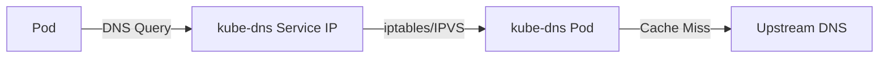
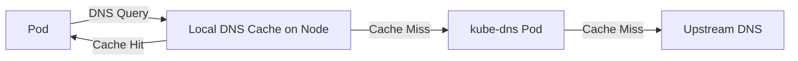

# How to Use GKE Node Local DNS Cache to Reduce DNS Latency for Pods

Author: [nawazdhandala](https://www.github.com/nawazdhandala)

Tags: GCP, GKE, DNS, Kubernetes, Performance, Node Local DNS Cache

Description: Learn how to enable and configure GKE Node Local DNS Cache to reduce DNS lookup latency, improve reliability, and avoid conntrack issues in your cluster.

---

DNS resolution is one of those things that you never think about until it becomes a problem. In a busy GKE cluster, every pod making HTTP requests starts with a DNS lookup. Those lookups go to kube-dns, and when you have hundreds or thousands of pods all hammering the same kube-dns pods, things can get slow. Worse, you can hit Linux conntrack table limits, causing DNS lookups to fail entirely.

Node Local DNS Cache fixes this by running a DNS cache on every node in your cluster. Instead of sending every DNS query across the network to kube-dns, pods resolve names through a local cache that sits on the same node. Cache hits return instantly, and even cache misses benefit from a shorter network path.

## Why Node Local DNS Cache Matters

In a standard GKE cluster, DNS resolution looks like this:



Every DNS query from every pod goes through iptables or IPVS rules to reach one of the kube-dns pods. This has several problems:

- Network latency for every query, even for names that were just resolved
- Conntrack table entries for UDP DNS packets, which can overflow under load
- All DNS load concentrated on a small number of kube-dns pods
- DNAT (Destination NAT) processing adds overhead

With Node Local DNS Cache, the flow changes:



The local cache handles most queries without any network hops. For a typical web application, cache hit rates above 90% are common.

## Enabling Node Local DNS Cache

On GKE, you can enable Node Local DNS Cache as a cluster addon. For existing clusters:

```bash
# Enable Node Local DNS Cache on an existing GKE cluster
gcloud container clusters update my-cluster \
  --zone us-central1-a \
  --update-addons=NodeLocalDNS=ENABLED
```

For new clusters:

```bash
# Create a cluster with Node Local DNS Cache enabled from the start
gcloud container clusters create my-cluster \
  --zone us-central1-a \
  --addons=NodeLocalDNS \
  --num-nodes=3
```

After enabling it, GKE deploys a DaemonSet called `node-local-dns` in the `kube-system` namespace. This runs a DNS cache pod on every node.

## Verifying the Deployment

Check that the DaemonSet is running on all nodes:

```bash
# Verify Node Local DNS pods are running on every node
kubectl get daemonset node-local-dns -n kube-system
```

The DESIRED and READY counts should match the number of nodes in your cluster.

Check the pods:

```bash
# List all Node Local DNS pods and their node assignments
kubectl get pods -n kube-system -l k8s-app=node-local-dns -o wide
```

## How It Works Under the Hood

When Node Local DNS Cache is enabled, GKE modifies the node's iptables rules so that DNS queries from pods are intercepted and sent to the local cache instead of the kube-dns service IP. The local cache listens on a link-local address (169.254.20.10 by default).

If the local cache has the answer, it responds immediately. If not, it forwards the query to kube-dns using TCP (which avoids conntrack issues with UDP). The response is cached locally for future queries.

The key benefit is that cached responses are served from the same node with sub-millisecond latency. No network hop, no conntrack entry, no kube-dns load.

## Measuring the Impact

You can measure DNS resolution times before and after enabling Node Local DNS Cache. Run a test pod and time some DNS lookups:

```bash
# Run a test pod to measure DNS resolution time
kubectl run dns-test --image=busybox:1.36 --restart=Never -- sleep 3600
```

Then exec into it and measure:

```bash
# Time DNS resolution inside the pod
kubectl exec dns-test -- sh -c "time nslookup kubernetes.default.svc.cluster.local"
kubectl exec dns-test -- sh -c "time nslookup google.com"
```

Typical results without Node Local DNS Cache show 1-5ms for cached queries and 10-50ms for external queries. With Node Local DNS Cache, cached queries drop to under 1ms.

## Configuration Options

The Node Local DNS Cache on GKE is managed by Google, so you cannot directly modify its configuration. However, understanding its default behavior is helpful:

- Cache TTL follows the upstream DNS record TTL
- The cache size is tuned for typical workloads
- It supports both IPv4 and IPv6
- The cache listens on 169.254.20.10 for cluster DNS and on the kube-dns service IP

If you need custom configuration, you can inspect the ConfigMap:

```bash
# View the Node Local DNS configuration
kubectl get configmap node-local-dns -n kube-system -o yaml
```

## Handling DNS Negative Caching

One thing to be aware of is negative caching. When a DNS query fails (for example, trying to resolve a service that does not exist yet), the failure is cached too. This means if you create a new service and immediately try to resolve it, the negative cache entry might cause the lookup to fail for a short period.

The default negative cache TTL is 30 seconds. In practice, this is rarely a problem because new service creation and DNS propagation within the cluster happen quickly.

## Monitoring DNS Performance

You can monitor Node Local DNS Cache performance through Cloud Monitoring. Look for these metrics:

```bash
# Check logs for the Node Local DNS pods
kubectl logs -n kube-system -l k8s-app=node-local-dns --tail=50
```

The cache exposes Prometheus metrics that include cache hit rates, query counts, and response times. If your cluster has Cloud Monitoring with managed Prometheus, these metrics are collected automatically.

## Troubleshooting Common Issues

If DNS resolution is still slow after enabling Node Local DNS Cache, check these things.

First, verify the pods are running and healthy:

```bash
# Check for any unhealthy Node Local DNS pods
kubectl get pods -n kube-system -l k8s-app=node-local-dns \
  --field-selector=status.phase!=Running
```

Second, make sure your pods are actually using the local cache. Check the resolv.conf inside a pod:

```bash
# Check which DNS server a pod is using
kubectl exec my-pod -- cat /etc/resolv.conf
```

The nameserver should point to the kube-dns service IP (usually 10.x.0.10), which the node's iptables rules redirect to the local cache.

Third, check if the node has enough resources. The local DNS cache is lightweight, but if a node is under severe resource pressure, even system components can be affected.

## When Not to Use Node Local DNS Cache

Node Local DNS Cache is beneficial for most workloads, but there are edge cases where it might not help:

- If your workloads do very few DNS lookups (for example, long-lived gRPC connections that resolve once at startup)
- If your cluster is very small (3-5 nodes) and DNS is not a bottleneck
- If you are running workloads that rely on very short DNS TTLs for failover (the cache might serve stale entries)

For the vast majority of GKE clusters, enabling Node Local DNS Cache is a straightforward win. It reduces latency, improves reliability, and takes load off kube-dns. It is one of those settings that should probably be on by default.
