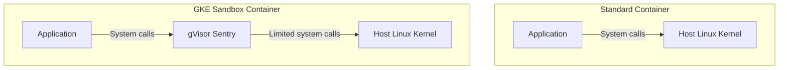

# How to Use GKE Sandbox gVisor to Isolate Untrusted Workloads at the Container Level

Author: [nawazdhandala](https://www.github.com/nawazdhandala)

Tags: GCP, GKE, Kubernetes, gVisor, Security, Container Isolation

Description: Learn how to use GKE Sandbox powered by gVisor to provide an extra layer of kernel-level isolation for running untrusted or multi-tenant container workloads securely.

---

Standard containers share the host kernel. When a container makes a system call, it goes directly to the host kernel. This means a kernel exploit in one container can compromise the entire node and every other container running on it. For trusted workloads from your own team, that risk is manageable. But if you are running untrusted code - user-submitted workloads, third-party plugins, CI/CD build jobs - you need stronger isolation.

GKE Sandbox uses gVisor, an open-source application kernel that intercepts system calls and handles them in user space. Instead of your container talking directly to the host kernel, it talks to gVisor, which acts as a security boundary. Even if the container tries to exploit a kernel vulnerability, it hits gVisor's limited system call surface, not the actual kernel.

## How gVisor Works

gVisor runs a lightweight kernel (called Sentry) in user space for each sandbox. System calls from the container are intercepted and reimplemented by Sentry without touching the host kernel for most operations.



The key difference: in a standard container, the application has direct access to thousands of kernel system calls. With gVisor, the application only sees gVisor's reimplementation, and gVisor only makes a small subset of actual kernel calls.

## When to Use GKE Sandbox

Use GKE Sandbox when:

- Running untrusted or user-submitted code (like a code execution platform)
- Running multi-tenant workloads where different customers share a cluster
- Running CI/CD build jobs that execute arbitrary build scripts
- Processing untrusted inputs that could trigger exploits (media processing, document conversion)
- Compliance requirements demand additional isolation layers

Do not use GKE Sandbox when:

- Your workload needs direct hardware access (GPUs, specific devices)
- You need maximum performance (gVisor adds overhead for system call interception)
- Your workload makes heavy use of system calls not supported by gVisor

## Step 1: Create a Sandbox-Enabled Node Pool

GKE Sandbox requires a dedicated node pool with the sandbox runtime enabled.

```bash
# Create a node pool with GKE Sandbox enabled
gcloud container node-pools create sandbox-pool \
  --cluster my-cluster \
  --region us-central1 \
  --machine-type e2-standard-4 \
  --num-nodes 3 \
  --sandbox type=gvisor \
  --image-type COS_CONTAINERD
```

The `--sandbox type=gvisor` flag enables the gVisor runtime on this node pool. Nodes in this pool will have the `gvisor` RuntimeClass available.

Important: You cannot enable GKE Sandbox on the default node pool. It must be a separate, dedicated pool.

## Step 2: Verify the RuntimeClass

After the node pool is created, GKE automatically creates a RuntimeClass named `gvisor`.

```bash
# Verify the RuntimeClass exists
kubectl get runtimeclass gvisor

# Expected output:
# NAME     HANDLER   AGE
# gvisor   gvisor    5m
```

## Step 3: Deploy a Workload in the Sandbox

To run a pod in the sandbox, add `runtimeClassName: gvisor` to the pod spec.

```yaml
# sandboxed-deployment.yaml - Deploy a workload inside gVisor sandbox
apiVersion: apps/v1
kind: Deployment
metadata:
  name: untrusted-workload
  namespace: default
spec:
  replicas: 3
  selector:
    matchLabels:
      app: untrusted-workload
  template:
    metadata:
      labels:
        app: untrusted-workload
    spec:
      # This is the key line - tells Kubernetes to use gVisor
      runtimeClassName: gvisor
      containers:
        - name: worker
          image: my-sandboxed-app:latest
          ports:
            - containerPort: 8080
          resources:
            requests:
              cpu: "500m"
              memory: "512Mi"
            limits:
              cpu: "1"
              memory: "1Gi"
      # Pods with gvisor runtime are automatically scheduled
      # on sandbox-enabled node pools via a node selector
```

```bash
kubectl apply -f sandboxed-deployment.yaml
```

## Step 4: Verify the Pod Is Running in the Sandbox

Check that your pod is actually using the gVisor runtime.

```bash
# Check the runtimeClassName on running pods
kubectl get pod -l app=untrusted-workload -o jsonpath='{.items[0].spec.runtimeClassName}'
# Output: gvisor

# Exec into the pod and check the kernel version
kubectl exec deploy/untrusted-workload -- uname -r
# Output will show a gVisor kernel version, not the host kernel
# Something like: 4.4.0 (gVisor version, not actual Linux kernel)

# Check /proc/version inside the container
kubectl exec deploy/untrusted-workload -- cat /proc/version
# Output will identify gVisor
```

## Running a Code Execution Platform

Here is a real-world example: a platform that executes user-submitted code in isolated sandboxes.

```yaml
# code-runner.yaml - User code execution in gVisor sandbox
apiVersion: batch/v1
kind: Job
metadata:
  name: user-code-run-12345
  namespace: sandbox-jobs
spec:
  ttlSecondsAfterFinished: 300  # Clean up after 5 minutes
  activeDeadlineSeconds: 60      # Kill after 60 seconds
  template:
    spec:
      runtimeClassName: gvisor
      automountServiceAccountToken: false  # No K8s API access
      containers:
        - name: runner
          image: code-runner:latest
          command: ["/bin/sh", "-c"]
          args:
            - |
              # Execute user code with strict resource limits
              timeout 30 python3 /workspace/user_code.py
          resources:
            requests:
              cpu: "250m"
              memory: "256Mi"
            limits:
              cpu: "500m"
              memory: "512Mi"
          securityContext:
            runAsNonRoot: true
            runAsUser: 65534
            readOnlyRootFilesystem: true
            allowPrivilegeEscalation: false
            capabilities:
              drop:
                - ALL
          volumeMounts:
            - name: code
              mountPath: /workspace
              readOnly: true
      volumes:
        - name: code
          configMap:
            name: user-code-12345
      restartPolicy: Never
```

This combines gVisor isolation with Kubernetes security contexts for defense in depth:

- gVisor intercepts system calls
- Non-root user
- Read-only filesystem
- No privilege escalation
- All capabilities dropped
- No service account token mounted
- Time-limited execution

## Network Policies with Sandboxed Pods

Sandboxed workloads should also have restricted network access.

```yaml
# network-policy-sandbox.yaml - Restrict sandbox pods to internal traffic only
apiVersion: networking.k8s.io/v1
kind: NetworkPolicy
metadata:
  name: sandbox-network-policy
  namespace: sandbox-jobs
spec:
  podSelector:
    matchLabels:
      sandbox: "true"
  policyTypes:
    - Ingress
    - Egress
  egress:
    # Allow DNS only
    - to:
        - namespaceSelector:
            matchLabels:
              kubernetes.io/metadata.name: kube-system
      ports:
        - protocol: UDP
          port: 53
    # Block everything else - no internet access for sandboxed code
```

## Performance Considerations

gVisor adds overhead because it intercepts and reimplements system calls. The impact varies by workload type:

- **CPU-bound workloads**: Minimal overhead (5-10%) since computation happens in user space anyway
- **I/O-bound workloads**: Moderate overhead (15-30%) because file I/O goes through gVisor's VFS layer
- **System call heavy workloads**: Higher overhead (30-50%) because each syscall is intercepted

```bash
# Benchmark to compare standard vs gVisor performance
# Run on a standard pod
kubectl run benchmark --image=my-benchmark:latest -- /run-benchmark.sh

# Run the same benchmark on a sandboxed pod
kubectl run benchmark-sandboxed --image=my-benchmark:latest \
  --overrides='{"spec":{"runtimeClassName":"gvisor"}}' -- /run-benchmark.sh
```

## What gVisor Does Not Support

Some system calls and features are not supported or behave differently in gVisor:

- Raw socket operations (some network tools may not work)
- Some ioctl calls
- Certain /proc and /sys filesystem entries
- Hardware-specific features
- Some advanced filesystem operations

If your application relies on these, test thoroughly in a sandbox environment before production deployment.

## Mixing Sandboxed and Non-Sandboxed Workloads

You can run both sandboxed and non-sandboxed workloads in the same cluster. Pods without `runtimeClassName: gvisor` run on regular node pools as usual.

```yaml
# Trusted workload - runs on standard nodes
apiVersion: apps/v1
kind: Deployment
metadata:
  name: trusted-api
spec:
  template:
    spec:
      # No runtimeClassName - uses standard container runtime
      containers:
        - name: api
          image: my-api:latest
---
# Untrusted workload - runs in gVisor sandbox
apiVersion: apps/v1
kind: Deployment
metadata:
  name: untrusted-processor
spec:
  template:
    spec:
      runtimeClassName: gvisor  # Uses gVisor
      containers:
        - name: processor
          image: untrusted-processor:latest
```

## Monitoring Sandboxed Workloads

Monitor your sandboxed workloads like any other, but be aware that some metrics may look different due to gVisor's virtual kernel.

```bash
# Check resource usage of sandboxed pods
kubectl top pods -l runtimeClassName=gvisor

# View sandbox-specific events
kubectl get events --field-selector involvedObject.name=untrusted-workload
```

## Wrapping Up

GKE Sandbox with gVisor provides a meaningful security improvement for untrusted workloads. By intercepting system calls at the user space level, it prevents container escapes from exploiting host kernel vulnerabilities. The setup is straightforward - create a sandbox-enabled node pool, add `runtimeClassName: gvisor` to your pod specs, and you get kernel-level isolation without managing VMs. Combine it with Kubernetes security contexts, network policies, and resource limits for a comprehensive defense-in-depth strategy. The performance overhead is real but acceptable for workloads where security matters more than raw speed.
