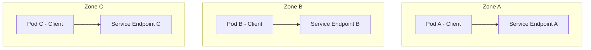

# How to Use GKE Topology-Aware Routing to Reduce Cross-Zone Network Costs

Author: [nawazdhandala](https://www.github.com/nawazdhandala)

Tags: GCP, GKE, Networking, Cost Optimization, Kubernetes, Topology-Aware Routing

Description: Learn how to enable topology-aware routing in GKE to keep traffic within the same zone, reducing cross-zone network costs and improving latency.

---

Cross-zone network traffic in Google Cloud is not free. Every time a pod in zone A talks to a pod in zone B, you pay for the data transfer between zones. For high-traffic services in a regional GKE cluster, this cost adds up quickly. I have seen clusters where cross-zone traffic accounts for a significant portion of the monthly bill.

Topology-aware routing tells Kubernetes to prefer routing traffic to endpoints in the same zone as the client pod. If your service has pods in zones A, B, and C, a request from a pod in zone A will go to a service endpoint also in zone A, instead of being load-balanced across all zones.

## Understanding the Cost

In GCP, intra-zone traffic is free. Cross-zone traffic within the same region costs around $0.01 per GB. That sounds cheap until you do the math. If you have a service handling 10,000 requests per second with 10 KB responses, that is about 100 MB/s. If half of that goes cross-zone, you are looking at roughly $1,300/month just for that one service pair.

Multiply that by all the services in a microservices architecture, and cross-zone traffic can easily cost thousands of dollars monthly.

## How Topology-Aware Routing Works

When topology-aware routing is enabled, the Kubernetes EndpointSlice controller adds zone hints to the endpoints. kube-proxy on each node uses these hints to route traffic to same-zone endpoints preferentially.

The flow looks like this:



Without topology-aware routing, Pod A might be routed to any of the endpoints. With it, Pod A is routed to the endpoint in Zone A.

## Enabling Topology-Aware Routing

Enabling it is straightforward. You add an annotation to your Service:

```yaml
# service.yaml - Service with topology-aware routing enabled
apiVersion: v1
kind: Service
metadata:
  name: my-service
  annotations:
    # Enable topology-aware routing to prefer same-zone endpoints
    service.kubernetes.io/topology-mode: Auto
spec:
  selector:
    app: my-app
  ports:
    - port: 80
      targetPort: 8080
```

The `service.kubernetes.io/topology-mode: Auto` annotation is the current way to enable this feature. In older versions, you might see `service.kubernetes.io/topology-aware-hints: auto` - both work, but the newer annotation is preferred.

Apply the change:

```bash
# Apply the updated service with topology-aware routing
kubectl apply -f service.yaml
```

You can also add the annotation to an existing service:

```bash
# Enable topology-aware routing on an existing service
kubectl annotate service my-service \
  service.kubernetes.io/topology-mode=Auto --overwrite
```

## Verifying It Is Working

After enabling topology-aware routing, check the EndpointSlice to see if zone hints are being set:

```bash
# Check endpoint slices for zone hints
kubectl get endpointslices -l kubernetes.io/service-name=my-service -o yaml
```

Look for the `hints` field on each endpoint. It should show the zone that endpoint is hinted for:

```yaml
endpoints:
  - addresses:
      - 10.0.1.5
    zone: us-central1-a
    hints:
      forZones:
        - name: us-central1-a
```

If hints are not appearing, the controller might have decided that topology-aware routing is not safe for this service (more on that below).

## When Topology-Aware Routing Does Not Activate

The EndpointSlice controller is conservative. It will not add zone hints if doing so would create an imbalanced traffic distribution. Specifically, it requires:

- At least one endpoint in each zone that has pods consuming the service
- The allocation per zone should not exceed 150% of the proportional share

For example, if you have 3 pods in zone A, 3 in zone B, and 1 in zone C, but your client pods are evenly distributed, the controller might skip zone C because it would receive disproportionately more traffic relative to its capacity.

You can check if hints were skipped:

```bash
# Check events for topology hint issues
kubectl get events --field-selector reason=TopologyAwareHintsDisabled
```

The fix is to ensure your deployment has roughly equal replicas across zones. Use topology spread constraints:

```yaml
# deployment.yaml - Deployment with zone spread for topology-aware routing
apiVersion: apps/v1
kind: Deployment
metadata:
  name: my-app
spec:
  replicas: 6
  selector:
    matchLabels:
      app: my-app
  template:
    metadata:
      labels:
        app: my-app
    spec:
      # Spread pods evenly across zones
      topologySpreadConstraints:
        - maxSkew: 1
          topologyKey: topology.kubernetes.io/zone
          whenUnsatisfiable: DoNotSchedule
          labelSelector:
            matchLabels:
              app: my-app
      containers:
        - name: app
          image: us-docker.pkg.dev/my-project/my-repo/app:v1.0
          resources:
            requests:
              cpu: 250m
              memory: 256Mi
```

## Handling Zone Failures

One concern with topology-aware routing is what happens when all pods in a zone go down. If zone A loses all its endpoints, will clients in zone A lose access to the service?

The answer is no. When endpoints in a zone become unavailable, kube-proxy falls back to routing traffic to endpoints in other zones. The failover is automatic. Traffic stays zone-local when possible and spills over when necessary.

## Measuring the Impact

To measure the cost savings, you need to track cross-zone traffic before and after enabling topology-aware routing.

Check network traffic metrics in Cloud Monitoring:

```bash
# Query cross-zone traffic metrics using gcloud
gcloud monitoring time-series list \
  --project=my-project \
  --filter='metric.type="networking.googleapis.com/vm_flow/egress_bytes_count" AND resource.type="gce_instance"' \
  --interval-start-time="2026-02-10T00:00:00Z" \
  --interval-end-time="2026-02-17T00:00:00Z"
```

You can also use VPC Flow Logs to get detailed per-pod traffic analysis:

```bash
# Enable VPC flow logs on the GKE subnet
gcloud compute networks subnets update my-gke-subnet \
  --region us-central1 \
  --enable-flow-logs \
  --logging-flow-sampling=0.1 \
  --logging-metadata=include-all
```

## Applying to All Services

If you want topology-aware routing on all services in your cluster, you can write a script to annotate them:

```bash
# Enable topology-aware routing on all ClusterIP services
for svc in $(kubectl get services --all-namespaces -o jsonpath='{range .items[?(@.spec.type=="ClusterIP")]}{.metadata.namespace}/{.metadata.name}{"\n"}{end}'); do
  ns=$(echo $svc | cut -d/ -f1)
  name=$(echo $svc | cut -d/ -f2)
  kubectl annotate service "$name" -n "$ns" \
    service.kubernetes.io/topology-mode=Auto --overwrite
done
```

## Combining with Other Cost Optimizations

Topology-aware routing works well alongside other GKE cost optimization strategies:

- Use committed use discounts for your base compute
- Enable Node Local DNS Cache to reduce cross-zone DNS traffic
- Right-size your pods to avoid paying for unused resources
- Use preemptible or spot VMs for fault-tolerant workloads

Together, these can reduce your GKE bill significantly. Topology-aware routing specifically targets the network cost component, which is often overlooked but can be substantial in microservices architectures.

## When Not to Use It

Topology-aware routing is not right for every service:

- Services with very few replicas (less than 3) might not have enough endpoints per zone
- Services where you want true global load balancing for even distribution
- Services with significantly uneven traffic patterns across zones

For most internal services in a regional cluster, though, enabling topology-aware routing is a quick win that reduces costs and improves latency with minimal risk. Try it on a few services first, verify the savings, then roll it out more broadly.
