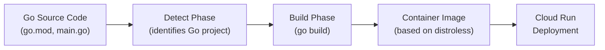

# How to Use Google Cloud Buildpacks to Containerize a Go Application Without Writing a Dockerfile for Cloud Run

Author: [nawazdhandala](https://www.github.com/nawazdhandala)

Tags: GCP, Cloud Build, Buildpacks, Go, Cloud Run, Google Cloud Platform

Description: Use Google Cloud Buildpacks to automatically containerize a Go application without writing a Dockerfile, producing optimized container images ready for deployment on Cloud Run.

---

Writing Dockerfiles is a skill, and getting them right for production takes effort. You need to choose the right base image, handle multi-stage builds for smaller output, manage dependencies, set up non-root users, and keep security patches current. For many applications, this is boilerplate that does not add business value.

Cloud Native Buildpacks, and specifically Google Cloud's buildpacks, automate all of this. You point them at your source code, and they produce an optimized, secure container image - no Dockerfile required. The resulting images follow best practices out of the box: minimal base images, non-root users, and proper layer caching.

Let me show you how this works with a Go application deployed to Cloud Run.

## What Are Buildpacks

Buildpacks originated at Heroku and were later standardized as Cloud Native Buildpacks (CNB). The idea is simple: a buildpack inspects your source code, detects the language and framework, installs dependencies, compiles the application, and produces a runnable container image.

Google maintains a set of buildpacks optimized for GCP:



Supported languages include Go, Node.js, Python, Java, .NET, Ruby, and PHP.

## The Go Application

Here is a simple Go web service that we will containerize:

```go
// main.go - A simple HTTP server for Cloud Run
package main

import (
	"encoding/json"
	"fmt"
	"log"
	"net/http"
	"os"
	"time"
)

// Response is the standard API response structure
type Response struct {
	Message   string `json:"message"`
	Timestamp string `json:"timestamp"`
}

// HealthResponse indicates service health status
type HealthResponse struct {
	Status string `json:"status"`
	Uptime string `json:"uptime"`
}

var startTime time.Time

func init() {
	startTime = time.Now()
}

func main() {
	// Cloud Run sets PORT environment variable
	port := os.Getenv("PORT")
	if port == "" {
		port = "8080"
	}

	// Register routes
	http.HandleFunc("/", handleIndex)
	http.HandleFunc("/health", handleHealth)
	http.HandleFunc("/api/greet", handleGreet)

	log.Printf("Server starting on port %s", port)
	if err := http.ListenAndServe(fmt.Sprintf(":%s", port), nil); err != nil {
		log.Fatal(err)
	}
}

func handleIndex(w http.ResponseWriter, r *http.Request) {
	writeJSON(w, Response{
		Message:   "Hello from Cloud Run with Buildpacks",
		Timestamp: time.Now().Format(time.RFC3339),
	})
}

func handleHealth(w http.ResponseWriter, r *http.Request) {
	writeJSON(w, HealthResponse{
		Status: "healthy",
		Uptime: time.Since(startTime).String(),
	})
}

func handleGreet(w http.ResponseWriter, r *http.Request) {
	name := r.URL.Query().Get("name")
	if name == "" {
		name = "World"
	}
	writeJSON(w, Response{
		Message:   fmt.Sprintf("Hello, %s!", name),
		Timestamp: time.Now().Format(time.RFC3339),
	})
}

func writeJSON(w http.ResponseWriter, data interface{}) {
	w.Header().Set("Content-Type", "application/json")
	json.NewEncoder(w).Encode(data)
}
```

And the Go module file:

```
// go.mod
module example.com/my-app

go 1.22
```

That is it. No Dockerfile. No docker-compose. Just the Go source code.

## Building with pack CLI

The `pack` CLI is the standard tool for building with buildpacks locally:

```bash
# Install pack CLI
# On macOS
brew install buildpacks/tap/pack

# On Linux
(curl -sSL "https://github.com/buildpacks/pack/releases/download/v0.33.0/pack-v0.33.0-linux.tgz" | sudo tar -C /usr/local/bin/ --no-same-owner -xzf - pack)

# Build the image using Google Cloud buildpacks
pack build my-go-app \
  --builder gcr.io/buildpacks/builder:google-22 \
  --env GOOGLE_RUNTIME_VERSION=1.22 \
  --path .

# Check the image - it will be small and based on distroless
docker images my-go-app
```

The `--builder` flag specifies Google's buildpack builder. It inspects your code, sees `go.mod`, recognizes it as a Go project, runs `go build`, and packages the binary into a minimal container.

## Building with Cloud Build

For CI/CD, use Cloud Build which has native buildpack support:

```yaml
# cloudbuild.yaml - Build with buildpacks using Cloud Build
steps:
  # Build using Google Cloud buildpacks
  - name: 'gcr.io/k8s-skaffold/pack'
    args:
      - 'build'
      - '${_REGION}-docker.pkg.dev/$PROJECT_ID/${_REPO}/${_IMAGE}:$SHORT_SHA'
      - '--builder=gcr.io/buildpacks/builder:google-22'
      - '--env=GOOGLE_RUNTIME_VERSION=1.22'
      - '--publish'

  # Deploy to Cloud Run
  - name: 'gcr.io/cloud-builders/gcloud'
    args:
      - 'run'
      - 'deploy'
      - '${_IMAGE}'
      - '--image=${_REGION}-docker.pkg.dev/$PROJECT_ID/${_REPO}/${_IMAGE}:$SHORT_SHA'
      - '--region=${_REGION}'
      - '--platform=managed'
      - '--allow-unauthenticated'

substitutions:
  _REGION: us-central1
  _REPO: apps
  _IMAGE: my-go-app
```

## The Simplest Approach: gcloud run deploy

The fastest path from source to Cloud Run is `gcloud run deploy --source`, which uses buildpacks under the hood:

```bash
# Deploy directly from source code - Cloud Build + Buildpacks + Cloud Run
# in a single command
gcloud run deploy my-go-app \
  --source . \
  --region us-central1 \
  --platform managed \
  --allow-unauthenticated

# This command:
# 1. Uploads source to Cloud Build
# 2. Detects Go, builds with buildpacks
# 3. Pushes image to Artifact Registry
# 4. Deploys to Cloud Run
```

## Customizing the Build

You can customize how buildpacks build your application using environment variables and a `project.toml` file.

```toml
# project.toml - Buildpack configuration

[project]
name = "my-go-app"

# Set build environment variables
[[build.env]]
name = "GOOGLE_RUNTIME_VERSION"
value = "1.22"

# Set flags for the Go compiler
[[build.env]]
name = "GOOGLE_BUILDABLE"
value = "./cmd/server"

# Enable build caching
[[build.env]]
name = "GOOGLE_CLEAR_SOURCE"
value = "true"

# Exclude files from the build context
[build]
exclude = [
  "README.md",
  "docs/",
  "tests/",
  ".github/",
  ".git/",
]
```

Common environment variables for Go buildpacks:

| Variable | Description | Example |
|----------|------------|---------|
| `GOOGLE_RUNTIME_VERSION` | Go version | `1.22` |
| `GOOGLE_BUILDABLE` | Main package path | `./cmd/server` |
| `GOOGLE_CLEAR_SOURCE` | Remove source after build | `true` |
| `GOOGLE_BUILD_ARGS` | Additional go build flags | `-ldflags="-s -w"` |

## Multi-Module Go Projects

For projects with multiple main packages, specify which one to build:

```bash
# Build a specific main package
pack build my-go-app \
  --builder gcr.io/buildpacks/builder:google-22 \
  --env GOOGLE_BUILDABLE=./cmd/server
```

Your project structure might look like:

```
my-project/
  go.mod
  go.sum
  cmd/
    server/
      main.go        # HTTP server
    worker/
      main.go        # Background worker
  internal/
    handlers/
      handlers.go
    models/
      models.go
```

## Adding Procfile for Custom Start Commands

If the default start command does not work for your app, use a Procfile:

```
# Procfile - Custom start command
web: ./cmd/server --config=/etc/app/config.yaml
```

## How the Output Image Differs from a Manual Dockerfile

The buildpack-produced image has some notable characteristics:

```bash
# Inspect the image layers
docker inspect my-go-app | jq '.[0].Config'

# You will see:
# - User is "cnb" (non-root) instead of root
# - The binary is in /workspace, not /app
# - Labels include buildpack metadata
# - Base image is gcr.io/buildpacks/google-22/run (similar to distroless)
```

The image is already optimized:

- Non-root user by default
- Minimal base image with no shell or package manager
- Compiled Go binary with no source code included
- Proper OCI labels for traceability

## Comparing Build Approaches

Here is how the different approaches compare for our Go application:

| Approach | Image Size | Build Time | Maintenance |
|----------|-----------|------------|-------------|
| `FROM golang:1.22` (naive) | ~1.2 GB | Fast | High (update Dockerfile) |
| Multi-stage + distroless | ~15-25 MB | Medium | Medium (manage Dockerfile) |
| Google Cloud Buildpacks | ~20-30 MB | Medium | Low (auto-updated base) |

Buildpack images are slightly larger than a perfectly optimized manual Dockerfile because they include the buildpack launcher, but the difference is small enough to not matter for most applications. The maintenance advantage is the real win - Google updates the base images with security patches automatically.

## Reproducible Builds

Buildpacks support reproducible builds, meaning the same source code produces the same image digest:

```bash
# Build twice and compare digests
pack build my-go-app:v1 --builder gcr.io/buildpacks/builder:google-22
pack build my-go-app:v2 --builder gcr.io/buildpacks/builder:google-22

docker inspect my-go-app:v1 --format='{{.Id}}'
docker inspect my-go-app:v2 --format='{{.Id}}'
# Same digest if source code has not changed
```

## Rebasing for Security Updates

One of the most powerful buildpack features is rebasing. When the base OS image gets a security update, you can update the image without rebuilding your application:

```bash
# Rebase onto a newer base image (security patches only)
pack rebase my-go-app \
  --run-image gcr.io/buildpacks/google-22/run:latest

# This swaps the base layers without touching your app layers
# Much faster than a full rebuild
```

## Deploying with Terraform

Use Terraform to manage the Cloud Run deployment:

```hcl
# cloud-run.tf - Deploy the buildpack-built image

resource "google_cloud_run_v2_service" "app" {
  project  = var.project_id
  name     = "my-go-app"
  location = var.region

  template {
    containers {
      image = "${var.region}-docker.pkg.dev/${var.project_id}/apps/my-go-app:${var.image_tag}"

      ports {
        container_port = 8080
      }

      resources {
        limits = {
          cpu    = "1"
          memory = "256Mi"
        }
        cpu_idle = true
      }

      startup_probe {
        http_get {
          path = "/health"
          port = 8080
        }
      }
    }

    scaling {
      min_instance_count = 0
      max_instance_count = 10
    }
  }
}

resource "google_cloud_run_v2_service_iam_member" "public" {
  project  = var.project_id
  location = var.region
  name     = google_cloud_run_v2_service.app.name
  role     = "roles/run.invoker"
  member   = "allUsers"
}
```

## When to Use Buildpacks vs. Dockerfiles

Use buildpacks when:
- Your application is a standard web service in a supported language
- You want minimal maintenance overhead
- You do not need fine-grained control over every layer
- You want automatic security patch rebasing

Use Dockerfiles when:
- You need system-level packages not provided by buildpacks
- You have very specific optimization requirements
- Your build process is unusual or complex
- You need to match exact image specifications from your security team

## Summary

Google Cloud Buildpacks let you go from Go source code to a production-ready container image without writing a single line of Dockerfile. The resulting images are optimized, secure (non-root, minimal base), and easy to maintain. For most Go applications deployed to Cloud Run, buildpacks are the fastest path to production. Use `gcloud run deploy --source` for the simplest experience, or `pack build` with Cloud Build for more control. You can always switch to a Dockerfile later if you outgrow what buildpacks offer, but many teams find they never need to.
