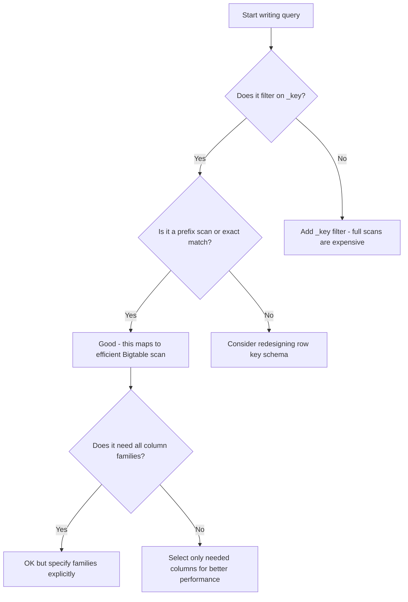

# How to Use GoogleSQL Queries with Cloud Bigtable

Author: [nawazdhandala](https://www.github.com/nawazdhandala)

Tags: GCP, Cloud Bigtable, GoogleSQL, SQL, NoSQL, Data Querying

Description: Learn how to query Cloud Bigtable tables using GoogleSQL syntax, enabling familiar SQL-based data access for your wide-column NoSQL database on Google Cloud.

---

Cloud Bigtable has always been a powerhouse for handling massive datasets - think petabytes of time-series data, user analytics, or IoT readings. But historically, querying it required learning the Bigtable-specific API with row key scans and filter chains. If you came from a SQL background, the learning curve was steep.

That changed when Google introduced GoogleSQL support for Cloud Bigtable. Now you can write familiar SQL queries to read data from your Bigtable tables without abandoning the performance characteristics that made you choose Bigtable in the first place. In this post, I will show you how to get started with GoogleSQL on Bigtable and cover the most useful query patterns.

## What is GoogleSQL for Bigtable?

GoogleSQL is Google's SQL dialect used across multiple products including BigQuery, Spanner, and now Bigtable. The Bigtable implementation lets you run read-only SQL queries against your tables. This is not a full SQL database engine bolted onto Bigtable - it is a query layer that translates SQL into efficient Bigtable scans.

A few important things to understand upfront:

- GoogleSQL queries on Bigtable are read-only. You cannot INSERT, UPDATE, or DELETE with SQL
- Queries are executed against the Bigtable data model (row keys, column families, column qualifiers)
- Performance depends heavily on how well your query maps to Bigtable's strengths (row key prefix scans)
- The feature is available through the Bigtable API, `cbt` CLI, and client libraries

## Understanding the Bigtable Data Model in SQL Terms

Before writing queries, you need to understand how Bigtable's data model maps to SQL concepts.

In Bigtable, data is organized by:
- **Row key** - a unique identifier for each row (maps to `_key` in SQL)
- **Column family** - a group of related columns
- **Column qualifier** - a specific column within a family
- **Timestamp** - each cell value is versioned by timestamp

When you query with GoogleSQL, each column family becomes accessible, and you reference columns using the family and qualifier.

## Getting Started

First, make sure your Bigtable instance is set up and you have data in a table. For these examples, I will use a table called `user_activity` with two column families: `profile` and `activity`.

You can run GoogleSQL queries using the `cbt` CLI tool:

```bash
# Run a GoogleSQL query against a Bigtable table
cbt -project=my-project -instance=my-instance sql "SELECT * FROM user_activity LIMIT 10"
```

## Basic SELECT Queries

The simplest query reads all columns from a table. Here is how to retrieve rows with a limit:

```sql
-- Retrieve the first 10 rows with all columns from the user_activity table
SELECT _key, profile, activity
FROM user_activity
LIMIT 10;
```

The `_key` column always refers to the row key. Column families are referenced by their names directly.

To access specific columns within a family, use bracket notation:

```sql
-- Access specific column qualifiers within column families
SELECT
  _key,
  profile['username'] AS username,
  profile['email'] AS email,
  activity['last_login'] AS last_login
FROM user_activity
LIMIT 10;
```

## Filtering by Row Key

Since Bigtable is optimized for row key lookups, filtering by `_key` is the most efficient query pattern:

```sql
-- Look up a single row by its exact row key
SELECT _key, profile['username'], activity['last_login']
FROM user_activity
WHERE _key = 'user#12345';
```

Row key prefix scans are where Bigtable really shines. If your row keys are designed with a prefix pattern, you can scan efficiently:

```sql
-- Scan all rows with a specific prefix using range operators
SELECT _key, profile['username'], activity['page_view']
FROM user_activity
WHERE _key >= 'user#100' AND _key < 'user#200';
```

This translates directly to an efficient Bigtable row range scan under the hood.

## Working with Timestamps

Every cell in Bigtable can have multiple versions, each with a different timestamp. GoogleSQL gives you access to these versions:

```sql
-- Retrieve cell values with their timestamps
SELECT
  _key,
  activity['page_view'].value AS page_view,
  activity['page_view'].timestamp AS recorded_at
FROM user_activity
WHERE _key = 'user#12345';
```

You can also filter by timestamp to get data within a specific time range:

```sql
-- Filter cell versions to only include data from the last 24 hours
SELECT
  _key,
  activity['page_view']
FROM user_activity
WHERE _key >= 'user#100' AND _key < 'user#200'
  AND activity['page_view'].timestamp > TIMESTAMP_SUB(CURRENT_TIMESTAMP(), INTERVAL 24 HOUR);
```

## Aggregation Queries

GoogleSQL on Bigtable supports basic aggregation functions:

```sql
-- Count the number of rows matching a key prefix
SELECT COUNT(*) AS total_users
FROM user_activity
WHERE _key >= 'user#' AND _key < 'user$';
```

Keep in mind that aggregation queries scan all matching rows, so they can be expensive on large datasets. Always include row key filters to limit the scan range.

## Using CAST for Data Types

Bigtable stores everything as bytes. When you need to work with specific data types, use CAST:

```sql
-- Cast byte values to appropriate data types for comparison
SELECT
  _key,
  CAST(profile['username'] AS STRING) AS username,
  CAST(activity['login_count'] AS INT64) AS login_count
FROM user_activity
WHERE _key >= 'user#100' AND _key < 'user#200'
ORDER BY CAST(activity['login_count'] AS INT64) DESC
LIMIT 20;
```

## Using GoogleSQL from Python

You can run GoogleSQL queries programmatically using the Bigtable client library. Here is a Python example:

```python
# Query Bigtable using GoogleSQL from the Python client library
from google.cloud import bigtable

def query_bigtable_sql(project_id, instance_id):
    """Run a GoogleSQL query against a Bigtable table."""

    client = bigtable.Client(project=project_id)
    instance = client.instance(instance_id)

    # Define the SQL query
    query = """
        SELECT _key, profile['username'], activity['last_login']
        FROM user_activity
        WHERE _key >= 'user#100' AND _key < 'user#200'
        LIMIT 50
    """

    # Execute the query using the instance's execute_query method
    rows = instance.execute_query(query)

    for row in rows:
        print(f"Key: {row['_key']}, Username: {row['username']}")

    return rows

# Run the query
results = query_bigtable_sql("my-project", "my-instance")
```

## Query Patterns to Avoid

Not every SQL pattern works well with Bigtable. Here are some anti-patterns:

**Full table scans without key filters.** A `SELECT * FROM table` without a WHERE clause on `_key` will scan the entire table. On a table with billions of rows, this will time out or cost a fortune.

**Complex JOINs.** GoogleSQL on Bigtable does not support JOINs between tables. Bigtable is a denormalized data store - design your schema so that each query hits a single table.

**Heavy aggregations across huge ranges.** While COUNT, SUM, and AVG work, running them across millions of rows without tight key bounds is going to be slow.

## Query Performance Tips

Here is a quick decision flow for writing efficient queries:



## When to Use GoogleSQL vs. the Native API

GoogleSQL is great for ad-hoc exploration, quick lookups, and when your team is more comfortable with SQL. But for production application code with high throughput requirements, the native Bigtable API still gives you more control over things like:

- Read-modify-write operations
- Conditional mutations
- Fine-grained filter chains
- Streaming reads

Think of GoogleSQL as a complement to the native API, not a replacement. Use SQL for exploration and analytics, and the native API for your application's hot path.

## Wrapping Up

GoogleSQL support for Cloud Bigtable bridges the gap between the familiarity of SQL and the raw power of a wide-column NoSQL store. You get to keep Bigtable's performance characteristics while using a query language that most developers already know. Just remember to always filter on row keys, cast your data types explicitly, and avoid patterns that would trigger full table scans. With those principles in mind, GoogleSQL makes Bigtable significantly more accessible.
