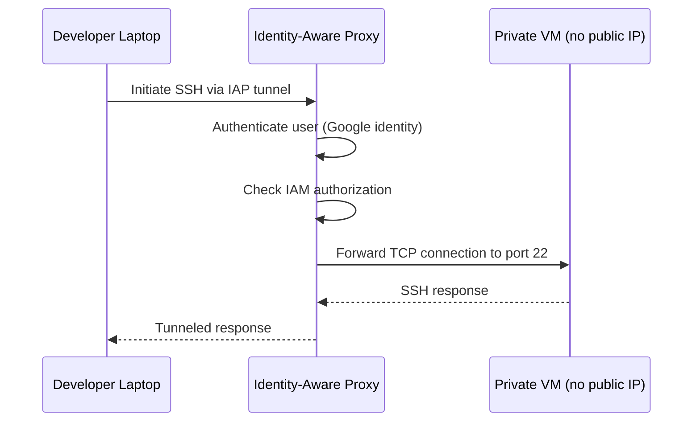

# How to Use IAP TCP Forwarding to SSH into GCP VMs Without Public IP Addresses

Author: [nawazdhandala](https://www.github.com/nawazdhandala)

Tags: GCP, IAP, TCP Forwarding, SSH, Security, Virtual Machines

Description: Learn how to use Identity-Aware Proxy TCP forwarding to securely SSH into Google Cloud VMs that have no public IP addresses, eliminating the need for bastion hosts.

---

Giving VMs public IP addresses just so you can SSH into them is a security risk that most teams accept out of convenience. The alternative used to be setting up bastion hosts or VPN tunnels, both of which come with their own maintenance overhead. IAP TCP forwarding changes that equation entirely.

With IAP TCP forwarding, you can SSH into any VM in your VPC without a public IP address, without a bastion host, and without a VPN. Traffic is tunneled through Google's infrastructure, authenticated against your Google identity, and authorized through IAM. It is secure, auditable, and requires zero additional infrastructure.

## How It Works

When you run `gcloud compute ssh` with IAP, here is what happens:



IAP authenticates you, checks your permissions, and then creates a tunnel from your machine to the VM's SSH port. The VM never needs to be reachable from the internet.

## Prerequisites

- A GCP VM instance (can be in any region)
- The VM does not need a public IP address
- The `gcloud` CLI installed on your local machine
- Your user account needs IAP tunnel access

## Step 1: Remove Public IPs (If Present)

If your VMs currently have public IPs and you want to tighten things up, remove them.

```bash
# Remove the external IP from an existing VM
gcloud compute instances delete-access-config my-vm \
    --access-config-name="external-nat" \
    --zone=us-central1-a \
    --project=my-project-id
```

For new VMs, create them without an external IP.

```bash
# Create a VM without a public IP
gcloud compute instances create my-private-vm \
    --zone=us-central1-a \
    --machine-type=e2-medium \
    --no-address \
    --network=my-vpc \
    --subnet=my-subnet \
    --project=my-project-id
```

## Step 2: Configure Firewall Rules for IAP

IAP TCP forwarding originates from a specific IP range: `35.235.240.0/20`. You need a firewall rule that allows SSH traffic from this range.

```bash
# Allow SSH from IAP's IP range to VMs with a specific tag
gcloud compute firewall-rules create allow-ssh-from-iap \
    --direction=INGRESS \
    --action=ALLOW \
    --rules=tcp:22 \
    --source-ranges=35.235.240.0/20 \
    --target-tags=allow-iap-ssh \
    --network=my-vpc \
    --project=my-project-id
```

Apply the network tag to your VMs.

```bash
# Add the network tag to an existing VM
gcloud compute instances add-tags my-private-vm \
    --tags=allow-iap-ssh \
    --zone=us-central1-a \
    --project=my-project-id
```

If you want all VMs in the network to be accessible via IAP, omit the `--target-tags` flag. But in practice, you should use tags to control which VMs are accessible.

## Step 3: Grant IAP Tunnel Access

Users need the `roles/iap.tunnelResourceAccessor` role to use IAP TCP forwarding.

```bash
# Grant a user permission to use IAP tunnels
gcloud projects add-iam-policy-binding my-project-id \
    --member="user:developer@company.com" \
    --role="roles/iap.tunnelResourceAccessor"
```

For more granular control, you can grant this at the instance level.

```bash
# Grant tunnel access to a specific VM only
gcloud compute instances add-iam-policy-binding my-private-vm \
    --zone=us-central1-a \
    --member="user:developer@company.com" \
    --role="roles/iap.tunnelResourceAccessor" \
    --project=my-project-id
```

## Step 4: SSH Using IAP

Now you can SSH into the VM using IAP tunneling. The `gcloud compute ssh` command supports this natively.

```bash
# SSH into a VM using IAP tunnel
gcloud compute ssh my-private-vm \
    --zone=us-central1-a \
    --tunnel-through-iap \
    --project=my-project-id
```

That is it. No public IP needed. No bastion host. No VPN.

## Using IAP for Other TCP Ports

IAP TCP forwarding is not limited to SSH. You can tunnel any TCP port. This is useful for accessing databases, web servers, or other services running on private VMs.

```bash
# Forward local port 3306 to the VM's MySQL port via IAP
gcloud compute start-iap-tunnel my-private-vm 3306 \
    --local-host-port=localhost:3306 \
    --zone=us-central1-a \
    --project=my-project-id
```

Now you can connect to `localhost:3306` on your machine, and traffic gets tunneled to port 3306 on the VM.

```bash
# Connect to MySQL through the IAP tunnel
mysql -h 127.0.0.1 -P 3306 -u myuser -p
```

For web applications running on port 8080:

```bash
# Forward local port 8080 to the VM's web server via IAP
gcloud compute start-iap-tunnel my-private-vm 8080 \
    --local-host-port=localhost:8080 \
    --zone=us-central1-a \
    --project=my-project-id
```

Then open `http://localhost:8080` in your browser.

## Configuring SSH Config for IAP

If you prefer using the native `ssh` command instead of `gcloud compute ssh`, you can configure your SSH config to use IAP.

```bash
# Add IAP tunnel configuration to your SSH config
cat >> ~/.ssh/config << 'EOF'

# SSH to GCP VMs via IAP
Host gcp-*
    ProxyCommand gcloud compute start-iap-tunnel %h 22 --listen-on-stdin --zone=us-central1-a --project=my-project-id
    User your-username
EOF
```

Now you can use standard SSH tools.

```bash
# SSH using the standard ssh command
ssh gcp-my-private-vm
```

## SCP File Transfer via IAP

You can also transfer files using SCP through IAP.

```bash
# Copy a file to the VM via IAP
gcloud compute scp ./local-file.txt my-private-vm:~/remote-file.txt \
    --zone=us-central1-a \
    --tunnel-through-iap \
    --project=my-project-id

# Copy a file from the VM via IAP
gcloud compute scp my-private-vm:~/remote-file.txt ./local-copy.txt \
    --zone=us-central1-a \
    --tunnel-through-iap \
    --project=my-project-id
```

## Terraform Setup

Here is the Terraform configuration for the firewall rule and IAM binding.

```hcl
# Firewall rule to allow SSH from IAP
resource "google_compute_firewall" "allow_iap_ssh" {
  name    = "allow-ssh-from-iap"
  network = google_compute_network.vpc.name

  allow {
    protocol = "tcp"
    ports    = ["22"]
  }

  # IAP's source IP range
  source_ranges = ["35.235.240.0/20"]
  target_tags   = ["allow-iap-ssh"]
}

# VM without a public IP
resource "google_compute_instance" "private_vm" {
  name         = "my-private-vm"
  machine_type = "e2-medium"
  zone         = "us-central1-a"

  boot_disk {
    initialize_params {
      image = "debian-cloud/debian-12"
    }
  }

  network_interface {
    network    = google_compute_network.vpc.name
    subnetwork = google_compute_subnetwork.subnet.name
    # No access_config block means no external IP
  }

  tags = ["allow-iap-ssh"]
}

# Grant IAP tunnel access to the engineering team
resource "google_iap_tunnel_instance_iam_member" "ssh_access" {
  project  = var.project_id
  zone     = "us-central1-a"
  instance = google_compute_instance.private_vm.name
  role     = "roles/iap.tunnelResourceAccessor"
  member   = "group:engineering@company.com"
}
```

## Troubleshooting

**Connection times out**: Check the firewall rule. Make sure you have a rule allowing TCP port 22 from `35.235.240.0/20` and that the VM has the correct network tag.

**Permission denied (403)**: The user does not have the `iap.tunnelResourceAccessor` role. Grant it at the project or instance level.

**SSH key errors**: `gcloud compute ssh` manages SSH keys through OS Login or project metadata. If you are using OS Login, make sure the user has the `roles/compute.osLogin` or `roles/compute.osAdminLogin` role.

**Slow connections**: IAP adds some latency because traffic goes through Google's infrastructure. For interactive SSH sessions, this is usually not noticeable. For large file transfers, consider using `gsutil` or Cloud Storage instead.

**Firewall rule not taking effect**: Firewall rules apply based on network tags. Verify the VM has the correct tag and the firewall rule targets that tag.

## Security Benefits

IAP TCP forwarding provides several security advantages over traditional SSH access patterns:

1. **No public IPs**: VMs are not exposed to the internet at all
2. **Identity-based access**: Access is controlled through IAM, not SSH keys alone
3. **Audit trail**: Every tunnel connection is logged in Cloud Audit Logs
4. **No infrastructure to manage**: No bastion hosts, no VPN concentrators
5. **Context-aware access**: Combine with Access Context Manager for device-based policies

## Summary

IAP TCP forwarding eliminates the need for public IPs and bastion hosts when you need to SSH into GCP VMs. Set up the firewall rule for IAP's IP range, grant the `tunnelResourceAccessor` role to your users, and use `--tunnel-through-iap` with your SSH commands. You can tunnel any TCP port, not just SSH, making it useful for database connections and internal web UIs too. It is one of those GCP features that, once you start using, you wonder how you ever managed without.
