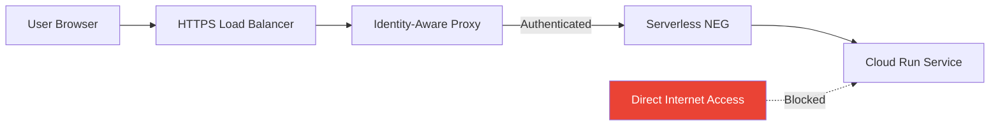

# How to Use IAP to Secure Access to Cloud Run Services Without Public Ingress in GCP

Author: [nawazdhandala](https://www.github.com/nawazdhandala)

Tags: GCP, IAP, Cloud Run, Security, Serverless, Authentication

Description: Learn how to protect Cloud Run services with Identity-Aware Proxy by removing public ingress and routing traffic through a load balancer with IAP authentication.

---

Cloud Run makes it easy to deploy containerized applications, but by default, every Cloud Run service gets a public URL. For internal tools, admin panels, and staging environments, that public URL is a liability. Even if you require authentication in your application code, the service is still directly reachable from the internet.

By putting IAP in front of Cloud Run and setting the ingress to internal-only, you get Google-backed authentication without your service being publicly accessible. IAP handles the sign-in flow, and Cloud Run only accepts traffic from the load balancer.

## Architecture

Here is the full traffic flow:



The Cloud Run service rejects all traffic that does not come through the load balancer. Users authenticate through IAP before their request reaches Cloud Run.

## Step 1: Deploy a Cloud Run Service with Internal Ingress

Deploy your Cloud Run service and set the ingress to `internal-and-cloud-load-balancing`. This blocks direct access from the internet while allowing traffic from the load balancer.

```bash
# Deploy a Cloud Run service with internal-only ingress
gcloud run deploy my-internal-app \
    --image=gcr.io/my-project-id/my-app:latest \
    --region=us-central1 \
    --ingress=internal-and-cloud-load-balancing \
    --no-allow-unauthenticated \
    --project=my-project-id
```

The `--no-allow-unauthenticated` flag adds an extra layer - even if someone bypasses IAP, Cloud Run still requires authentication.

## Step 2: Create a Serverless Network Endpoint Group (NEG)

The load balancer needs a serverless NEG to route traffic to your Cloud Run service.

```bash
# Create a serverless NEG pointing to the Cloud Run service
gcloud compute network-endpoint-groups create my-app-neg \
    --region=us-central1 \
    --network-endpoint-type=serverless \
    --cloud-run-service=my-internal-app \
    --project=my-project-id
```

## Step 3: Create the Backend Service

Create a backend service and attach the serverless NEG.

```bash
# Create a backend service for the Cloud Run serverless NEG
gcloud compute backend-services create my-app-backend \
    --global \
    --load-balancing-scheme=EXTERNAL_MANAGED \
    --project=my-project-id

# Add the serverless NEG to the backend service
gcloud compute backend-services add-backend my-app-backend \
    --global \
    --network-endpoint-group=my-app-neg \
    --network-endpoint-group-region=us-central1 \
    --project=my-project-id
```

## Step 4: Set Up the Load Balancer

Create the URL map, SSL certificate, target proxy, and forwarding rule.

```bash
# Create a URL map
gcloud compute url-maps create my-app-url-map \
    --default-service=my-app-backend \
    --global \
    --project=my-project-id

# Create a managed SSL certificate
gcloud compute ssl-certificates create my-app-cert \
    --domains=my-app.company.com \
    --global \
    --project=my-project-id

# Create the target HTTPS proxy
gcloud compute target-https-proxies create my-app-https-proxy \
    --url-map=my-app-url-map \
    --ssl-certificates=my-app-cert \
    --global \
    --project=my-project-id

# Reserve a static IP address
gcloud compute addresses create my-app-ip \
    --global \
    --project=my-project-id

# Create the forwarding rule
gcloud compute forwarding-rules create my-app-https-rule \
    --global \
    --address=my-app-ip \
    --target-https-proxy=my-app-https-proxy \
    --ports=443 \
    --project=my-project-id
```

Get the IP address and update your DNS to point your domain at it.

```bash
# Get the reserved IP address
gcloud compute addresses describe my-app-ip \
    --global \
    --format="value(address)" \
    --project=my-project-id
```

## Step 5: Enable IAP on the Backend Service

```bash
# Enable IAP on the backend service
gcloud compute backend-services update my-app-backend \
    --iap=enabled \
    --global \
    --project=my-project-id
```

## Step 6: Grant User Access

```bash
# Grant access to internal users
gcloud iap web add-iam-policy-binding \
    --resource-type=backend-services \
    --service=my-app-backend \
    --member="group:internal-users@company.com" \
    --role="roles/iap.httpsResourceAccessor" \
    --project=my-project-id
```

## Step 7: Handle Cloud Run Authentication

Since we set `--no-allow-unauthenticated`, the load balancer's service account needs permission to invoke the Cloud Run service. The load balancer uses the Compute Engine default service account or the service account you configure.

However, when IAP is in front of Cloud Run, IAP handles the authentication. You need to allow IAP to invoke the Cloud Run service.

```bash
# Allow IAP's service agent to invoke the Cloud Run service
gcloud run services add-iam-policy-binding my-internal-app \
    --region=us-central1 \
    --member="serviceAccount:service-PROJECT_NUMBER@gcp-sa-iap.iam.gserviceaccount.com" \
    --role="roles/run.invoker" \
    --project=my-project-id
```

Alternatively, if you want the load balancer to handle invocation without IAP service agent involvement, you can set Cloud Run to allow unauthenticated from the load balancer but rely on IAP for user authentication:

```bash
# Allow unauthenticated invocations (IAP handles authentication)
gcloud run services add-iam-policy-binding my-internal-app \
    --region=us-central1 \
    --member="allUsers" \
    --role="roles/run.invoker" \
    --project=my-project-id
```

This is safe because the ingress setting blocks direct internet access. Only traffic from the load balancer (which goes through IAP) can reach Cloud Run.

## Reading User Identity in Cloud Run

IAP adds identity headers to the request. Your Cloud Run application can read them.

```python
from flask import Flask, request

app = Flask(__name__)

@app.route("/")
def index():
    # Read the authenticated user's email from IAP headers
    user_email = request.headers.get("X-Goog-Authenticated-User-Email", "")

    # Remove the accounts.google.com: prefix
    if ":" in user_email:
        user_email = user_email.split(":", 1)[1]

    # Read the JWT for verification
    jwt_assertion = request.headers.get("X-Goog-Iap-Jwt-Assertion", "")

    return f"Hello, {user_email}!"

if __name__ == "__main__":
    app.run(host="0.0.0.0", port=8080)
```

For production use, verify the JWT to prevent header spoofing.

```python
from google.auth.transport import requests
from google.oauth2 import id_token

def verify_iap_jwt(jwt_token, expected_audience):
    """Verify the IAP JWT and return user email."""
    try:
        decoded = id_token.verify_token(
            jwt_token,
            requests.Request(),
            audience=expected_audience,
            certs_url="https://www.gstatic.com/iap/verify/public_key",
        )
        return decoded.get("email")
    except Exception as e:
        return None
```

## Terraform Configuration

Here is the complete Terraform setup.

```hcl
# Cloud Run service with internal ingress
resource "google_cloud_run_v2_service" "app" {
  name     = "my-internal-app"
  location = "us-central1"

  ingress = "INGRESS_TRAFFIC_INTERNAL_LOAD_BALANCER"

  template {
    containers {
      image = "gcr.io/my-project-id/my-app:latest"
    }
  }
}

# Allow IAP to invoke Cloud Run
resource "google_cloud_run_service_iam_member" "iap_invoker" {
  service  = google_cloud_run_v2_service.app.name
  location = "us-central1"
  role     = "roles/run.invoker"
  member   = "allUsers"
}

# Serverless NEG
resource "google_compute_region_network_endpoint_group" "app_neg" {
  name                  = "my-app-neg"
  region                = "us-central1"
  network_endpoint_type = "SERVERLESS"

  cloud_run {
    service = google_cloud_run_v2_service.app.name
  }
}

# Backend service with IAP
resource "google_compute_backend_service" "app" {
  name                  = "my-app-backend"
  load_balancing_scheme = "EXTERNAL_MANAGED"

  backend {
    group = google_compute_region_network_endpoint_group.app_neg.id
  }

  iap {
    oauth2_client_id     = google_iap_client.app.client_id
    oauth2_client_secret = google_iap_client.app.secret
  }
}

# URL map
resource "google_compute_url_map" "app" {
  name            = "my-app-url-map"
  default_service = google_compute_backend_service.app.id
}

# Managed SSL certificate
resource "google_compute_managed_ssl_certificate" "app" {
  name = "my-app-cert"
  managed {
    domains = ["my-app.company.com"]
  }
}

# HTTPS proxy
resource "google_compute_target_https_proxy" "app" {
  name             = "my-app-https-proxy"
  url_map          = google_compute_url_map.app.id
  ssl_certificates = [google_compute_managed_ssl_certificate.app.id]
}

# Static IP
resource "google_compute_global_address" "app" {
  name = "my-app-ip"
}

# Forwarding rule
resource "google_compute_global_forwarding_rule" "app" {
  name       = "my-app-https-rule"
  target     = google_compute_target_https_proxy.app.id
  ip_address = google_compute_global_address.app.address
  port_range = "443"
}

# IAP access
resource "google_iap_web_backend_service_iam_member" "access" {
  project             = var.project_id
  web_backend_service = google_compute_backend_service.app.name
  role                = "roles/iap.httpsResourceAccessor"
  member              = "group:internal-users@company.com"
}
```

## Troubleshooting

**502 error after enabling IAP**: The load balancer cannot reach Cloud Run. Check that the serverless NEG is correctly configured and the Cloud Run service is running.

**403 after authentication**: The user does not have the `iap.httpsResourceAccessor` role on the backend service.

**Direct URL still accessible**: Make sure the Cloud Run service ingress is set to `internal-and-cloud-load-balancing`, not `all`. Check with:

```bash
gcloud run services describe my-internal-app \
    --region=us-central1 \
    --format="value(spec.template.metadata.annotations['run.googleapis.com/ingress'])" \
    --project=my-project-id
```

**SSL certificate pending**: Managed SSL certificates take some time to provision. Make sure your DNS is pointing to the correct IP address.

## Summary

Combining IAP with Cloud Run gives you authenticated access to serverless applications without exposing them to the public internet. Set the Cloud Run ingress to internal-and-cloud-load-balancing, route traffic through an HTTPS load balancer with a serverless NEG, and enable IAP on the backend service. Users authenticate through Google Sign-In, and your Cloud Run service receives requests with identity headers attached. The setup requires more components than a bare Cloud Run deployment, but the security benefits are significant for internal applications.
