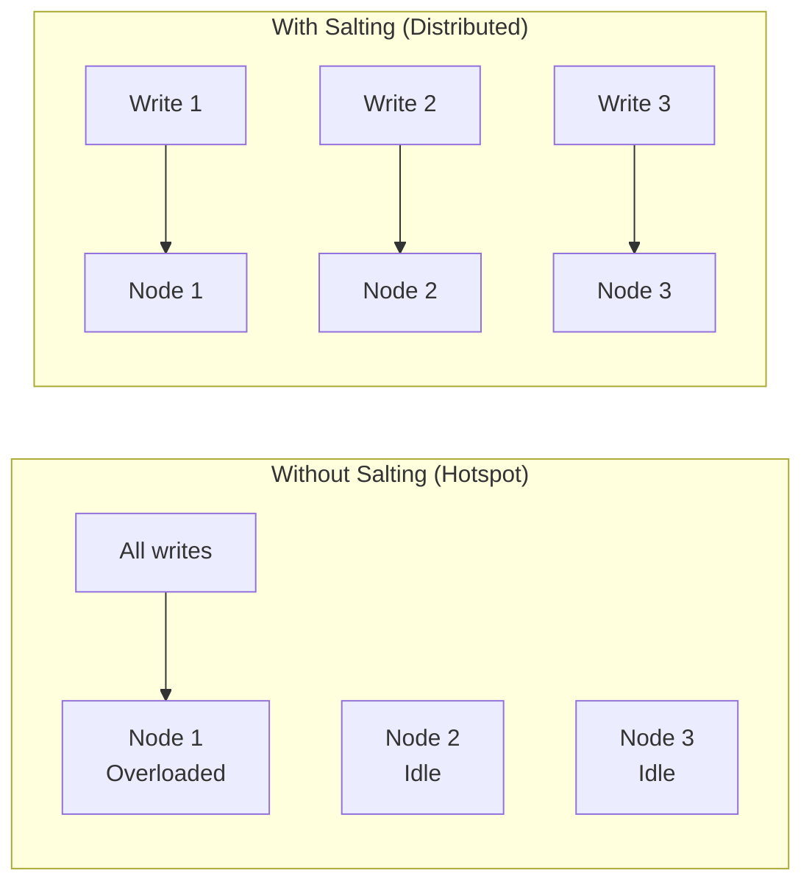

# How to Use Key Salting to Distribute Write Load in Cloud Bigtable

Author: [nawazdhandala](https://www.github.com/nawazdhandala)

Tags: GCP, Cloud Bigtable, Key Salting, Write Distribution, Performance

Description: Learn how to use key salting in Cloud Bigtable to distribute write load evenly across nodes and prevent hotspot-induced performance degradation.

---

If you are writing to Cloud Bigtable with keys that have a common prefix or follow a sequential pattern, you will hit a hotspot. All those writes land on the same tablet (and the same node), creating a bottleneck that can slow your entire cluster to a crawl. Key salting is a technique that adds a computed prefix to your row keys to spread writes across the entire key space.

It is a simple concept with big impact. Let me show you how to implement it correctly and how to handle the tradeoffs.

## The Hotspot Problem

Bigtable stores data sorted by row key and splits the key space into tablets. Each tablet is served by a single node. When all your writes cluster in one part of the key space, one node does all the work while the others sit idle.

Common hotspot-causing patterns:
- Monotonically increasing keys like timestamps: `2026-02-17T10:00:01`, `2026-02-17T10:00:02`, etc.
- Keys starting with the same prefix: `web#event#1`, `web#event#2`, `web#event#3`
- Sequential IDs: `1000001`, `1000002`, `1000003`



## What Key Salting Is

Key salting prepends a short, deterministic prefix to each row key. The prefix is computed from the key itself (usually via a hash), so the same logical key always gets the same salt. This scatters keys that would otherwise be adjacent across different regions of the key space.

```
// Without salting (all writes go to the same region):
event#2026-02-17T10:00:01
event#2026-02-17T10:00:02
event#2026-02-17T10:00:03

// With salting (writes distributed across N buckets):
03#event#2026-02-17T10:00:01
07#event#2026-02-17T10:00:02
01#event#2026-02-17T10:00:03
```

## Implementing Key Salting

Here is a straightforward implementation in Python.

```python
# Key salting implementation for Cloud Bigtable
# Uses a hash-based salt to deterministically distribute keys
import hashlib

class SaltedKeyGenerator:
    def __init__(self, num_buckets=10):
        """
        Initialize with the number of salt buckets.
        More buckets = better distribution but more parallel scans needed for reads.
        """
        self.num_buckets = num_buckets

    def salt_key(self, original_key):
        """
        Generate a salted key by prepending a hash-derived bucket number.
        The same input always produces the same salt (deterministic).
        """
        # Compute hash of the original key
        key_bytes = original_key.encode('utf-8') if isinstance(original_key, str) else original_key
        hash_value = int(hashlib.md5(key_bytes).hexdigest(), 16)

        # Map to a bucket number
        bucket = hash_value % self.num_buckets

        # Prepend the bucket as a zero-padded prefix
        return f"{bucket:02d}#{original_key}"

    def get_all_salted_prefixes(self, original_prefix):
        """
        For scanning, generate all possible salted versions of a prefix.
        You need to scan all buckets and merge the results.
        """
        return [f"{i:02d}#{original_prefix}" for i in range(self.num_buckets)]


# Usage
keygen = SaltedKeyGenerator(num_buckets=10)

# Writing: salt the key before writing
salted_key = keygen.salt_key("event#2026-02-17T10:00:01")
print(f"Salted key: {salted_key}")
# Output: "07#event#2026-02-17T10:00:01" (bucket depends on hash)

# Reading a specific key: salt it the same way
lookup_key = keygen.salt_key("event#2026-02-17T10:00:01")
# Always returns the same salt for the same input
```

## Writing with Salted Keys

Here is how to integrate salting into your Bigtable writes.

```python
# Writing to Bigtable with salted keys
from google.cloud import bigtable
from google.cloud.bigtable import row as bt_row
import time

client = bigtable.Client(project='your-project-id')
instance = client.instance('my-instance')
table = instance.table('events')

keygen = SaltedKeyGenerator(num_buckets=20)

def write_event(event_data):
    """Write an event with a salted row key."""
    # Build the logical key
    logical_key = f"event#{event_data['source']}#{event_data['timestamp']}"

    # Salt it for even distribution
    salted_key = keygen.salt_key(logical_key)

    # Write to Bigtable
    row = table.direct_row(salted_key.encode())
    row.set_cell('data', b'type', event_data['type'].encode())
    row.set_cell('data', b'source', event_data['source'].encode())
    row.set_cell('data', b'payload', event_data['payload'].encode())
    row.commit()

# Write many events - they are distributed across all buckets
for i in range(1000):
    write_event({
        'source': 'web-server',
        'timestamp': f"2026-02-17T10:00:{i:06d}",
        'type': 'page_view',
        'payload': f'{{"page": "/home", "user": "user-{i}"}}'
    })
```

## Reading with Salted Keys

Reading a specific row is easy - just compute the same salt. But scanning for a range of keys requires parallel scans across all salt buckets.

```python
# Reading a specific row with a salted key
def read_event(logical_key):
    """Read a specific event using its logical key."""
    salted_key = keygen.salt_key(logical_key)
    row = table.read_row(salted_key.encode())

    if row:
        return {
            col.decode(): cells[0].value.decode()
            for col, cells in row.cells['data'].items()
        }
    return None

# Reading a range: scan all buckets in parallel and merge results
import concurrent.futures

def scan_events(prefix, limit_per_bucket=100):
    """
    Scan for events matching a prefix across all salt buckets.
    Runs scans in parallel for better performance.
    """
    all_salted_prefixes = keygen.get_all_salted_prefixes(prefix)
    all_results = []

    def scan_bucket(salted_prefix):
        """Scan a single salt bucket."""
        results = []
        rows = table.read_rows(
            row_set=bt_row.RowRange(
                start_key=salted_prefix.encode(),
                end_key=(salted_prefix + '\xff').encode()
            ),
            limit=limit_per_bucket
        )

        for row in rows:
            result = {
                'key': row.row_key.decode(),
                'data': {}
            }
            for col, cells in row.cells.get('data', {}).items():
                result['data'][col.decode()] = cells[0].value.decode()
            results.append(result)

        return results

    # Scan all buckets in parallel
    with concurrent.futures.ThreadPoolExecutor(max_workers=keygen.num_buckets) as executor:
        futures = {executor.submit(scan_bucket, prefix): prefix
                   for prefix in all_salted_prefixes}

        for future in concurrent.futures.as_completed(futures):
            bucket_results = future.result()
            all_results.extend(bucket_results)

    # Sort results by the original (unsalted) key
    all_results.sort(key=lambda r: r['key'].split('#', 1)[1])
    return all_results

# Usage: scan all events from a specific source
results = scan_events("event#web-server#2026-02-17")
print(f"Found {len(results)} events")
```

## Java Implementation

Here is the same pattern in Java, which is the most common language for Bigtable applications.

```java
// Key salting implementation in Java for Cloud Bigtable
import com.google.cloud.bigtable.data.v2.BigtableDataClient;
import com.google.cloud.bigtable.data.v2.models.*;
import com.google.protobuf.ByteString;
import java.security.MessageDigest;

public class SaltedBigtableWriter {
    private final int numBuckets;
    private final BigtableDataClient client;
    private final String tableId;

    public SaltedBigtableWriter(BigtableDataClient client, String tableId, int numBuckets) {
        this.client = client;
        this.tableId = tableId;
        this.numBuckets = numBuckets;
    }

    // Compute the salt bucket for a given key
    public int computeSalt(String key) {
        try {
            MessageDigest md = MessageDigest.getInstance("MD5");
            byte[] hash = md.digest(key.getBytes("UTF-8"));
            int hashInt = ((hash[0] & 0xFF) << 24) | ((hash[1] & 0xFF) << 16)
                        | ((hash[2] & 0xFF) << 8) | (hash[3] & 0xFF);
            return Math.abs(hashInt % numBuckets);
        } catch (Exception e) {
            throw new RuntimeException(e);
        }
    }

    // Generate a salted row key
    public String saltKey(String logicalKey) {
        int salt = computeSalt(logicalKey);
        return String.format("%02d#%s", salt, logicalKey);
    }

    // Write a row with a salted key
    public void writeRow(String logicalKey, String family, String qualifier, String value) {
        String saltedKey = saltKey(logicalKey);
        RowMutation mutation = RowMutation.create(tableId, saltedKey)
            .setCell(family, qualifier, value);
        client.mutateRow(mutation);
    }
}
```

## Choosing the Number of Buckets

The number of salt buckets is a critical design decision. Too few buckets and you still have hotspots. Too many and your parallel scans become expensive.

Guidelines:
- Start with the number of nodes in your cluster multiplied by 2-3
- For a 3-node cluster, use 6-10 buckets
- For a 10-node cluster, use 20-30 buckets
- Never use more buckets than necessary - each bucket adds a parallel scan for range queries

```python
# Benchmark different bucket counts to find the sweet spot
# Run this against your actual workload
import time

for num_buckets in [5, 10, 20, 50]:
    keygen = SaltedKeyGenerator(num_buckets=num_buckets)

    # Measure write distribution
    bucket_counts = {}
    for key in test_keys:  # Your actual key set
        salted = keygen.salt_key(key)
        bucket = salted.split('#')[0]
        bucket_counts[bucket] = bucket_counts.get(bucket, 0) + 1

    # Check distribution evenness
    counts = list(bucket_counts.values())
    min_count = min(counts)
    max_count = max(counts)
    ratio = max_count / min_count if min_count > 0 else float('inf')

    print(f"Buckets: {num_buckets}, Min: {min_count}, Max: {max_count}, Ratio: {ratio:.2f}")
```

A ratio close to 1.0 means perfectly even distribution. Anything under 1.5 is usually good enough.

## Salting vs Hashing vs Reversing

There are several approaches to key distribution. Here is how they compare:

| Approach | Pros | Cons |
|----------|------|------|
| Salting (N buckets) | Controlled distribution, parallel scan possible | Need to scan all buckets for range queries |
| Full hash prefix | Maximum distribution | Lose scan ability entirely |
| Reverse key | Preserves some scan ability | Limited distribution if keys share a suffix |
| Composite key | Natural distribution if prefix is high-cardinality | Depends on data characteristics |

Salting is the best general-purpose choice because it gives you predictable distribution while still allowing range scans (with parallel bucket scanning).

## Wrapping Up

Key salting is a proven technique for preventing hotspots in Cloud Bigtable. By prepending a hash-derived bucket number to your row keys, you force even distribution of writes across all nodes in your cluster. The tradeoff is that range scans require parallel queries across all salt buckets, but with proper parallelization, this overhead is manageable. Choose your bucket count based on your cluster size, use deterministic hashing so reads can reconstruct the salted key, and verify your distribution using Key Visualizer. With salting in place, your Bigtable cluster can achieve the throughput it was designed for.
