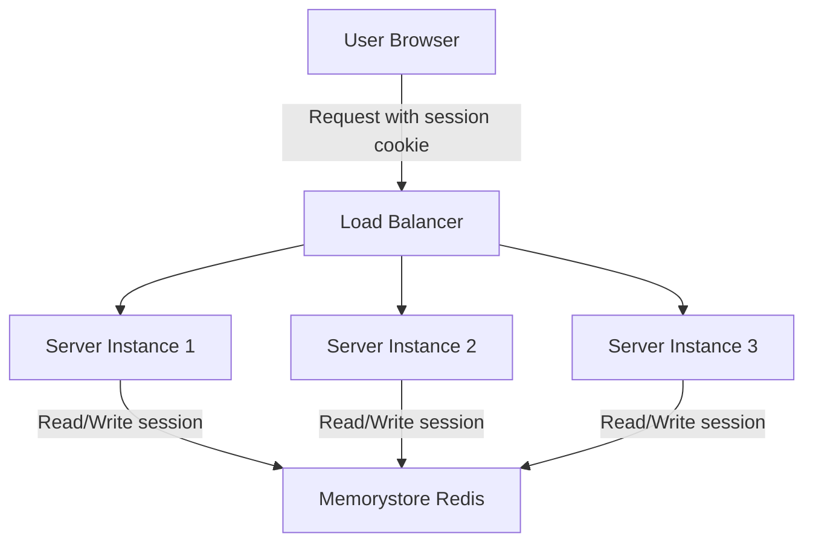

# How to Use Memorystore Redis as a Session Store for Web Applications on GCP

Author: [nawazdhandala](https://www.github.com/nawazdhandala)

Tags: GCP, Memorystore, Redis, Session Management, Web Applications

Description: Implement Redis-based session management for web applications on GCP using Memorystore, covering session storage patterns, security, and scaling across multiple instances.

---

Storing sessions in memory on your web server works fine until you scale to multiple instances. The moment a user's request hits a different server than the one holding their session, they get logged out. Load balancer sticky sessions are a workaround, but they create uneven load distribution and break when servers restart.

The clean solution is to externalize your session store. Every web server reads and writes sessions from a shared Redis instance. Memorystore for Redis is ideal for this because it gives you sub-millisecond read latency (so session lookups do not slow down your requests), built-in replication for availability, and automatic expiration for session cleanup.

I have used this pattern for applications serving millions of sessions. In this post, I will show you how to set it up with different web frameworks and handle the operational concerns.

## Architecture



Every server instance connects to the same Redis instance. Sessions are stored as key-value pairs where the key is the session ID and the value is the serialized session data.

## Setting Up Memorystore for Sessions

Create a Redis instance optimized for session storage:

```bash
# Create a Standard Tier Redis instance for session storage
gcloud redis instances create session-store \
  --size=2 \
  --region=us-central1 \
  --tier=standard \
  --redis-version=redis_7_0 \
  --enable-auth \
  --redis-config=maxmemory-policy=volatile-lru \
  --maintenance-window-day=SUNDAY \
  --maintenance-window-hour=3 \
  --display-name="Session Store"
```

Key configuration choices:

- **Standard Tier** - Sessions should survive zone failures. Losing all sessions means logging out every user.
- **volatile-lru eviction policy** - When memory is full, evict the least recently used keys that have a TTL set. This ensures inactive sessions are cleaned up before active ones.
- **2 GB size** - A typical session is 1-5 KB. 2 GB holds hundreds of thousands of concurrent sessions.

## Python Flask with Redis Sessions

Flask does not use Redis for sessions by default. Add the `flask-session` extension:

```bash
# Install Flask-Session with Redis support
pip install flask flask-session redis
```

```python
# app.py - Flask application with Redis-backed sessions
import os
from flask import Flask, session, jsonify, request
from flask_session import Session
import redis

app = Flask(__name__)

# Configure Flask-Session to use Redis
app.config["SESSION_TYPE"] = "redis"
app.config["SESSION_PERMANENT"] = True
app.config["PERMANENT_SESSION_LIFETIME"] = 86400  # 24 hours in seconds
app.config["SESSION_USE_SIGNER"] = True  # Sign session cookies for security
app.config["SESSION_KEY_PREFIX"] = "session:"  # Prefix for Redis keys
app.config["SECRET_KEY"] = os.environ.get("FLASK_SECRET_KEY", "change-this-in-production")

# Connect to Memorystore Redis
app.config["SESSION_REDIS"] = redis.Redis(
    host=os.environ.get("REDIS_HOST", "10.0.0.3"),
    port=int(os.environ.get("REDIS_PORT", "6379")),
    password=os.environ.get("REDIS_AUTH"),
    socket_timeout=5,
    retry_on_timeout=True
)

# Initialize the session extension
Session(app)

@app.route("/login", methods=["POST"])
def login():
    """Authenticate user and create a session."""
    data = request.get_json()
    username = data.get("username")

    # In production, validate credentials against your user database
    if username:
        # Store user data in the session
        session["user_id"] = username
        session["logged_in"] = True
        session["login_time"] = str(os.popen("date").read().strip())
        return jsonify({"status": "logged in", "user": username})

    return jsonify({"error": "username required"}), 400

@app.route("/profile")
def profile():
    """Return the current user's profile from their session."""
    if not session.get("logged_in"):
        return jsonify({"error": "not logged in"}), 401

    return jsonify({
        "user_id": session["user_id"],
        "login_time": session.get("login_time"),
        "session_data": dict(session)
    })

@app.route("/logout", methods=["POST"])
def logout():
    """Destroy the user's session."""
    session.clear()
    return jsonify({"status": "logged out"})

if __name__ == "__main__":
    app.run(host="0.0.0.0", port=8080)
```

## Node.js Express with Redis Sessions

```bash
# Install required packages
npm install express express-session connect-redis redis
```

```javascript
// app.js - Express application with Redis-backed sessions
const express = require("express");
const session = require("express-session");
const { createClient } = require("redis");
const RedisStore = require("connect-redis").default;

async function startServer() {
    const app = express();
    app.use(express.json());

    // Create a Redis client for session storage
    const redisClient = createClient({
        socket: {
            host: process.env.REDIS_HOST || "10.0.0.3",
            port: parseInt(process.env.REDIS_PORT || "6379"),
            connectTimeout: 5000,
        },
        password: process.env.REDIS_AUTH,
    });

    redisClient.on("error", (err) => console.error("Redis session error:", err));
    await redisClient.connect();

    // Configure session middleware with Redis store
    app.use(
        session({
            store: new RedisStore({
                client: redisClient,
                prefix: "sess:", // Key prefix in Redis
                ttl: 86400, // Session TTL in seconds (24 hours)
            }),
            secret: process.env.SESSION_SECRET || "change-this-in-production",
            resave: false, // Do not save session if unmodified
            saveUninitialized: false, // Do not create session until data is stored
            cookie: {
                secure: process.env.NODE_ENV === "production", // HTTPS only in production
                httpOnly: true, // Prevent client-side JS access
                maxAge: 86400000, // Cookie expiration in milliseconds
                sameSite: "lax", // CSRF protection
            },
        })
    );

    // Login endpoint
    app.post("/login", (req, res) => {
        const { username } = req.body;
        if (!username) {
            return res.status(400).json({ error: "username required" });
        }

        // Store user info in session
        req.session.userId = username;
        req.session.loggedIn = true;
        req.session.loginTime = new Date().toISOString();

        res.json({ status: "logged in", user: username });
    });

    // Profile endpoint
    app.get("/profile", (req, res) => {
        if (!req.session.loggedIn) {
            return res.status(401).json({ error: "not logged in" });
        }

        res.json({
            userId: req.session.userId,
            loginTime: req.session.loginTime,
        });
    });

    // Logout endpoint
    app.post("/logout", (req, res) => {
        req.session.destroy((err) => {
            if (err) {
                return res.status(500).json({ error: "logout failed" });
            }
            res.clearCookie("connect.sid");
            res.json({ status: "logged out" });
        });
    });

    const port = process.env.PORT || 8080;
    app.listen(port, () => console.log(`Server running on port ${port}`));
}

startServer().catch(console.error);
```

## Django with Redis Sessions

```bash
# Install the Django Redis session backend
pip install django-redis
```

```python
# settings.py - Django settings for Redis session backend
import os

# Configure Django to use Redis for sessions
SESSION_ENGINE = "django.contrib.sessions.backends.cache"
SESSION_CACHE_ALIAS = "sessions"

# Cache configuration pointing to Memorystore Redis
CACHES = {
    "default": {
        "BACKEND": "django_redis.cache.RedisCache",
        "LOCATION": f"redis://:{os.environ.get('REDIS_AUTH', '')}@{os.environ.get('REDIS_HOST', '10.0.0.3')}:6379/0",
        "OPTIONS": {
            "CLIENT_CLASS": "django_redis.client.DefaultClient",
            "SOCKET_CONNECT_TIMEOUT": 5,
            "SOCKET_TIMEOUT": 5,
            "RETRY_ON_TIMEOUT": True,
        }
    },
    "sessions": {
        "BACKEND": "django_redis.cache.RedisCache",
        "LOCATION": f"redis://:{os.environ.get('REDIS_AUTH', '')}@{os.environ.get('REDIS_HOST', '10.0.0.3')}:6379/1",
        "OPTIONS": {
            "CLIENT_CLASS": "django_redis.client.DefaultClient",
            "SERIALIZER": "django_redis.serializers.json.JSONSerializer",
        }
    }
}

# Session settings
SESSION_COOKIE_AGE = 86400  # 24 hours
SESSION_COOKIE_SECURE = True  # HTTPS only
SESSION_COOKIE_HTTPONLY = True  # No JS access
SESSION_COOKIE_SAMESITE = "Lax"
```

## Session Security Best Practices

**Sign your session cookies.** The session ID in the cookie should be signed so users cannot forge session IDs. All the frameworks above support signed cookies.

**Set httpOnly and secure flags.** These cookie flags prevent client-side JavaScript from reading the session cookie and ensure it is only sent over HTTPS.

**Use short session TTLs.** A 24-hour session is reasonable for most applications. For sensitive applications (banking, healthcare), use shorter TTLs (30 minutes to 2 hours).

**Regenerate session IDs on login.** After authentication, create a new session ID to prevent session fixation attacks:

```python
# Flask: regenerate session ID after login
from flask import session
import uuid

@app.route("/login", methods=["POST"])
def login():
    # After validating credentials...
    # Clear the old session and start fresh
    session.clear()
    session["user_id"] = authenticated_user_id
    session.sid = str(uuid.uuid4())  # New session ID
```

**Limit session data size.** Store only essential data in the session (user ID, roles, preferences). Do not store large objects. Keep sessions under 5 KB.

## Monitoring Session Storage

Track these metrics to understand your session load:

```python
# monitor_sessions.py - Monitor Redis session store health
import redis
import os

def monitor_session_store():
    """Report on session store metrics."""
    r = redis.Redis(
        host=os.environ.get("REDIS_HOST"),
        port=6379,
        password=os.environ.get("REDIS_AUTH"),
        decode_responses=True
    )

    info = r.info()

    # Count active sessions
    session_count = 0
    for key in r.scan_iter(match="session:*", count=1000):
        session_count += 1

    memory_mb = info["used_memory"] / (1024 * 1024)
    max_memory_mb = info["maxmemory"] / (1024 * 1024)

    print(f"Active sessions: {session_count}")
    print(f"Memory usage: {memory_mb:.1f} MB / {max_memory_mb:.1f} MB")
    print(f"Connected clients: {info['connected_clients']}")
    print(f"Evicted keys: {info['evicted_keys']}")

    if session_count > 0:
        avg_session_size = (info["used_memory"] / session_count) / 1024
        print(f"Average session size: {avg_session_size:.1f} KB")

monitor_session_store()
```

## Sizing for Session Storage

Estimate the Redis size you need:

```
Required memory = (concurrent sessions) x (average session size) x 1.5 (overhead)
```

For example:
- 100,000 concurrent sessions
- 3 KB average session size
- 1.5x overhead factor

```
100,000 x 3 KB x 1.5 = 450 MB
```

A 1 GB instance would comfortably handle this with room to grow. Round up to 2 GB for headroom.

## Handling Redis Downtime

For session storage, Redis downtime means users cannot log in or their requests fail. Implement graceful degradation:

```python
# Graceful degradation when Redis is unavailable
def get_session_data(session_id):
    """Attempt to read session from Redis with fallback."""
    try:
        data = redis_client.get(f"session:{session_id}")
        if data:
            return json.loads(data)
    except redis.ConnectionError:
        # Redis is down - log the issue
        logger.warning("Redis unavailable for session read")
        # Option 1: Return None and force re-authentication
        # Option 2: Fall back to signed JWT for temporary session
        return None

    return None
```

For critical applications, consider these strategies:
- Use Standard Tier for automatic failover
- Set min-instances on Cloud Run to keep connections warm
- Implement JWT-based fallback for short-lived sessions

## Wrapping Up

Using Memorystore Redis as a session store is one of the most common and highest-value patterns for Redis on GCP. It solves the distributed session problem cleanly, provides sub-millisecond session lookups, and handles session expiration automatically. Choose Standard Tier for production, configure the volatile-lru eviction policy, secure your cookies, and monitor your session count and memory usage. With this setup, your web application scales horizontally without any session management headaches.
