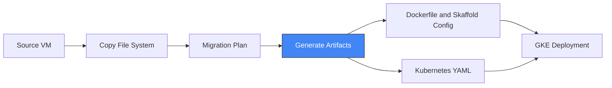

# How to Use Migrate to Containers to Convert VMs to GKE Workloads

Author: [nawazdhandala](https://www.github.com/nawazdhandala)

Tags: GCP, Migrate to Containers, GKE, Kubernetes, VM Migration

Description: Learn how to use GCP Migrate to Containers to automatically convert virtual machine workloads into container images and Kubernetes deployments running on GKE.

---

You have a fleet of virtual machines running applications that would benefit from containerization - better resource utilization, easier scaling, faster deployments. But rewriting applications and creating Dockerfiles from scratch for dozens or hundreds of VMs is a massive undertaking. Migrate to Containers (M2C) automates much of this conversion, turning VM file systems into container build artifacts and generating Kubernetes deployment artifacts.

M2C copies a VM file system, analyzes the application and its dependencies, generates a migration plan, and creates the Dockerfiles and Kubernetes YAML you need to build and deploy it on GKE. It is not a magic button - you will still need to tune the results - but it dramatically reduces the effort compared to manual containerization.

## How Migrate to Containers Works

The process has several stages:


```mermaid
flowchart LR
    A[Source VM] --> B[Copy File System]
    B --> C[Migration Plan]
    C --> D[Generate Artifacts]
    D --> E[Dockerfile and Skaffold Config]
    D --> F[Kubernetes YAML]
    E --> G[GKE Deployment]
    F --> G

    style D fill:#4285f4,stroke:#333,color:#fff
```

1. **Copy the source VM file system**: Copy the VM file system locally using `m2c copy`
2. **Create a migration plan**: M2C analyzes the copied file system and writes a migration plan
3. **Review and customize**: You review the plan, adjust what gets included in the container
4. **Generate artifacts**: M2C generates Dockerfiles, Kubernetes manifests, and Skaffold configuration
5. **Build and deploy**: Use the generated artifacts to build the image and deploy it to GKE

## Prerequisites

- A Linux local machine or VM with Docker installed
- The Migrate to Containers CLI (`m2c`)
- Skaffold for building and deploying the generated artifacts
- Source VMs running on Compute Engine, VMware, or another environment reachable by SSH
- A GKE cluster where you will deploy the migrated workload

## Step 1: Set Up the GKE Cluster

Create a GKE cluster where you will deploy the migrated workload:

```bash
# Create a GKE cluster for the migrated workload
gcloud container clusters create m2c-cluster \
  --zone=us-central1-a \
  --machine-type=e2-standard-4 \
  --num-nodes=3 \
  --enable-ip-alias \
  --project=PROJECT_ID

# Get credentials
gcloud container clusters get-credentials m2c-cluster \
  --zone=us-central1-a \
  --project=PROJECT_ID
```

Install Migrate to Containers on your local Linux machine:

```bash
# Install Docker first, then download the Migrate to Containers CLI
curl -O "https://m2c-cli-release.storage.googleapis.com/$(curl -s https://m2c-cli-release.storage.googleapis.com/latest)/linux/amd64/m2c"
chmod +x ./m2c

# Install Skaffold
curl -Lo skaffold https://storage.googleapis.com/skaffold/releases/latest/skaffold-linux-amd64 && \
  sudo install skaffold /usr/local/bin/
```

Verify the installation:

```bash
# Check the M2C CLI version
./m2c version
```

## Step 2: Create a Migration Source

Copy the source VM file system to your local machine. For Compute Engine VMs:

```bash
# Copy a Compute Engine VM file system
./m2c copy gcloud \
  --project PROJECT_ID \
  --zone us-central1-a \
  --vm-name web-server-vm-001 \
  --output web-server-filesystem
```

For VMware VMs or other VMs reachable over SSH:

```bash
# Copy a VM file system over SSH
./m2c copy ssh user@vmware-or-ec2-host.example.com \
  --output web-server-filesystem \
  --remote-sudo
```

If you need to customize what is copied, start from the default filters:

```bash
# Save the default copy filters, edit them, then pass them to m2c copy
./m2c copy default-filters > filters.txt
```

## Step 3: Create a Migration

Start a migration analysis for the copied VM file system:

```bash
# Analyze a Linux VM file system
./m2c analyze \
  --source web-server-filesystem \
  --plugin linux-vm-container \
  --output analysis-output
```

The `--plugin` parameter specifies the type of workload you want to produce:

- `linux-vm-container`: Generate a Linux system container from a Linux VM
- `apache-container`: Generate an application container for Apache workloads
- `tomcat-container`: Generate an application container for Tomcat workloads

Check the analysis output:

```bash
# Check the generated analysis files
ls analysis-output
```

## Step 4: Generate and Review the Migration Plan

Once M2C has analyzed the VM, it generates a migration plan:

```bash
# Open the migration plan for review
less analysis-output/config.yaml
```

The plan is a YAML file that describes what M2C found on the VM and how it plans to containerize it. Here is an example plan fragment:

```yaml
# config.yaml generated by M2C
filters:
  - "- /tmp/***"
  - "- /var/tmp/***"
  - "- /var/cache/***"

systemServices:
  - name: nginx
    enabled: true
    probed: true
  - name: cron
    enabled: false
    probed: false

endpoints:
  - port: 80
    protocol: HTTP
    name: web-server-nginx
  - port: 8080
    protocol: TCP
    name: web-server-app

nfsMounts:
  - mountPoint: /mnt/shared
    exportedDirectory: /exports/shared
    nfsServer: 10.0.0.10
    mountOptions:
      - rw
    enabled: false

deployment:
  logPaths:
    - appName: nginx
      globs:
        - /var/log/nginx/*.log
```

Review this plan carefully. Common adjustments include:

- Removing unnecessary services from the container
- Adjusting which paths are included or excluded
- Configuring external mounts or data migration for persistent data
- Setting the right service endpoints and log paths

To edit the plan:

```bash
# Edit the generated plan directly
vi analysis-output/config.yaml
```

## Step 5: Generate Container Artifacts

Once you are happy with the plan, generate the container build files and Kubernetes manifests:

```bash
# Generate the container artifacts
./m2c generate \
  --input analysis-output \
  --output ./artifacts
```

This step:

1. Creates Dockerfiles and Docker build context for the migrated workload
2. Generates Kubernetes deployment YAML
3. Generates Skaffold configuration for building and deploying the image
4. Copies the migration configuration into the generated artifacts

Check the output:

```bash
# List the generated artifacts
ls ./artifacts/
```

## Step 6: Review Generated Artifacts

The generated artifacts typically include:

```bash
# List the generated files
ls ./artifacts/
```

You will find:

- `deployment_spec.yaml` - Kubernetes workload and Service definitions
- `Dockerfile` - For building the container image
- `skaffold.yaml` - For building and deploying the generated image
- `migration.yaml` - The migration configuration
- `blocklist.yaml` and `logs.yaml` - Linux system container settings when applicable

Review the deployment spec:

```yaml
# deployment_spec.yaml (generated by M2C, then edited for production)
apiVersion: apps/v1
kind: Deployment
metadata:
  name: web-server
spec:
  replicas: 1
  selector:
    matchLabels:
      app: web-server
  template:
    metadata:
      labels:
        app: web-server
    spec:
      containers:
        - name: web-server
          image: us-central1-docker.pkg.dev/PROJECT_ID/m2c-images/web-server:v1
          ports:
            - containerPort: 80
            - containerPort: 8080
          resources:
            requests:
              cpu: "500m"
              memory: "1Gi"
          livenessProbe:
            httpGet:
              path: /
              port: 80
            initialDelaySeconds: 30
          volumeMounts:
            - name: data
              mountPath: /var/www/html
      volumes:
        - name: data
          persistentVolumeClaim:
            claimName: web-server-data
---
apiVersion: v1
kind: Service
metadata:
  name: web-server
spec:
  selector:
    app: web-server
  ports:
    - name: http
      port: 80
      targetPort: 80
    - name: app
      port: 8080
      targetPort: 8080
  type: LoadBalancer
```

## Step 7: Customize and Deploy

Adjust the generated YAML for production use:

```yaml
# Add resource limits and additional configuration
apiVersion: apps/v1
kind: Deployment
metadata:
  name: web-server
spec:
  replicas: 3  # Increase from 1 for production
  selector:
    matchLabels:
      app: web-server
  template:
    metadata:
      labels:
        app: web-server
    spec:
      containers:
        - name: web-server
          image: us-central1-docker.pkg.dev/PROJECT_ID/m2c-images/web-server:v1
          ports:
            - containerPort: 80
            - containerPort: 8080
          resources:
            requests:
              cpu: "500m"
              memory: "1Gi"
            limits:
              cpu: "2000m"
              memory: "4Gi"
          livenessProbe:
            httpGet:
              path: /
              port: 80
            initialDelaySeconds: 30
            periodSeconds: 10
          readinessProbe:
            httpGet:
              path: /
              port: 80
            initialDelaySeconds: 5
            periodSeconds: 5
```

Build and deploy to your production GKE cluster:

```bash
# Build, push, and deploy the migrated workload
cd ./artifacts
skaffold run -d us-central1-docker.pkg.dev/PROJECT_ID/m2c-images

# Verify the deployment
kubectl rollout status deployment/web-server

# Check pods
kubectl get pods -l app=web-server

# Test the service
kubectl get svc web-server
```

## Step 8: Iterate and Optimize

The first migration is rarely perfect. Common post-migration tasks:

**Slim down the image.** A Linux system container can include a large portion of the VM filesystem. Remove unnecessary packages and files to reduce image size:

```dockerfile
# Edit the generated Dockerfile to remove unnecessary packages
FROM us-central1-docker.pkg.dev/PROJECT_ID/m2c-images/web-server-base:v1

# Remove packages not needed in the container
RUN apt-get remove -y \
  desktop-packages \
  unnecessary-tools \
  && apt-get autoremove -y \
  && rm -rf /var/lib/apt/lists/*
```

**Externalize configuration.** Move configuration that was baked into the VM to ConfigMaps or environment variables:

```yaml
# configmap.yaml
apiVersion: v1
kind: ConfigMap
metadata:
  name: web-server-config
data:
  nginx.conf: |
    server {
      listen 80;
      root /var/www/html;
      location /api {
        proxy_pass http://localhost:8080;
      }
    }
```

**Add proper logging.** Configure the migration plan or `logs.yaml` for logs that should be forwarded, and move application logging to stdout/stderr where possible so Kubernetes picks up the logs automatically.

## Limitations to Be Aware Of

**Not all workloads containerize well.** Applications with heavy filesystem dependencies, GUI components, or kernel-level operations may not work well in containers.

**Windows VMs require different handling.** M2C supports Windows IIS migrations with the Windows version of the `m2c` CLI, but the workflow differs from Linux VM migrations.

**Stateful applications need careful planning.** If the VM has local databases or stateful services, you need to decide whether to migrate data into persistent volumes or move the data layer to managed services such as Cloud SQL.

**Performance may differ.** Containerized workloads share resources differently than VMs. Benchmark your containerized application against the original VM to make sure performance is acceptable.

## Summary

Migrate to Containers automates much of the hardest part of containerizing VM workloads - copying the VM filesystem, analyzing the application, and generating container build and deployment artifacts. Install the M2C CLI on a local machine, copy and analyze your VM, review and customize the generated plan, then build and deploy the containerized result to GKE. The generated artifacts are a starting point - plan for iteration to slim down images, externalize configuration, and optimize for the container runtime. The result is a containerized workload that benefits from Kubernetes orchestration without requiring a manual rewrite.
