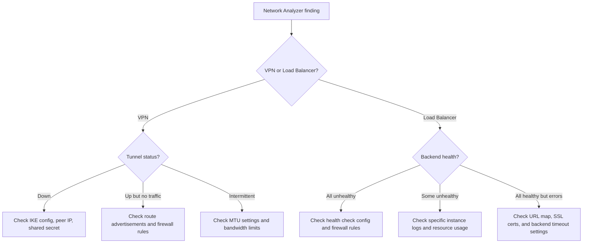

# How to Use Network Analyzer to Detect VPN Tunnel and Load Balancer Misconfigurations

Author: [nawazdhandala](https://www.github.com/nawazdhandala)

Tags: GCP, Network Analyzer, VPN, Load Balancer, Network Intelligence Center

Description: Learn how to use GCP Network Analyzer to automatically detect misconfigurations in VPN tunnels and load balancers before they cause outages or performance degradation.

---

Misconfigured VPN tunnels and load balancers are some of the trickiest issues to debug in GCP. A VPN tunnel might be up but not passing traffic for a specific subnet. A load balancer might have health checks passing but still return 502 errors to clients. These kinds of problems are subtle and often only surface under specific conditions.

Network Analyzer, part of Network Intelligence Center, continuously scans your network configuration and flags these misconfigurations automatically. Instead of waiting for users to report problems, you get proactive alerts about issues that could cause outages.

## What Network Analyzer Does

Network Analyzer runs automated checks against your network configuration and produces insights about potential problems. For VPN tunnels and load balancers, it checks things like:

- VPN tunnel status and configuration consistency
- IKE version and cipher mismatches
- Route advertisement problems
- Load balancer backend health
- Firewall rules blocking health check probes
- SSL certificate expiration
- Backend service capacity issues

## Enabling Network Analyzer

Network Analyzer is enabled by default when you use Network Intelligence Center, but you need the right API enabled:

```bash
# Enable the Network Management API for Network Analyzer
gcloud services enable networkmanagement.googleapis.com --project=my-project
```

You also need appropriate permissions:

```bash
# Grant the necessary role for viewing Network Analyzer insights
gcloud projects add-iam-policy-binding my-project \
  --member="user:admin@example.com" \
  --role="roles/networkmanagement.viewer"
```

## Detecting VPN Tunnel Misconfigurations

### Tunnel Status Issues

The most basic check is tunnel status. Network Analyzer flags tunnels that are not in the ESTABLISHED state:

```bash
# List Network Analyzer insights related to VPN tunnels
gcloud network-management network-analyzer-findings list \
  --location=global \
  --project=my-project \
  --filter="findingType:VPN"
```

If you want to manually check tunnel status as well:

```bash
# Check the status of all VPN tunnels in the project
gcloud compute vpn-tunnels list \
  --project=my-project \
  --format="table(name,region,status,peerIp,ikeVersion)"
```

### Route Advertisement Mismatches

A common issue with Cloud VPN is when routes are not being advertised correctly. Network Analyzer catches cases where:

- The Cloud Router is not advertising the expected subnets
- Custom route advertisements are missing important ranges
- The on-premises side is not advertising routes back

```bash
# Check Cloud Router BGP session status and advertised routes
gcloud compute routers get-status my-router \
  --region=us-central1 \
  --project=my-project \
  --format="yaml(result.bgpPeerStatus)"
```

### MTU Mismatches

VPN tunnels have specific MTU requirements. If the tunnel MTU does not match the VPC MTU, you can get silent packet drops for larger packets. Network Analyzer detects this:

```bash
# Check VPN tunnel MTU settings
gcloud compute vpn-tunnels describe my-tunnel \
  --region=us-central1 \
  --project=my-project \
  --format="yaml(name,mtu)"

# Compare with the VPC network MTU
gcloud compute networks describe my-vpc \
  --project=my-project \
  --format="yaml(name,mtu)"
```

If there is a mismatch, update the VPN tunnel MTU to match:

```bash
# The VPC MTU and tunnel MTU should be consistent
# For standard VPN tunnels, the effective MTU is typically 1460 bytes
# Adjust your on-premises MTU to match
```

### IKE Configuration Problems

Network Analyzer checks for IKE version and cipher suite mismatches between your Cloud VPN gateway and the peer gateway:

```bash
# View detailed VPN tunnel configuration including IKE settings
gcloud compute vpn-tunnels describe my-tunnel \
  --region=us-central1 \
  --project=my-project \
  --format="yaml(name,ikeVersion,peerIp,sharedSecretHash)"
```

## Detecting Load Balancer Misconfigurations

### Health Check Firewall Issues

The most common load balancer problem is health checks being blocked by firewall rules. Google's health check probes come from specific IP ranges that need to be allowed through your firewall.

Network Analyzer flags this automatically, but you can also verify manually:

```bash
# Check if firewall rules allow health check probe IPs
gcloud compute firewall-rules list \
  --filter="network=my-vpc AND sourceRanges:(130.211.0.0/22 OR 35.191.0.0/16)" \
  --format="table(name,allowed[].map().firewall_rule().list(),targetTags)" \
  --project=my-project
```

If no rules match, create one:

```bash
# Allow health check probes from Google's health check IP ranges
gcloud compute firewall-rules create allow-health-checks \
  --network=my-vpc \
  --allow=tcp \
  --source-ranges=130.211.0.0/22,35.191.0.0/16 \
  --target-tags=load-balanced \
  --direction=INGRESS \
  --project=my-project
```

### Backend Configuration Issues

Network Analyzer detects several backend-related problems:

```bash
# Check backend service health for a specific load balancer
gcloud compute backend-services get-health my-backend-service \
  --global \
  --project=my-project \
  --format="yaml(status)"
```

Common issues include:

- All backends unhealthy (often a health check misconfiguration)
- Backends in a single zone (no zone redundancy)
- Instance groups with zero instances
- Named ports not configured on instance groups

```bash
# Verify named ports are configured on the instance group
gcloud compute instance-groups managed describe my-instance-group \
  --zone=us-central1-a \
  --project=my-project \
  --format="yaml(namedPorts)"

# If missing, set the named port
gcloud compute instance-groups managed set-named-ports my-instance-group \
  --zone=us-central1-a \
  --named-ports=http:8080 \
  --project=my-project
```

### SSL Certificate Expiration

For HTTPS load balancers, Network Analyzer tracks SSL certificate expiration and alerts you before certificates expire:

```bash
# List SSL certificates and their expiration dates
gcloud compute ssl-certificates list \
  --project=my-project \
  --format="table(name,type,expireTime,managed.status)"
```

### URL Map Misconfiguration

Network Analyzer also checks URL map rules for potential issues like unreachable rules (rules that will never match because a more general rule comes first):

```bash
# Describe the URL map to review routing rules
gcloud compute url-maps describe my-url-map \
  --global \
  --project=my-project \
  --format="yaml(pathMatchers)"
```

## Creating Alerts for Network Analyzer Findings

You can set up alerts to be notified when Network Analyzer discovers new issues:

```bash
# Create a log-based metric for Network Analyzer findings
gcloud logging metrics create network-analyzer-findings \
  --description="Count of Network Analyzer findings" \
  --log-filter='resource.type="network_management_connectivity_test" AND
                severity>=WARNING' \
  --project=my-project
```

Then create an alerting policy based on this metric:

```bash
# Create an alert for new Network Analyzer findings
gcloud monitoring policies create \
  --display-name="Network Analyzer New Findings" \
  --condition-display-name="New network configuration issues detected" \
  --condition-filter='metric.type="logging.googleapis.com/user/network-analyzer-findings"' \
  --condition-threshold-value=0 \
  --condition-threshold-comparison=COMPARISON_GT \
  --condition-threshold-duration=60s \
  --notification-channels="projects/my-project/notificationChannels/CHANNEL_ID" \
  --combiner=OR \
  --project=my-project
```

## A Troubleshooting Workflow

When Network Analyzer reports an issue, here is the workflow I follow:



## Summary

Network Analyzer saves you from discovering misconfigurations the hard way - through outages and user complaints. It continuously checks your VPN tunnels for status issues, route problems, and MTU mismatches, and checks your load balancers for health check firewall issues, backend problems, and certificate expiration. Enable it, set up alerts for new findings, and address issues as they appear. Prevention is always better than firefighting.
