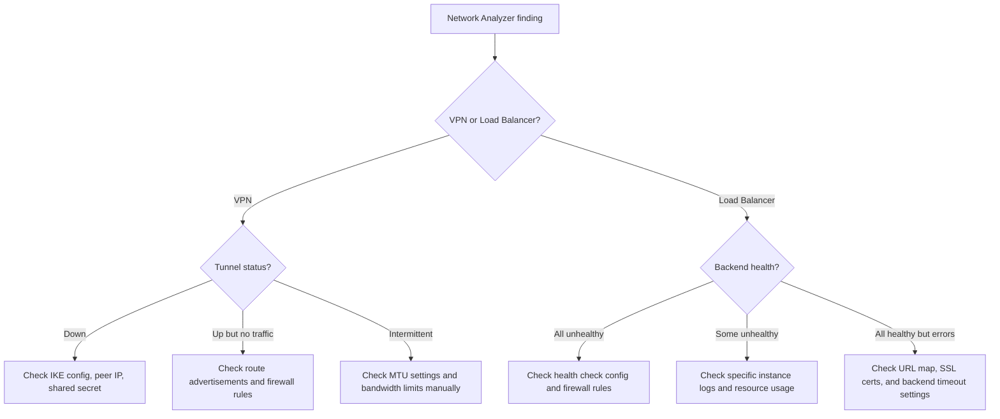

# How to Use Network Analyzer to Detect VPN Tunnel

Author: [nawazdhandala](https://www.github.com/nawazdhandala)

Tags: GCP, Network Analyzer, VPN, Load Balancer, Network Intelligence Center

Description: Learn how to use GCP Network Analyzer to automatically detect misconfigurations in VPN tunnels and load balancers before they cause outages or performance degradation.

---

Misconfigured VPN tunnels and load balancers are some of the trickiest issues to debug in GCP. A VPN tunnel might be up but not passing traffic for a specific subnet. A load balancer might have health checks passing but still return 502 errors to clients. These kinds of problems are subtle and often only surface under specific conditions.

Network Analyzer, part of Network Intelligence Center, continuously scans your network configuration and flags these misconfigurations automatically. Instead of waiting for users to report problems, you get proactive alerts about issues that could cause outages.

## What Network Analyzer Does

Network Analyzer runs automated checks against your network configuration and produces insights about potential problems. For VPN tunnels and load balancers, it checks things like:

- Routes whose next hop is a VPN tunnel that is deleted or not established
- Dynamic routes that are shadowed by subnet or static routes
- Firewall rules blocking health check probes
- Health check port mismatches
- Backend service balancing modes that can break session affinity
- Google-managed SSL certificates that are not attached to load balancers or are attached to forwarding rules that do not expose port 443

## Enabling Network Analyzer

Network Analyzer runs automatically, but if you want to query insights from the Google Cloud CLI, enable the Recommender API:

```bash
# Enable the Recommender API for Network Analyzer insights

gcloud services enable recommender.googleapis.com --project=my-project
```

You also need appropriate permissions:

```bash
# Grant the necessary role for viewing Network Analyzer insights
gcloud projects add-iam-policy-binding my-project \
  --member="user:admin@example.com" \
  --role="roles/recommender.networkAnalyzerViewer"
```

## Detecting VPN Tunnel Misconfigurations

### Tunnel Status Issues

The most basic check is tunnel status. Network Analyzer can flag routes whose next hop is a VPN tunnel that is not established:

```bash
# List Network Analyzer insights for routes that point to non-established VPN tunnels
gcloud recommender insights list \
  --location=global \
  --project=my-project \
  --insight-type=google.networkanalyzer.vpcnetwork.connectivityInsight \
  --filter='insightSubtype="ROUTE_NEXT_HOP_VPN_TUNNEL_NOT_ESTABLISHED"' \
  --format="table(name,insightSubtype,description,stateInfo.state)"
```

If you want to manually check tunnel status as well:

```bash
# Check the status of all VPN tunnels in the project
gcloud compute vpn-tunnels list \
  --project=my-project \
  --format="table(name,region,status,peerIp,ikeVersion)"
```

### Route Advertisement Mismatches

A common issue with Cloud VPN is when routes are not being advertised correctly. Network Analyzer can catch dynamic routes that are shadowed by subnet routes or static routes:

```bash
# List Network Analyzer insights for shadowed dynamic routes
gcloud recommender insights list \
  --location=global \
  --project=my-project \
  --insight-type=google.networkanalyzer.hybridconnectivity.dynamicRouteInsight \
  --format="table(name,insightSubtype,description,stateInfo.state)"
```

To verify BGP sessions and route advertisements directly:

```bash
# Check Cloud Router BGP session status and advertised routes
gcloud compute routers get-status my-router \
  --region=us-central1 \
  --project=my-project \
  --format="yaml(result.bgpPeerStatus)"
```

### MTU Checks

VPN tunnels have specific MTU requirements. If the peer VPN gateway does not account for Cloud VPN encapsulation overhead, you can get packet drops for larger packets. Network Analyzer does not provide a dedicated VPN MTU insight, so check this manually:

```bash
# Compare with the VPC network MTU
gcloud compute networks describe my-vpc \
  --project=my-project \
  --format="yaml(name,mtu)"
```

If there is a mismatch, adjust the peer VPN gateway and workloads to account for Cloud VPN MTU:

```bash
# Cloud VPN gateway MTU is 1460 bytes for Cloud VPN tunnels
# The payload MTU is lower and depends on ciphers and gateway IP version
# Configure the peer VPN gateway to use the corresponding Cloud VPN gateway MTU
```

### IKE Configuration Problems

Cloud VPN automatically negotiates the connection when the peer gateway uses a supported IKE cipher setting. If the tunnel is down, verify the IKE version, peer IP, shared secret, and peer cipher configuration:

```bash
# View detailed VPN tunnel configuration including IKE settings
gcloud compute vpn-tunnels describe my-tunnel \
  --region=us-central1 \
  --project=my-project \
  --format="yaml(name,ikeVersion,peerIp,sharedSecretHash)"
```

## Detecting Load Balancer Misconfigurations

### Health Check Firewall Issues

The most common load balancer problem is health checks being blocked by firewall rules. Google's health check probes come from specific IP ranges that need to be allowed through your firewall.

Network Analyzer flags this automatically, but you can also verify manually:

```bash
# List Network Analyzer load balancer insights
gcloud recommender insights list \
  --location=global \
  --project=my-project \
  --insight-type=google.networkanalyzer.networkservices.loadBalancerInsight \
  --format="table(name,insightSubtype,description,stateInfo.state)"

# Check if firewall rules allow health check probe IPs
gcloud compute firewall-rules list \
  --filter="network=my-vpc AND sourceRanges:(130.211.0.0/22 OR 35.191.0.0/16)" \
  --format="table(name,allowed[].map().firewall_rule().list(),targetTags)" \
  --project=my-project
```

If no rules match, create one:

```bash
# Allow health check probes from Google's health check IP ranges
gcloud compute firewall-rules create allow-health-checks \
  --network=my-vpc \
  --allow=tcp \
  --source-ranges=130.211.0.0/22,35.191.0.0/16 \
  --target-tags=load-balanced \
  --direction=INGRESS \
  --project=my-project
```

### Backend Configuration Issues

Network Analyzer detects several load balancer backend-related problems, such as health check firewall issues, health check port mismatches, and backend service balancing modes that can break session affinity. You can also check backend health directly:

```bash
# Check backend service health for a specific load balancer
gcloud compute backend-services get-health my-backend-service \
  --global \
  --project=my-project \
  --format="yaml(status)"
```

Common load balancer issues to check include:

- All backends unhealthy (often a health check misconfiguration)
- Backends in a single zone (no zone redundancy)
- Instance groups with zero instances
- Named ports not configured on instance groups

```bash
# Verify named ports are configured on the instance group
gcloud compute instance-groups managed describe my-instance-group \
  --zone=us-central1-a \
  --project=my-project \
  --format="yaml(namedPorts)"

# If missing, set the named port
gcloud compute instance-groups managed set-named-ports my-instance-group \
  --zone=us-central1-a \
  --named-ports=http:8080 \
  --project=my-project
```

### SSL Certificate Attachment

For HTTPS load balancers, Network Analyzer reports Google-managed SSL certificates that are not associated with a load balancer, or that are associated with forwarding rules that do not expose port 443:

```bash
# List SSL certificates and their expiration dates
gcloud compute ssl-certificates list \
  --project=my-project \
  --format="table(name,type,expireTime,managed.status)"
```

### URL Map Review

Network Analyzer does not currently publish a dedicated URL map unreachable-rule insight, but URL maps are still worth reviewing when backends are healthy and clients see routing errors:

```bash
# Describe the URL map to review routing rules
gcloud compute url-maps describe my-url-map \
  --global \
  --project=my-project \
  --format="yaml(pathMatchers)"
```

## Creating Alerts for Network Analyzer Findings

You can set up alerts to be notified when Network Analyzer discovers new issues:

```bash
# Create a log-based metric for Network Analyzer findings
gcloud logging metrics create network-analyzer-findings \
  --description="Count of Network Analyzer findings" \
  --log-filter='LOG_ID("networkanalyzer.googleapis.com%2Fanalyzer_reports")' \
  --project=my-project
```

Then create an alerting policy based on this metric:

```bash
# Create an alert for new Network Analyzer findings
gcloud monitoring policies create \
  --display-name="Network Analyzer New Findings" \
  --condition-display-name="New network configuration issues detected" \
  --condition-filter='metric.type="logging.googleapis.com/user/network-analyzer-findings"' \
  --if="> 0" \
  --duration=60s \
  --notification-channels="projects/my-project/notificationChannels/CHANNEL_ID" \
  --combiner=OR \
  --project=my-project
```

## A Troubleshooting Workflow

When Network Analyzer reports an issue, here is the workflow I follow:


```mermaid
flowchart TD
    A[Network Analyzer finding] --> B{VPN or Load Balancer?}
    B -->|VPN| C{Tunnel status?}
    C -->|Down| D[Check IKE config, peer IP, shared secret]
    C -->|Up but no traffic| E[Check route advertisements and firewall rules]
    C -->|Intermittent| F[Check MTU settings and bandwidth limits manually]
    B -->|Load Balancer| G{Backend health?}
    G -->|All unhealthy| H[Check health check config and firewall rules]
    G -->|Some unhealthy| I[Check specific instance logs and resource usage]
    G -->|All healthy but errors| J[Check URL map, SSL certs, and backend timeout settings]
```

## Summary

Network Analyzer saves you from discovering misconfigurations the hard way - through outages and user complaints. It continuously checks route and hybrid connectivity issues that can affect VPN traffic, and checks your load balancers for health check firewall issues, backend configuration problems, and Google-managed certificate attachment problems. Enable CLI access, set up alerts for new findings, and address issues as they appear. Prevention is always better than firefighting.
