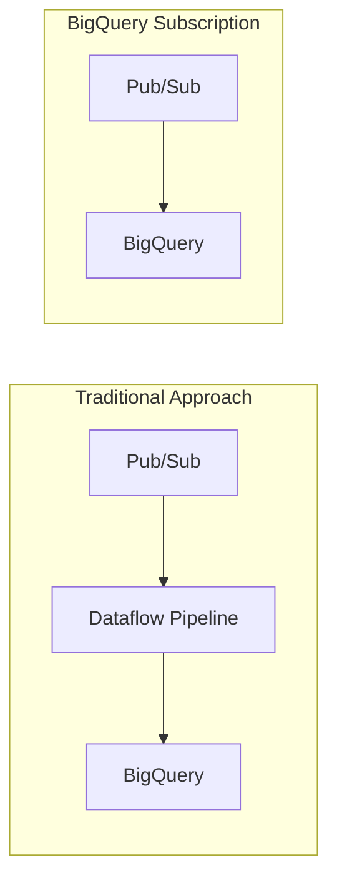

# How to Use Pub/Sub BigQuery Subscriptions for Zero-Code Streaming Ingestion

Author: [nawazdhandala](https://www.github.com/nawazdhandala)

Tags: GCP, Pub/Sub, BigQuery, Streaming Ingestion, Zero-Code, Data Pipeline

Description: Learn how to use Pub/Sub BigQuery subscriptions to stream data directly from Pub/Sub topics into BigQuery tables without writing any pipeline code.

---

For a long time, the standard way to get data from Pub/Sub into BigQuery was to build a Dataflow pipeline. It works, but it is a lot of infrastructure for what is often a simple task: take JSON messages and write them to a table. Pub/Sub BigQuery subscriptions eliminate the middle layer entirely. You point a subscription at a BigQuery table, and messages flow directly in - no Dataflow, no code, no pipeline to manage.

This guide shows how to set it up and when it makes sense to use over a full Dataflow pipeline.

## How It Works

A BigQuery subscription is a special type of Pub/Sub subscription that writes messages directly to a BigQuery table using the BigQuery Storage Write API. There is no intermediate compute layer.



The subscription handles:
- Automatic message delivery to BigQuery
- At-least-once delivery guarantees
- Schema mapping between Pub/Sub message fields and BigQuery columns
- Dead letter routing for messages that fail to write

## Prerequisites

- A Pub/Sub topic with messages in a consistent format
- A BigQuery table with a schema that matches your messages
- The Pub/Sub service account needs BigQuery write permissions

## Step 1: Create the BigQuery Table

First, create the destination table. The schema needs to match the structure of your Pub/Sub messages.

```bash
# Create a dataset
bq mk --dataset MY_PROJECT:streaming_data

# Create the destination table
bq mk --table MY_PROJECT:streaming_data.events \
  event_id:STRING,event_type:STRING,user_id:STRING,timestamp:TIMESTAMP,payload:STRING,source:STRING
```

If your messages have nested fields, use a JSON schema file:

```json
[
  {"name": "event_id", "type": "STRING", "mode": "REQUIRED"},
  {"name": "event_type", "type": "STRING", "mode": "REQUIRED"},
  {"name": "user_id", "type": "STRING", "mode": "NULLABLE"},
  {"name": "timestamp", "type": "TIMESTAMP", "mode": "REQUIRED"},
  {"name": "data", "type": "RECORD", "mode": "NULLABLE", "fields": [
    {"name": "action", "type": "STRING", "mode": "NULLABLE"},
    {"name": "value", "type": "FLOAT", "mode": "NULLABLE"},
    {"name": "metadata", "type": "STRING", "mode": "NULLABLE"}
  ]},
  {"name": "source", "type": "STRING", "mode": "NULLABLE"}
]
```

```bash
# Create the table with a JSON schema file
bq mk --table MY_PROJECT:streaming_data.events schema.json
```

## Step 2: Grant Permissions to the Pub/Sub Service Account

The Pub/Sub service agent needs permission to write to BigQuery.

```bash
# Get the Pub/Sub service account for your project
PROJECT_NUMBER=$(gcloud projects describe MY_PROJECT --format="value(projectNumber)")
PUBSUB_SA="service-${PROJECT_NUMBER}@gcp-sa-pubsub.iam.gserviceaccount.com"

# Grant BigQuery write access
gcloud projects add-iam-policy-binding MY_PROJECT \
  --member="serviceAccount:${PUBSUB_SA}" \
  --role="roles/bigquery.dataEditor"

# Grant metadata access
gcloud projects add-iam-policy-binding MY_PROJECT \
  --member="serviceAccount:${PUBSUB_SA}" \
  --role="roles/bigquery.metadataViewer"
```

## Step 3: Create the BigQuery Subscription

Now create the subscription that connects the topic to the table.

```bash
# Create a BigQuery subscription
gcloud pubsub subscriptions create events-to-bq \
  --topic=events-topic \
  --bigquery-table=MY_PROJECT:streaming_data.events \
  --use-topic-schema \
  --write-metadata \
  --drop-unknown-fields
```

Let me break down the flags:

- `--bigquery-table`: The destination table in `project:dataset.table` format
- `--use-topic-schema`: Maps Pub/Sub message fields to BigQuery columns based on the topic's schema
- `--write-metadata`: Adds Pub/Sub metadata (message ID, publish time, attributes) to the row
- `--drop-unknown-fields`: Ignores message fields that do not match BigQuery columns (instead of failing)

## Step 4: Publish a Test Message

Send a message to verify the pipeline works.

```bash
# Publish a test message
gcloud pubsub topics publish events-topic --message='{
  "event_id": "test-001",
  "event_type": "page_view",
  "user_id": "user-123",
  "timestamp": "2026-02-17T14:00:00Z",
  "data": {
    "action": "view",
    "value": 1.0,
    "metadata": "homepage"
  },
  "source": "web"
}'
```

Wait about 30 seconds, then check BigQuery:

```sql
-- Verify the message arrived
SELECT * FROM `streaming_data.events`
ORDER BY timestamp DESC
LIMIT 5
```

## Using Topic Schema vs Table Schema

There are two ways to map messages to table columns:

### Option 1: Use Topic Schema

Attach an Avro or Protocol Buffer schema to the Pub/Sub topic. The subscription uses this schema to parse messages and map fields to BigQuery columns.

```bash
# Create a Pub/Sub schema
gcloud pubsub schemas create events-schema \
  --type=AVRO \
  --definition='{
    "type": "record",
    "name": "Event",
    "fields": [
      {"name": "event_id", "type": "string"},
      {"name": "event_type", "type": "string"},
      {"name": "user_id", "type": ["null", "string"]},
      {"name": "timestamp", "type": {"type": "long", "logicalType": "timestamp-micros"}},
      {"name": "source", "type": ["null", "string"]}
    ]
  }'

# Assign the schema to the topic
gcloud pubsub topics update events-topic \
  --schema=events-schema \
  --message-encoding=json
```

### Option 2: Use Table Schema

If your topic does not have a schema, the subscription can use the BigQuery table's schema directly. Messages must be valid JSON with field names that match the BigQuery columns.

```bash
# Create subscription using table schema
gcloud pubsub subscriptions create events-to-bq \
  --topic=events-topic \
  --bigquery-table=MY_PROJECT:streaming_data.events \
  --use-table-schema \
  --drop-unknown-fields
```

## Handling Dead Letters

Messages that fail to write to BigQuery (schema mismatches, invalid data types) can be routed to a dead letter topic.

```bash
# Create a dead letter topic
gcloud pubsub topics create events-dead-letter

# Create the subscription with dead letter handling
gcloud pubsub subscriptions create events-to-bq \
  --topic=events-topic \
  --bigquery-table=MY_PROJECT:streaming_data.events \
  --use-table-schema \
  --drop-unknown-fields \
  --dead-letter-topic=projects/MY_PROJECT/topics/events-dead-letter \
  --max-delivery-attempts=5
```

Monitor the dead letter topic to catch schema issues:

```bash
# Pull messages from the dead letter topic to inspect failures
gcloud pubsub subscriptions pull events-dead-letter-sub --auto-ack --limit=10
```

## When to Use BigQuery Subscriptions vs Dataflow

BigQuery subscriptions are great when:

- Your messages are already in a format that maps cleanly to BigQuery columns
- You do not need to transform, enrich, or filter the data
- You want to minimize operational overhead
- The volume is within BigQuery streaming insert limits

Stick with Dataflow when:

- You need to join or enrich data with external sources
- Complex transformations are required (parsing, aggregating, windowing)
- You need exactly-once processing semantics
- You are routing data to multiple destinations from the same stream

## Performance and Limits

A few things to keep in mind:

- BigQuery subscriptions use the Storage Write API, which supports up to 3 GB/s per project
- Messages up to 10 MB are supported
- Latency is typically a few seconds from publish to queryable in BigQuery
- There is no cost for the subscription itself - you pay for Pub/Sub message delivery and BigQuery streaming inserts

## Monitoring

Monitor the subscription health in Cloud Monitoring:

```bash
# Check subscription metrics
gcloud monitoring dashboards create \
  --config-from-file=dashboard.json

# Key metrics to watch:
# pubsub.googleapis.com/subscription/num_undelivered_messages (backlog)
# pubsub.googleapis.com/subscription/oldest_unacked_message_age (lag)
# pubsub.googleapis.com/subscription/dead_letter_message_count (failures)
```

## Wrapping Up

Pub/Sub BigQuery subscriptions remove an entire layer of infrastructure from your streaming pipeline. For straightforward ingestion where the message format matches your BigQuery schema, they are the simplest option available. No code to write, no pipeline to deploy, no workers to scale. Just configure the subscription and messages flow into your table. When you need more processing power, Dataflow is still there, but for many use cases, the zero-code path is all you need.
