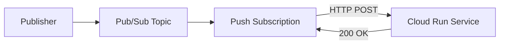

# How to Use Pub/Sub with Cloud Run for Event-Driven Microservices

Author: [nawazdhandala](https://www.github.com/nawazdhandala)

Tags: GCP, Pub/Sub, Cloud Run, Event-Driven, Microservices

Description: Learn how to connect Google Cloud Pub/Sub with Cloud Run to build event-driven microservices that scale automatically and process messages via push subscriptions.

---

Cloud Run and Pub/Sub are a natural pair for event-driven microservices on GCP. Pub/Sub handles message delivery and buffering, while Cloud Run provides serverless HTTP endpoints that scale to zero when there is no traffic and scale up automatically when messages start flowing. You do not manage servers, and you only pay when messages are being processed.

The connection works through push subscriptions. Pub/Sub pushes messages as HTTP requests to your Cloud Run service. Cloud Run processes the message and returns an HTTP response. If the response is successful, Pub/Sub acknowledges the message. If not, it retries.

## How the Integration Works



1. A publisher sends a message to a Pub/Sub topic
2. The push subscription delivers the message as an HTTP POST to your Cloud Run service URL
3. Your Cloud Run service processes the message and returns a 200 response
4. Pub/Sub marks the message as acknowledged

If your service returns a non-2xx response (or times out), Pub/Sub retries delivery with exponential backoff.

## Setting Up the Cloud Run Service

First, build a service that handles Pub/Sub push messages. The message format is a JSON envelope with the actual data base64-encoded:

```python
# app.py - Cloud Run service that processes Pub/Sub messages
import base64
import json
import os
import logging
from flask import Flask, request, jsonify

app = Flask(__name__)
logging.basicConfig(level=logging.INFO)
logger = logging.getLogger(__name__)

@app.route('/process', methods=['POST'])
def handle_pubsub_message():
    """Handle incoming Pub/Sub push message."""
    envelope = request.get_json(silent=True)

    if not envelope:
        logger.error("No JSON payload received")
        return jsonify({'error': 'Bad Request: no payload'}), 400

    if 'message' not in envelope:
        logger.error("No message field in envelope")
        return jsonify({'error': 'Bad Request: no message'}), 400

    # Decode the message data from base64
    message = envelope['message']
    message_data = base64.b64decode(message.get('data', '')).decode('utf-8')
    message_id = message.get('messageId', 'unknown')
    attributes = message.get('attributes', {})
    publish_time = message.get('publishTime', '')

    logger.info(f"Received message {message_id}: {message_data[:100]}")

    try:
        # Parse and process the message
        data = json.loads(message_data)
        process_event(data, attributes)

        # Return 200 to acknowledge the message
        return jsonify({'status': 'ok', 'message_id': message_id}), 200

    except json.JSONDecodeError as e:
        logger.error(f"Invalid JSON in message {message_id}: {e}")
        # Return 200 anyway to prevent infinite retries on bad data
        return jsonify({'status': 'skipped', 'reason': 'invalid json'}), 200

    except Exception as e:
        logger.error(f"Processing failed for {message_id}: {e}")
        # Return 500 to trigger retry
        return jsonify({'error': str(e)}), 500

def process_event(data, attributes):
    """Your business logic here."""
    event_type = attributes.get('event_type', 'unknown')
    logger.info(f"Processing {event_type}: {data}")
    # Do work...

if __name__ == '__main__':
    port = int(os.environ.get('PORT', 8080))
    app.run(host='0.0.0.0', port=port)
```

The Dockerfile:

```dockerfile
# Dockerfile for Cloud Run Pub/Sub consumer
FROM python:3.11-slim

WORKDIR /app

COPY requirements.txt .
RUN pip install --no-cache-dir -r requirements.txt

COPY . .

# Cloud Run expects the service on PORT (defaults to 8080)
CMD exec gunicorn --bind :$PORT --workers 1 --threads 8 --timeout 0 app:app
```

Requirements:

```
flask==3.0.0
gunicorn==21.2.0
```

## Deploying to Cloud Run

```bash
# Build and deploy the Cloud Run service
gcloud run deploy order-processor \
  --source=. \
  --region=us-central1 \
  --no-allow-unauthenticated \
  --min-instances=0 \
  --max-instances=10 \
  --memory=512Mi \
  --timeout=60
```

The `--no-allow-unauthenticated` flag is critical. It ensures only authenticated requests are accepted. Pub/Sub will authenticate using a service account.

## Creating the Pub/Sub Push Subscription

Create a service account for Pub/Sub to use when calling Cloud Run:

```bash
# Create a service account for Pub/Sub push authentication
gcloud iam service-accounts create pubsub-cloud-run-invoker \
  --display-name="Pub/Sub Cloud Run Invoker"

# Grant the service account permission to invoke the Cloud Run service
gcloud run services add-iam-policy-binding order-processor \
  --region=us-central1 \
  --member="serviceAccount:pubsub-cloud-run-invoker@my-project.iam.gserviceaccount.com" \
  --role="roles/run.invoker"

# Create the push subscription
gcloud pubsub subscriptions create order-events-push-sub \
  --topic=order-events \
  --push-endpoint=https://order-processor-xyz.run.app/process \
  --push-auth-service-account=pubsub-cloud-run-invoker@my-project.iam.gserviceaccount.com \
  --ack-deadline=60 \
  --min-retry-delay=10s \
  --max-retry-delay=600s
```

## Terraform Configuration

Here is the complete setup in Terraform:

```hcl
# Cloud Run service
resource "google_cloud_run_v2_service" "order_processor" {
  name     = "order-processor"
  location = "us-central1"

  template {
    scaling {
      min_instance_count = 0
      max_instance_count = 10
    }

    containers {
      image = "gcr.io/my-project/order-processor:latest"

      resources {
        limits = {
          cpu    = "1000m"
          memory = "512Mi"
        }
      }

      ports {
        container_port = 8080
      }
    }

    timeout = "60s"
  }
}

# Service account for Pub/Sub to authenticate with Cloud Run
resource "google_service_account" "pubsub_invoker" {
  account_id   = "pubsub-cloud-run-invoker"
  display_name = "Pub/Sub Cloud Run Invoker"
}

# Grant the invoker permission to call Cloud Run
resource "google_cloud_run_v2_service_iam_member" "invoker" {
  name     = google_cloud_run_v2_service.order_processor.name
  location = google_cloud_run_v2_service.order_processor.location
  role     = "roles/run.invoker"
  member   = "serviceAccount:${google_service_account.pubsub_invoker.email}"
}

# Pub/Sub topic
resource "google_pubsub_topic" "order_events" {
  name = "order-events"
  message_retention_duration = "604800s"
}

# Push subscription pointing to Cloud Run
resource "google_pubsub_subscription" "order_events_push" {
  name  = "order-events-push-sub"
  topic = google_pubsub_topic.order_events.id

  push_config {
    push_endpoint = "${google_cloud_run_v2_service.order_processor.uri}/process"

    oidc_token {
      service_account_email = google_service_account.pubsub_invoker.email
      audience              = google_cloud_run_v2_service.order_processor.uri
    }
  }

  ack_deadline_seconds = 60

  retry_policy {
    minimum_backoff = "10s"
    maximum_backoff = "600s"
  }

  dead_letter_policy {
    dead_letter_topic     = google_pubsub_topic.order_events_dlq.id
    max_delivery_attempts = 10
  }

  expiration_policy { ttl = "" }
}
```

## Handling Concurrent Messages

Cloud Run can handle multiple concurrent requests. Tune the concurrency based on your processing characteristics:

```bash
# Set concurrency to 10 requests per instance
gcloud run services update order-processor \
  --region=us-central1 \
  --concurrency=10
```

With concurrency set to 10, each Cloud Run instance processes up to 10 Pub/Sub messages simultaneously. If more messages arrive, Cloud Run spins up additional instances (up to `max-instances`).

For CPU-intensive processing, set concurrency to 1. For I/O-bound processing (like making API calls), higher concurrency works well.

## Idempotency and Deduplication

Since Pub/Sub may deliver messages more than once, your Cloud Run service needs to handle duplicates:

```python
# Cloud Run handler with deduplication
from google.cloud import firestore
import base64
import json

db = firestore.Client()

@app.route('/process', methods=['POST'])
def handle_message():
    """Process message with deduplication."""
    envelope = request.get_json()
    message_id = envelope['message']['messageId']

    # Check if we already processed this message
    dedup_ref = db.collection('processed_messages').document(message_id)

    @firestore.transactional
    def check_and_process(transaction):
        snapshot = dedup_ref.get(transaction=transaction)
        if snapshot.exists:
            return False  # Already processed

        # Process the message
        data = json.loads(
            base64.b64decode(envelope['message']['data']).decode('utf-8')
        )
        process_event(data)

        # Record processing
        transaction.set(dedup_ref, {
            'processed_at': firestore.SERVER_TIMESTAMP,
        })
        return True

    transaction = db.transaction()
    was_new = check_and_process(transaction)

    return jsonify({
        'status': 'processed' if was_new else 'duplicate',
        'message_id': message_id,
    }), 200
```

## Scaling Behavior

Cloud Run scales based on incoming HTTP requests. With Pub/Sub push:

- **Scale to zero**: If no messages are being published, Cloud Run scales to zero instances.
- **Scale up**: When messages start flowing, Cloud Run creates instances to handle the load.
- **Backpressure**: If Cloud Run instances are all busy, Pub/Sub queues messages and retries when instances become available.

The scaling speed depends on your Cloud Run configuration:

```yaml
# Cloud Run service configuration for fast scaling
apiVersion: serving.knative.dev/v1
kind: Service
metadata:
  name: order-processor
spec:
  template:
    metadata:
      annotations:
        autoscaling.knative.dev/minScale: "1"  # Keep 1 instance warm
        autoscaling.knative.dev/maxScale: "50"
    spec:
      containerConcurrency: 10
      timeoutSeconds: 60
```

Setting `minScale` to 1 eliminates cold start latency for the first message, at the cost of running one instance continuously.

## Monitoring the Integration

Monitor both the Pub/Sub subscription and the Cloud Run service:

```bash
# Check Pub/Sub backlog
gcloud monitoring read \
  "pubsub.googleapis.com/subscription/num_undelivered_messages" \
  --filter='resource.labels.subscription_id = "order-events-push-sub"'

# Check Cloud Run request latency and error rate
gcloud monitoring read \
  "run.googleapis.com/request_latencies" \
  --filter='resource.labels.service_name = "order-processor"'
```

Key metrics to watch:
- **Pub/Sub backlog**: Growing backlog means Cloud Run cannot keep up
- **Cloud Run instance count**: Verify autoscaling is working as expected
- **Request latency**: Track how long message processing takes
- **Error rate**: Non-2xx responses trigger Pub/Sub retries

## Wrapping Up

Pub/Sub with Cloud Run is a powerful combination for event-driven microservices. Pub/Sub provides reliable message delivery, and Cloud Run provides serverless compute that scales automatically. The push subscription model means your service just exposes an HTTP endpoint - no client libraries or connection management needed. Add OIDC authentication for security, configure retry policies and dead letter topics for reliability, and tune concurrency and instance counts for performance. This pattern handles everything from low-volume event processing to high-throughput data pipelines.
