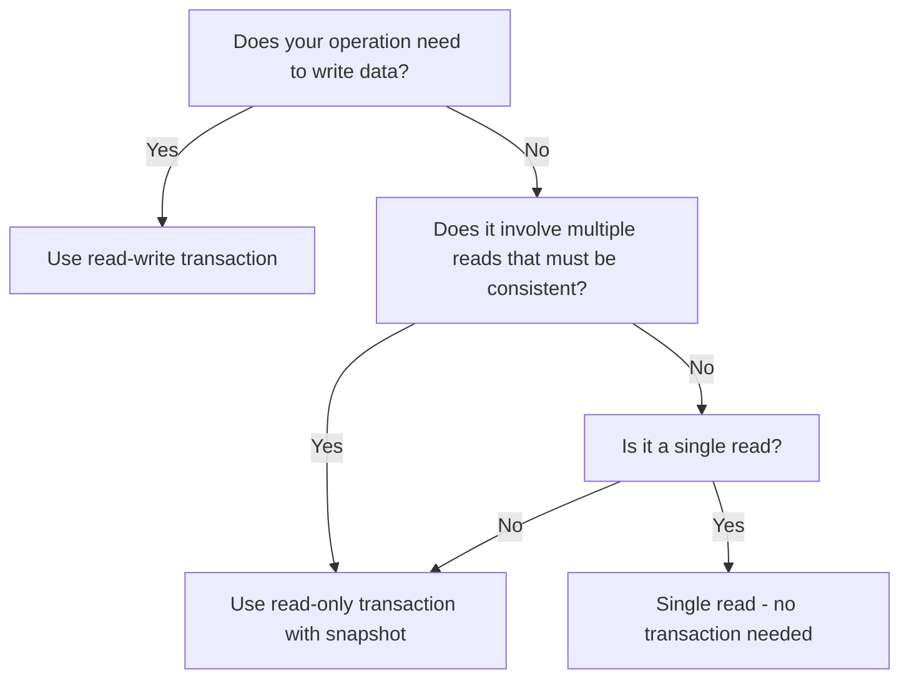

# How to Use Read-Only Transactions for Consistent Reads in Cloud Spanner

Author: [nawazdhandala](https://www.github.com/nawazdhandala)

Tags: GCP, Cloud Spanner, Transactions, Read-Only, Consistency

Description: Learn when and how to use read-only transactions in Cloud Spanner for consistent snapshot reads without locking overhead.

---

Not every database operation needs the full weight of a read-write transaction. When you only need to read data - no writes involved - Cloud Spanner offers read-only transactions that give you a consistent snapshot of your data without acquiring any locks. This makes them faster, cheaper, and non-blocking. In this post, I will explain how read-only transactions work, when to use them, and how they differ from read-write transactions.

## Why Read-Only Transactions Exist

In Spanner, read-write transactions acquire shared locks on every row they read. This is necessary because the transaction might later write to those rows, and Spanner needs to ensure no one else changes them in the meantime.

But if you know upfront that you will only be reading, those locks are unnecessary overhead. Read-only transactions skip the locking entirely. They read from a consistent snapshot of the database at a specific timestamp, and they never block or are blocked by write transactions.

This has several practical benefits:

- Lower latency because no locks are acquired or waited on
- No possibility of transaction aborts due to contention
- Can be served from any replica, not just the leader
- Multiple read-only transactions can run concurrently without interfering with each other

## Strong Reads vs Stale Reads

Read-only transactions in Spanner come in two flavors: strong reads and stale reads.

**Strong reads** see all data that has been committed up to the moment the read starts. This is the default and gives you the most up-to-date view of the data.

**Stale reads** read data at a timestamp in the past. They can be faster because Spanner can serve them from any nearby replica without waiting for the latest data to propagate. I will focus on strong reads here and cover stale reads in more detail in a separate post.

## Using Read-Only Transactions in Python

Here is how to perform a read-only transaction with the Python client library:

```python
from google.cloud import spanner

# Set up the client and database reference
client = spanner.Client()
instance = client.instance("my-instance")
database = instance.database("my-database")

# Create a snapshot for a read-only transaction
with database.snapshot() as snapshot:
    # Read all orders for a customer
    results = snapshot.execute_sql(
        "SELECT OrderId, TotalAmount, Status, CreatedAt "
        "FROM Orders "
        "WHERE CustomerId = @customer_id "
        "ORDER BY CreatedAt DESC",
        params={"customer_id": "customer-123"},
        param_types={"customer_id": spanner.param_types.STRING}
    )

    # Process the results
    orders = []
    for row in results:
        orders.append({
            "order_id": row[0],
            "total_amount": row[1],
            "status": row[2],
            "created_at": row[3]
        })

    # All reads within this snapshot see the same consistent data
    summary = snapshot.execute_sql(
        "SELECT COUNT(*) AS total_orders, SUM(TotalAmount) AS total_spent "
        "FROM Orders "
        "WHERE CustomerId = @customer_id",
        params={"customer_id": "customer-123"},
        param_types={"customer_id": spanner.param_types.STRING}
    )

    for row in summary:
        total_orders = row[0]
        total_spent = row[1]
```

The important thing here is that both queries within the snapshot see exactly the same data. Even if another transaction commits between the two queries, the snapshot does not see those changes. This is what makes read-only transactions so useful for generating reports or displaying consistent data to users.

## Multi-Read Consistency

Consider a scenario where you need to display a user's profile along with their recent orders and account balance. Without a read-only transaction, each query might see a different state of the database:

```python
# Without read-only transaction - INCONSISTENT
# These three queries might see different database states
user = query("SELECT * FROM Users WHERE UserId = @id")
orders = query("SELECT * FROM Orders WHERE UserId = @id")
balance = query("SELECT Balance FROM Accounts WHERE UserId = @id")
# A transfer might commit between these queries, making the data inconsistent
```

With a read-only transaction:

```python
# With read-only transaction - CONSISTENT
# All three queries see the exact same snapshot of the database
with database.snapshot() as snapshot:
    user = snapshot.execute_sql(
        "SELECT * FROM Users WHERE UserId = @id",
        params={"id": "user-123"},
        param_types={"id": spanner.param_types.STRING}
    )

    orders = snapshot.execute_sql(
        "SELECT * FROM Orders WHERE UserId = @id",
        params={"id": "user-123"},
        param_types={"id": spanner.param_types.STRING}
    )

    balance = snapshot.execute_sql(
        "SELECT Balance FROM Accounts WHERE UserId = @id",
        params={"id": "user-123"},
        param_types={"id": spanner.param_types.STRING}
    )
```

## Read-Only vs Read-Write: When to Use Which

Here is a straightforward decision guide:



In practice:

- **Dashboard displaying user data across multiple tables** - Read-only transaction
- **Generating a report that involves multiple queries** - Read-only transaction
- **Transferring money between accounts** - Read-write transaction
- **Looking up a single user by ID** - Single read (no transaction needed)
- **Inserting a new record** - Read-write transaction

## Using Read-Only Transactions in Go

Here is the same pattern in Go:

```go
package main

import (
    "context"
    "fmt"
    "cloud.google.com/go/spanner"
    "google.golang.org/api/iterator"
)

func getCustomerDashboard(ctx context.Context, client *spanner.Client, customerID string) error {
    // Create a read-only transaction
    txn := client.ReadOnlyTransaction()
    defer txn.Close()

    // First query: get customer details
    stmt := spanner.Statement{
        SQL:    "SELECT DisplayName, Email FROM Users WHERE UserId = @id",
        Params: map[string]interface{}{"id": customerID},
    }

    iter := txn.Query(ctx, stmt)
    defer iter.Stop()

    row, err := iter.Next()
    if err != nil {
        return fmt.Errorf("reading user: %w", err)
    }

    var name, email string
    if err := row.Columns(&name, &email); err != nil {
        return fmt.Errorf("parsing user: %w", err)
    }

    // Second query: get order count - sees same snapshot as first query
    countStmt := spanner.Statement{
        SQL:    "SELECT COUNT(*) FROM Orders WHERE CustomerId = @id",
        Params: map[string]interface{}{"id": customerID},
    }

    countIter := txn.Query(ctx, countStmt)
    defer countIter.Stop()

    countRow, err := countIter.Next()
    if err != nil {
        return fmt.Errorf("reading count: %w", err)
    }

    var orderCount int64
    if err := countRow.Columns(&orderCount); err != nil {
        return fmt.Errorf("parsing count: %w", err)
    }

    fmt.Printf("User: %s (%s) - %d orders\n", name, email, orderCount)
    return nil
}
```

## Performance Characteristics

Read-only transactions in Spanner have some notable performance properties:

**No leader required.** In a multi-region setup, read-write transactions must coordinate with the leader replica. Read-only transactions with strong reads can be served by the nearest replica that is caught up, which means lower latency for globally distributed readers.

**No retries.** Since read-only transactions do not acquire locks, they cannot be aborted due to contention. Your code does not need retry logic.

**No 10-second limit.** Read-write transactions must complete within 10 seconds. Read-only transactions have a much more generous timeout of 60 minutes. This makes them suitable for long-running analytical queries.

**Parallel execution.** Multiple read-only transactions can run concurrently on the same data without any interference, making them perfect for serving high-traffic read workloads.

## Timestamps and Reproducibility

Every read-only transaction is associated with a specific timestamp. You can retrieve this timestamp and use it later for debugging or to create another read at the exact same point in time:

```python
with database.snapshot() as snapshot:
    results = snapshot.execute_sql("SELECT * FROM Users")

    # Get the timestamp of this snapshot
    read_timestamp = snapshot.read_timestamp
    print(f"Data as of: {read_timestamp}")
```

This is extremely useful for debugging data inconsistency reports from users - you can read the database as it was at the exact time the user saw the issue.

## Wrapping Up

Read-only transactions are one of Spanner's best features for read-heavy workloads. They give you consistent snapshots without locking overhead, they cannot be aborted by contention, and they can be served from any caught-up replica. If your operation does not need to write data, always prefer a read-only transaction over a read-write transaction. Your queries will be faster, your system will handle more concurrent load, and you will avoid unnecessary contention with write transactions. It is a straightforward optimization that pays off immediately.
