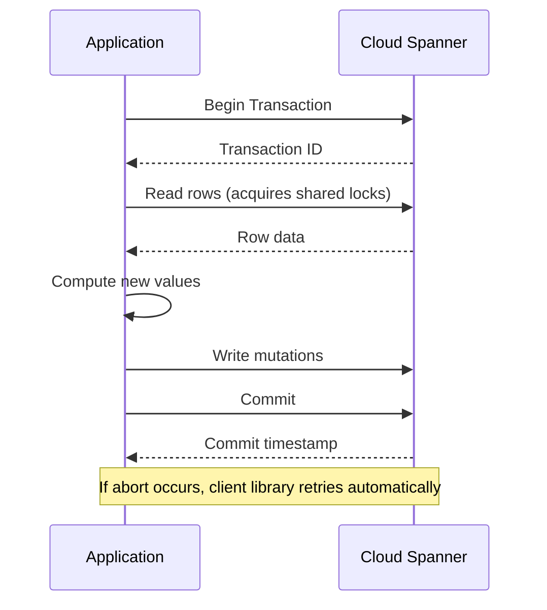

# How to Use Read-Write Transactions in Cloud Spanner

Author: [nawazdhandala](https://www.github.com/nawazdhandala)

Tags: GCP, Cloud Spanner, Transactions, Database, Consistency

Description: A developer's guide to using read-write transactions in Cloud Spanner for strongly consistent reads and writes with practical code examples.

---

Transactions are at the heart of any serious database application. Cloud Spanner provides fully ACID read-write transactions that work across rows, tables, and even across globally distributed data. Unlike many distributed databases that force you to choose between consistency and availability, Spanner gives you externally consistent transactions by default. In this post, I will cover how read-write transactions work in Spanner and how to use them effectively.

## What Makes Spanner Transactions Special

In a traditional single-node database, transactions use locks to ensure consistency. In a distributed database like Spanner, the challenge is much harder because your data might live on different machines in different data centers.

Spanner solves this with a combination of two-phase locking and TrueTime (Google's globally synchronized clock system). The result is that every transaction gets a precise timestamp, and the ordering of transactions is globally consistent. If transaction A commits before transaction B starts, every reader in the world will see A's changes before B's.

This is called external consistency, and it is the strongest consistency guarantee available in a distributed system.

## Basic Read-Write Transaction Structure

A read-write transaction in Spanner follows this pattern:

1. Begin the transaction
2. Read some data
3. Compute new values based on what you read
4. Write the new values
5. Commit the transaction

If anything goes wrong, the entire transaction is rolled back. Let me show this in code.

Here is a Python example that transfers money between two accounts:

```python
from google.cloud import spanner

# Initialize the Spanner client and get a database reference
client = spanner.Client()
instance = client.instance("my-instance")
database = instance.database("my-database")

def transfer_funds(transaction):
    """Transfer $100 from account A to account B within a transaction."""

    # Read current balances for both accounts
    results = transaction.read(
        table="Accounts",
        columns=["AccountId", "Balance"],
        keyset=spanner.KeySet(keys=[["account-a"], ["account-b"]])
    )

    # Build a dict of account balances
    balances = {}
    for row in results:
        balances[row[0]] = row[1]

    # Check that account A has sufficient funds
    if balances["account-a"] < 100:
        raise ValueError("Insufficient funds in account A")

    # Write the updated balances
    transaction.update(
        table="Accounts",
        columns=["AccountId", "Balance"],
        values=[
            ["account-a", balances["account-a"] - 100],
            ["account-b", balances["account-b"] + 100],
        ]
    )

# Execute the transaction - Spanner handles retries automatically
database.run_in_transaction(transfer_funds)
```

The key thing to notice is `run_in_transaction`. This method handles transaction creation, execution, and automatic retries. You pass it a function that takes a transaction object, and Spanner takes care of the rest.

## Automatic Retries and Why They Matter

Spanner will automatically retry your transaction if it encounters certain transient errors, such as abort errors caused by contention. This means your transaction function might be called more than once. Because of this, your transaction function must be idempotent - it should not have side effects beyond the Spanner writes.

Here is what NOT to do inside a transaction:

```python
def bad_transaction(transaction):
    """This is wrong - side effects outside Spanner are not retried safely."""

    # Do NOT do this - if the transaction retries, the email sends again
    send_email("Transfer initiated")

    # Read and write in Spanner
    results = transaction.read(...)
    transaction.update(...)
```

Move side effects outside the transaction:

```python
# Execute the Spanner transaction first
database.run_in_transaction(transfer_funds)

# Then trigger side effects after successful commit
send_email("Transfer completed")
```

## Locking Behavior

Read-write transactions acquire shared locks on rows that are read and exclusive locks on rows that are written. This means:

- Multiple read-write transactions can read the same rows concurrently
- Only one transaction can write to a given row at a time
- If transaction A reads a row and transaction B tries to write to it, one of them will be aborted and retried

This locking is row-level, so transactions that touch different rows will not interfere with each other.

## Writing Without Reading First

Sometimes you want to write data without reading it first. Spanner supports blind writes within transactions:

```python
def insert_user(transaction):
    """Insert a new user without reading first."""

    # Insert a new row - no read needed
    transaction.insert(
        table="Users",
        columns=["UserId", "Email", "DisplayName", "CreatedAt"],
        values=[
            ["user-123", "alice@example.com", "Alice", spanner.COMMIT_TIMESTAMP]
        ]
    )

database.run_in_transaction(insert_user)
```

For bulk inserts where you do not need to read existing data, this is more efficient because it avoids acquiring read locks.

## Transaction Timeouts

Read-write transactions have a maximum lifetime of 10 seconds from the first read or write to the commit. If your transaction takes longer than this, it will be aborted. This is by design - long-running transactions hold locks and can cause contention.

If you find yourself hitting the 10-second limit, it is a sign that your transaction is doing too much work. Break it into smaller transactions, or move non-transactional work outside the transaction boundary.

## Handling Contention

When many transactions try to read and write the same rows, contention increases and more transactions get aborted. Here are strategies to reduce contention:

Keep transactions short. The less time a transaction holds locks, the less chance of conflict.

Minimize the rows touched. Read only the rows you need, and write only the rows that changed.

Use commit timestamps wisely. Instead of reading a counter and incrementing it, consider append-only patterns with timestamps.

```python
def add_event(transaction):
    """Append-only pattern avoids contention on a counter."""

    # Instead of reading and updating a counter, insert a new event row
    # This avoids contention because each insert touches a different row
    transaction.insert(
        table="Events",
        columns=["EventId", "UserId", "EventType", "CreatedAt"],
        values=[
            [str(uuid.uuid4()), "user-123", "page_view", spanner.COMMIT_TIMESTAMP]
        ]
    )

database.run_in_transaction(add_event)
```

## Transaction Flow

Here is how a read-write transaction flows through Spanner:



## Mutations vs DML

Inside a transaction, you can use either mutations (the insert/update/delete methods) or DML statements (SQL INSERT, UPDATE, DELETE). They have different characteristics:

Mutations are buffered and applied atomically at commit time. They are simpler and slightly more efficient for straightforward operations.

DML statements execute immediately within the transaction. They are better when you need the results of a write to be visible within the same transaction.

```python
def update_with_dml(transaction):
    """Using DML inside a transaction for more complex logic."""

    # DML executes immediately, so the result count is available
    row_count = transaction.execute_update(
        "UPDATE Orders SET Status = 'SHIPPED' "
        "WHERE CustomerId = @customer_id AND Status = 'PENDING'",
        params={"customer_id": "customer-123"},
        param_types={"customer_id": spanner.param_types.STRING}
    )

    # You can use the result of the DML in the same transaction
    if row_count > 0:
        transaction.execute_update(
            "INSERT INTO AuditLog (LogId, Message, CreatedAt) "
            "VALUES (@log_id, @message, PENDING_COMMIT_TIMESTAMP())",
            params={
                "log_id": str(uuid.uuid4()),
                "message": f"Shipped {row_count} orders for customer-123"
            },
            param_types={
                "log_id": spanner.param_types.STRING,
                "message": spanner.param_types.STRING
            }
        )

database.run_in_transaction(update_with_dml)
```

## Wrapping Up

Read-write transactions in Cloud Spanner give you the same ACID guarantees you expect from a traditional relational database, but with the scale and distribution of a global system. The critical things to remember are: keep transactions short, make your transaction functions idempotent (since they may be retried), move side effects outside the transaction boundary, and minimize the rows you read and write to reduce contention. With these principles in mind, you can build applications on Spanner that are both correct and performant.
