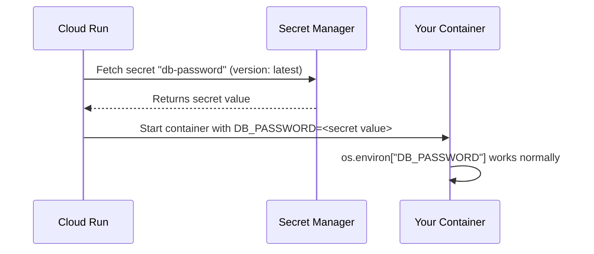

# How to Use Secret Manager References in Cloud Run Environment Variables Without Code Changes

Author: [nawazdhandala](https://www.github.com/nawazdhandala)

Tags: GCP, Cloud Run, Secret Manager, Environment Variables, Security, Google Cloud

Description: Learn how to reference Google Cloud Secret Manager secrets directly in Cloud Run environment variables without modifying your application code.

---

Hardcoding secrets in environment variables is a security risk. Storing them in Secret Manager is better, but rewriting your application to use the Secret Manager API adds complexity. The good news is that Cloud Run can pull secrets from Secret Manager and inject them as regular environment variables or files - your application code does not need to change at all.

This guide shows you how to wire up Secret Manager references in Cloud Run so your app reads secrets from environment variables like it always has, while the actual values are stored securely in Secret Manager.

## How It Works

When you configure a Cloud Run service to reference a secret, here is what happens at startup:

1. Cloud Run reads the service configuration and sees secret references
2. It calls Secret Manager to fetch the specified secret versions
3. It injects the secret values as environment variables (or mounts them as files)
4. Your container starts with the secrets already available

Your application just reads `os.environ["DATABASE_URL"]` like normal. It has no idea the value came from Secret Manager.



## Prerequisites

You need:

- Cloud Run API and Secret Manager API enabled
- Secrets created in Secret Manager
- Proper IAM permissions for Cloud Run to access the secrets

```bash
# Enable required APIs
gcloud services enable run.googleapis.com secretmanager.googleapis.com
```

## Step 1: Create Secrets in Secret Manager

Create the secrets your application needs:

```bash
# Create a database password secret
echo -n "my-super-secret-password" | \
  gcloud secrets create db-password --data-file=-

# Create an API key secret
echo -n "sk_live_abc123def456" | \
  gcloud secrets create api-key --data-file=-

# Create a JSON credentials secret from a file
gcloud secrets create service-credentials \
  --data-file=./credentials.json
```

Each secret can have multiple versions. When you update a secret, a new version is created:

```bash
# Add a new version to an existing secret
echo -n "my-new-password" | \
  gcloud secrets versions add db-password --data-file=-
```

## Step 2: Grant Cloud Run Access to Secrets

Cloud Run uses a service account to access Secret Manager. By default, this is the Compute Engine default service account, but you should use a dedicated service account:

```bash
# Get the project number
PROJECT_NUMBER=$(gcloud projects describe $(gcloud config get-value project) \
  --format='value(projectNumber)')

# Option 1: Grant access to the default compute service account
gcloud secrets add-iam-policy-binding db-password \
  --member="serviceAccount:${PROJECT_NUMBER}-compute@developer.gserviceaccount.com" \
  --role="roles/secretmanager.secretAccessor"

gcloud secrets add-iam-policy-binding api-key \
  --member="serviceAccount:${PROJECT_NUMBER}-compute@developer.gserviceaccount.com" \
  --role="roles/secretmanager.secretAccessor"

# Option 2: Use a dedicated service account (recommended)
gcloud iam service-accounts create cloud-run-sa \
  --display-name="Cloud Run Service Account"

# Grant the service account access to specific secrets
gcloud secrets add-iam-policy-binding db-password \
  --member="serviceAccount:cloud-run-sa@$(gcloud config get-value project).iam.gserviceaccount.com" \
  --role="roles/secretmanager.secretAccessor"

gcloud secrets add-iam-policy-binding api-key \
  --member="serviceAccount:cloud-run-sa@$(gcloud config get-value project).iam.gserviceaccount.com" \
  --role="roles/secretmanager.secretAccessor"
```

## Step 3: Reference Secrets as Environment Variables

### Using gcloud CLI

The `--set-secrets` flag maps secret references to environment variable names:

```bash
# Deploy with secrets mapped to environment variables
gcloud run deploy my-service \
  --image=us-central1-docker.pkg.dev/MY_PROJECT/my-repo/my-app:latest \
  --region=us-central1 \
  --service-account=cloud-run-sa@MY_PROJECT.iam.gserviceaccount.com \
  --set-secrets="DB_PASSWORD=db-password:latest,API_KEY=api-key:latest"
```

The format is `ENV_VAR_NAME=SECRET_NAME:VERSION`. Using `latest` always fetches the most recent version. You can also pin to a specific version number:

```bash
# Pin to specific secret versions for reproducibility
gcloud run deploy my-service \
  --image=us-central1-docker.pkg.dev/MY_PROJECT/my-repo/my-app:latest \
  --region=us-central1 \
  --set-secrets="DB_PASSWORD=db-password:3,API_KEY=api-key:1"
```

### Using Update for Existing Services

Add secrets to a service that is already running:

```bash
# Add a new secret to an existing service
gcloud run services update my-service \
  --region=us-central1 \
  --update-secrets="NEW_SECRET=new-secret-name:latest"

# Remove a secret reference
gcloud run services update my-service \
  --region=us-central1 \
  --remove-secrets="OLD_SECRET"
```

### Using Service YAML

```yaml
# service.yaml - Cloud Run service with secret references
apiVersion: serving.knative.dev/v1
kind: Service
metadata:
  name: my-service
spec:
  template:
    spec:
      serviceAccountName: cloud-run-sa@MY_PROJECT.iam.gserviceaccount.com
      containers:
        - image: us-central1-docker.pkg.dev/MY_PROJECT/my-repo/my-app:latest
          env:
            # Regular environment variable
            - name: APP_ENV
              value: production
            # Secret from Secret Manager
            - name: DB_PASSWORD
              valueFrom:
                secretKeyRef:
                  key: latest          # Secret version
                  name: db-password    # Secret name in Secret Manager
            # Another secret
            - name: API_KEY
              valueFrom:
                secretKeyRef:
                  key: "2"             # Pinned to version 2
                  name: api-key
```

## Step 4: Mount Secrets as Files

Some applications read configuration from files rather than environment variables. Cloud Run can mount secrets as files in the container filesystem:

```bash
# Mount a secret as a file
gcloud run deploy my-service \
  --image=us-central1-docker.pkg.dev/MY_PROJECT/my-repo/my-app:latest \
  --region=us-central1 \
  --set-secrets="/secrets/db-password=db-password:latest" \
  --set-secrets="/secrets/credentials.json=service-credentials:latest"
```

When the path starts with a `/`, Cloud Run mounts the secret as a file at that path. Your application reads it as a normal file:

```python
# Reading a secret mounted as a file
with open("/secrets/db-password", "r") as f:
    db_password = f.read()

# Or for JSON credentials
import json
with open("/secrets/credentials.json", "r") as f:
    credentials = json.load(f)
```

In YAML:

```yaml
# service.yaml - Mount secrets as files
spec:
  template:
    spec:
      containers:
        - image: us-central1-docker.pkg.dev/MY_PROJECT/my-repo/my-app:latest
          volumeMounts:
            - name: db-secret
              mountPath: /secrets/db-password
              readOnly: true
            - name: creds-secret
              mountPath: /secrets/credentials.json
              readOnly: true
      volumes:
        - name: db-secret
          secret:
            secretName: db-password
            items:
              - key: latest
                path: db-password
        - name: creds-secret
          secret:
            secretName: service-credentials
            items:
              - key: latest
                path: credentials.json
```

## Version Pinning vs Latest

There is a tradeoff between using `latest` and pinning to a specific version number.

**Using `latest`:**
- Automatically picks up new secret values
- Requires deploying a new revision for the change to take effect (Cloud Run caches the value at startup)
- Good for secrets that rotate frequently

**Pinning a version:**
- Predictable - you know exactly which value is in use
- Requires updating the service configuration to use a new version
- Better for production environments where you want explicit control

A common pattern is to use `latest` in development and pin versions in production:

```bash
# Development: use latest
gcloud run deploy my-service-dev \
  --set-secrets="DB_PASSWORD=db-password:latest"

# Production: pin to tested version
gcloud run deploy my-service-prod \
  --set-secrets="DB_PASSWORD=db-password:5"
```

## Using Terraform

```hcl
# Terraform configuration for Cloud Run with secrets
resource "google_cloud_run_v2_service" "my_service" {
  name     = "my-service"
  location = "us-central1"

  template {
    service_account = google_service_account.cloud_run_sa.email

    containers {
      image = "us-central1-docker.pkg.dev/my-project/my-repo/my-app:latest"

      # Secret as environment variable
      env {
        name = "DB_PASSWORD"
        value_source {
          secret_key_ref {
            secret  = google_secret_manager_secret.db_password.secret_id
            version = "latest"
          }
        }
      }

      # Regular environment variable
      env {
        name  = "APP_ENV"
        value = "production"
      }
    }
  }
}
```

## Troubleshooting

**"Permission denied" errors on deployment:**
Make sure the Cloud Run service account has the `roles/secretmanager.secretAccessor` role on each secret. The error usually includes the service account email and the secret name.

**Secrets not updating after rotation:**
Secret values are fetched when a new revision starts. If you update a secret in Secret Manager, you need to deploy a new revision for Cloud Run to pick up the change. You can force a new revision with no other changes:

```bash
# Force a new revision to pick up updated secrets
gcloud run services update my-service \
  --region=us-central1 \
  --update-labels="secret-refresh=$(date +%s)"
```

**"Secret version not found":**
Check that the version you referenced exists. If you pinned to version 5 but only versions 1-3 exist, the deployment will fail.

## Summary

Secret Manager references in Cloud Run give you proper secret management without touching your application code. Your app reads environment variables or files like it always has. Cloud Run handles the Secret Manager integration behind the scenes. Use environment variables for simple string secrets and file mounts for certificates or JSON credentials. Pin versions in production for predictability, and use `latest` in development for convenience.
