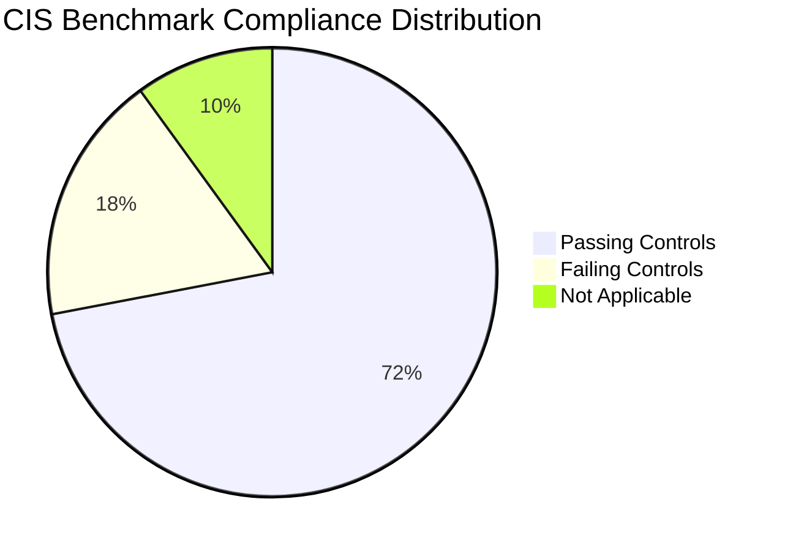

# How to Use Security Command Center Compliance Reports for CIS Benchmarks

Author: [nawazdhandala](https://www.github.com/nawazdhandala)

Tags: GCP, Security Command Center, CIS Benchmarks, Compliance, Cloud Security

Description: Learn how to use Security Command Center compliance reports to track your GCP environment against CIS benchmark standards and maintain continuous compliance.

---

If your organization needs to demonstrate compliance with CIS (Center for Internet Security) benchmarks, you know how tedious manual assessments can be. You have to go through dozens of controls, check each one against your environment, document the results, and repeat the whole thing quarterly.

Security Command Center Premium tier automates most of this. It continuously evaluates your GCP resources against CIS Google Cloud Platform Foundation Benchmark controls and presents the results in a compliance dashboard. You can see exactly which controls pass, which fail, and what needs fixing.

Let me show you how to access and use these reports.

## What Are CIS Benchmarks?

CIS benchmarks are industry-standard security configuration guidelines. The CIS Google Cloud Platform Foundation Benchmark covers areas like:

- Identity and Access Management
- Logging and Monitoring
- Networking
- Virtual Machines
- Storage
- Cloud SQL Databases
- BigQuery
- Cloud KMS

Each section contains specific controls with pass/fail criteria. For example, "Ensure that Cloud Audit Logging is configured properly" is a specific control under the Logging section.

## Prerequisites

- Security Command Center Premium tier (compliance reports are not available in Standard)
- Organization-level SCC access
- The `roles/securitycenter.findingsViewer` role

## Step 1: Access the Compliance Dashboard

The compliance dashboard is available in the Cloud Console:

1. Navigate to Security > Security Command Center
2. Click on the "Compliance" tab
3. Select "CIS Google Cloud Platform Foundation Benchmark" from the available standards

You will see a percentage score showing overall compliance and a breakdown by section.

## Step 2: Review Compliance by Section

The dashboard breaks down compliance into sections matching the CIS benchmark structure. Here is what you will typically see:



Each section shows:
- The number of passing controls
- The number of failing controls
- Individual control details with resource-level findings

## Step 3: List Compliance Findings via CLI

You can also pull compliance-related findings via the command line.

```bash
# List all findings related to CIS benchmark violations
gcloud scc findings list ORGANIZATION_ID \
  --source=organizations/ORGANIZATION_ID/sources/SHA_SOURCE_ID \
  --filter='state="ACTIVE" AND sourceProperties.compliance_standards : "CIS"' \
  --format="table(finding.category, finding.severity, finding.resourceName)" \
  --limit=50
```

To get a count of violations per CIS section:

```bash
# Count findings grouped by category for CIS-related detectors
gcloud scc findings list ORGANIZATION_ID \
  --source=organizations/ORGANIZATION_ID/sources/SHA_SOURCE_ID \
  --filter='state="ACTIVE"' \
  --format="value(finding.category)" | sort | uniq -c | sort -rn
```

## Step 4: Map Findings to CIS Controls

Each SHA finding category maps to one or more CIS controls. Here are some common mappings:

| SHA Finding Category | CIS Control |
|---|---|
| MFA_NOT_ENFORCED | 1.1 - Ensure MFA is enabled for all users |
| SERVICE_ACCOUNT_KEY_NOT_ROTATED | 1.7 - Ensure service account keys are rotated |
| AUDIT_LOGGING_DISABLED | 2.1 - Ensure Cloud Audit Logging is configured |
| FLOW_LOGS_DISABLED | 3.8 - Ensure VPC Flow Logs are enabled |
| DEFAULT_NETWORK | 3.1 - Ensure default network does not exist |
| OPEN_SSH_PORT | 3.6 - Ensure SSH access is restricted |
| PUBLIC_BUCKET_ACL | 5.1 - Ensure Cloud Storage buckets are not publicly accessible |
| SQL_NO_ROOT_PASSWORD | 6.1 - Ensure Cloud SQL database requires all incoming connections to use SSL |

## Step 5: Generate a Compliance Report

For audit purposes, you often need a formal report. You can export the compliance data.

```bash
# Export all active findings to a JSON file for reporting
gcloud scc findings list ORGANIZATION_ID \
  --source=organizations/ORGANIZATION_ID/sources/SHA_SOURCE_ID \
  --filter='state="ACTIVE"' \
  --format=json > scc_compliance_report.json
```

For a more structured report, use a Python script to parse and format the data:

```python
import json
from collections import defaultdict

def generate_cis_report(findings_file):
    """Generate a CIS compliance summary from SCC findings export."""

    with open(findings_file, 'r') as f:
        findings = json.load(f)

    # Group findings by category
    categories = defaultdict(list)
    for item in findings:
        finding = item.get('finding', {})
        category = finding.get('category', 'Unknown')
        categories[category].append({
            'resource': finding.get('resourceName', ''),
            'severity': finding.get('severity', ''),
            'project': finding.get('projectDisplayName', ''),
            'state': finding.get('state', '')
        })

    # Print summary
    print("CIS Benchmark Compliance Report")
    print("=" * 60)
    print(f"Total violation categories: {len(categories)}")
    print(f"Total individual findings: {sum(len(v) for v in categories.values())}")
    print()

    # Print details per category
    for category, items in sorted(categories.items()):
        print(f"\n{category} ({len(items)} findings)")
        print("-" * 40)
        for item in items[:5]:  # Show first 5 per category
            print(f"  Resource: {item['resource']}")
            print(f"  Severity: {item['severity']}")
            print()

generate_cis_report('scc_compliance_report.json')
```

## Step 6: Track Compliance Over Time

Export findings to BigQuery to track your compliance posture over time.

```sql
-- Track weekly compliance score
SELECT
  DATE_TRUNC(DATE(event_time), WEEK) as week,
  COUNT(CASE WHEN state = 'ACTIVE' THEN 1 END) as active_violations,
  COUNT(CASE WHEN state = 'INACTIVE' THEN 1 END) as resolved_violations
FROM `my-project.scc_findings.structured_findings`
WHERE category IN (
  'MFA_NOT_ENFORCED', 'AUDIT_LOGGING_DISABLED',
  'FLOW_LOGS_DISABLED', 'DEFAULT_NETWORK',
  'OPEN_SSH_PORT', 'PUBLIC_BUCKET_ACL'
)
GROUP BY week
ORDER BY week DESC;
```

## Step 7: Remediate Failing Controls

For each failing control, the SCC finding includes remediation guidance. Here are quick fixes for the most common CIS violations:

Enable VPC Flow Logs (CIS 3.8):

```bash
# Enable flow logs on a subnet
gcloud compute networks subnets update my-subnet \
  --region=us-central1 \
  --enable-flow-logs \
  --logging-flow-sampling=0.5 \
  --logging-metadata=include-all \
  --project=my-project-id
```

Remove the default network (CIS 3.1):

```bash
# Delete the default network (must delete firewall rules first)
gcloud compute firewall-rules list --filter="network=default" \
  --format="value(name)" --project=my-project-id | \
  xargs -I {} gcloud compute firewall-rules delete {} --quiet --project=my-project-id

gcloud compute networks delete default --quiet --project=my-project-id
```

Restrict SSH access (CIS 3.6):

```bash
# Update firewall rule to restrict SSH to specific IPs
gcloud compute firewall-rules update allow-ssh \
  --source-ranges="10.0.0.0/8" \
  --project=my-project-id
```

## Step 8: Set Up Continuous Compliance Monitoring

Create notification configs that alert you when new compliance violations appear.

```bash
# Alert on new CIS-related findings
gcloud scc notifications create cis-violations \
  --organization=ORGANIZATION_ID \
  --pubsub-topic=projects/my-project-id/topics/compliance-alerts \
  --filter='state="ACTIVE" AND (severity="HIGH" OR severity="CRITICAL")'
```

## Best Practices for CIS Compliance

1. Start with the highest-impact controls. Focus on IAM, networking, and logging first since these have the broadest security impact.

2. Use Organization Policies to prevent violations before they happen. For example, set a constraint that prevents public buckets at the org level.

3. Automate remediation where possible. For straightforward fixes like enabling flow logs, use Cloud Functions triggered by SCC findings.

4. Document exceptions. Not every CIS control makes sense for every organization. Document why you are accepting certain risks.

5. Review compliance weekly, not just during audits. Continuous monitoring prevents the last-minute scramble before an audit.

## Conclusion

Security Command Center compliance reports turn CIS benchmark assessments from a periodic manual exercise into a continuous automated process. The dashboard gives you an at-a-glance view of your compliance posture, and the detailed findings tell you exactly what needs fixing. Combined with automated remediation and BigQuery-based trend tracking, you can maintain strong compliance without dedicating a full-time team to the effort.
