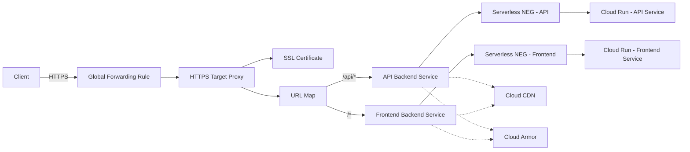

# How to Use Serverless Network Endpoint Groups with Cloud Run Behind a GCP Load Balancer

Author: [nawazdhandala](https://www.github.com/nawazdhandala)

Tags: GCP, Cloud Run, Serverless NEG, Load Balancer, Serverless

Description: Learn how to put Cloud Run services behind a GCP HTTP(S) load balancer using serverless network endpoint groups for custom domains, CDN, and advanced routing.

---

Cloud Run gives you a URL like `my-service-abc123-uc.a.run.app` out of the box. That works fine for development, but for production you usually want a custom domain, SSL certificates, CDN caching, and the ability to route different paths to different Cloud Run services. Serverless network endpoint groups (NEGs) let you plug Cloud Run services into a GCP HTTP(S) load balancer, giving you all these features.

This post shows you how to wire it up from scratch, including handling multiple services and enabling Cloud CDN.

## What Is a Serverless NEG?

A serverless NEG is a pointer to a serverless backend - Cloud Run, App Engine, or Cloud Functions. It acts as a bridge between the load balancer's backend service and your serverless workload. Instead of pointing a backend service at an instance group with VMs, you point it at a serverless NEG that references a Cloud Run service.

Benefits of putting Cloud Run behind a load balancer:
- Custom domains with Google-managed SSL certificates
- Cloud CDN for caching responses at edge locations
- Cloud Armor for WAF and DDoS protection
- URL-based routing to multiple Cloud Run services
- Header-based routing and traffic splitting

## Prerequisites

- A Cloud Run service already deployed
- A GCP project with the Compute Engine API enabled
- The `gcloud` CLI configured

## Step 1: Deploy a Cloud Run Service (If You Do Not Have One)

If you need a Cloud Run service to work with:

```bash
# Deploy a sample Cloud Run service
gcloud run deploy my-web-app \
    --image=gcr.io/cloudrun/hello \
    --platform=managed \
    --region=us-central1 \
    --allow-unauthenticated
```

## Step 2: Create a Serverless NEG

The serverless NEG points to your Cloud Run service:

```bash
# Create a serverless NEG for the Cloud Run service
gcloud compute network-endpoint-groups create my-serverless-neg \
    --region=us-central1 \
    --network-endpoint-type=serverless \
    --cloud-run-service=my-web-app
```

If you want the NEG to point to a specific Cloud Run URL mask (useful for routing multiple services through a single NEG):

```bash
# Create a serverless NEG with a URL mask
gcloud compute network-endpoint-groups create multi-service-neg \
    --region=us-central1 \
    --network-endpoint-type=serverless \
    --cloud-run-url-mask="<service>.example.com"
```

## Step 3: Create a Backend Service

Create a backend service and attach the serverless NEG:

```bash
# Create a backend service for the Cloud Run workload
gcloud compute backend-services create my-cloud-run-backend \
    --global \
    --load-balancing-scheme=EXTERNAL_MANAGED

# Add the serverless NEG to the backend service
gcloud compute backend-services add-backend my-cloud-run-backend \
    --global \
    --network-endpoint-group=my-serverless-neg \
    --network-endpoint-group-region=us-central1
```

Note that serverless NEGs do not need health checks. Cloud Run manages the health of your service automatically.

## Step 4: Create a URL Map

```bash
# Create a URL map routing all traffic to the Cloud Run backend
gcloud compute url-maps create my-cloud-run-map \
    --default-service=my-cloud-run-backend \
    --global
```

## Step 5: Create SSL Certificate and Target Proxy

```bash
# Reserve a global IP address
gcloud compute addresses create cloud-run-lb-ip \
    --ip-version=IPV4 \
    --global

# Create a managed SSL certificate
gcloud compute ssl-certificates create cloud-run-cert \
    --domains=app.example.com \
    --global

# Create the HTTPS target proxy
gcloud compute target-https-proxies create cloud-run-https-proxy \
    --url-map=my-cloud-run-map \
    --ssl-certificates=cloud-run-cert
```

## Step 6: Create the Forwarding Rule

```bash
# Create the forwarding rule to route HTTPS traffic
gcloud compute forwarding-rules create cloud-run-https-rule \
    --address=cloud-run-lb-ip \
    --global \
    --target-https-proxy=cloud-run-https-proxy \
    --ports=443
```

Point your DNS to the load balancer IP and wait for the SSL certificate to provision.

## Routing Multiple Cloud Run Services

A common pattern is routing different URL paths to different Cloud Run services. For example, `/api/*` goes to an API service and everything else goes to a frontend service.

```bash
# Create serverless NEGs for each service
gcloud compute network-endpoint-groups create api-neg \
    --region=us-central1 \
    --network-endpoint-type=serverless \
    --cloud-run-service=api-service

gcloud compute network-endpoint-groups create frontend-neg \
    --region=us-central1 \
    --network-endpoint-type=serverless \
    --cloud-run-service=frontend-service

# Create backend services for each
gcloud compute backend-services create api-backend \
    --global --load-balancing-scheme=EXTERNAL_MANAGED

gcloud compute backend-services add-backend api-backend \
    --global \
    --network-endpoint-group=api-neg \
    --network-endpoint-group-region=us-central1

gcloud compute backend-services create frontend-backend \
    --global --load-balancing-scheme=EXTERNAL_MANAGED

gcloud compute backend-services add-backend frontend-backend \
    --global \
    --network-endpoint-group=frontend-neg \
    --network-endpoint-group-region=us-central1

# Create a URL map with path-based routing
gcloud compute url-maps create multi-service-map \
    --default-service=frontend-backend \
    --global

gcloud compute url-maps add-path-matcher multi-service-map \
    --path-matcher-name=service-routes \
    --default-service=frontend-backend \
    --path-rules="/api/*=api-backend" \
    --global
```

## Enabling Cloud CDN

One of the main reasons to put Cloud Run behind a load balancer is CDN caching:

```bash
# Enable Cloud CDN on the Cloud Run backend service
gcloud compute backend-services update my-cloud-run-backend \
    --enable-cdn \
    --cache-mode=USE_ORIGIN_HEADERS \
    --global
```

For CDN to work, your Cloud Run service needs to return appropriate Cache-Control headers:

```python
# Example Cloud Run handler with cache headers
from flask import Flask, jsonify

app = Flask(__name__)

@app.route('/api/products')
def get_products():
    # Cache product list at the CDN for 5 minutes
    response = jsonify(get_all_products())
    response.headers['Cache-Control'] = 'public, max-age=300'
    return response

@app.route('/api/user')
def get_user():
    # Never cache user-specific data at CDN
    response = jsonify(get_current_user())
    response.headers['Cache-Control'] = 'private, no-store'
    return response
```

## Adding Cloud Armor

Protect your Cloud Run service with Cloud Armor WAF rules:

```bash
# Create a Cloud Armor security policy
gcloud compute security-policies create cloud-run-policy

# Add a rate limiting rule
gcloud compute security-policies rules create 1000 \
    --security-policy=cloud-run-policy \
    --action=throttle \
    --rate-limit-threshold-count=100 \
    --rate-limit-threshold-interval-sec=60 \
    --conform-action=allow \
    --exceed-action=deny-429 \
    --enforce-on-key=IP

# Attach the policy to the backend service
gcloud compute backend-services update my-cloud-run-backend \
    --security-policy=cloud-run-policy \
    --global
```

## Architecture Diagram



## Multi-Region Setup

For global availability, create serverless NEGs in multiple regions:

```bash
# Deploy Cloud Run in multiple regions
gcloud run deploy my-web-app --region=us-central1 --image=gcr.io/my-project/app
gcloud run deploy my-web-app --region=europe-west1 --image=gcr.io/my-project/app

# Create serverless NEGs in each region
gcloud compute network-endpoint-groups create neg-us \
    --region=us-central1 \
    --network-endpoint-type=serverless \
    --cloud-run-service=my-web-app

gcloud compute network-endpoint-groups create neg-eu \
    --region=europe-west1 \
    --network-endpoint-type=serverless \
    --cloud-run-service=my-web-app

# Add both NEGs to the same backend service
gcloud compute backend-services add-backend my-cloud-run-backend \
    --global \
    --network-endpoint-group=neg-us \
    --network-endpoint-group-region=us-central1

gcloud compute backend-services add-backend my-cloud-run-backend \
    --global \
    --network-endpoint-group=neg-eu \
    --network-endpoint-group-region=europe-west1
```

The load balancer automatically routes users to the nearest region.

## IAM and Authentication

When Cloud Run is behind a load balancer, you can restrict direct access to the Cloud Run URL and only allow traffic through the load balancer:

```bash
# Remove public access from Cloud Run
gcloud run services update my-web-app \
    --region=us-central1 \
    --no-allow-unauthenticated

# The load balancer uses IAM to authenticate to Cloud Run
# Grant the Compute Engine default service account access
gcloud run services add-iam-policy-binding my-web-app \
    --region=us-central1 \
    --member="serviceAccount:PROJECT_NUMBER-compute@developer.gserviceaccount.com" \
    --role="roles/run.invoker"
```

## Wrapping Up

Serverless NEGs are the glue between Cloud Run and the full power of GCP's load balancing infrastructure. They give your Cloud Run services custom domains, CDN caching, WAF protection, and sophisticated routing capabilities. The setup involves a few more resources than using Cloud Run's built-in domain mapping, but the additional features are well worth the extra configuration for any production deployment.
