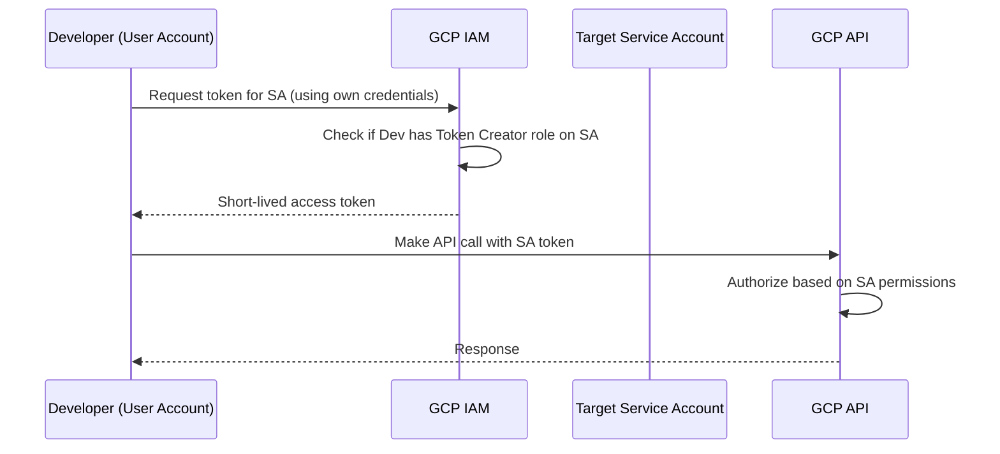

# How to Use Service Account Impersonation to Test Permissions in GCP

Author: [nawazdhandala](https://www.github.com/nawazdhandala)

Tags: GCP, Service Account Impersonation, IAM, Security, Google Cloud

Description: Learn how to use service account impersonation in GCP to test permissions, debug access issues, and develop locally without downloading service account key files.

---

When you are setting up IAM permissions for a service account, you want to verify that it has exactly the right access - not too much, not too little. The traditional approach was to download a service account key, switch to it, and test. That approach has security problems: key files can be leaked, forgotten, or shared inappropriately.

Service account impersonation lets you temporarily assume a service account's identity using your existing credentials. No key files involved. This post covers how to set it up, use it for testing, and integrate it into your development workflow.

## How Service Account Impersonation Works

When you impersonate a service account, you use your own credentials (or another service account's credentials) to request a short-lived token that represents the target service account. The token typically lasts one hour and cannot be refreshed indefinitely.

The flow looks like this:



## Setting Up Impersonation

### Grant the Token Creator Role

First, you need the `roles/iam.serviceAccountTokenCreator` role on the target service account:

```bash
# Grant yourself permission to impersonate a service account
gcloud iam service-accounts add-iam-policy-binding \
  app-backend@my-project.iam.gserviceaccount.com \
  --member="user:developer@example.com" \
  --role="roles/iam.serviceAccountTokenCreator"
```

This does not give you the permissions of the service account directly. It gives you the ability to request tokens that represent the service account.

### Verify the Binding

```bash
# Check the IAM policy on the service account
gcloud iam service-accounts get-iam-policy \
  app-backend@my-project.iam.gserviceaccount.com \
  --format="yaml(bindings)"
```

## Using Impersonation with gcloud

### One-Off Commands

Add the `--impersonate-service-account` flag to any gcloud command:

```bash
# List buckets as the service account
gcloud storage buckets list \
  --impersonate-service-account=app-backend@my-project.iam.gserviceaccount.com \
  --project=my-project

# Create a VM as the service account
gcloud compute instances create test-vm \
  --zone=us-central1-a \
  --machine-type=e2-micro \
  --impersonate-service-account=app-backend@my-project.iam.gserviceaccount.com \
  --project=my-project
```

### Set as Default for a Session

If you are doing extensive testing, set impersonation as the default:

```bash
# Set impersonation for all subsequent gcloud commands
gcloud config set auth/impersonate_service_account \
  app-backend@my-project.iam.gserviceaccount.com
```

Now every gcloud command uses the service account identity:

```bash
# These commands all run as the service account
gcloud storage ls
gcloud compute instances list --project=my-project
gcloud pubsub topics list --project=my-project
```

To stop impersonating:

```bash
# Remove the impersonation setting
gcloud config unset auth/impersonate_service_account
```

## Using Impersonation for Local Development

### With Application Default Credentials

Set up ADC to use impersonation:

```bash
# Configure ADC to impersonate a service account
gcloud auth application-default login \
  --impersonate-service-account=app-backend@my-project.iam.gserviceaccount.com
```

Now your application code uses the service account's identity:

```python
# Python code that automatically uses the impersonated identity
from google.cloud import storage
from google.cloud import pubsub_v1

# These clients use the impersonated service account's permissions
storage_client = storage.Client()
publisher = pubsub_v1.PublisherClient()

# This will succeed or fail based on the SA's IAM permissions
buckets = list(storage_client.list_buckets())
```

### With Client Libraries Directly

You can also impersonate within your code:

```python
# Explicit impersonation in Python code
from google.auth import impersonated_credentials
import google.auth

# Get the source credentials (your user account or another SA)
source_credentials, project = google.auth.default()

# Create impersonated credentials
target_credentials = impersonated_credentials.Credentials(
    source_credentials=source_credentials,
    target_principal='app-backend@my-project.iam.gserviceaccount.com',
    target_scopes=['https://www.googleapis.com/auth/cloud-platform'],
    lifetime=3600  # Token lifetime in seconds (max 3600)
)

# Use the impersonated credentials with a client
from google.cloud import storage
client = storage.Client(credentials=target_credentials)
buckets = list(client.list_buckets())
```

## Testing Permission Boundaries

The real value of impersonation is testing that permissions are correct. Here is a workflow for verifying a service account's access.

### Test What Should Work

```bash
# Test that the SA can read from the expected bucket
gcloud storage ls gs://app-data-bucket/ \
  --impersonate-service-account=app-backend@my-project.iam.gserviceaccount.com

# Test that the SA can publish to the expected topic
gcloud pubsub topics publish my-topic \
  --message="test" \
  --impersonate-service-account=app-backend@my-project.iam.gserviceaccount.com \
  --project=my-project
```

### Test What Should Not Work

Equally important - verify that the service account cannot access things it should not:

```bash
# This should fail - the SA should not have access to sensitive buckets
gcloud storage ls gs://sensitive-data-bucket/ \
  --impersonate-service-account=app-backend@my-project.iam.gserviceaccount.com

# This should fail - the SA should not be able to modify IAM
gcloud projects get-iam-policy my-project \
  --impersonate-service-account=app-backend@my-project.iam.gserviceaccount.com
```

If any of the "should fail" commands succeed, the service account has too many permissions and you need to tighten the IAM bindings.

### Automated Permission Testing

Create a script that tests both positive and negative access:

```bash
#!/bin/bash
# test-sa-permissions.sh - Verify service account permissions are correct

SA="app-backend@my-project.iam.gserviceaccount.com"
IMPERSONATE="--impersonate-service-account=$SA"
PROJECT="my-project"

echo "Testing permissions for $SA"
echo "================================"

# Test cases: command, expected_result (0=success, non-zero=failure)
test_permission() {
  local description="$1"
  local expected="$2"
  shift 2

  # Run the command
  "$@" $IMPERSONATE --project=$PROJECT > /dev/null 2>&1
  local result=$?

  if [ "$expected" = "allow" ] && [ $result -eq 0 ]; then
    echo "PASS: $description (allowed as expected)"
  elif [ "$expected" = "deny" ] && [ $result -ne 0 ]; then
    echo "PASS: $description (denied as expected)"
  elif [ "$expected" = "allow" ] && [ $result -ne 0 ]; then
    echo "FAIL: $description (should be allowed but was denied)"
  elif [ "$expected" = "deny" ] && [ $result -eq 0 ]; then
    echo "FAIL: $description (should be denied but was allowed)"
  fi
}

# Positive tests - these should succeed
test_permission "Read app data bucket" "allow" \
  gcloud storage ls gs://app-data-bucket/

test_permission "Publish to app topic" "allow" \
  gcloud pubsub topics list

# Negative tests - these should fail
test_permission "Read sensitive bucket" "deny" \
  gcloud storage ls gs://sensitive-data-bucket/

test_permission "List IAM policy" "deny" \
  gcloud projects get-iam-policy my-project

echo "================================"
echo "Permission testing complete"
```

## Chained Impersonation

In some cases, you might need to impersonate through a chain of service accounts. This is useful when testing delegate patterns:

```bash
# Impersonate through a chain: you -> SA-A -> SA-B
gcloud storage ls gs://restricted-bucket/ \
  --impersonate-service-account=sa-b@my-project.iam.gserviceaccount.com \
  --impersonate-service-account-delegates=sa-a@my-project.iam.gserviceaccount.com
```

For this to work:
- You need Token Creator on SA-A
- SA-A needs Token Creator on SA-B

## Debugging Impersonation Failures

If impersonation fails, check these things:

```bash
# Verify the service account exists
gcloud iam service-accounts describe \
  app-backend@my-project.iam.gserviceaccount.com

# Verify your Token Creator role
gcloud iam service-accounts get-iam-policy \
  app-backend@my-project.iam.gserviceaccount.com \
  --flatten="bindings[].members" \
  --filter="bindings.role=roles/iam.serviceAccountTokenCreator" \
  --format="table(bindings.members)"

# Check if the SA is disabled
gcloud iam service-accounts describe \
  app-backend@my-project.iam.gserviceaccount.com \
  --format="value(disabled)"
```

Common failures include:
- Missing Token Creator role (most common)
- Service account is disabled
- Organization policy blocking token creation
- Source credentials have expired

## Summary

Service account impersonation is the secure alternative to service account key files. It lets you assume a service account's identity using short-lived tokens, which is perfect for testing permissions, local development, and debugging access issues. Set up the Token Creator role, use the `--impersonate-service-account` flag for gcloud commands or `gcloud auth application-default login --impersonate-service-account` for client libraries, and build automated tests to verify both positive and negative access patterns.
