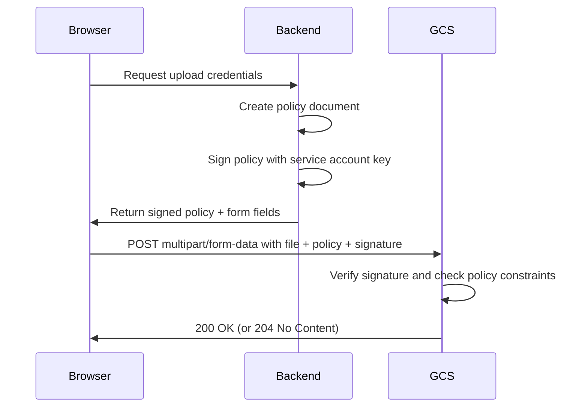

# How to Use Signed Policy Documents for Browser-Based Uploads to Google Cloud Storage

Author: [nawazdhandala](https://www.github.com/nawazdhandala)

Tags: GCP, Google Cloud Storage, Signed Policy Documents, Browser Uploads, Web Development

Description: Learn how to use signed policy documents for secure browser-based uploads to Google Cloud Storage with file size limits, content type restrictions, and path controls.

---

Signed URLs are great for simple browser uploads, but they have a limitation: the backend must know the exact object name and content type upfront. Signed policy documents offer more flexibility. They let you define a set of constraints - maximum file size, allowed content types, key prefix - and the browser can upload any file that meets those constraints. This is particularly useful for user-facing upload forms where you want to allow uploads but enforce rules.

This guide covers how to create and use signed policy documents for secure browser uploads to Google Cloud Storage.

## How Signed Policy Documents Work

A signed policy document is a JSON object that describes what the browser is allowed to upload. The backend signs this document with a service account key and sends the signature to the browser along with the policy. The browser then includes the policy and signature in a POST request to Cloud Storage.



## Creating a Policy Document

A policy document is a Base64-encoded JSON object that specifies conditions the upload must meet. Here is an example:

```json
{
  "expiration": "2026-02-17T12:00:00Z",
  "conditions": [
    {"bucket": "my-upload-bucket"},
    ["starts-with", "$key", "uploads/user-123/"],
    {"Content-Type": "image/jpeg"},
    ["content-length-range", 0, 10485760],
    {"x-goog-algorithm": "GOOG4-RSA-SHA256"},
    {"x-goog-credential": "my-sa@project.iam.gserviceaccount.com/20260217/auto/storage/goog4_request"},
    {"x-goog-date": "20260217T100000Z"}
  ]
}
```

Each condition restricts what the upload can do:

- **bucket** - which bucket receives the upload
- **starts-with $key** - the object name must start with a specific prefix
- **Content-Type** - the allowed MIME type (exact match or starts-with)
- **content-length-range** - minimum and maximum file size in bytes
- **x-goog-algorithm** - the signing algorithm
- **x-goog-credential** - the service account and date scope
- **x-goog-date** - the signing timestamp

## Generating Signed Policy Documents in Python

Here is a complete backend implementation:

```python
import base64
import datetime
import json
import hashlib
import hmac

from google.cloud import storage
from google.oauth2 import service_account


def generate_signed_policy(
    bucket_name,
    key_prefix,
    allowed_content_types=None,
    max_size_bytes=10 * 1024 * 1024,
    expiration_minutes=30,
    service_account_file="service-account-key.json"
):
    """
    Generate a signed policy document for browser-based uploads.

    Args:
        bucket_name: Target GCS bucket
        key_prefix: Required prefix for the uploaded object name
        allowed_content_types: List of allowed MIME types
        max_size_bytes: Maximum upload size in bytes
        expiration_minutes: How long the policy is valid
        service_account_file: Path to service account JSON key
    """

    # Use the storage client to generate the policy
    client = storage.Client.from_service_account_json(service_account_file)
    bucket = client.bucket(bucket_name)

    # Calculate expiration time
    expiration = datetime.datetime.utcnow() + datetime.timedelta(minutes=expiration_minutes)

    # Build the conditions list
    conditions = [
        {"bucket": bucket_name},
        ["starts-with", "$key", key_prefix],
        ["content-length-range", 0, max_size_bytes],
    ]

    # Add content type restrictions if specified
    if allowed_content_types and len(allowed_content_types) == 1:
        conditions.append({"Content-Type": allowed_content_types[0]})
    elif allowed_content_types:
        # Use starts-with for multiple types sharing a prefix
        conditions.append(["starts-with", "$Content-Type", ""])

    # Generate the signed post policy using the client library
    policy = bucket.generate_signed_post_policy_v4(
        blob_name=key_prefix,
        expiration=expiration,
        conditions=conditions,
        fields={
            "Content-Type": allowed_content_types[0] if allowed_content_types else "",
        },
        credentials=client._credentials,
    )

    return policy


# Generate a policy for user image uploads
policy = generate_signed_policy(
    bucket_name="my-upload-bucket",
    key_prefix="uploads/user-123/",
    allowed_content_types=["image/jpeg"],
    max_size_bytes=5 * 1024 * 1024,  # 5 MB max
    expiration_minutes=15
)

print("Upload URL:", policy["url"])
print("Form fields:", json.dumps(policy["fields"], indent=2))
```

## Using the Python Client Library Directly

The Google Cloud Storage Python library has built-in support for generating V4 signed POST policies:

```python
from google.cloud import storage
from datetime import datetime, timedelta

def create_upload_policy(bucket_name, blob_prefix, max_size_mb=10):
    """Create a signed POST policy using the GCS Python client."""
    client = storage.Client()
    bucket = client.bucket(bucket_name)

    # Define conditions for the upload
    conditions = [
        ["starts-with", "$key", blob_prefix],
        ["content-length-range", 0, max_size_mb * 1024 * 1024],
        ["starts-with", "$Content-Type", "image/"],
    ]

    # Generate the signed post policy
    policy = storage.Blob.generate_signed_post_policy_v4(
        bucket_name=bucket_name,
        blob_name=f"{blob_prefix}${{filename}}",
        expiration=datetime.utcnow() + timedelta(minutes=30),
        conditions=conditions,
    )

    return policy
```

## Node.js Backend Implementation

```javascript
const { Storage } = require('@google-cloud/storage');
const storage = new Storage();

async function generateUploadPolicy(bucketName, keyPrefix, maxSizeMB = 10) {
  const bucket = storage.bucket(bucketName);
  const file = bucket.file(`${keyPrefix}\${filename}`);

  // Generate a V4 signed policy for POST uploads
  const [response] = await file.generateSignedPostPolicyV4({
    expires: Date.now() + 30 * 60 * 1000, // 30 minutes
    conditions: [
      ['starts-with', '$key', keyPrefix],
      ['content-length-range', 0, maxSizeMB * 1024 * 1024],
      ['starts-with', '$Content-Type', 'image/'],
    ],
    fields: {
      'Content-Type': 'image/jpeg',
    },
  });

  return response;
}

// Express API endpoint
const express = require('express');
const app = express();

app.post('/api/upload-policy', async (req, res) => {
  try {
    const userId = req.user.id; // From your auth middleware

    const policy = await generateUploadPolicy(
      'my-upload-bucket',
      `uploads/${userId}/`,
      5 // 5 MB max
    );

    res.json(policy);
  } catch (err) {
    console.error('Failed to generate policy:', err);
    res.status(500).json({ error: 'Failed to generate upload policy' });
  }
});
```

## Browser Upload Form

### HTML Form

The simplest way to use a signed policy is with a standard HTML form:

```html
<form id="uploadForm"
      action="https://storage.googleapis.com/my-upload-bucket"
      method="POST"
      enctype="multipart/form-data">

  <!-- These hidden fields come from your backend -->
  <input type="hidden" name="key" value="uploads/user-123/${filename}">
  <input type="hidden" name="Content-Type" value="image/jpeg">
  <input type="hidden" name="x-goog-algorithm" value="">
  <input type="hidden" name="x-goog-credential" value="">
  <input type="hidden" name="x-goog-date" value="">
  <input type="hidden" name="policy" value="">
  <input type="hidden" name="x-goog-signature" value="">

  <!-- The actual file input -->
  <input type="file" name="file" accept="image/jpeg">
  <button type="submit">Upload</button>
</form>
```

### JavaScript Upload

For more control, use JavaScript to build the form data programmatically:

```javascript
async function uploadWithPolicy(file) {
  // Step 1: Get the signed policy from your backend
  const policyResponse = await fetch('/api/upload-policy', {
    method: 'POST',
    headers: { 'Content-Type': 'application/json' },
    body: JSON.stringify({
      contentType: file.type,
      fileName: file.name,
    }),
  });

  const { url, fields } = await policyResponse.json();

  // Step 2: Build the multipart form data
  const formData = new FormData();

  // Add all policy fields first (order matters - file must be last)
  Object.entries(fields).forEach(([key, value]) => {
    formData.append(key, value);
  });

  // Add the file last - this is required by GCS
  formData.append('file', file);

  // Step 3: POST directly to GCS
  const uploadResponse = await fetch(url, {
    method: 'POST',
    body: formData,
  });

  if (uploadResponse.ok) {
    console.log('Upload successful');
    return true;
  } else {
    const error = await uploadResponse.text();
    console.error('Upload failed:', error);
    return false;
  }
}

// Attach to a file input
document.getElementById('fileInput').addEventListener('change', (event) => {
  const file = event.target.files[0];
  if (file) {
    uploadWithPolicy(file);
  }
});
```

## Policy Conditions Reference

Here are all the conditions you can use:

| Condition | Description | Example |
|---|---|---|
| Exact match | Field must equal exact value | `{"Content-Type": "image/jpeg"}` |
| starts-with | Field must start with prefix | `["starts-with", "$key", "uploads/"]` |
| content-length-range | File size must be in range | `["content-length-range", 0, 5242880]` |

## Common Policy Patterns

### Allow Multiple Image Types

```json
{
  "conditions": [
    ["starts-with", "$Content-Type", "image/"],
    ["content-length-range", 0, 10485760]
  ]
}
```

### Allow Specific File Types

```json
{
  "conditions": [
    ["starts-with", "$Content-Type", ""],
    ["content-length-range", 0, 52428800]
  ]
}
```

Then validate the content type in your backend before generating the policy.

### Restrict to a User's Directory

```json
{
  "conditions": [
    ["starts-with", "$key", "uploads/user-456/"],
    ["content-length-range", 0, 5242880]
  ]
}
```

## Signed Policy Documents vs Signed URLs

| Feature | Signed Policy Documents | Signed URLs |
|---|---|---|
| File name flexibility | Can use prefix patterns | Must know exact name |
| Size restrictions | Built into policy | Not available |
| Content type validation | Built into policy | Must match at signing |
| Upload method | POST with multipart form | PUT with raw body |
| Multiple constraints | Yes, flexible conditions | Limited |
| Best for | User upload forms | Programmatic uploads |

Use signed policy documents when you need more control over what gets uploaded. Use signed URLs when simplicity is more important and you know the exact upload parameters.

## CORS Configuration

Remember to set up CORS on the bucket for browser uploads to work:

```json
[
  {
    "origin": ["https://myapp.com"],
    "method": ["POST"],
    "responseHeader": ["Content-Type"],
    "maxAgeSeconds": 3600
  }
]
```

Signed policy documents give you fine-grained control over browser uploads while keeping the actual file transfer between the browser and GCS. Your backend never handles the file data, reducing load and complexity, while the policy ensures that only valid uploads succeed.
