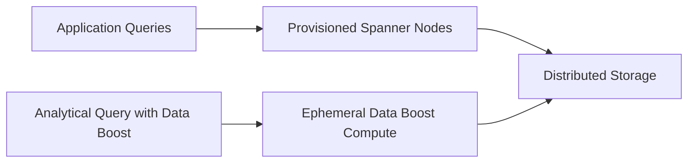

# How to Use Spanner Data Boost for Resource-Isolated Analytical Queries

Author: [nawazdhandala](https://www.github.com/nawazdhandala)

Tags: GCP, Cloud Spanner, Data Boost, Analytics, Database Performance

Description: Learn how to use Cloud Spanner Data Boost to run heavy analytical queries and data exports without impacting your production OLTP workloads through resource-isolated compute.

---

One of the oldest tensions in database management is running analytical queries against a production database. Your application needs consistent, low-latency reads and writes for transactional workloads. But someone in the analytics team wants to scan millions of rows for a report, and suddenly your API response times spike. Cloud Spanner's Data Boost feature solves this by running analytical queries on separate, isolated compute resources that do not touch your provisioned Spanner nodes.

Data Boost is essentially on-demand compute that reads directly from Spanner's distributed storage layer. Your OLTP workload keeps humming along on your provisioned nodes while the analytical query runs on completely independent resources. There is no shared CPU, no shared memory, no contention.

## How Data Boost Works

In a standard Spanner setup, all queries - transactional and analytical - share the same set of provisioned nodes. When you run a heavy table scan, it competes for CPU and memory with your application queries.

Data Boost changes this by introducing a separate compute path. When you execute a query with Data Boost enabled, Spanner routes it to ephemeral, independently provisioned compute resources. These resources read directly from Spanner's Colossus-based storage layer, bypassing your provisioned nodes entirely.

The flow looks like this:



The important thing to notice is that the analytical query path and the application query path share storage but not compute. This is what gives you isolation.

## Enabling Data Boost

Data Boost does not require any changes to your Spanner instance configuration. You enable it per-query by specifying the `DATA_BOOST_ENABLED` option in your read or query request.

Using gcloud to run a Data Boost query:

```bash
# Run a query using Data Boost through gcloud
# The --data-boost flag routes the query to isolated compute
gcloud spanner databases execute-sql my-database \
  --instance=my-instance \
  --sql="SELECT COUNT(*) as total, status FROM orders GROUP BY status" \
  --data-boost
```

## Using Data Boost in Application Code

Here is how to enable Data Boost in the most common client libraries.

### Python

```python
from google.cloud import spanner
from google.cloud.spanner_v1 import DirectedReadOptions

client = spanner.Client()
instance = client.instance('my-instance')
database = instance.database('my-database')

# Run an analytical query with Data Boost enabled
# This will not impact your production OLTP workload
with database.snapshot() as snapshot:
    results = snapshot.execute_sql(
        "SELECT user_id, COUNT(*) as order_count, SUM(total) as revenue "
        "FROM orders "
        "GROUP BY user_id "
        "ORDER BY revenue DESC "
        "LIMIT 100",
        data_boost_enabled=True  # Routes query to isolated compute
    )

    for row in results:
        print(f"User: {row[0]}, Orders: {row[1]}, Revenue: {row[2]}")
```

### Java

```java
import com.google.cloud.spanner.*;

// Create a Spanner client and get a database client
SpannerOptions options = SpannerOptions.newBuilder().build();
Spanner spanner = options.getService();
DatabaseClient dbClient = spanner.getDatabaseClient(
    DatabaseId.of("my-project", "my-instance", "my-database")
);

// Execute an analytical query with Data Boost
// The setDataBoostEnabled(true) call isolates this from production traffic
try (ResultSet resultSet = dbClient
    .singleUse()
    .executeQuery(
        Statement.of(
            "SELECT region, COUNT(*) as cnt, AVG(response_time_ms) as avg_latency "
            + "FROM api_logs "
            + "WHERE timestamp > TIMESTAMP_SUB(CURRENT_TIMESTAMP(), INTERVAL 24 HOUR) "
            + "GROUP BY region"
        ),
        Options.dataBoostEnabled(true)  // Enable Data Boost
    )) {
    while (resultSet.next()) {
        System.out.printf("Region: %s, Count: %d, Avg Latency: %.2f%n",
            resultSet.getString("region"),
            resultSet.getLong("cnt"),
            resultSet.getDouble("avg_latency"));
    }
}
```

### Go

```go
package main

import (
    "context"
    "fmt"
    "log"

    "cloud.google.com/go/spanner"
    "google.golang.org/api/iterator"
)

func runDataBoostQuery() {
    ctx := context.Background()
    client, err := spanner.NewClient(ctx,
        "projects/my-project/instances/my-instance/databases/my-database")
    if err != nil {
        log.Fatal(err)
    }
    defer client.Close()

    // Create a read-only transaction with Data Boost enabled
    // This query will run on isolated compute resources
    stmt := spanner.Statement{
        SQL: `SELECT product_id, SUM(quantity) as total_sold
              FROM order_items
              GROUP BY product_id
              ORDER BY total_sold DESC
              LIMIT 50`,
    }

    iter := client.Single().WithDataBoostEnabled(true).Query(ctx, stmt)
    defer iter.Stop()

    for {
        row, err := iter.Next()
        if err == iterator.Done {
            break
        }
        if err != nil {
            log.Fatal(err)
        }
        var productID string
        var totalSold int64
        if err := row.Columns(&productID, &totalSold); err != nil {
            log.Fatal(err)
        }
        fmt.Printf("Product: %s, Sold: %d\n", productID, totalSold)
    }
}
```

## Data Boost with Batch Reads

Data Boost is particularly useful with Spanner's batch read API, which is designed for large-scale data processing. Batch reads partition a query across multiple workers for parallel execution:

```python
from google.cloud import spanner

client = spanner.Client()
instance = client.instance('my-instance')
database = instance.database('my-database')

# Create a batch transaction with Data Boost
# This is ideal for large exports or ETL jobs
batch_txn = database.batch_snapshot()

# Generate partitions for parallel reading
partitions = batch_txn.generate_read_batches(
    table='events',
    columns=['event_id', 'event_type', 'timestamp', 'payload'],
    keyset=spanner.KeySet(all_=True),
    data_boost_enabled=True  # All partitions use Data Boost
)

# Process each partition (in production, distribute across workers)
total_rows = 0
for partition in partitions:
    results = batch_txn.process(partition)
    for row in results:
        total_rows += 1
        # Process each row

print(f"Processed {total_rows} rows without impacting production")
batch_txn.close()
```

## Data Boost with Dataflow and Spark

Data Boost integrates with GCP's data processing ecosystem. When using the Spanner connector for Dataflow or Spark, you can enable Data Boost to ensure your pipeline does not affect production.

For a Dataflow pipeline:

```python
import apache_beam as beam
from apache_beam.io.gcp.spanner import ReadFromSpanner

# Apache Beam pipeline that reads from Spanner using Data Boost
# Production workloads are completely unaffected
with beam.Pipeline() as pipeline:
    rows = (
        pipeline
        | 'ReadFromSpanner' >> ReadFromSpanner(
            project_id='my-project',
            instance_id='my-instance',
            database_id='my-database',
            sql='SELECT * FROM large_table WHERE created_at > @start_date',
            params={'start_date': '2026-01-01'},
            data_boost_enabled=True  # Enable Data Boost for the read
        )
        | 'TransformData' >> beam.Map(transform_row)
        | 'WriteToBigQuery' >> beam.io.WriteToBigQuery(
            'my-project:my_dataset.my_table',
            write_disposition=beam.io.BigQueryDisposition.WRITE_APPEND
        )
    )
```

## Cost Considerations

Data Boost is billed separately from your provisioned Spanner nodes. You pay for the amount of data processed by Data Boost queries, measured in processing units. This is a usage-based cost on top of your base Spanner instance cost.

The pricing model means Data Boost is most cost-effective for periodic analytical workloads rather than continuous ones. If you need constant analytical capacity, adding read replicas or provisioning additional nodes might be more economical. But for daily reports, ad-hoc analysis, and periodic data exports, Data Boost is usually cheaper than over-provisioning your instance to handle both OLTP and analytical workloads.

You can monitor Data Boost usage and costs in the Cloud Console under Spanner's monitoring tab, or through Cloud Monitoring metrics.

## When to Use Data Boost

Data Boost is the right choice in several scenarios. Large table scans for reporting and analytics are the primary use case. ETL and ELT pipelines that read data from Spanner for processing elsewhere benefit greatly. Data exports to BigQuery or Cloud Storage become safe operations. Ad-hoc analytical queries from data scientists or analysts no longer require coordination with the operations team.

Data Boost is not the right choice for transactional workloads (it only supports read operations), low-latency queries where the overhead of spinning up ephemeral compute would be noticeable, or continuous streaming reads where provisioned capacity would be more economical.

## Monitoring Data Boost Queries

You can track Data Boost usage in Cloud Monitoring:

```bash
# View Data Boost metrics for your instance
gcloud monitoring metrics list \
  --filter="metric.type = starts_with(\"spanner.googleapis.com/instance/data_boost\")"
```

The key metrics to watch are data_boost/processing_units (how much compute your queries consumed) and data_boost/bytes_returned (how much data was returned).

## Wrapping Up

Data Boost is one of those features that eliminates an entire category of operational headaches. The separation between OLTP and analytical compute means you no longer need to schedule reports during off-peak hours, over-provision your instance for occasional heavy reads, or say no to the analytics team. You just add a single flag to your query, and it runs on isolated resources. For teams running mixed workloads on Spanner, this is a significant quality-of-life improvement.
